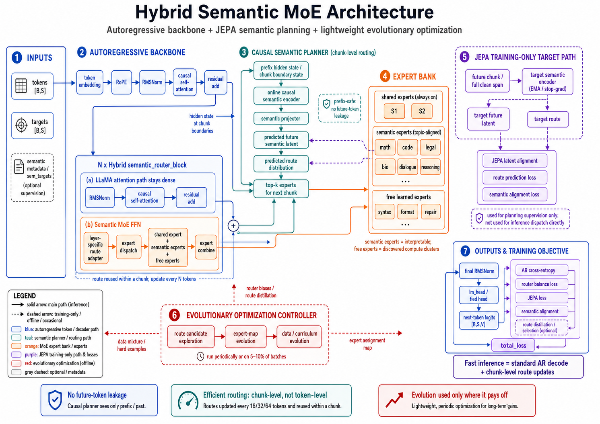

# NeuralFn

NeuralFn is a graph-native neural network framework where each neuron can be a built-in primitive or a user-defined Python function with typed I/O ports, connected in arbitrary directed graphs. This repository now combines that core library with an authenticated web platform for multi-project, multi-session editing, training, analytics, and MCP-driven automation.

NeuralFn supports a scalar graph runtime plus native CUDA trainers. Legacy graph-backed Torch modules remain in the source tree for old experiments, but Torch is no longer an installable NeuralFn dependency extra. The default install is now the lean native/core SDK surface: it does not install Torch, NumPy, tokenizer, dataset, graph-analysis, or server packages. Native GPT training uses cached token shards and the compiled CUDA trainer path without importing `torch`.

Native training entrypoints prefer direct compiled C++ binaries on the
workstation path. Dense GPT aliases use the linked
`nfn_gpt_native_train_linked --model-family ...` binary when it exists, falling
back to `nfn_gpt_native_train`; other compiled families such as `gpt2-evo`,
`llama`, `mixllama`, `jepa`, `semantic-router-moe`, and `deepseek-v4` use their
matching `nfn_<family>_native_train` binary when present or when
`NFN_NATIVE_<FAMILY>_CLI` is set. Set `NFN_NATIVE_TRAIN_CLI` only when you
intentionally want to force the unified `nfn_native_train --base-model ...`
frontend. For direct family binaries, `nfn train --base-model ... --dry-run
--print-command` runs the family frontend so GPT-2-evo and similar targets can
print their final compiled delegate command instead of the Python wrapper's
intermediate argv.

The top-level `nfn` module keeps that startup contract when imported as a CLI
shim: `from nfn import main; main()` can serve root help, direct dense GPT
native training, and native fast-path inference without importing `nfn_impl`,
`train_gpt_native`, or `torch`. Planner helpers such as `maybe_plan`,
`recipe_from_state`, and `render_help` are still available from `nfn`, but they
load the graph-backed planner lazily when first accessed.

Dense GPT native training defaults to periodic validation loss every 250
optimizer steps over 20 validation batches. Pass `--eval-every-steps 1000` to
change the cadence, or `--eval-batches N` / `--eval-batch-size N` to bound the
validation work for smoke tests.

Install extras only for the workflows you need:

```bash
pip install -e .                 # native/core SDK and CLI metadata
pip install -e ".[tile-cuda]"     # local CUDA Tile builds
pip install -e ".[datasets]"      # raw-text tokenization and HF dataset cache setup
pip install -e ".[graph]"         # Python graph analysis/runtime helpers
pip install -e ".[server]"        # FastAPI editor/backend and MCP server
pip install -e ".[all]"           # full native/server/dataset workstation, without Torch
```

`.[all]` intentionally excludes Torch, and there is no `.[torch]` extra. If you
need to run legacy graph-backed Torch code while it still exists in the tree,
install PyTorch explicitly in that environment outside NeuralFn's package
metadata.

CUDA Tile development targets CUDA Toolkit 13.3+ on the SM120 workstation. The
generic Python Tile extension and the trainer-facing raw C ABI both build from
`neuralfn/csrc/tile_cuda/kernels.cu`; after toolkit changes, run
`bash tools/rebuild_native_sm120.sh` to rebuild
`build/libnfn_native_train_tile_ops.so`, the SDK C++ bindings
(`neuralfn._native_gpt`, `neuralfn._native_gpt2`, and
`neuralfn._native_train`), the compiled GPT/native training frontends, the
SM120 no-Bash launcher (`build/nfn_train_gpt_sm120`), the GPT-2 compatibility
frontend, and the missing-template native stubs against the current CUDA
toolkit. It also refreshes
`build/libnfn_native_train_tile_ops_tk.so`, `build/linear_backward_bench`, and
`build/lm_head_backward_bench`, so `tools/check_native_no_torch_deps.py` does
not fail later on stale SDK binding, benchmark, or TK-candidate artifacts. Set
`NFN_NATIVE_REBUILD_BINDINGS=0` only when intentionally rebuilding raw trainer
binaries without touching the importable SDK extensions. The full native build script rebuilds
`libnfn_native_train_tile_ops.so` before `nfn_gpt_native_train_linked`, so the
linked binary preferred by SDK and CLI startup paths is not left pointing at a
stale Tile ops library. The default SM120 Tile ops library also defines
`LLMK_SM120_USE_TK_FUSED_DGELU_DINP` and
`LLMK_SM120_APPROX_DGELU_TANH=1`, so the linked native trainer gets the
llm.kittens fused MLP projection dInput+dGELU path without loading the
diagnostic `_tk` sidecar. The linked trainer build, SM120 benchmark wrappers,
linear/LM-head microbench wrappers, and no-Torch stale-artifact verifier treat
`tools/build_native_train_tile_ops.sh` as a Tile ops dependency, so compile-flag
changes force a library rebuild instead of silently reusing an old shared
object. Dense GPT LM-head CUDA Graph prewarm now uploads each instantiated graph
executable by default before training; set
`NFN_NATIVE_GPT_LM_HEAD_GRAPH_UPLOAD=0` only for bisection, or run
`NFN_SM120_NATIVE_CANDIDATE_PROFILE=lm_head_graph_upload_off bash tools/bench_native_gpt_sm120_candidate.sh`
to compare upload against the opt-out route in the same selected-GPU window.
The script defaults to `NFN_TILE_CUDA_ARCH=sm_120a`
and `NFN_TILE_CUDA_USE_TK_ATTENTION=1`; set
`NFN_TILE_CUDA_TK_EXTRA_NVCC_FLAGS` to override the diagnostic TK sidecar flags,
or set `NFN_NATIVE_REBUILD_OUT_DIR=/path/to/build` to write the refreshed
artifacts somewhere other than `build/`. After rebuilding, run
`NFN_TILE_CUDA_TEST=1 python -m pytest tests/test_tile_cuda_gpu.py tests/test_tile_cuda_ops.py tests/test_tile_cuda_optimizer.py -q -rs`
to confirm the extension executes GPU tests instead of skipping. After the
CUDA Toolkit 13.3.33 WSL reinstall, the dedicated RTX 5090 path is correctness
green for the revisited native and Tile CUDA gates. After reinstalling the WSL
CUDA toolkit (`cuda-toolkit-13-3`), the GPU-visible full suite passed with
`1185 passed, 4 skipped, 20 warnings, 468 subtests passed`; the focused native/Tile CUDA
gates, GPT template preset suite, and native no-Torch guard all pass.
The post-reinstall paired llm.kittens parity check on the display-disabled RTX
5090 used 3 optimizer steps, one interleaved sample, and stage timing with the
selected GPU idle before and after the run. It measured llm.kittens at
`213188.666667` tokens/sec and NeuralFn native GPT at `208073` tokens/sec,
or `1.023900x` NeuralFn train-loop wall time versus the llm.kittens step log.
The same CUDA 13.3.33 recheck left both `llmk_sm120_reference_flags` and
`mlp_proj_dinput_before_dweight` rejected: the former missed train-loop,
steady-state, LM-head, and MLP-projection gates, while the latter improved
short-run wall time but regressed steady-state timing and MLP projection
dInput attribution. Keep both as diagnostic profiles unless a later same-script
gate passes all hot-stage and steady-state criteria.
The CUDA module-loading bisection is also pinned as a rejected diagnostic:
`NFN_SM120_NATIVE_CANDIDATE_PROFILE=cuda_module_eager` compares the default
`CUDA_MODULE_LOADING=LAZY` wrapper route against `CUDA_MODULE_LOADING=EAGER`.
The CUDA 13.3.33 dedicated RTX 5090 5-step, 3-sample rerun after the WSL CUDA
reinstall left LAZY as the default because EAGER changed no tracked kernel
route and regressed setup wall time to `3.467504x`, train-loop wall time to
`1.009903x`, first-step CUDA-event timing to `1.048444x`, and tokens/sec to
`0.990197x`.
The linked native trainer remains the preferred workstation startup path for
direct `train_gpt_native.py`, SDK, and `nfn train` use. A CUDA 13.3 dedicated
RTX 5090 startup-only gate measured `linked_startup` at `0.868933x` setup wall
time versus the dynamic Tile-ops baseline after switching token-weight
initialization to a precomputed float4 pattern helper, and a direct dry run prints
`build/nfn_gpt_native_train_linked ... --tile-ops-lib linked` without importing
Torch or the Python dataset manager. The current LM-head alternatives are still
diagnostics rather than defaults: the strict cooperative true-fused smoke is a
real single-kernel path but was `8.985042x` slower at trainer chunk size, and
the cuBLASLt LM-head wrapper that wins in isolation regressed the full native
trainer to `1.076611x` train-loop wall time.
Dense GPT native training now routes the no-bias BF16 LM-head logits GEMM through the TK
BF16 forward bridge by default for the
default `50304,32768,768,T,N` row-chunk shape. The default tied LM-head row
chunk is restored to 32768 rows for the workstation 5090 profile after the
CUDA 13.3 paired confirmation rejected the 49152-row route at `1.012983x`
train-loop wall time. Pass `--lm-head-row-chunk-size 49152` only to reproduce
that rejected historical route, or pass `--lm-head-row-chunk-size 8192`,
`--native-cuda-lm-head-row-chunk-size 8192`, or
`NativeGpt2RunConfig(lm_head_row_chunk_size=8192, ...)` to reproduce the older
lower-memory default. A full-batch 65536-row chunk is not a default candidate:
the CUDA 13.3 RTX 5090 paired run timed out at the 300s sample limit after
leaving the GPU utilization counter stuck until the WSL driver recovered, and
the latest CUDA 13.3.33 dedicated 5090 current/native/reference rerun proved
the route but regressed to `7.368793x` train-loop wall time versus current
native and `8.037520x` versus llm.kittens. Use
`NFN_SM120_NATIVE_CANDIDATE_PROFILE=lm_head_row_chunk_65536` only to reproduce
that rejected diagnostic, with
`NFN_SM120_NATIVE_ALLOW_REJECTED_CANDIDATE_PROFILE=1`; it expands to
`NFN_NATIVE_GPT_ALLOW_UNSAFE_LM_HEAD_ROW_CHUNK=1 --lm-head-row-chunk-size
65536`. The
`NFN_SM120_NATIVE_CANDIDATE_PROFILE=lm_head_row_chunk_49152` profile now pins
the baseline to `--lm-head-row-chunk-size 32768` and the candidate to
`--lm-head-row-chunk-size 49152`, so the same-script wrapper still compares the
promoted route against the older route under the same external GPU load. The
matching `lm_head_row_chunk_32768` profile performs the inverse rollback check,
but real wrapper launches now reject it by default: the CUDA 13.3 dedicated RTX
5090 rerun changed the route but missed strict train-loop, steady-state,
LM-head, block-backward, and MLP-projection gates. Use
`NFN_SM120_NATIVE_ALLOW_REJECTED_CANDIDATE_PROFILE=1` only for an intentional
diagnostic rerun.
The diagnostic probability-only LM-head CE route now writes its aligned BF16
dlogits rows with vec8 normal stores instead of scalar stores, but it remains
default-off. Use
`NFN_SM120_NATIVE_CANDIDATE_PROFILE=lm_head_prob_only_combined_corrections`
only for same-script bisection of
`NFN_NATIVE_GPT_LM_HEAD_PROB_ONLY_COMBINED_CORRECTIONS=1`; the current RTX 5090
gate still rejects that broader route for default training because total
train-loop and block-backward timing regress despite a slight LM-head substage
improvement.
Real paired-wrapper runs of timeout-prone LM-head profiles now also
require `NFN_SM120_NATIVE_ALLOW_TIMEOUT_PRONE_LM_HEAD_PROFILE=1`; dry-run plan
expansion remains available without that opt-in. The native runner now rejects
LM-head chunks above 49152 rows before launching CUDA unless
`NFN_NATIVE_GPT_ALLOW_UNSAFE_LM_HEAD_ROW_CHUNK=1` is set for explicit paired
diagnostics. The
SM120 candidate wrapper also tracks stored activation reservation counters in
the route-change gate. `NFN_SM120_NATIVE_CANDIDATE_PROFILE=store_mlp_blocks6`
is available only as a rejected diagnostic: cutting stored MLP blocks from 12
to 6 improved startup-only timing, but the paired training gate regressed
steady-state throughput and MLP projection time, so full stored activation
coverage remains the default. The matching
`NFN_SM120_NATIVE_CANDIDATE_PROFILE=store_packed_attention_blocks6` diagnostic
is also rejected: cutting packed-attention stored blocks from 12 to 6 saved
some setup time but regressed train-loop wall time, steady-state CUDA-event
time, block backward, and attention dprep timing. The
`NFN_SM120_NATIVE_CANDIDATE_PROFILE=store_residual1_off` diagnostic is rejected
even earlier because disabling residual1 activation storage failed the paired
native run with cuBLASLt status 14; keep stored residual1 activations enabled
on the default path. The no-recompute diagnostic is
`NFN_SM120_NATIVE_CANDIDATE_PROFILE=full_activation_tape`; it forces baseline
`NFN_NATIVE_GPT_FULL_ACTIVATION_TAPE=0` and candidate `=1`, and the paired
tool now reports `activation_tape_count`, `full_activation_tape_enabled`,
`backward_recompute_blocks`, and `activation_tape_strategy` so the larger
full-forward tape can be compared against the default scratch-recompute path in
the same run. It is rejected by default because the RTX 5090 diagnostic removed
backward recompute but ran slower than the default stored-activation
scratch-recompute route; the CUDA 13.3.33 one-microbatch rerun measured the
full-forward tape at `27.374754x` train-loop wall time and `0.036530x`
tokens/sec versus scratch recompute while changing
`block_state_layout.activation_tape_strategy` from
`scratch-recompute-bf16-stored-packed-attention-and-mlp-direct-backward` to
`full-forward-tape-bf16-stored-packed-attention-and-mlp-direct-backward`.
Interrupting a paired benchmark with Ctrl-C now
terminates the active child process group and exits with a concise interruption
message instead of printing a Python traceback. The
current CUDA 13.3.33 rebuilt 5-step, 3-sample parity refresh on the dedicated
RTX 5090 measured NeuralFn at `2525.500 ms/step` versus llm.kittens at
`2465.055 ms/step` (`1.024520x` train-loop wall time, `0.975643x`
tokens/sec) with no compute processes on the selected GPU. The same run
measured the NeuralFn steady-state CUDA-event slice slower at `1.014749x`, and
the first-step CUDA-event slice slower at `1.061982x`. Native setup was
`634.259 ms`, dominated by float arena materialization (`265.065 ms`), token
weight initialization (`158.416 ms`), uint16 arena materialization
(`124.713 ms`), and cuBLASLt plan prewarm (`74.021 ms`). The remaining parity
gap is native kernel throughput in block backward, model forward, and LM-head
internals plus first-step prewarm effects, not Torch, Python, graph-editor
execution, or external GPU load. The rebuilt JSON confirmed the selected GPU
was idle before and after every sample and reported the promoted default route
with `block_state_layout.layer_norm_backward_affine_row_chunk_size=128` and
`block_backward_qkv_dinput_before_dweight_count=480`.
The diagnostic `NFN_SM120_NATIVE_CANDIDATE_PROFILE=lm_head_prob_only_corrections`
profile is available for reproducing the probability-only LM-head CE route. It
sets `NFN_NATIVE_GPT_LM_HEAD_PROB_ONLY_CORRECTIONS=1`, writes probability-only
dlogits for the no-loss BF16 classifier path, and applies the target subtraction
through separate Tile CUDA dHidden/dWeight correction kernels. It is not a
default: the CUDA 13.3 dedicated RTX 5090 3-step, 2-sample gate rejected it at
`1.005050x` LM-head backward and `1.000994x` steady-state CUDA-event step time.
The related
`NFN_SM120_NATIVE_CANDIDATE_PROFILE=lm_head_prob_only_combined_corrections`
diagnostic sets `NFN_NATIVE_GPT_LM_HEAD_PROB_ONLY_COMBINED_CORRECTIONS=1` and
replaces those two post-GEMM correction launches with one combined Tile CUDA
target-correction launch. It is also rejected by default: the CUDA 13.3
dedicated RTX 5090 3-step, 2-sample stage-timed gate changed the strategy to
`no-loss-prob-only-dlogits-plus-combined-target-correction`, but regressed
train-loop wall time to `1.006574x` and LM-head backward to `1.003646x`.
After the aligned-store kernel update, runtime JSON names the route as
`no-loss-prob-only-dlogits-vec8-loads-normal-vec8-stores-plus-combined-target-correction`
and reports `lm_head_ce_bf16_vector_io_strategy:
vec8-loads-normal-vec8-stores` when the prob-only path actually runs.
`NFN_SM120_NATIVE_CANDIDATE_PROFILE=lm_head_prob_only_ce_target_corrections`
is the next diagnostic step toward the true row-chunked LM-head fused body: it
sets `NFN_NATIVE_GPT_LM_HEAD_PROB_ONLY_CE_TARGET_CORRECTIONS=1` and folds the
dHidden and dWeight target correction into the same prob-only CE row kernel,
so the separate combined correction launch is skipped. It is rejected by
default: the CUDA 13.3.33 dedicated RTX 5090 one-step stage-timed gate changed
the runtime strategy to
`no-loss-prob-only-dlogits-vec8-loads-normal-vec8-stores-plus-ce-target-correction`
and improved the non-cooperative native train-loop wall ratio to `0.968799x`,
but regressed `stage.lm_head_backward.ce.total_ms` to `1.053810x` and still
trailed llm.kittens at `1.101282x` train-loop wall time.
Within that diagnostic route, the combined target-correction kernel now
defaults to 512 threads instead of 256. Override
`NFN_NATIVE_GPT_LM_HEAD_PROB_ONLY_TARGET_CORRECTION_THREADS`,
`NFN_NATIVE_GPT2_LM_HEAD_PROB_ONLY_TARGET_CORRECTION_THREADS`, or
`NFN_TILE_CUDA_LM_HEAD_PROB_ONLY_TARGET_CORRECTION_THREADS` with `128`, `256`,
`512`, or `1024` for paired bisection. The native JSON reports
`lm_head_prob_only_target_correction_threads`, and
`NFN_SM120_NATIVE_CANDIDATE_PROFILE=lm_head_prob_only_combined_corrections_threads_512`
keeps the forced 256-versus-512 comparison available. The CUDA 13.3 dedicated
RTX 5090 3-step, 2-sample gate passed that isolated launch-shape comparison at
`0.988300x` train-loop wall time and `0.999215x` LM-head backward, but this
does not promote the broader prob-only CE route as the normal training path.
Because parity samples can move with reference-run noise, keep using
`tools/bench_native_gpt_sm120_parity.sh` before declaring final parity on a new
build. The cooperative LM-head diagnostic wrapper is intentionally separate
from strict native LM-head kernel availability. Strict JSON availability now
requires the strict callable symbol
`nfn_native_tile_lm_head_classifier_backward_fused_kernel_bf16_u16` plus the
future monolithic capability
`nfn_native_tile_lm_head_classifier_backward_fused_kernel_is_true_fused()`.
By default, CUDA 13.3 builds still return `0` for that true-fused capability, so
`lm_head_cooperative_backward_kernel_available` and
`lm_head_cooperative_backward_fused_kernel_available` remain false. The
separate `lm_head_llmk_classifier_matmul_parity_available=true` field only
proves the diagnostic graph/wrapper path can run fused classifier CE/dlogits
followed by native dHidden/dWeight matmul backward without sending real
training tensors through the graph editor or Torch. Real training runs that
pass `--require-cooperative-lm-head-backward` now fail before token-shard
resolution or CUDA runtime setup until the true-fused capability is present;
use `--check-tile-ops --require-cooperative-lm-head-backward` when you want the
detailed capability JSON instead of entering training. The
strict cooperative body is now available as an explicit smoke-only opt-in:
set `NFN_TILE_CUDA_LM_HEAD_TRUE_FUSED_COOPERATIVE=1` (or the matching
`NFN_NATIVE_GPT*_LM_HEAD_TRUE_FUSED_COOPERATIVE` flag) and run
`NFN_LM_HEAD_BACKWARD_PROFILE=true-fused-cooperative-smoke
tools/bench_lm_head_backward_candidate.sh`. That path launches one cooperative
Tile-CUDA body, materializes CE/dlogits, uses a grid sync, then computes
dHidden and dWeight without the CUDA Graph wrapper. It is not the default
training path and is not trainer-sized parity evidence until it passes the
same stage-timed candidate/reference gates at production dimensions.
The
`tools/bench_native_gpt_sm120_parity.sh` wrapper preserves its failing exit code
when NeuralFn misses the llm.kittens gate, but now adds a targeted diagnostic
when the paired JSON proves the run is native Tile-backed and the remaining
blocker is this wrapper-only LM-head route. The same failure diagnostic now
also reads the newest candidate native profile sidecar from
`--append-native-profile-json-dir` and prints the top setup timings plus float
and uint16 arena allocation families, so startup materialization bottlenecks are
visible in the same script output as the kernel parity failure.
`tools/paired_kernel_speed.py` also writes a
`native_lm_head_true_fused_target` JSON block and text section when the
candidate native profile reports the diagnostic CUDA Graph wrapper or a false
strict true-fused capability. That block records the wrapper path class, strict
symbol and capability booleans, graph replay/body-node means, whether a
candidate/reference gate failed, and the required next ABI:
`nfn_native_tile_lm_head_classifier_backward_fused_kernel_bf16_u16` with
`nfn_native_tile_lm_head_classifier_backward_fused_kernel_is_true_fused()`
returning true and `strict-true-fused-tile-kernel` as the path class.
Pass `--require-native-lm-head-true-fused` to make the paired benchmark fail
specifically on that condition even if ordinary timing gates are not enabled.
When the strict kernel launches but fails candidate/reference gates, the target
status is `strict-true-fused-slow`; this also fails the strict gate so a scalar
single-kernel launch cannot satisfy the promotion contract.
`tools/bench_native_gpt_sm120_parity.sh` forwards that gate by default whenever
strict parity enforcement is enabled; set
`NFN_SM120_PARITY_REQUIRE_NATIVE_LM_HEAD_TRUE_FUSED=0` only for measurement-only
gap refreshes. Native-vs-native candidate sweeps keep it opt-in through
`NFN_SM120_NATIVE_REQUIRE_LM_HEAD_TRUE_FUSED=1` or
`NFN_SM120_CANDIDATE_REQUIRE_LM_HEAD_TRUE_FUSED=1`, so unrelated block-kernel
bisections are not blocked by the known LM-head wrapper.
The current CUDA 13.3 dedicated RTX 5090 measurement-only parity refresh
(`NFN_SM120_PARITY_STEPS=2`, one sample, stage timing on, strict true-fused gate
disabled only to collect numbers) measured llm.kittens at `2429.860 ms/step`
and NeuralFn at `2525.015 ms/step`, or `1.039161x` host wall time. The
steady-state CUDA-event gap was narrower at `1.012150x` (`2441.650 ms/step`
for NeuralFn versus `2412.340 ms/step` for llm.kittens), with NeuralFn at
`0.962262x` reference tokens/sec. The same run reported
`lm_head_classifier_backward_path_class: "diagnostic-cuda-graph-wrapper"`,
`lm_head_cooperative_backward_fused_kernel_capability_available: false`, and a
three-node graph body per replay, so the remaining parity target is still a
true fused LM-head classifier-backward Tile kernel rather than CUDA setup,
Torch, graph-editor tensor flow, or external GPU load.
When
`NFN_SM120_PARITY_STAGE_TIMING=1` is enabled, the same summary prints the
largest candidate native stage timings so block-forward, block-backward, and
LM-head buckets can be ranked without opening the sidecar JSON manually. On the
native JSON side, each stage timing record also carries `first_step_*` and
`steady_state_*` totals/counts/averages. The paired benchmark extractor reports
those as `stage.<name>.first_step_avg_ms` and
`stage.<name>.steady_state_avg_ms`, so first-step startup penalties can be
compared against steady-state kernels in the same candidate-vs-current script.
Stage-timed native GPT diagnostics preallocate CUDA event pairs before the
training loop by default (`NFN_NATIVE_GPT_STAGE_TIMING_PREALLOC_EVENTS`, also
available as the `NFN_NATIVE_GPT2_...` alias, defaults to `16384` capped by
`NFN_NATIVE_GPT_STAGE_TIMING_MAX_EVENTS`). Native JSON and
`tools/paired_kernel_speed.py` report the requested, preallocated, hot-created,
and unused-destroyed event-pair counts so stage-timed parity runs can separate
kernel timing from diagnostic instrumentation overhead.
On the
paired native-vs-native and native-vs-llm.kittens summaries, startup hot
metrics now include the native trainer's existing arena sub-timers
`float_arena_cuda_malloc_wall_ms`, `float_arena_pointer_assign_wall_ms`,
`uint16_arena_cuda_malloc_wall_ms`, `uint16_arena_pointer_assign_wall_ms`, and
the combined-arena equivalents, so startup work can distinguish CUDA allocation
cost from pointer binding cost. On the
CUDA 13.3 dedicated RTX 5090 recheck, disabling NeuralFn train-loop event
timing, prewarming the LM-head graph, and forcing the cooperative sequence
wrapper all still failed the same-script llm.kittens parity gate. Disabling the
cooperative LM-head wrapper entirely is also catalogued as
`NFN_SM120_NATIVE_CANDIDATE_PROFILE=lm_head_cooperative_backward_off`; the
CUDA 13.3 dedicated RTX 5090 10-step parity gate ran the direct
CE+dHidden+dWeight schedule but regressed NeuralFn versus llm.kittens to
`1.019533x` train-loop wall and `1.016084x` steady-state CUDA-event timing.
The full-trainer cuBLASLt cooperative wrapper diagnostic is also available as
`NFN_SM120_NATIVE_CANDIDATE_PROFILE=lm_head_cooperative_cublaslt`, expanding to
`NFN_NATIVE_GPT_LM_HEAD_COOPERATIVE_CUBLASLT=1`. It proves the full GPT loop can
select the cuBLASLt LM-head wrapper, but it is rejected by default: the CUDA
13.3 dedicated RTX 5090 3-step stage-timed gate changed
`lm_head_cooperative_backward_strategy` to
`diagnostic-cublaslt-sequence-wrapper-ce-dhidden-dweight-not-parity` and
regressed train-loop wall time to `1.077251x`, steady-state CUDA-event step
time to `1.083727x`, `stage.lm_head_backward.total_ms` to `1.335573x`, and
`stage.lm_head_backward.cooperative.total_ms` to `1.477219x`.
Those routes remain diagnostic-only.
Future
single-kernel LM-head candidates should first run
`bash tools/bench_lm_head_backward_candidate.sh`, which builds
`build/lm_head_backward_bench` and compares the current cooperative sequence
symbol against `nfn_native_tile_lm_head_classifier_backward_fused_kernel_bf16_u16`
inside one CUDA process with event timing, route counters, decomposed
`reference_components` timings for logits, CE, dHidden, and dWeight, and a
`candidate_true_fused_capability` JSON field. Use the compiled
`--require-true-fused-candidate` contract, or the wrapper profile
`NFN_LM_HEAD_BACKWARD_PROFILE=trainer-chunk-strict`, before promoting any
candidate into the full GPT loop. Reference component timings honor
the same `--warmup` count as the baseline/candidate variants and report that
count as `reference_component_warmup`, so those numbers do not include first-use
CUDA/cuBLAS/TK setup. The same JSON also reports
`candidate_sequence_wrapper_only` and
`candidate_strict_symbol_is_placeholder_sequence`, plus
`candidate_cuda_graph_wrapper_only` for the current strict symbol that replays
captured CE, dHidden, and dWeight work through a CUDA Graph. When the strict
symbol is still not a real fused Tile kernel, the JSON sets
`true_fused_replacement_required=true`, reports `candidate_component_gap`
ratios against CE, dHidden, and dWeight component timings, and names the next
required body as `row-chunked-ce-dhidden-dweight-single-tile-kernel` with the
required symbol and capability flag. This makes
`NFN_LM_HEAD_BACKWARD_REQUIRE_TRUE_FUSED=1` distinguish sequence wrappers,
CUDA Graph wrappers, and a future real fused kernel. Strict wrapper failures
and direct compiled benchmark failures print those `next_required_*` fields, so
a failed `trainer-chunk-strict` run or direct
`build/lm_head_backward_bench --require-true-fused-candidate` invocation names
the exact symbol, capability flag, path class, and kernel body still needed
before promotion. The bench resets
Tile-CUDA LM-head counters after warmup and before timed iterations, so warmup
graph capture/fallback launches do not contaminate the timed classification.
CUDA 13.3 retesting can
also compare the explicit cuBLASLt LM-head candidate with
`NFN_LM_HEAD_BACKWARD_PROFILE=trainer-chunk-cublaslt` or
`NFN_LM_HEAD_BACKWARD_PROFILE=trainer-row-loss-cublaslt`, or by setting
`NFN_LM_HEAD_BACKWARD_CANDIDATE_SYMBOL=nfn_native_tile_lm_head_classifier_backward_cooperative_cublaslt_bf16_u16`;
that symbol runs the same CE/dlogits stage and then forces the strided
cuBLASLt dHidden and dWeight ABI calls, while the JSON keeps reporting the
older generic component timings and the explicit `reference_cublaslt_components`
timings in the same process. It is a candidate measurement route, not a strict
true-fused kernel. The named cuBLASLt profiles are rejected by default; set
`NFN_LM_HEAD_BACKWARD_ALLOW_REJECTED_PROFILE=1` only when intentionally
rerunning that diagnostic route, or set `NFN_LM_HEAD_BACKWARD_DRY_RUN=1` to
inspect the resolved command without launching CUDA. The CUDA 13.3 dedicated
RTX 5090 no-loss trainer-chunk
microbench rejected that cuBLASLt cooperative route: baseline-first measured
`1.466890x` candidate/baseline time (`37.070129 ms/iter` candidate versus
`25.271233 ms/iter` baseline) and earlier candidate-first retesting measured
`1.463026x`.
The CUDA 13.3 dedicated RTX 5090 `trainer-chunk` microbench measured the strict
graph candidate at
`35.783084 ms/iter` versus `35.776438 ms/iter` for the legacy cooperative
symbol (`1.000186x`). Use
`NFN_LM_HEAD_BACKWARD_PROFILE=trainer-chunk` to exercise the default
32768-row optimizer no-loss trainer chunk scale,
`NFN_LM_HEAD_BACKWARD_PROFILE=trainer-chunk-strict` to run that same shape with
`NFN_LM_HEAD_BACKWARD_REQUIRE_TRUE_FUSED=1` enabled by default,
`NFN_LM_HEAD_BACKWARD_PROFILE=trainer-chunk-true-fused` with
`NFN_LM_HEAD_BACKWARD_ALLOW_REJECTED_PROFILE=1` to opt into
`NFN_TILE_CUDA_LM_HEAD_TRUE_FUSED_COOPERATIVE=1` and
`NFN_TILE_CUDA_LM_HEAD_TRUE_FUSED_COOPERATIVE_ALLOW_PRODUCTION=1` for a focused
production-shape true-fused candidate measurement. Focused benchmark JSON
reports `candidate_true_fused_production_shape`,
`candidate_true_fused_allow_production_env`, and
`candidate_true_fused_forced_production_debug`; it only reports
`candidate_true_fused_production_ready` for non-production smoke shapes until
the trainer-sized strict kernel beats the paired parity gates, so a selected
strict symbol cannot be mistaken for a defaultable trainer-shape candidate,
`NFN_LM_HEAD_BACKWARD_PROFILE=trainer-chunk-cublaslt` to compare that same
optimizer chunk against the cuBLASLt cooperative candidate,
`NFN_LM_HEAD_BACKWARD_PROFILE=trainer-row-loss` to reproduce the older row-loss
chunk comparison, or
`NFN_LM_HEAD_BACKWARD_PROFILE=trainer-row-loss-cublaslt` to compare that
row-loss shape against the cuBLASLt cooperative candidate, or
`NFN_LM_HEAD_BACKWARD_PROFILE=trainer-loss-bins` to exercise the matching
1024-bin loss-reduction route, without involving the full training loop. Set
`NFN_LM_HEAD_BACKWARD_REQUIRE_TRUE_FUSED=1` and
`NFN_LM_HEAD_BACKWARD_MAX_RATIO=1.000` when the harness should fail fast for a
candidate that is not a real fused kernel or is slower than the baseline. Add
`NFN_LM_HEAD_BACKWARD_MAX_REFERENCE_RATIO=1.000` or
`NFN_LM_HEAD_BACKWARD_MAX_CUBLASLT_REFERENCE_RATIO=1.000` when the candidate
must also beat the explicit CE+dHidden+dWeight reference sequence measured in
the same process; the matching `*_WITH_LOGITS_RATIO` variants compare against
the reference sequence plus its logits GEMM. The
LM-head harness also accepts `NFN_LM_HEAD_BACKWARD_CANDIDATE_FIRST=1`; its JSON
reports `run_order` so close candidates can be checked in both baseline-first
and candidate-first order under the same external GPU load. Set
`NFN_LM_HEAD_BACKWARD_DRY_RUN=1` to print the resolved C++ benchmark command
without building artifacts, loading CUDA, or touching Torch; the native no-Torch
verifier uses that dry-run path. The standalone LM-head and linear backward
benchmark wrappers rebuild their C++ benchmark binaries when `tile_ops.h` or
the matching benchmark source changes, and rebuild
`libnfn_native_train_tile_ops.so` when `tile_ops.cu`, `tile_ops.h`, or
`tile_cuda/kernels.cu` is newer than the shared library, so header-only Tile ABI
edits are not measured against stale harnesses or kernels.
For full-loop production-shape checks, use
`NFN_SM120_NATIVE_CANDIDATE_PROFILE=lm_head_true_fused_cooperative` with
`NFN_SM120_NATIVE_ALLOW_REJECTED_CANDIDATE_PROFILE=1`. That profile forces
`NFN_TILE_CUDA_LM_HEAD_TRUE_FUSED_COOPERATIVE=1`,
`NFN_TILE_CUDA_LM_HEAD_TRUE_FUSED_COOPERATIVE_ALLOW_PRODUCTION=1`,
`NFN_NATIVE_GPT_LM_HEAD_COOPERATIVE_BACKWARD=1`, and the paired wrapper's
`--require-native-lm-head-true-fused` gate so the opt-in strict body is measured
against the current full GPT loop and the llm.kittens reference before any
default promotion. The gate now treats `strict-true-fused-slow` as failing, so
the route must launch and pass the same-script reference gates before promotion.
`NFN_SM120_NATIVE_DRY_RUN_PLAN=1` includes
`candidate_true_fused_cooperative_env` and
`candidate_true_fused_production_env` metadata, so the two required env gates can
be audited without launching GPU work.
The full SM120 parity and native-candidate wrappers also refresh the default
`nfn_gpt_native_train` or `nfn_gpt_native_train_linked` binary before non-dry
runs when the native GPT source, token shard resolver, or linked Tile ABI inputs
are newer; explicitly pinned `NFN_NATIVE_GPT_TRAIN_BIN` and candidate trainer
paths are left untouched. The
low-level GPT CLI build scripts now skip recompilation when their output is
newer than `nfn_gpt2_native_train.cpp`, `token_shards.cpp`,
`token_shards.h`, their own build script, and, for the linked trainer,
`libnfn_native_train_tile_ops.so`. Set `NFN_NATIVE_GPT_FORCE_REBUILD=1` or
`NFN_NATIVE_FORCE_REBUILD=1` when a forced local rebuild is required.
`tools/rebuild_native_sm120.sh` sets `NFN_NATIVE_FORCE_REBUILD=1` by default,
so CUDA toolkit refreshes still rebuild all native artifacts unless that
environment variable is explicitly overridden. The
wrapper defaults `NFN_LM_HEAD_BACKWARD_CUDA_VISIBLE_DEVICES=dedicated`, requiring
an idle display-disabled NVIDIA GPU when `nvidia-smi` can report one; set it to
`auto` to allow fallback to the lowest-utilization NVIDIA GPU, or set it or
`NFN_LM_HEAD_BACKWARD_CUDA_DEVICE` explicitly to pin the benchmark. If
`nvidia-smi` is unavailable or blocked in dedicated mode, the wrapper fails
before launching so benchmark results do not silently include display-GPU load. A matching
lower-level linear-backward harness is available as
`bash tools/bench_linear_backward_candidate.sh`. It builds
`build/linear_backward_bench`, loads `libnfn_native_train_tile_ops.so`, and
compares baseline versus candidate C ABI symbols for the strided BF16 dInput or
dWeight kernels inside one CUDA process. Use
`NFN_LINEAR_BACKWARD_PROFILE=mlp-proj-dinput`, `mlp-proj-dweight`,
`mlp-fc-dinput`, `mlp-fc-dweight`, `qkv-dinput`, `qkv-dweight`,
`attn-proj-dinput`, `attn-proj-dweight`, `lm-head-dinput`, or
`lm-head-dweight` to isolate the current block-backward and LM-head hot shapes
without dataset, graph-editor, or trainer-loop noise. The diagnostic profiles
`lm-head-dinput-cublaslt` and `lm-head-dweight-cublaslt` compare the current
strided BF16 route against explicit forced-cuBLASLt C ABI symbols; the CUDA 13.3
RTX 5090 isolated run rejected them for default promotion at `1.017720x` dInput
and `1.000576x` dWeight versus the current symbols. Override
`NFN_LINEAR_BACKWARD_CANDIDATE_SYMBOL` for a new kernel candidate and set
`NFN_LINEAR_BACKWARD_REQUIRE_ROUTE_CHANGE=1` when the candidate must prove it
called a different C ABI symbol before timing gates are trusted; JSON reports
`candidate_symbol_changed`. Add `NFN_LINEAR_BACKWARD_MAX_RATIO=1.000` when the
candidate must also be no slower than the current symbol. Keep the default
`NFN_LINEAR_BACKWARD_WARMUP=1` or higher for candidate comparisons so first-call
cuBLAS/TK setup is not counted as kernel time. Set
`NFN_LINEAR_BACKWARD_CANDIDATE_FIRST=1` to rerun a close result with the
candidate timed before the baseline; JSON reports `run_order` so baseline-first
and candidate-first checks can be compared directly. To sweep the
full native GPT hot linear set in one reproducible gate, run
`bash tools/bench_native_gpt_linear_hot_matrix.sh`. The matrix wrapper runs the
MLP projection, MLP FC, QKV, attention projection, and LM-head dInput/dWeight
profiles through the same C++ CUDA event harness and writes an aggregate JSON
summary to `NFN_LINEAR_HOT_MATRIX_JSON_OUT`. Set
`NFN_LINEAR_HOT_DINPUT_CANDIDATE_SYMBOL` or
`NFN_LINEAR_HOT_DWEIGHT_CANDIDATE_SYMBOL` for operation-wide candidates, or a
profile-specific variable such as
`NFN_LINEAR_HOT_MLP_PROJ_DINPUT_CANDIDATE_SYMBOL` when only one shape should use
a new symbol. `NFN_LINEAR_HOT_MATRIX_MAX_RATIO=1.000` fails the matrix if any
candidate profile is slower than its baseline.
`NFN_LINEAR_HOT_MATRIX_REQUIRE_ROUTE_CHANGE=1` passes the per-profile
route-change guard through to every comparison so accidental no-op candidate
symbols fail before ratio gates. The aggregate matrix JSON also reports
`candidate_symbol_changed_count`, `same_symbol_profile_count`,
`measurement_only_profile_count`, and `route_change_failure_reason`, so a sweep
that compared the current symbol against itself is recorded as measurement-only
evidence instead of a promotable kernel candidate.
For attention-store bisection,
`NFN_SM120_NATIVE_CANDIDATE_PROFILE=packed_attention_saved_lse_off` compares
the default stored packed-attention LSE route against
`NFN_NATIVE_GPT_STORE_PACKED_ATTENTION_LSE=0` in the same paired wrapper and
enables attention-section timing. The CUDA 13.3 dedicated RTX 5090 gate keeps
the saved-LSE default enabled: disabling it regressed steady-state CUDA-event
timing to `1.002521x` and `stage.block_backward.attn_sdpa.to_qkv.total_ms` to
`1.002141x`.
`NFN_LINEAR_BACKWARD_CANDIDATE_FIRST=1` also applies to matrix runs because the
matrix delegates each profile to the same lower-level wrapper. A
post-reinstall wrapper
timing check also confirms that
`python cli/scripts/train_gpt.py --tinystories --native-cuda-dry-run --native-cuda-print-command`
and the matching `nfn train ... --native-cuda-dry-run --native-cuda-print-command`
now print the already translated compiled C++ delegate directly from the
lightweight shims without spawning the native binary, measuring about `0.04s`
on this workstation; non-inspection dry-runs, Tile checks, smoke tests, plan
prints, and real training still enter the compiled C++ frontend. The old
Python schedule estimation path is not on the current native GPT startup route. A native
startup-only paired run with and without `--tinystories` measured `1.000758x`
setup wall time, which assigns startup cost to CUDA arena materialization and
weight initialization rather than dataset alias resolution. LM-head cuBLASLt
expansion, BF16 arena removal, token-shadow removal, threaded token
initialization, LM-head 4096-row chunks, disabling cuBLASLt plan prewarm, and
direct bias-gradient first-write probes remain rejected diagnostic switches
rather than workflow guidance. The QKV dInput/dWeight side-stream diagnostic is
also rejected as a default: set
`NFN_NATIVE_GPT_BLOCK_QKV_CONCURRENT_DINPUT_DWEIGHT=1` only for paired
bisection, since the current packed-QKV CUDA 13.3 RTX 5090 same-script run
enabled the route but slowed train-loop wall time to `1.009068x` and QKV
backward to `1.040672x`. Dense GPT startup defaults the tied token-weight
initializer to the vector4 CUDA Tile route; set
`NFN_NATIVE_GPT_TOKEN_WEIGHT_VECTOR4_INIT=0` or
`NFN_TILE_CUDA_TOKEN_WEIGHT_VECTOR4_INIT=0` only for paired bisection against
the previous fast int32 path. The alternative BF16-pattern vector4 shadow
writer remains diagnostic-only behind
`NFN_NATIVE_GPT_TOKEN_WEIGHT_BF16_PATTERN_INIT=1` or
`NFN_TILE_CUDA_TOKEN_WEIGHT_BF16_PATTERN_INIT=1`. The current CUDA 13.3.33
dedicated RTX 5090 5-sample startup-only recheck improved mean setup wall and
mean token-weight init, but kept the route diagnostic-only because token-weight
init remained unstable with median and max regressions versus the
conversion-based vector4 shadow writer.
The opt-in vector4-strided token-weight initializer
(`NFN_TILE_CUDA_TOKEN_WEIGHT_VECTOR4_STRIDED_INIT=1` /
`NFN_NATIVE_GPT_TOKEN_WEIGHT_VECTOR4_STRIDED_INIT=1`) is also diagnostic-only:
the paired wrapper now forces baseline
`NFN_NATIVE_GPT_TOKEN_WEIGHT_VECTOR4_STRIDED_INIT=0` versus candidate `=1`, and
native JSON reports
`token_weight_vector4_strided_init_requested` plus the distinct
`device-vector4-strided-power2-deterministic[-fused-bf16-shadow]` strategy.
After the CUDA 13.3 reinstall on the dedicated RTX 5090, the corrected
2-sample startup-only gate passed (`0.949594x` setup wall,
`0.986349x` token init), but the broader 5-sample startup-only gate rejected the
route because `setup.token_weight_init.total_ms` regressed to `1.003837x`.
Real paired-wrapper runs now fail fast for this rejected profile unless
`NFN_SM120_NATIVE_ALLOW_REJECTED_CANDIDATE_PROFILE=1` is set; dry-run expansion
still works without that opt-in.
The fused padded-vocab BF16-shadow token initializer is exposed for paired
bisection as `NFN_NATIVE_GPT_FUSE_TOKEN_WEIGHT_PADDED_INIT=1`, but remains
default-off. It initializes public token rows and zeroes the padded vocabulary
tail plus BF16 shadow in one launch, eliding two separate padding zero/refresh
operations when selected. The CUDA 13.3 dedicated RTX 5090 startup-only retest
rejected the route at `1.011381x` setup wall time versus the current vector4
BF16-shadow default, despite a noise-equivalent `0.995702x` token-init
sub-bucket.
The combined float+BF16 transformer arena is also still diagnostic-only behind
`NFN_NATIVE_GPT_COMBINED_DEVICE_ARENA=1`. A CUDA 13.3.33 dedicated RTX 5090
startup-only recheck proved the route change, but rejected it at `1.031475x`
setup wall time, with the combined allocation bucket shifting cost into
`setup.uint16_arena_materialize` and slowing token initialization.
The split-arena concurrent materialization probe is likewise diagnostic-only
behind `NFN_NATIVE_GPT_CONCURRENT_ARENA_MATERIALIZE=1`. It overlaps the float
and uint16 arena `cudaMalloc` calls with host `std::thread` workers and reports
`concurrent_arena_materialize_requested`,
`concurrent_arena_materialize_enabled`,
`concurrent_arena_materialize_count`, plus
`setup.float_uint16_arena_materialize_concurrent.total_ms` when selected. The
CUDA 13.3 dedicated RTX 5090 startup-only gate rejected default promotion:
mean setup wall was a noisy `0.987871x`, but median setup wall regressed to
`1.003922x` and `uint16_arena_cuda_malloc_wall_ms` regressed to `2.664592x`
mean.
`NFN_NATIVE_GPT_UINT16_ARENA_FIRST=1` is a startup-only bisection switch for the
same default split-arena path. It materializes the large BF16/uint16 arena before
the float arena, leaves concurrent and combined-arena modes untouched, and
reports `uint16_arena_first_requested`, `uint16_arena_first_enabled`, and
`arena_materialize_order` in runtime JSON. Measure it with
`NFN_SM120_NATIVE_CANDIDATE_PROFILE=uint16_arena_first` only for intentional
reproduction. The CUDA 13.3.33 dedicated RTX 5090 7-sample startup gate rejected
it: `arena_materialize_order` changed to `uint16-then-float`, but setup wall
regressed to `1.013035x` mean / `1.010524x` median, uint16 arena materialization
regressed to `2.369884x`, and token-weight init regressed to `1.135714x`.
Dense GPT native BF16 classifier/CE now uses vectorized BF16 row loads by
default to match the llm.kittens fused-classifier memory access pattern,
including the final dlogit write pass when scalar stores are selected; set
`NFN_NATIVE_GPT_CE_BF16_VEC_LOADS=0` or
`NFN_TILE_CUDA_CE_BF16_VEC_LOADS=0` only for paired scalar-load bisection.
The SM120 candidate wrapper also exposes
`NFN_SM120_NATIVE_CANDIDATE_PROFILE=lm_head_ce_vec8_io`, which keeps vec8
loads and switches the no-loss LM-head CE dlogit write to vec8 streaming
stores for same-script RTX 5090 checks. Runtime JSON reports
`lm_head_ce_bf16_vector_io_strategy` plus the individual vec-load/store flags
so the paired benchmark can confirm the classifier route used by the candidate.
This profile is rejected for real runs unless
`NFN_SM120_NATIVE_ALLOW_REJECTED_CANDIDATE_PROFILE=1` is set: the current CUDA
13.3 dedicated RTX 5090 rerun failed the strict CE stage gate at
`stage.lm_head_backward.ce.total_ms=1.003780x`.
`NFN_SM120_NATIVE_CANDIDATE_PROFILE=lm_head_ce_scalar_streaming_store` is the
narrower scalar-store cache-hint probe; it keeps vec8 loads but writes scalar
BF16 dlogits through `st.global.cs.u16`. It is diagnostic-only: the dedicated
RTX 5090 rerun rejected it at `1.020535x` train-loop wall, `1.026691x`
steady-state CUDA-event wall, `1.122725x` LM-head backward, and `2.054816x`
LM-head CE time. `lm_head_ce_vec8_normal_store` is also rejected: it improved
the narrow CE bucket to `0.999055x`, but missed the total LM-head gate at
`1.009078x` and regressed LM-head logits to `1.024165x`, so cached scalar
stores remain the default.
`NFN_SM120_NATIVE_CANDIDATE_PROFILE=lm_head_cooperative_no_loss_backward`
expands to the cooperative LM-head sequence wrapper plus the normal
optimizer-only no-loss CE route:
`NFN_NATIVE_GPT_LM_HEAD_COOPERATIVE_BACKWARD=1`,
`NFN_NATIVE_GPT_LM_HEAD_CLASSIFIER_CE_NO_LOSS=1`, and
`NFN_NATIVE_GPT_LM_HEAD_CE_NO_LOSS_DEFAULT_SPECIALIZED=1`, with
`--train-loss-every-steps 0` applied to both paired commands. It is rejected
for real launches unless `NFN_SM120_NATIVE_ALLOW_REJECTED_CANDIDATE_PROFILE=1`
is set: the dedicated RTX 5090 one-step stage-timed gate activated the no-loss
cooperative wrapper but regressed train-loop wall time to `1.117578x`,
LM-head backward to `1.294010x`, and tokens/sec to `0.894788x`.

For local server/editor development, leaving `NEURALFN_REDIS_URL` empty keeps
live state and persistence in-process. Redis-backed deployments still enqueue
through Redis, but the no-Redis fallback now persists synchronously so tests and
single-workstation runs do not race teardown or lose the latest session/run
state. Raw-text dataset metadata can also resolve the known `gpt2`,
`cl100k_base`, and `o200k_base` vocabulary sizes offline; actual tokenization
still requires the tokenizer assets or the `tiktoken` cache.

> **Pre-alpha notice:** NeuralFn is in active pre-alpha development. The SDK, REST API, MCP tools, and graph format are all subject to rapid, breaking changes without prior deprecation. Do not depend on API stability at this stage. See the [CHANGELOG](CHANGELOG.md) for a running list of what has changed.

## Documentation

**[Read the full documentation](docs/README.md)**

| Section | What it covers |
|---------|---------------|
| [Getting Started](docs/getting-started.md) | Installation, quickstart, your first graph |
| [CLI Workflows](docs/cli.md) | `nfn` train/infer/eval workflows, datasets, tokenizers, artifacts |
| [Framework Guide](docs/framework-guide/README.md) | How to build with NeuralFn in Python -- neurons, graphs, subgraphs, training, inference |
| [Python SDK Reference](docs/python-sdk/README.md) | Every class, function, method, and type in the `neuralfn` package |
| [REST API Reference](docs/rest-api/README.md) | All HTTP endpoints with request/response shapes |
| [MCP Tools Reference](docs/mcp/README.md) | All MCP tools for AI agent integration |
| [Server Internals](docs/server/README.md) | Services, ORM models, auth, configuration |
| [Editor Reference](docs/editor/README.md) | React frontend: store, components, API client |
| [Agent Skills](docs/agent-skills.md) | AI coding agent skills for Cursor and Codex |
| [llms.txt](llms.txt) | LLM-friendly project index |
| [llms-full.txt](llms-full.txt) | Complete docs in a single file for LLM ingestion |

Native GPT benchmark and preflight runs can pass
`--native-cuda-no-checkpoint` from the Python wrappers or `--no-checkpoint`
to the compiled C++ trainer to skip final trained-checkpoint export. Default
training still writes the final native checkpoint.
When sampled training loss is enabled with `--train-loss-every-steps`, the
default BF16/u16-token native GPT path now fuses public-vocab CE loss
accumulation with the in-place BF16 dlogits kernel, avoiding the older separate
loss-partials pass. The fused kernel synchronizes after the target-logit loss
read and before overwriting logits with dlogits, so sampled train loss does not
race the in-place classifier backward write. The scalar is accumulated on
device across the whole gradient-accumulation optimizer step and copied to the
host once per logged step, so train-loss logging does not add one host sync per
microbatch. Validation loss still uses `--eval-every-steps` and remains
separate from sampled train loss.
For native-vs-native SM120 cuBLASLt route work, use the named candidate
profiles rather than ad hoc defaults. The heavy returned-multiple-candidate
plan flip is preserved as
`NFN_SM120_NATIVE_CANDIDATE_PROFILE=cublaslt_heavy_shape_flip`, but it is
rejected by default because the CUDA 13.3.33 dedicated RTX 5090 gate proved
plan-cache and linear-shape changes while regressing steady-state training.
The native Tile ABI also includes opt-in public-vocab strided LM-head dHidden
and dWeight GEMM routes for padded BF16 dlogit chunks. They remain disabled by
default (`NFN_NATIVE_GPT_LM_HEAD_PUBLIC_VOCAB_STRIDED_GEMM=0`) because the
CUDA 13.3 RTX 5090 same-binary paired run measured them slower than the current
aligned padded-vocab GEMMs for GPT-2's `50257 -> 50304` padded vocabulary.
The strict/cooperative LM-head backward ABI now also uses the aligned padded
GEMM route for its dHidden and dWeight work so
`NFN_SM120_NATIVE_CANDIDATE_PROFILE=lm_head_cooperative_backward` measures the
cooperative wrapper itself rather than implicitly enabling the rejected strided
public-vocab route. A CUDA 13.3 dedicated RTX 5090 rerun on 2026-06-24 still
kept that profile rejected: it activated the cooperative wrapper and slightly
improved `stage.lm_head_backward.total_ms` to `0.999819x`, but missed
promotion at `1.002204x` train-loop wall and `1.000412x` steady-state
CUDA-event step time.
Dense GPT native training also now defaults to eliding the unused FP32
attention-projection and MLP-projection scratch-tape buffers when BF16
projection-residual is active. Set
`NFN_NATIVE_GPT_ELIDE_FLOAT_PROJECTION_OUTPUTS=0` only for paired bisection
against the older reservation.

Use `python tools/paired_kernel_speed.py --baseline "OLD_COMMAND"
--candidate "NEW_COMMAND" --samples N --json-out /tmp/result.json` for
candidate-vs-current CUDA timing. The helper defaults
`--cuda-visible-devices` to `dedicated`, requiring an idle display-disabled
NVIDIA GPU from `nvidia-smi`; pass `--cuda-visible-devices auto` to allow
fallback to the lowest-utilization NVIDIA GPU, an explicit device id such as
`--cuda-visible-devices 0` to pin manually, or `--cuda-visible-devices ""` to
leave the environment unchanged. It still alternates pairs in the same sampling
window and runs one warmup pair by default so first-use CUDA/kernel load does
not contaminate reported samples. It sets `CUDA_DEVICE_MAX_CONNECTIONS=1` for
both commands by default; pass `--cuda-device-max-connections ""` to leave that
environment unchanged. Pass repeatable `--baseline-env KEY=VALUE` or
`--candidate-env KEY=VALUE` flags for environment-gated kernel candidates; these
overrides apply only to that side of the pair and are recorded in the JSON/text
output. Pass repeatable `--max-candidate-ratio [STAT:]METRIC=RATIO` gates when a
candidate must not regress a hot native metric such as
`stage.lm_head_backward.total_ms`, `stage.block_backward.total_ms`, or
`train_loop_wall_ms_per_step`; pass `--min-candidate-ratio [STAT:]METRIC=RATIO`
when a candidate must preserve or improve a metric such as
`train_tokens_per_second` or a required route counter. `STAT` defaults to
`mean` and can be `median`, `min`, or `max`, so use gates such as
`median:train_loop_wall_ms_per_step=1.000` for noisy GPU timing. Missing metrics
fail the gate so a stage-timing or JSON-output mistake cannot be accepted as a
passing kernel result.
`--command-timeout-seconds N` terminates the timed-out command's process
group so a slow native candidate does not leave child GPU work running after the
sample is recorded. Interrupting the helper also terminates the active command
process group before re-raising, so aborted memory-heavy candidates do not keep
running on the selected GPU. Pass `--require-idle-selected-gpu` for dedicated
benchmark runs that must abort if `nvidia-smi` reports any compute process on
the selected CUDA GPU before each warmup or measured command. The idle check is scoped
to the selected GPU UUID, so a separate display GPU can still be active. Pass
`--max-selected-gpu-utilization-pct N` to also reject samples when the selected
CUDA GPU's `nvidia-smi` utilization is already above `N` before each warmup or
measured command. Pass
`--allow-stale-selected-gpu-utilization-without-compute-processes` only when a
WSL/NVML idle poll is stuck high on a dedicated GPU; compute processes still
fail immediately, and the stale-utilization allowance is recorded in text and
JSON output. When `nvidia-smi` is available, the JSON also includes
the resolved `cuda_device_selection`, run-level
`gpu_before` / `gpu_after` snapshots and per-sample `paired_samples[].gpu_before`
/ `paired_samples[].gpu_after` snapshots, plus command-level
`paired_samples[].baseline.gpu_before` / `gpu_after` and
`paired_samples[].candidate.gpu_before` / `gpu_after` snapshots with GPU
identity, display-active state, utilization, memory, and active compute-process
rows so kernel-speed notes show which CUDA device was measured and whether
other compute work was present for a specific command. Text and JSON output also include
`gpu_sample_summary`, which summarizes selected-GPU utilization, memory, and
compute-process counts before and after measured samples; use this summary when
checking that candidate-vs-baseline timing was not skewed by other GPU load.
Native stage-timed JSON already records every CUDA bucket, and the text summary
prints a compact `native_hot_summary` before the full metric dump. That section
keeps the current SM120 parity decision fields together: host train-loop wall,
CUDA-event total/first-step/steady-state timing, tokens/sec, setup wall, the
hot setup buckets (`float_arena_materialize`, `uint16_arena_materialize`,
`token_weight_init`, `cublaslt_plan_prewarm`), and the largest stage-timed
forward/backward buckets. The full text summary still prints the LM-head
backward substages (`logits`, `ce`, `dhidden`, `dweight`,
optional `dhidden_dweight_concurrent`) plus block-backward substages such as
`mlp_proj.*`, `attn_sdpa.to_qkv`, and `qkv.dweight_bias` so parity runs can
attribute the current RTX 5090 gap without opening sidecar JSON by hand. The
same text summary also surfaces optimizer-step support stages:
`stage.final_norm_backward.total_ms`, `stage.embedding_backward.total_ms`,
`stage.gradient_zero.total_ms`, `stage.gradient_clip.total_ms`, and
`stage.adamw_update.total_ms`. The paired text output and JSON additionally
include `native_hot_stage_ratios`, a structured summary derived from the same
interleaved stage metrics. It ranks `top_candidate_total_ms`,
`top_regressions`, and `top_improvements` so reviewers can see the hottest
candidate stages and the largest candidate-over-baseline deltas directly in
the same-script benchmark output, without post-processing the appended profile
JSON files.
Dense GPT native JSON also reports block dInput route counters:
`block_backward_dinput_tk_gemm_count`,
`block_backward_dinput_cublaslt_gemm_count`, and
`block_backward_dinput_bf16_gemm_count`. These counters are captured around the
MLP projection, MLP FC, attention projection, and QKV dInput bodies, and
`tools/paired_kernel_speed.py` treats them as route-change counters so future
block-backward candidates must prove the hot dInput GEMM route actually moved.
For optimizer/gradient-clipping Tile retile candidates, build a temporary Tile
ops library with
`NFN_TILE_CUDA_EXTRA_NVCC_FLAGS="-DNFN_TILE_CUDA_OPTIMIZER_TILE_SIZE=2048"`
or `4096`. The default remains `1024`; native runtime JSON reports
`optimizer_tile_size`, `optimizer_tile_size_symbol_loaded`, and
`optimizer_tile_strategy`, and the paired benchmark route-change gate tracks
those fields. The current CUDA 13.3 dedicated RTX 5090 2048 candidate smoked
successfully but did not improve the measured optimizer buckets, so it should
stay a diagnostic build unless fresh same-script evidence proves otherwise.
Packed-attention TK backward block-size candidates are reported the same way:
the trainer-facing Tile ABI exports
`nfn_native_tile_attention_backward_tk_block_size()`, native runtime JSON emits
`attention_backward_tk_block_size` plus
`attention_backward_tk_block_size_symbol_loaded` at the top level and under
`block_state_layout`, and the paired benchmark strategy gate tracks the value
so compile-time
`-DLLMK_SM120_ATTN_BWD_BLOCK=N` builds are visible even when env flags and
launch counters are otherwise unchanged. Paired benchmark summaries also
flatten the nested `block_state_layout.attention_backward_tk_block_size` and
`block_state_layout.attention_backward_tk_block_size_symbol_loaded` fields, so
profile consumers can compare the block-loop contract directly.
Native JSON also reports the packed-attention TK backward batch plan as
`attention_backward_tk_batch_cap`,
`attention_backward_tk_chunk_batch_total`,
`attention_backward_tk_chunk_batch_max`,
`attention_backward_tk_chunk_batch_min`, and
`attention_backward_tk_chunk_batch_last`; `tools/paired_kernel_speed.py`
extracts these fields so native-vs-native runs can prove whether a candidate
kept the intended full-microbatch chunking.
When a command exits nonzero and `--continue-on-error` is not set, the helper now
prints both stdout and stderr tails so CUDA driver/runtime messages from
external baselines are not hidden behind an empty stderr block.
For native-vs-native dense GPT kernel bisections, `tools/bench_native_gpt_sm120_candidate.sh`
accepts the canonical `NFN_SM120_NATIVE_*` environment variables and the shorter
`NFN_SM120_CANDIDATE_*` aliases for steps, samples, warmup, profile directory,
CUDA device selection, candidate env, template/graph selection, and JSON output.
Use `tools/sweep_native_gpt_sm120_candidates.sh` when retesting several named
profiles: it runs the same candidate wrapper once per profile, continues after
failures, and writes per-profile logs, JSON sidecars, native profile
directories, and a `summary.tsv` under
`NFN_SM120_NATIVE_SWEEP_OUT_DIR` (defaulting to `/tmp`). Positional arguments
select profiles, or set `NFN_SM120_NATIVE_SWEEP_PROFILES`; with no profile list
it sweeps the current SM120 hot-path proof set: `qkv_dinput_ln128`,
`lm_head_graph_prewarm`, `lm_head_loss_bins`, and `cublaslt_grouped_probe`.
Startup-only bisections such as
`token_weight_vector4_strided` remain available when named explicitly, but they
are no longer the default because the current parity gap is steady-state
block/LM-head throughput rather than token setup. The sweep preserves the
candidate wrapper's strict
same-script route and metric gates and exits nonzero if any profile fails; set
`NFN_SM120_NATIVE_SWEEP_ALLOW_FAILURES=1` only for exploratory evidence
collection where rejected candidates should not fail the outer job. Its
`summary.tsv` includes compact baseline-to-candidate route proof columns for
the default hot profiles: QKV dInput-before-dWeight launches, LM-head loss-bin
classifier launches, LM-head graph replay counts, cooperative LM-head sequence
launches, cuBLASLt BGRADB direct/accumulate route counts, and grouped cuBLASLt
layout/matmul probe statuses.
The common-shape controls also accept the explicit
`NFN_SM120_NATIVE_CANDIDATE_*` aliases, such as
`NFN_SM120_NATIVE_CANDIDATE_STEPS`, `NFN_SM120_NATIVE_CANDIDATE_SAMPLES`,
`NFN_SM120_NATIVE_CANDIDATE_WARMUP`, and
`NFN_SM120_NATIVE_CANDIDATE_JSON_OUT`, so candidate wrapper commands can spell
the workload consistently without silently falling back to the 10-step,
3-sample default run.
The SM120 wrappers also accept generic `NFN_SM120_*` names such as
`NFN_SM120_STEPS`, `NFN_SM120_SAMPLES`, `NFN_SM120_WARMUP`,
`NFN_SM120_CUDA_VISIBLE_DEVICES`, `NFN_SM120_PROFILE_DIR`, and
`NFN_SM120_JSON_OUT` as the lowest-priority fallback, so a copied parity or
candidate command does not silently return to default step/sample counts.
The native candidate wrapper now defaults `GENERATE_TOKENS` to `144`, matching
the llm.kittens `train-sm120.sh` `-g 144` cadence and the parity wrapper. Set
`NFN_SM120_NATIVE_GENERATE_TOKENS`,
`NFN_SM120_NATIVE_CANDIDATE_GENERATE_TOKENS`, or `NFN_SM120_GENERATE_TOKENS`
only for an explicit generation-shape bisection.
Named candidate profiles are intentionally limited to
`tools/bench_native_gpt_sm120_candidate.sh`. The llm.kittens parity wrapper
refuses `NFN_SM120_PARITY_CANDIDATE_PROFILE` / `NFN_SM120_PARITY_PROFILE`
instead of silently ignoring them; use `NFN_SM120_PARITY_CANDIDATE_ENV` for an
explicit NeuralFn-vs-llm.kittens env change.
For kernel promotion work that must compare both the previous NeuralFn native
route and the llm.kittens reference in the same GPU-load window,
`tools/paired_kernel_speed.py` accepts an optional `--reference
"REFERENCE_COMMAND"` plus `--reference-env KEY=VALUE`. With that third command
the tool rotates baseline, candidate, and reference order per sample and emits
`reference_over_baseline`, `candidate_over_reference`,
`reference_native_metrics`, `reference_over_baseline_native_metrics`, and
`candidate_over_reference_native_metrics` beside the existing
candidate-over-baseline fields. Each `paired_samples[]` row also includes direct
per-sample `candidate_over_baseline_native_metrics`,
`reference_over_baseline_native_metrics`, and
`candidate_over_reference_native_metrics` maps, so one noisy sample can be
inspected against the exact native metric ratios instead of only the top-level
aggregate summaries. Use this when a candidate should be accepted only if it
improves the old native route and remains competitive with the external
llm.kittens timing under the same selected-GPU lock. Add
`--max-candidate-reference-ratio [STAT:]METRIC=RATIO` or
`--min-candidate-reference-ratio [STAT:]METRIC=RATIO` to fail the run when the
candidate loses to that reference on the same native metric. The SM120 native
candidate wrapper forwards the same checks from
`NFN_SM120_NATIVE_MAX_CANDIDATE_REFERENCE_RATIO` /
`NFN_SM120_CANDIDATE_MAX_CANDIDATE_REFERENCE_RATIO` and
`NFN_SM120_NATIVE_MIN_CANDIDATE_REFERENCE_RATIO` /
`NFN_SM120_CANDIDATE_MIN_CANDIDATE_REFERENCE_RATIO`.
The SM120 native candidate wrapper exposes the same path with
`NFN_SM120_NATIVE_INCLUDE_LLMK_REFERENCE=1`. The shorter
`NFN_SM120_NATIVE_INCLUDE_REFERENCE=1` alias is also accepted, as are the
candidate/parity/generic llm.kittens aliases. It builds the reference command
from `LLM_KITTENS_ROOT`,
`LLM_KITTENS_TRAIN_BIN`, `LLM_KITTENS_TINYSTORIES_DIR`,
`NFN_SM120_NATIVE_REFERENCE_OUTPUT_DIR`, and the existing step/sample/checkpoint
controls, then forwards it to `tools/paired_kernel_speed.py --reference`. Dry
runs include the resolved `reference_command` in the JSON plan without requiring
the llm.kittens binary to exist. When a candidate actually changes the native
binary, Tile library, build flags, environment, or extra args, the wrapper now
adds default candidate-over-reference gates unless explicit reference gates are
set: `train_loop_wall_ms_per_step <= 1.000`, steady-state CUDA-event wall time
`<= 1.000` plus first-step CUDA-event wall time `<= 1.000` for multi-step
event-timed runs, and
`train_tokens_per_second >= 1.000`. Set
`NFN_SM120_NATIVE_MAX_CANDIDATE_REFERENCE_RATIO` /
`NFN_SM120_NATIVE_MIN_CANDIDATE_REFERENCE_RATIO` when a diagnostic run needs a
different llm.kittens acceptance threshold.
For promoted native default-vs-legacy checks, the wrapper can use a narrow
steady-state event tolerance where the wall and hot-stage gates remain strict:
`qkv_dinput_ln128` now matches `lm_head_graph_prewarm` with a `1.002x`
steady-state CUDA-event cap, so sub-percent event noise does not fail a route
that still improves train-loop wall and block-backward time.
Promoted/default-on profiles such as `linear_bias_threads_512`,
`lm_head_loss_bins`, `mlp_fc_dinput_before_dweight`, `qkv_dinput_ln128`, and
`lm_head_graph_prewarm` are treated as default-vs-legacy gates. They still run
the llm.kittens reference when `NFN_SM120_NATIVE_INCLUDE_LLMK_REFERENCE=1`, but
the wrapper no longer adds automatic candidate-over-reference failure gates for
those profiles. The paired native baseline/candidate run remains the acceptance
gate, and the JSON metadata includes `candidate_gate_scope=default-vs-legacy`.
Set `NFN_SM120_NATIVE_MAX_CANDIDATE_REFERENCE_RATIO` or
`NFN_SM120_NATIVE_MIN_CANDIDATE_REFERENCE_RATIO` to explicitly require a
promoted profile to beat llm.kittens in the same run.
Wrapper-generated candidate ratio gates are also filtered to the requested run
shape: one-step runs do not add a steady-state CUDA-event gate, and runs
without `NFN_SM120_NATIVE_STAGE_TIMING=1` do not add `stage.*` gates. Explicit
`NFN_SM120_NATIVE_MAX_CANDIDATE_RATIO` /
`NFN_SM120_NATIVE_MIN_CANDIDATE_RATIO` values are left untouched.
Native candidate wrapper runs leave `NFN_NATIVE_GPT_CUDA_VERSION_PREFLIGHT`
unset by default, matching normal workstation training startup. Set
`NFN_SM120_NATIVE_CUDA_VERSION_PREFLIGHT=1` when a diagnostic sweep should fail
before warmup on WSL/CUDA driver/runtime mismatches; keep it off for startup
timing because `cudaRuntimeGetVersion` can add about 110 ms before allocation.
The native candidate wrapper also enables
`NFN_NATIVE_GPT_TRAIN_LOOP_EVENT_TIMING=1` on both compared commands by
default. For measured training comparisons with more than one step, automatic
gates include `train_loop_cuda_event_steady_state_wall_ms_per_step=1.000`
beside `train_loop_wall_ms_per_step=1.000`, so a candidate must hold the
steady-state CUDA-event slice instead of passing only on first-step or setup
movement. Set `NFN_SM120_NATIVE_TRAIN_LOOP_EVENT_TIMING=0` or
`NFN_SM120_CANDIDATE_TRAIN_LOOP_EVENT_TIMING=0` for a timing-only rerun without
native CUDA-event records.
The 2026-06-25 CUDA 13.3.33 dedicated RTX 5090 refresh now keeps
`NFN_SM120_NATIVE_CANDIDATE_PROFILE=lm_head_loss_bins` as the accepted
train-loss logging comparison. The same-script 3-step, 2-sample gate forces
`--train-loss-every-steps 1`, moves
`lm_head_classifier_loss_bin_launch_count` from `0` to `48`, and measured
`0.981541x` train-loop wall, `0.982697x` steady-state CUDA-event timing,
`1.018809x` train tokens/sec, `0.927229x` LM-head backward, `0.999905x`
block backward, and `0.995141x` MLP projection backward versus the older
row-loss tail. The wrapper records that evidence in `candidate_note` metadata
for the promoted profile.
The `NFN_SM120_NATIVE_CANDIDATE_PROFILE=tk_qkv_forward_prewarm` diagnostic
enables `NFN_NATIVE_GPT_PREWARM_TK_QKV_FORWARD=1` to move the first forward-QKV
TK launch into setup. It is intentionally rejected by default: the latest
split-stage gate with the `train-sm120.sh` `-g 144` cadence improved NeuralFn
train-loop wall to `0.976642x` and forward-QKV first-step avg to `0.360843x`,
but increased setup to `1.204975x` and still failed strict llm.kittens
reference gates at `1.006631x` train-loop wall, `1.008535x` first-step
CUDA-event timing, `1.005693x` steady-state CUDA-event timing, and `0.993379x`
tokens/sec. Use it only to reproduce
first-use QKV attribution; it moves setup cost, not long-run steady throughput.
`NFN_NATIVE_GPT_PREWARM_TK_QKV_FORWARD_ROWS=N` limits that diagnostic prewarm
to the first `N` rows and reports
`linear_tk_qkv_first_use_prewarm_requested_rows` plus
`linear_tk_qkv_first_use_prewarm_effective_rows` in native GPT JSON. The
`tk_qkv_forward_prewarm_1row` profile uses this to test whether a tiny setup
launch can pay TK first-use overhead without the full-row setup regression; it
remains rejected. The CUDA 13.3.33 dedicated RTX 5090 rerun proved the one-row
route and improved train-loop wall to `0.975482x` plus forward-QKV first-step
avg to `0.364558x`, but setup regressed to `1.249672x` and the candidate still
lost to llm.kittens on train-loop wall, first-step timing, steady-state timing,
and tokens/sec.
Set `NFN_SM120_STAGE_TIMING=1` or the wrapper-specific stage-timing aliases to
collect native CUDA-event stage buckets even when `NFN_SM120_PROFILE_DIR=none`;
profile sidecars and stage attribution are independent controls.
Use `NFN_SM120_NATIVE_ENV`, `NFN_SM120_COMMON_ENV`, or `NFN_SM120_PARITY_ENV`
for shared environment variables that must be applied to both commands, such as
`NFN_NATIVE_GPT_LINEAR_SHAPE_STATS=1` during route attribution. Use
`NFN_SM120_NATIVE_CANDIDATE_ENV` or `NFN_SM120_CANDIDATE_ENV` only for
candidate-only switches. Env lists can be separated with spaces or with commas
between assignments, so both `KEY=1 OTHER=2` and `KEY=1,OTHER=2` are accepted;
commas inside a value, such as
`NFN_NATIVE_LINEAR_CUBLASLT_HEURISTIC_SHAPE=768,3072,65536,N,T,0`, are kept as
part of that value.
Use `NFN_SM120_COMMON_EXTRA_ARGS` only for args that must be appended to both
commands, and use `NFN_SM120_NATIVE_CANDIDATE_EXTRA_ARGS`,
`NFN_SM120_NATIVE_CANDIDATE_ARGS`, or `NFN_SM120_CANDIDATE_EXTRA_ARGS` for
candidate-only CLI flags such as `--lm-head-row-chunk-size 32768`; the dry-run
plan prints both resolved commands and each command's effective env overrides
so command/env separation can be audited before launching a long GPU job.
When comparing a saved or freshly compiled native trainer executable, set
`NFN_SM120_NATIVE_CANDIDATE_TRAIN_BIN=/tmp/nfn_gpt_native_train_candidate`
or the shorter `NFN_SM120_CANDIDATE_TRAIN_BIN=...`; the baseline still comes
from `NFN_NATIVE_GPT_TRAIN_BIN`, defaulting to
`build/nfn_gpt_native_train_linked` when it exists, and the candidate command no
longer silently reuses the baseline trainer path.
This keeps quick candidate runs from silently falling back to the wrapper's
default 10-step, 3-sample profile when using the shorter alias names.
Set `NFN_SM120_NATIVE_MAX_CANDIDATE_RATIO` or
`NFN_SM120_CANDIDATE_MAX_CANDIDATE_RATIO` to a whitespace-separated list of
`METRIC=RATIO` gates, for example
`stage.lm_head_backward.total_ms=1.000 train_loop_wall_ms_per_step=1.005`, so
native candidate runs fail nonzero when they worsen the LM-head/block hot
buckets even if total command timing looks flat. Use
`NFN_SM120_NATIVE_MIN_CANDIDATE_RATIO` or
`NFN_SM120_CANDIDATE_MIN_CANDIDATE_RATIO` for lower-bound gates such as
`train_tokens_per_second=1.000` when a candidate must meet or beat baseline
throughput. When `NFN_SM120_NATIVE_INCLUDE_LLMK_REFERENCE=1` or
`NFN_SM120_NATIVE_INCLUDE_REFERENCE=1` is set, use
`NFN_SM120_NATIVE_MAX_CANDIDATE_REFERENCE_RATIO` /
`NFN_SM120_CANDIDATE_MAX_CANDIDATE_REFERENCE_RATIO` and the matching `MIN`
variables to apply the same gate syntax against `candidate_over_reference`
metrics, so a candidate that only beats old NeuralFn but loses to llm.kittens
fails nonzero.
throughput.
When no explicit ratio list is supplied, measured candidate runs that actually
change the candidate Tile ops library, candidate-only env, or candidate-only
extra args now default to `train_loop_wall_ms_per_step=1.000`; if native stage
timing is enabled they also gate `stage.lm_head_backward.total_ms`,
`stage.block_backward.total_ms`, and `stage.block_backward.mlp_proj.total_ms` at
`1.000`. Stage-timed CE-kernel candidates whose candidate text mentions
`CE_BF16` also gate `stage.lm_head_backward.ce.total_ms=1.000`; LM-head hidden
prepack candidates mentioning `LM_HEAD_PREPACK_BF16_HIDDEN` additionally gate
`stage.lm_head_backward.dhidden.total_ms`,
`stage.lm_head_backward.dweight.total_ms`, and
`setup.uint16_arena_materialize.total_ms`. The named
`lm_head_prepack_bf16_hidden_off` profile pins the baseline to
`NFN_NATIVE_GPT_LM_HEAD_PREPACK_BF16_HIDDEN=1` and the candidate to `0`, but it
is now a rejected historical route. The CUDA 13.3 dedicated RTX 5090 2026-06-24
3-step, 2-sample stage-timed gate changed the LM-head dWeight strategy from
full-final-norm BF16 prepack to per-chunk BF16 packing and regressed train-loop
wall to `1.049342x`, steady-state CUDA-event step time to `1.064113x`,
LM-head backward to `1.055161x`, dHidden to `1.000521x`, and dWeight to
`1.008148x`. The mirror `lm_head_prepack_bf16_hidden_on` profile remains the
historical explicit recheck of the promoted default.
The named `ce_bf16_threads_512` profile expands to
`NFN_NATIVE_GPT_CE_BF16_THREADS=512` for repeatable CE row-block bisection and
stays diagnostic-only after the latest dedicated RTX 5090 gate changed
`lm_head_ce_bf16_threads_per_row` from `1024` to `512` but regressed
train-loop wall to `1.012086x`, LM-head backward to `1.051608x`, and LM-head
CE to `1.430612x` versus the 1024-thread default. Real reruns require
`NFN_SM120_NATIVE_ALLOW_REJECTED_CANDIDATE_PROFILE=1`; dry-run expansion stays
available without the opt-in. `lm_head_ce_loss_bins_default_specialized` expands to loss-bin
reduction plus `NFN_NATIVE_GPT_LM_HEAD_CE_LOSS_BINS_DEFAULT_SPECIALIZED=1` for
repeatable loss-bin CE branch-specialization checks; the current dedicated RTX
5090 3-step, 3-sample gate proved the route and passed train-loop wall
(`0.999215x`) but rejected the candidate on LM-head backward (`1.000741x`),
LM-head CE (`1.000339x`), and MLP projection (`1.001222x`). Real reruns now
require `NFN_SM120_NATIVE_ALLOW_REJECTED_CANDIDATE_PROFILE=1`; dry-run
expansion stays available without the opt-in.
`lm_head_ce_llmk_style_specialized` and
`lm_head_ce_loss_bins_llmk_style_specialized` expand to
`NFN_NATIVE_GPT_LM_HEAD_CE_LLMK_STYLE_SPECIALIZED=1` (with loss-bin reduction
for the second profile) for an explicit llm.kittens-style CE+dlogits probe:
1024 row threads, vec8 BF16 loads, and vector streaming stores for the logits
overwrite. The CUDA 13.3 dedicated RTX 5090 gate proved both routes but rejected
promotion: row-loss improved train-loop wall (`0.997562x`) but missed LM-head
backward (`1.000511x`) and CE (`1.000411x`). The loss-bin profile proved the
request/strategy plumbing but the loss-bin route counter stayed at zero in that
short run; with runtime counter-derived reporting it remains a request-only
diagnostic until a measured run emits loss-bin launches.
LM-head pipeline overlap candidates
still use the comparable train-loop and total LM-head gates; their
candidate-only `stage.lm_head_backward.pipeline_queue.total_ms` and
`stage.lm_head_backward.pipeline_final_wait.total_ms` fields are reported for
inspection instead of ratio-gated against a serial baseline that never emits
them. Attention candidates mentioning `PACKED_ATTENTION` or `BF16_ATTENTION`
gate
`stage.block_backward.attn_sdpa.total_ms`,
`stage.block_backward.attn_sdpa.to_qkv.total_ms`,
`attention_backward_tk_timing_us`, and
`attention_backward_dprep_timing_us` so packed-attention bisections fail on the
hot substage even when total command timing is noisy. Dry-run planning and
no-op baseline-vs-baseline checks stay ungated. For explicit native-vs-native
attribution without selecting a named attention profile, set
`NFN_SM120_NATIVE_ATTENTION_SECTION_TIMING=1`,
`NFN_SM120_NATIVE_CANDIDATE_ATTENTION_SECTION_TIMING=1`, or
`NFN_SM120_CANDIDATE_ATTENTION_SECTION_TIMING=1`; the wrapper forwards
`NFN_NATIVE_GPT_ATTENTION_BACKWARD_SECTION_TIMING=1` to both compared native
commands so dprep/TK attention section counters are available.
For native-vs-llm.kittens parity attribution, set
`NFN_SM120_PARITY_ATTENTION_SECTION_TIMING=1` (or the generic
`NFN_SM120_ATTENTION_SECTION_TIMING=1`) to add
`NFN_NATIVE_GPT_ATTENTION_BACKWARD_SECTION_TIMING=1` to the NeuralFn candidate
side of `tools/bench_native_gpt_sm120_parity.sh`. The llm.kittens baseline is
unchanged, while the NeuralFn profile JSON and paired summary include
`attention_backward_dprep_timing_*` and `attention_backward_tk_timing_*`. The
current CUDA 13.3 dedicated RTX 5090 2-step diagnostic run reported
`attention_backward_dprep_timing_us=60700` and
`attention_backward_tk_timing_us=1078455` across 192 packed-backward launches,
so the default attention gap is dominated by the TK backward section rather than
the dprep launch.
`NFN_SM120_NATIVE_CANDIDATE_PROFILE=attention_bwd_block_32` compiles a
diagnostic candidate Tile ops library with `-DLLMK_SM120_ATTN_BWD_BLOCK=32` for
repeatable packed-attention TK block-size bisection. Keep it rejected by
default: the CUDA 13.3 dedicated RTX 5090 post-`-Bsymbolic` 1-step,
1-sample same-script gate proved the route changed from
`attention_backward_tk_block_size=16` to `32`, but measured
`attention_backward_tk_timing_us=1.058092x` and missed the strict
`stage.lm_head_backward.total_ms` gate at `1.002283x`.
`NFN_SM120_NATIVE_CANDIDATE_PROFILE=attention_bwd_block_64` is also rejected by
default: the same post-`-Bsymbolic` gate proved the route changed from
`attention_backward_tk_block_size=16` to `64`, but regressed
`train_loop_wall_ms_per_step` to `3.343485x`,
`stage.block_backward.total_ms` to `5.034009x`, and
`attention_backward_tk_timing_us` to `24.139285x`.
QKV side-stream candidates mentioning `BLOCK_QKV_CONCURRENT_DINPUT_DWEIGHT`
also gate `stage.block_backward.qkv.total_ms`; the candidate-only combined
`stage.block_backward.qkv.dinput_dweight_concurrent.total_ms` substage is still
reported for inspection, but it cannot be ratio-gated directly because the
serial baseline emits split dInput and dWeight substages instead.
Set `NFN_SM120_NATIVE_AUTO_DISABLE_METRIC_RATIO_GATES=1` or the shorter
`NFN_SM120_NATIVE_DISABLE_METRIC_RATIO_GATES=1` only for diagnostic measurement
runs where you intentionally want the wrapper to emit paired metrics for a known
or exploratory candidate without enforcing the default promotion gates. The
existing `--require-native-route-change` behavior is unchanged; this only
disables automatic ratio thresholds.
Rejected candidate profiles that are explicitly rerun with
`NFN_SM120_NATIVE_ALLOW_REJECTED_CANDIDATE_PROFILE=1` now use that same
route-proof behavior by default: the wrapper still prints the paired timing
ratios, but it does not fail the command solely because a known-rejected
diagnostic profile misses strict default-promotion timing gates. Set
`NFN_SM120_NATIVE_ENFORCE_REJECTED_CANDIDATE_RATIO_GATES=1` when intentionally
rechecking whether a rejected profile has become fast enough for promotion.
For repeatable CUDA/driver bisection of known LM-head dHidden routes, set
`NFN_SM120_NATIVE_CANDIDATE_PROFILE=lm_head_tk_dinput_32768` (or the shorter
`NFN_SM120_CANDIDATE_PROFILE`) to expand the candidate env to
`NFN_NATIVE_LINEAR_TK_DINPUT_ENABLE_SHAPE=768,32768,50304,N,N`, or use
`lm_head_cublaslt_dhidden_32768` to expand to
`NFN_NATIVE_LINEAR_BF16_CUBLASLT_ENABLE_SHAPE=768,32768,50304,N,N`,
`NFN_NATIVE_LINEAR_BF16_CUBLASLT_EXTRA_LARGE_K=1`, and
`NFN_NATIVE_LINEAR_CUBLASLT_HEURISTIC_SHAPE=768,32768,50304,N,N,0`. Use
`lm_head_logits_bf16_fallback_32768` only to reproduce the rejected BF16 GEMMEx
fallback for the current default 32768-row LM-head logits shape; it expands to
`NFN_NATIVE_LINEAR_TK_FORWARD_DISABLE_SHAPE=50304,32768,768,T,N`.
The CUDA 13.3 dedicated RTX 5090 rebuilt 3-step, 2-sample stage-timed gate moved
`lm_head_logits_tk_gemm_count` from 48 to 0 but rejected the fallback at
`1.003097x` train-loop wall, `1.000836x` steady-state CUDA-event step time,
`1.010331x` block backward, and `1.004728x` MLP projection. Use
`lm_head_logits_bf16_fallback_49152` only for the rejected historical 49152-row
LM-head chunk with `NFN_NATIVE_LINEAR_TK_FORWARD_DISABLE_SHAPE=50304,49152,768,T,N`.
Use
`qkv_forward_bf16_fallback_65536` to disable the TK forward route for the
current packed-QKV forward shape with
`NFN_NATIVE_LINEAR_TK_FORWARD_DISABLE_SHAPE=2304,65536,768,T,N`. Use
`lm_head_dhidden_fast16bf_32768` to test only the current 32768-row LM-head
dHidden BF16 GEMMEx fallback with
`NFN_NATIVE_LINEAR_BF16_GEMM_EX_FAST_16BF_SHAPE=768,32768,50304,N,N`. These
profiles are measurement shortcuts only; the alternate LM-head and packed-QKV
routes remain default-off until the same-script candidate gate beats the current
route.
For compile-time Tile ops candidates, set
`NFN_SM120_NATIVE_CANDIDATE_TILE_OPS_BUILD_FLAGS` or
`NFN_SM120_CANDIDATE_TILE_OPS_BUILD_FLAGS`; the wrapper builds a temporary
candidate `libnfn_native_train_tile_ops.so` with those extra nvcc flags and
compares it against the baseline library without overwriting `build/`. The
dry-run plan path does not build that temporary shared object; it resolves the
generated candidate path, env split, and paired-run `metadata` fields only, so
build-flag profiles can be inspected without launching nvcc or CUDA work.
Measured and dry-run JSON now include wrapper metadata such as
`candidate_profile`, `candidate_tile_ops_build_flags`, and
`candidate_route_change_gate`, making saved benchmark artifacts self-contained.
Native GPT run JSON also reports the loaded SM120 TK GEMM compile settings:
`linear_tk_sm120_k_tile`, `linear_tk_sm120_grad_k_tile`,
`linear_tk_sm120_super_m`, `linear_tk_sm120_dinput_super_m`,
`linear_tk_sm120_dweight_super_m`, `linear_tk_sm120_huge_n_k_tile`,
`linear_tk_sm120_fast_dgelu_enabled`, and
`linear_tk_sm120_approx_dgelu_tanh_enabled`. Native `--check-tile-ops` and
plan JSON query those values from the loaded Tile ops library too, so build
flag changes are visible before a full training run. The paired benchmark
treats these as strategy values, so compile-time Tile ops candidates can prove
generated kernel changes even when their launch counters stay constant.
The
named profiles `tk_dgelu_dinput` and `tk_dgelu_approx_tanh` are now
rejected/no-op historical diagnostics. The current linked SM120 baseline
already uses the fused TK MLP projection dInput+dGELU route and reports
`linear_tk_dgelu_dinput_gemm_count`, so rebuilding a candidate Tile library
with `-DLLMK_SM120_USE_TK_FUSED_DGELU_DINP` no longer proves a distinct route.
Use those profile names only with
`NFN_SM120_NATIVE_ALLOW_REJECTED_CANDIDATE_PROFILE=1` when intentionally
reproducing older dGELU route evidence. `tk_forward_no_n96` is also rejected
by default. The CUDA 13.3 dedicated RTX 5090 recheck built the
`-DLLMK_SM120_FORWARD_N96=0` Tile ops candidate, but tracked route counters,
strategy strings, linear shape stats, and cuBLASLt plan cache entries were
unchanged; the route-change gate failed and hot-stage gates regressed at
`stage.lm_head_backward.total_ms=1.001484x` and
`stage.block_backward.mlp_proj.total_ms=1.001994x`. Use it only with
`NFN_SM120_NATIVE_ALLOW_REJECTED_CANDIDATE_PROFILE=1` when intentionally
reproducing the historical forward-N96 evidence. Stage-timed
dGELU diagnostics still gate
`stage.block_backward.mlp_proj.dinput.total_ms=1.000` when explicitly rerun.
Runtime JSON reports
`linear_tk_dgelu_dinput_gemm_count`, and the paired benchmark treats it as a
route counter so compile-flag candidates cannot be accepted on timing noise
when they do not change the fused dGELU route.
Use `NFN_SM120_NATIVE_CANDIDATE_PROFILE=llmk_sm120_reference_flags` to rebuild
a temporary candidate Tile ops library with the documented llm.kittens SM120
reference macro bundle, including `LLMK_SM120_USE_CUBLASLT_GEMM`,
`LLMK_SM120_ATTN_FWD_BLOCK=32`, `LLMK_SM120_ATTN_BWD_BLOCK=16`,
`LLMK_SM120_DWEIGHT_SUPER_M=2`, `LLMK_SM120_FAST_DGELU=1`,
`LLMK_SM120_APPROX_DGELU_TANH=1`, `LLMK_SM120_DPREP_WARPS=3`, and
`LLMK_SM120_LAYERNORM_BWD_BLOCKS_PER_SM=1`. The profile disables route-change
enforcement because most of those values already match header defaults or
NeuralFn's default build flags; it still uses the same paired timing gates, so
do not promote it unless the generated-kernel candidate beats the current
default in the same script. The CUDA 13.3.33 dedicated RTX 5090 post-rebuild
5-step, 2-sample stage-timed gate changed no tracked route or strategy counters
and rejected the reference bundle as a default: train-loop wall improved to
`0.995837x`, tokens/sec to `1.004176x`, and block backward to `0.991665x`, but
steady-state CUDA-event timing missed at `1.000937x` while MLP FC regressed to
`1.006521x` and QKV regressed to `1.008280x`.
The llm.kittens parity wrapper accepts the same stage-timing aliases as the
native candidate wrapper: set `NFN_SM120_NATIVE_STAGE_TIMING=1`,
`NFN_SM120_NATIVE_PARITY_STAGE_TIMING=1`, `NFN_SM120_PARITY_STAGE_TIMING=1`, or
`NFN_SM120_STAGE_TIMING=1` to add `--native-stage-timing` and capture
`timing.stage_timing` from the NeuralFn side. After the CUDA 13.3 reinstall and
SM120 native rebuild, the dedicated idle RTX 5090 3-step parity gate completed
cleanly and measured NeuralFn at about `208k` tokens/sec versus llm.kittens at
about `216k` tokens/sec, leaving the remaining work as kernel-throughput
closing rather than CUDA setup or graph/Torch startup.
`NFN_SM120_NATIVE_CANDIDATE_PROFILE=cuda_device_max_connections_1` is now a
fast-fail no-op profile. The SM120 paired wrapper already applies
`CUDA_DEVICE_MAX_CONNECTIONS=1` to both baseline and candidate commands,
matching the llm.kittens SM120 launcher policy, so a candidate-only profile
would not measure a real route change.
The named `qkv_concurrent_dinput_dweight` profile expands to
`NFN_NATIVE_GPT_BLOCK_QKV_CONCURRENT_DINPUT_DWEIGHT=1` for repeatable
stage-timed reruns of the default-off QKV side-stream diagnostic. The current
packed-QKV one-step gate still rejects it at `1.009068x` train-loop wall time
and `1.040672x` QKV backward.
The named `mlp_proj_tk_dweight_65536` profile expands to
`NFN_NATIVE_LINEAR_TK_DWEIGHT_ENABLE_SHAPE=3072,768,65536,N,T` for repeatable
MLP projection dWeight reruns. Runtime JSON reports
`block_backward_mlp_proj_tk_dweight_requested`,
`block_backward_mlp_proj_tk_dweight_enabled`, and the diagnostic
`block_backward_weight_linear_strategy` label when the route runs. Keep it
default-off: the CUDA 13.3 dedicated RTX 5090 3-step, 2-sample same-script gate
proved the route counter change but regressed train-loop wall and MLP projection
dWeight+bias. After the LM-head prepack default change, a 2-step, 2-sample
rerun still regressed train-loop wall to `1.019797x`; the wrapper now requires
`NFN_SM120_NATIVE_ALLOW_REJECTED_CANDIDATE_PROFILE=1` for intentional reruns.
The named `lm_head_concurrent_dhidden_dweight` profile expands to
`NFN_NATIVE_GPT_LM_HEAD_CONCURRENT_DHIDDEN_DWEIGHT=1` for repeatable LM-head
dHidden/dWeight side-stream bisections. Stage-timed runs report the combined
`stage.lm_head_backward.dhidden_dweight_concurrent.total_ms` bucket for
candidate-side inspection; the wrapper gates train-loop and total LM-head
timing because the serial baseline emits split dHidden and dWeight substages.
The profile now fails fast as rejected after the CUDA 13.3 dedicated RTX 5090
3-sample same-script confirmation regressed train-loop wall time to `1.002970x`
and train tokens/sec to `0.997039x`.
The named `lm_head_row_chunk_65536` profile expands to
`NFN_NATIVE_GPT_ALLOW_UNSAFE_LM_HEAD_ROW_CHUNK=1` plus
`--lm-head-row-chunk-size 65536` for repeatable full-resident LM-head chunk
rechecks. Keep it diagnostic-only: the current CUDA 13.3 dedicated RTX 5090
same-script current/native/reference rerun changed `lm_head_classifier_last_rows`
from 32768 to 65536, but regressed train-loop wall time to `7.368793x` versus
current native and `8.037520x` versus llm.kittens, cut train tokens/sec to
`0.135708x` versus current and `0.124417x` versus llm.kittens, and collapsed the
downstream `stage.block_backward.attn_sdpa.to_qkv.total_ms` bucket to
`63.207371x`. Real launches now require
`NFN_SM120_NATIVE_ALLOW_REJECTED_CANDIDATE_PROFILE=1`; dry-run expansion remains
available for inspection.
The named `lm_head_row_chunk_49152` profile now benchmarks the promoted 49152
row-chunk route against the older 32768 route by pinning both sides explicitly;
the latest CUDA 13.3 dedicated RTX 5090 5-step, 3-sample gate passed at
`0.992974x` train-loop wall time and `0.998563x` LM-head backward. Use
`lm_head_row_chunk_32768` for the inverse old-route check.
The helper decodes
native binary stdout/stderr with replacement, so external CUDA trainers that
emit non-UTF-8 bytes can still be compared in the same paired run. For
llm.kittens output, parsed `step ... ms ... tok/s` rows now report
`train_loop_wall_ms` as the sum of parsed step times,
`train_loop_wall_ms_per_step` as their mean, plus last-step fields under the
`llm_kittens_last_step_*` keys. Pass
`--command-timeout-seconds N` to cap each child command; with
`--continue-on-error`, timed-out candidates are kept in the JSON with
`timed_out: true`, `returncode: -1`, and their output tails instead of wedging
the tuning loop. If either command emits NeuralFn native JSON, the helper also
summarizes native in-loop
metrics such as `timing.train_loop_wall_ms`, `timing.train_tokens_per_second`,
setup time, checkpoint time, total native wall time, and any emitted
`timing.setup_timing` and `timing.stage_timing` entries separately from outer
command runtime. Compiled native GPT commands can write that JSON directly with
`--json-out PATH`; `--profile-json PATH` and `--stage-profile-json PATH` are
aliases for profiling runs such as
`NFN_NATIVE_GPT_STAGE_TIMING=1 build/nfn_gpt_native_train ... --profile-json /tmp/nfn_profile.json`.
Those profile files also include `float_arena_request_stats` and
`uint16_arena_request_stats`, ranked by suballocation name, elements, bytes,
and arena offset, so startup optimization can target the buffers that dominate
the large native `cudaMalloc` arenas. Each arena stats object includes both the
short `requested_elements` / `allocated_elements` / `requested_bytes` /
`allocated_bytes` names and the explicit `total_requested_elements` /
`total_allocated_elements` / `total_requested_bytes` / `total_allocated_bytes`
aliases for benchmark tooling that reads nested arena totals directly.
The paired helper also detects those native JSON-output flags in child commands
and reads the sidecar file when stdout is empty, so stage-timed native runs can
keep stdout small without losing metric summaries or paired ratios.
When
native JSON includes `steps_completed`, the helper also reports
`train_loop_wall_ms_per_step` so total-loop NeuralFn runs can be compared fairly
with trainers that only log per-step timing. It also parses llm.kittens
`step ... ms ... tok/s` logs, so direct NeuralFn-vs-`train_gpt2cu` comparisons
report both trainers' normalized in-loop step time and token throughput in the
same paired JSON. Paired native JSON also summarizes route/strategy strings such
as `lm_head_logits_linear_strategy`, `lm_head_dhidden_linear_strategy`,
`lm_head_dweight_strategy`, block linear strategies, and attention strategies
under `baseline_native_metric_values` and `candidate_native_metric_values`, so
kernel-candidate results show whether a route actually changed. It also emits
`native_strategy_value_changes`, comparing those categorical strategy fields
between baseline and candidate, and `native_route_counter_changes`, comparing
tracked route counters such as TK, cuBLASLt, BF16 GEMM, LM-head logits, BF16
packing/cache, fused TK dGELU dInput launches, and attention launch counts
between baseline and candidate. If
candidate-specific environment knobs
are set but those counters do not change, the text report warns that timing-only
improvements should be treated as noise until a route counter change, strategy
value change, or separate kernel-level attribution confirms the candidate.
Pass `--require-native-route-change` to make that warning a hard failure; the
SM120 candidate wrapper enables this gate automatically for measured candidate
runs that change candidate-only environment, candidate-only args, or candidate
Tile/native binaries, while leaving dry-run plans unaffected.
The gate treats setup/prewarm counters as attribution only: cuBLAS handle
prewarm, BF16 workspace prewarm, and device-arena allocation changes remain in
`native_route_counter_changes`, but they do not satisfy the required
route-change gate unless a hot training counter, strategy value, linear-shape
row, or cuBLASLt plan-cache entry also changes.
CUDA 13.3 grouped cuBLASLt layout readiness is opt-in via
`NFN_NATIVE_GPT_PROBE_CUBLASLT_GROUPED_LAYOUT=1`,
`NFN_NATIVE_GPT2_PROBE_CUBLASLT_GROUPED_LAYOUT=1`, or
`NFN_TILE_CUDA_LINEAR_CUBLASLT_GROUPED_LAYOUT_PROBE=1`, and is reported as
`linear_cublaslt_grouped_layout_probe_available`,
`linear_cublaslt_grouped_layout_probe_requested`,
`linear_cublaslt_grouped_layout_probe_status`, and
`linear_cublaslt_grouped_layout_supported`; those fields are diagnostics for
future grouped-GEMM candidates and do not mean the current default route uses
grouped matmul.
Classic cuBLAS grouped BF16 GEMM execution is probed separately as
`linear_cublas_grouped_bf16_gemm_probe_available`,
`linear_cublas_grouped_bf16_gemm_probe_requested`,
`linear_cublas_grouped_bf16_gemm_probe_status`, and
`linear_cublas_grouped_bf16_gemm_supported`. The execution probe is opt-in via
`NFN_NATIVE_GPT_PROBE_CUBLAS_GROUPED_BF16_GEMM=1` because unsupported grouped
BF16 launches can leave the CUDA context in an illegal-access state before
training allocations. When requested, a nonzero probe status fails native
preflight immediately instead of continuing into model arena allocation.
The probe launches tiny aligned BF16 grouped GEMMs through
`cublasGemmGroupedBatchedEx` and checks the BF16 outputs, so candidate work can
distinguish descriptor support from an actually working grouped-GEMM execution
path on the selected CUDA install.
The separate cuBLASLt grouped execution smoke is opt-in via
`NFN_NATIVE_GPT_PROBE_CUBLASLT_GROUPED_MATMUL=1`,
`NFN_NATIVE_GPT2_PROBE_CUBLASLT_GROUPED_MATMUL=1`, or
`NFN_TILE_CUDA_LINEAR_CUBLASLT_GROUPED_MATMUL_PROBE=1`. It uses grouped
cuBLASLt matrix layouts with 32-bit grouped shape arrays plus device pointer
arrays and reports
`linear_cublaslt_grouped_matmul_probe_available`,
`linear_cublaslt_grouped_matmul_probe_requested`,
`linear_cublaslt_grouped_matmul_probe_status`, and
`linear_cublaslt_grouped_matmul_supported`. The probe is telemetry only and
does not fail startup on a nonzero execution status; the current CUDA 13.3 RTX
5090 check reports status `15`, so grouped cuBLASLt execution is not yet a
safe route for LM-head or block-backward parity work even though grouped layout
creation succeeds.
Use `NFN_SM120_NATIVE_CANDIDATE_PROFILE=cublaslt_grouped_probe` to run both
cuBLASLt grouped layout and grouped execution probes through the same native
paired wrapper as the other SM120 candidates; the current CUDA 13.3 WSL recheck
still reports layout status `0` and grouped matmul status `15`; a later
one-step dedicated RTX 5090 rerun after the CUDA reinstall reported the same
`0`/`15` probe result. A CUDA 13.3.33 dedicated RTX 5090 one-step probe again
reported grouped layout status `0` and grouped matmul status `15`, while the
separate classic cuBLAS grouped BF16 probe still failed with status `700`.
The 2026-06-24 dedicated RTX 5090 3-step, 2-sample
stage-timed rerun also kept the normal hot route counters unchanged, so this
remains capability telemetry rather than a training route. A follow-up strict
preflight with the 32-bit grouped shape-array probe also returned `0`/`15`;
forcing explicit 64-bit grouped shape-array widths returned status `7`, so the
grouped route remains blocked on cuBLASLt execution support rather than shape
descriptor allocation. The wrapper keeps
the native route-change gate but disables automatic timing-ratio gates for this
capability-only profile, so startup noise cannot hide the probe status.
Use `NFN_SM120_NATIVE_CANDIDATE_PROFILE=cublaslt_grouped_probe_required` when a
future grouped-GEMM implementation needs a hard prerequisite gate: it runs the
same non-poisoning probes but exits nonzero unless both layout and grouped
matmul statuses are `0`.
It intentionally does not request the classic cuBLAS grouped BF16 probe because the
CUDA 13.3 recheck showed that unsupported route still poisons the selected CUDA
context before the trainer can allocate model arenas.
The native trainer keeps CUDA 13.3 BF16 cuBLASLt plan prewarm off by default so
normal training startup matches the direct llm.kittens-style launch more
closely. Set `NFN_NATIVE_GPT_PREWARM_CUBLASLT_PLANS=1`,
`NFN_NATIVE_GPT2_PREWARM_CUBLASLT_PLANS=1`, or
`NFN_TILE_CUDA_LINEAR_CUBLASLT_PREWARM=1` only for paired bisection or a
machine-local run that proves prewarm improves total time.
The optional mode selector
`NFN_NATIVE_GPT_PREWARM_CUBLASLT_PLAN_MODE`,
`NFN_NATIVE_GPT2_PREWARM_CUBLASLT_PLAN_MODE`, or
`NFN_TILE_CUDA_LINEAR_CUBLASLT_PREWARM_MODE` accepts `all` (default),
`block_only`, or `lm_head_only`. These reduced modes are diagnostic-only:
the dedicated RTX 5090 CUDA 13.3 same-script gates rejected both selective
prewarm routes, so normal training should leave the mode at `all`.
Native JSON reports
`linear_cublaslt_plan_prewarm_available`,
`linear_cublaslt_plan_prewarm_enabled`,
`linear_cublaslt_plan_prewarm_mode`,
`linear_cublaslt_plan_prewarm_attempted_count`,
`linear_cublaslt_plan_prewarm_skipped_count`,
`linear_cublaslt_plan_prewarm_success_count`, and
`linear_cublaslt_plan_prewarm_failure_count`, and setup timing includes
`setup.cublaslt_plan_prewarm`. The dedicated RTX 5090 CUDA 13.3 retest measured
the prewarmed route at `0.989405x` train-loop wall time and `0.964634x`
LM-head backward time, but normal startup now leaves prewarm disabled until a
same-script total-runtime gate justifies enabling it for a local profile.
The native candidate wrapper also exposes rejected diagnostic profiles
`cublaslt_plan_prewarm_block_only`, `cublaslt_plan_prewarm_lm_head_only`, and
`cublaslt_plan_prewarm_off`, and now includes all three in the unknown-profile
help text. The `off` profile pins the baseline to full cuBLASLt plan prewarm
and the candidate to `NFN_NATIVE_GPT_PREWARM_CUBLASLT_PLANS=0`.
The CUDA 13.3 dedicated RTX 5090 3-step, 2-sample gate improved setup wall to
`0.834325x`, but moved lazy plan work into training: train-loop wall regressed
to `1.015300x`, first-step CUDA-event time to `1.044809x`, tokens/sec to
`0.984974x`, LM-head backward to `1.031614x`, and block backward to
`1.023253x`. Keep full plan prewarm enabled for real training unless a future
same-script gate improves both setup and hot training metrics.
The raw Tile ABI also exposes a cuBLAS handle prewarm hook for the remaining
GEMMEx routes that are not covered by cuBLASLt plan-cache prewarm. Native GPT
training now initializes this handle during setup by default; set
`NFN_NATIVE_GPT_PREWARM_CUBLAS_HANDLE=0`,
`NFN_NATIVE_GPT2_PREWARM_CUBLAS_HANDLE=0`, or
`NFN_TILE_CUDA_LINEAR_CUBLAS_PREWARM=0` only when reproducing the older lazy
initialization route. Native JSON reports
`linear_cublas_handle_prewarm_available`,
`linear_cublas_handle_prewarm_enabled`,
`linear_cublas_handle_prewarm_success_count`, and
`linear_cublas_handle_prewarm_failure_count`, and setup timing includes
`setup.cublas_handle_prewarm`.
The trainer also exposes a BF16 GEMMEx workspace prewarm for first-step
allocation cost. Native GPT reserves the dense GPT workstation BF16 linear
scratch buffers during setup by default; set
`NFN_NATIVE_GPT_PREWARM_BF16_WORKSPACE=0`,
`NFN_NATIVE_GPT2_PREWARM_BF16_WORKSPACE=0`, or
`NFN_TILE_CUDA_LINEAR_BF16_WORKSPACE_PREWARM=0` only for lazy-allocation
regression checks. Native JSON reports
`linear_bf16_workspace_prewarm_available`,
`linear_bf16_workspace_prewarm_enabled`,
`linear_bf16_workspace_prewarm_success_count`, and
`linear_bf16_workspace_prewarm_failure_count`, and setup timing includes
`setup.linear_bf16_workspace_prewarm`. Use
`NFN_SM120_NATIVE_CANDIDATE_PROFILE=bf16_workspace_prewarm` to compare it
against the default in the same paired benchmark. The profile is currently
rejected for default promotion: on the dedicated RTX 5090 it improved first-step
CUDA event time and total train-loop wall time, but the 5-step, 3-sample
confirmation narrowly regressed steady-state CUDA event time.
Use
`NFN_SM120_NATIVE_CANDIDATE_PROFILE=lm_head_loss_bins_bf16_workspace_prewarm`
only when intentionally retesting the logged train-loss path. That profile
combines `NFN_NATIVE_GPT_LM_HEAD_LOSS_BIN_REDUCTION=1`,
`NFN_NATIVE_GPT_PREWARM_BF16_WORKSPACE=1`, and
`--train-loss-every-steps 1` against a baseline with both routes disabled. It is
rejected for default promotion because normal no-train-loss throughput does not
execute the loss-bin tail, while forcing train-loss logging introduces host loss
copies.
Normal native JSON also reports `linear_cublaslt_plan_cache_available`,
`linear_cublaslt_plan_cache_count`, and `linear_cublaslt_plan_cache` entries
with shape, transpose, selected heuristic, returned heuristic count, workspace,
and epilogue metadata. This is a low-overhead plan-cache snapshot and stays
available when synchronized `linear_shape_stats` timing is disabled.

The compiled `nfn_native_train` frontend can now be used directly as the
startup-fast dense GPT training command instead of relying on the Python
argument shim. It accepts the same common wrapper flags as `nfn train` and
`cli/scripts/train_gpt.py`, including `--dataset tinystories`, `--output`,
`--kernel-backend`, `--template` / `--preset`, `--graph`, and
`--native-cuda-*` aliases, then injects the dense GPT defaults
`--train-transformer-lm`, `--backend tile-cuda`, the TinyStories alias fallback,
and GPT-3's implicit `--train-seq-len 2048` / `--batch-size 32` when selected
through `--base-model gpt3` or `--template-name gpt3` before execing
`nfn_gpt_native_train`. High-level aliases are normalized before the exec; for
example `--native-cuda-no-checkpoint` is passed to the compiled trainer as the
single native `--no-checkpoint` flag. This removes Python startup from the
direct compiled frontend path; it does not by itself close the remaining SM120
in-loop throughput gap tracked by the parity benchmark.
The native dense GPT selector recognizes the shipped GPT-2 geometry aliases
`gpt`, `gpt2`, `gpt2_modern`, `gpt2_megakernel`, `gpt2_moa`, and `gpt3` as
compiled-loop runnable. NanoGPT aliases are recognized as dense GPT templates
but still report a geometry-mismatch native work item until the shared loop is
made shape-dynamic; custom graph files report explicit native planner work
instead of routing tensors through Torch or editor graph nodes.

Native dense-GPT plan and runtime JSON now include
`lm_head_classifier_strategy_contract`, which makes the remaining SM120 parity
tradeoff explicit. The llm.kittens reference keeps full resident BF16 logits for
all microbatch rows before `fused_classifier`, while NeuralFn keeps only the
row-chunked BF16 logits/dlogits buffer and overwrites logits in-place during CE
backward. At the default `64 x 1024` shape the contract reports 65,536 full
logit rows versus the 8,192-row NeuralFn chunk, 6.59GB of reference-style BF16
logits versus 825.8MB resident NeuralFn BF16 logits, and an 8x resident-logit
reduction. Use this object with `tools/paired_kernel_speed.py` stage metrics
when evaluating a fused classifier/LM-head-backward kernel or a memory-gated
full-logit candidate. The paired benchmark helper extracts and prints the
contract's full/chunk BF16 byte counts, chunk rows/count, and resident-logit
reduction ratio alongside LM-head stage timing.
`tools/bench_native_gpt_sm120_candidate.sh` includes the llm.kittens
`train_gpt2cu` reference by default, so normal SM120 candidate runs compare
current NeuralFn, candidate NeuralFn, and the external reference inside the
same selected-GPU lock. Set `NFN_SM120_NATIVE_INCLUDE_LLMK_REFERENCE=0` or the
shorter alias `NFN_SM120_NATIVE_INCLUDE_REFERENCE=0` only for intentional
two-way native bisection runs where the external reference cost is not needed.
When a candidate changes the native route and no explicit reference gates are
provided, the wrapper adds candidate-over-reference gates for train-loop wall
time, first-step CUDA-event step time, steady-state CUDA-event step time, and
tokens/sec so a noisy native-only win cannot be promoted while still losing to
the llm.kittens baseline.
The raw Tile ABI also exposes the LM-head classifier row-chunk route as a
distinct symbol,
`nfn_native_tile_lm_head_classifier_backward_loss_inplace_strided_no_pad_zero_bf16_bits_u16_targets`,
plus the no-loss
`nfn_native_tile_lm_head_classifier_backward_inplace_strided_no_pad_zero_bf16_bits_u16_targets_with_workspace`
variant and `nfn_native_tile_lm_head_classifier_*` counters. Native dense-GPT
runs now report `lm_head_classifier_chunk_kernel_available`,
`lm_head_classifier_chunk_kernel_enabled`,
`lm_head_classifier_chunk_launch_count`, and the last rows/vocab/stride handled
by that route. `tools/paired_kernel_speed.py` includes the chunk launch count
and last rows/vocab/stride in native metric summaries and
`native_route_counter_changes`, so same-script candidate runs can prove when an
LM-head classifier route changes instead of relying only on coarse stage timing.
This keeps the LM-head classifier path auditable while the next kernel step
replaces the ABI internals with a cooperative classifier plus dHidden/dWeight
kernel.
`NFN_SM120_NATIVE_CANDIDATE_PROFILE=lm_head_ce_no_loss_llmk_style_specialized`
adds a diagnostic no-loss CE/dlogits kernel that mirrors the llm.kittens SM120
classifier store policy for the current no-loss optimizer-step path: vec8 BF16
loads plus streaming vec8 stores, with runtime JSON reporting
`lm_head_ce_no_loss_llmk_style_specialized_requested`,
`lm_head_ce_no_loss_llmk_style_specialized_enabled`, and
`lm_head_ce_kernel_strategy:
no-loss-llmk-style-dlogits-vec8-loads-streaming-vec8-stores`. Keep it
diagnostic-only. The current CUDA 13.3 dedicated RTX 5090 3-step, 2-sample
same-script recheck proved the route but rejected it because train-loop wall
regressed to `1.009040x`, `stage.lm_head_backward.total_ms` to `1.001085x`,
`stage.lm_head_backward.ce.total_ms` to `1.001185x`, and
`stage.block_backward.total_ms` to `1.018917x`.
Dense GPT training now requests the non-strict cooperative LM-head backward
route by default. On current CUDA 13.3 RTX 5090 builds this selects the
diagnostic CUDA Graph/wrapper path when the strict callable symbol is present:
fused classifier CE/dlogits runs in Tile CUDA, and dHidden plus dWeight remain
native matmul backward kernels with no Torch or graph-editor tensor flow. Set
`NFN_NATIVE_GPT_LM_HEAD_COOPERATIVE_BACKWARD=0` only for bisection back to the
separate-stage LM-head schedule, or use
`NFN_SM120_NATIVE_CANDIDATE_PROFILE=lm_head_cooperative_backward` to remeasure
the route in the paired benchmark wrapper. Set
`NFN_NATIVE_GPT_LM_HEAD_FORCE_SEQUENCE_WRAPPER_DIAGNOSTIC=1` only for paired
diagnostics that need to force the older sequence wrapper instead of the
current strict parity route while keeping the cooperative route requested; the
reproducible same-script profile is
`NFN_SM120_NATIVE_CANDIDATE_PROFILE=lm_head_cooperative_sequence_wrapper`;
that profile also sets `NFN_NATIVE_GPT_LM_HEAD_COOPERATIVE_CUDA_GRAPH=0` and
real reruns require `NFN_SM120_NATIVE_ALLOW_REJECTED_CANDIDATE_PROFILE=1`
because the stronger confirmation kept the sequence route rejected as a
default. The
separate strict callable symbol
`nfn_native_tile_lm_head_classifier_backward_fused_kernel_bf16_u16` is present
for the future fused body, but the current llm.kittens-parity route is not a
true single-kernel/cooperative implementation. Its capability probe
`nfn_native_tile_lm_head_classifier_backward_fused_kernel_is_true_fused()`
therefore returns `0`; callers that require the current native parity route
should check `lm_head_llmk_classifier_matmul_parity_available` and
`lm_head_cooperative_backward_cuda_graph_enabled`, while callers that require a
future monolithic CE+dHidden+dWeight kernel must check
`lm_head_cooperative_backward_fused_kernel_capability_available`.
The Tile ops ABI also exports
`nfn_native_tile_lm_head_classifier_backward_fused_kernel_path_class()`, which
returns `diagnostic-cuda-graph-wrapper` for current builds. Native GPT runtime
JSON reports that value as
`lm_head_cooperative_backward_fused_kernel_abi_path_class`, and the focused
LM-head benchmark reports it as `candidate_symbol_abi_path_class` so strict
candidate gates can compare ABI-declared route class against counter-inferred
route class.
True-fused cooperative smoke runs also expose
`nfn_native_tile_lm_head_classifier_true_fused_launch_count()` through the Tile
ops ABI, and `tools/bench_lm_head_backward_candidate.sh` includes
`true_fused_launch_count` in each variant JSON payload. This counter is separate
from the sequence-wrapper and CUDA Graph counters, and it increments only after
CUDA accepts the cooperative kernel launch, so a strict true-fused candidate
must prove that the cooperative kernel actually launched instead of passing
only on capability strings. Strict LM-head benchmark profiles now fail when
`candidate_true_fused_capability=true` but
`candidate.true_fused_launch_count` remains zero. Full-loop native GPT JSON
reports the same evidence as `lm_head_classifier_true_fused_launch_count`, and
`tools/paired_kernel_speed.py` treats it as a hot route counter for
same-script candidate gates.
The current strict cooperative body is intentionally smoke-shape-only. Full GPT
row/vocab/hidden shapes return CUDA not-supported unless
`NFN_NATIVE_GPT_LM_HEAD_TRUE_FUSED_COOPERATIVE_ALLOW_PRODUCTION=1` (or the
`NFN_NATIVE_GPT2_` / `NFN_TILE_CUDA_` alias) is set for a deliberate unsafe
diagnostic run.
Use `--require-cooperative-lm-head-backward` on `nfn_gpt_native_train` or the
named benchmark profile
`NFN_SM120_NATIVE_CANDIDATE_PROFILE=lm_head_cooperative_backward_required` when
a candidate run must require the future true-fused native LM-head backward
kernel before training starts. The SM120 wrapper treats this named profile as a
strict ABI preflight probe, not a metric-gated speed candidate. The current
llm.kittens-style classifier/matmul parity route remains a diagnostic runtime
route and does not satisfy this strict guard, so strict runs fail instead of
falling back to wrapper replay, Torch, or graph-editor tensor flow; the
metadata and training-loop failure messages explicitly name that parity probe as
diagnostic-only. The generic `NativeGptRunConfig` / compatibility
`NativeGpt2RunConfig` field
`require_cooperative_lm_head_backward=True`, direct
`cli/scripts/train_gpt.py`, direct `cli/scripts/train_gpt_native.py`, and
`nfn-native-train` all forward the same compiled flag; the
`--native-cuda-require-cooperative-lm-head-backward` spelling is accepted by the
wrapper entrypoints.
For optimizer-only steps that do not record train loss, the diagnostic
CUDA Graph wrapper passes the explicit no-loss cooperative flag and reuses the
normal BF16/u16 no-loss classifier CE+dlogits kernel instead of forcing the
row-loss CE path. Validation and train-loss logging still use the row-loss or
loss-bin routes when requested. After the CUDA Toolkit 13.3 reinstall, the
dedicated RTX 5090 3-step, 2-sample same-script rerun measured the default
graph replay route at `0.989305x` train-loop wall, `1.000461x` steady-state
CUDA-event timing, and `1.010931x` train tokens/sec versus the previous native
separate-stage route, while reducing classifier chunk launches from `48` to
`3` for the measured run.
`NFN_SM120_NATIVE_CANDIDATE_PROFILE=lm_head_cooperative_loss_bins` enables the
same strict cooperative ABI plus `NFN_NATIVE_GPT_LM_HEAD_LOSS_BIN_REDUCTION=1`
and `NFN_NATIVE_GPT_LM_HEAD_COOPERATIVE_LOSS_BINS=1`; the wrapper also applies
`--train-loss-every-steps 1` to both baseline and candidate so the loss-bin
kernel is actually exercised. Runtime JSON reports
`lm_head_cooperative_loss_bins_requested` and the loss-bin cooperative strategy
strings when active. Keep this profile diagnostic-only until a paired gate
against the CUDA Graph strict callable proves a whole-loop win. Real
paired-wrapper launches now require
`NFN_SM120_NATIVE_ALLOW_REJECTED_CANDIDATE_PROFILE=1`.
Runtime JSON reports
`lm_head_cooperative_backward_required`,
`lm_head_cooperative_backward_requested`,
`lm_head_cooperative_loss_bins_requested`,
`lm_head_cooperative_backward_cuda_graph_requested`,
`lm_head_force_sequence_wrapper_diagnostic_enabled`,
`lm_head_cooperative_backward_abi_wrapper_available`,
`lm_head_cooperative_backward_sequence_wrapper_available`,
`lm_head_cooperative_backward_cuda_graph_available`,
`lm_head_cooperative_backward_cuda_graph_enabled`,
`lm_head_cooperative_backward_kernel_available`,
`lm_head_cooperative_backward_fused_kernel_available`,
`lm_head_cooperative_backward_route_integrated`,
`lm_head_cooperative_backward_kernel_enabled`,
`lm_head_cooperative_backward_sequence_wrapper_enabled`,
`lm_head_classifier_backward_path_class`, and
`lm_head_cooperative_backward_strategy`. Runtime JSON also reports
`lm_head_classifier_fusion_scope` and `lm_head_schedule_parity_status` so
paired benchmarks distinguish the reference-parity separate-stage LM-head
schedule from optional cooperative/fused candidate probes. The non-strict CUDA
Graph replay route is default-on; the strict true-fused ABI remains opt-in and
non-promoted. The focused LM-head microbench keeps distinguishing the CUDA
Graph wrapper from a future real
single-kernel capability; current Tile ops return false from
`nfn_native_tile_lm_head_classifier_backward_fused_kernel_is_true_fused()`.
The CUDA Graph body is still ABI groundwork rather than the final fused kernel:
same-script reports must keep showing
`lm_head_cooperative_backward_kernel_enabled: false` and
`lm_head_cooperative_backward_strategy:
diagnostic-cuda-graph-ce-fork-join-dhidden-dweight-not-single-kernel` until a
later single-kernel body passes the strict capability probe. That graph wrapper
now captures a post-CE fork/join schedule: CE/dlogits runs first, dHidden and
dWeight are launched on cooperative non-blocking streams, and the captured graph
joins both streams before the caller can reuse the row-chunk workspace. It is a
measurable scheduling improvement over the older single-stream graph replay, but
`nfn_native_tile_lm_head_classifier_backward_fused_kernel_is_true_fused()` still
returns false and strict SM120 parity still requires further LM-head or
block-backward kernel work.
The probed Tile symbol is now exported by the rebuilt ops library with a typed
C ABI contract for this diagnostic wrapper: it accepts the BF16 logit/dlogit
chunk, u16 targets, optional row-loss buffer, BF16/float hidden inputs,
BF16/float token weights, dHidden, dWeight, shape metadata, loss scale, dWeight
beta, flags, and stream. Runtime JSON only reports
`lm_head_cooperative_backward_abi_wrapper_available: true` when the current run
loads a Tile ops library containing that symbol.
The existing
`nfn_native_tile_lm_head_classifier_backward_cooperative_fused_bf16_u16` export
is the event-ordered sequence wrapper and only makes
`lm_head_cooperative_backward_sequence_wrapper_available` true. The strict
graph-fused probe uses the separate symbol
`nfn_native_tile_lm_head_classifier_backward_fused_kernel_bf16_u16` plus a
nonzero result from
`nfn_native_tile_lm_head_classifier_backward_fused_kernel_is_true_fused()`.
Current CUDA 13.3 builds return `0` from that capability probe because the
existing CUDA Graph body still replays CE, dHidden, and dWeight launches rather
than executing a true fused classifier-backward kernel. Runtime JSON reports
`lm_head_cooperative_backward_fused_kernel_symbol_available` separately from
`lm_head_cooperative_backward_fused_kernel_capability_available` and
`lm_head_cooperative_backward_fused_kernel_abi_path_class`; only the
capability path can make `lm_head_cooperative_backward_kernel_available` and
`lm_head_cooperative_backward_fused_kernel_available` true. The
`lm_head_classifier_backward_path_class` field summarizes the active class as
`strict-true-fused-tile-kernel`, `diagnostic-cuda-graph-wrapper`,
`diagnostic-cublaslt-sequence-wrapper`, `diagnostic-sequence-wrapper`,
`legacy-abi-sequence-wrapper`, or `missing` so full-trainer parity reports do
not have to infer the route from multiple booleans and counters.
The non-required `NFN_NATIVE_GPT_LM_HEAD_COOPERATIVE_BACKWARD` route exercises
the CUDA Graph body by default when the strict symbol is present. In that case
runtime JSON reports `lm_head_cooperative_backward_cuda_graph_available: true`,
`lm_head_cooperative_backward_cuda_graph_enabled: true`, a diagnostic
`lm_head_cooperative_backward_strategy`, and graph replay counters; this still
does not satisfy `--require-cooperative-lm-head-backward`.
Fresh Tile ops builds also export cooperative sequence counters for this
diagnostic wrapper. Runtime JSON reports
`lm_head_cooperative_sequence_launch_count`,
`lm_head_cooperative_sequence_ce_launch_count`,
`lm_head_cooperative_sequence_dhidden_launch_count`,
`lm_head_cooperative_sequence_dweight_launch_count`,
`lm_head_cooperative_sequence_concurrent_count`,
`lm_head_cooperative_sequence_legacy_count`, and
`lm_head_cooperative_sequence_loss_bin_count` so paired speed tests can prove
whether a candidate is still sequencing the old CE/dHidden/dWeight launches.
The paired kernel speed tool prints these counters and treats them as route
counters.
Fresh Tile ops builds also report CUDA Graph evidence for the strict
`nfn_native_tile_lm_head_classifier_backward_fused_kernel_bf16_u16` ABI:
`lm_head_fused_graph_capture_attempt_count`,
`lm_head_fused_graph_capture_success_count`,
`lm_head_fused_graph_cache_hit_count`,
`lm_head_fused_graph_thread_cache_hit_count`,
`lm_head_fused_graph_cache_entry_count`, `lm_head_fused_graph_replay_count`,
`lm_head_fused_graph_replay_success_count`, and
`lm_head_fused_graph_fallback_count`. These counters are included in native
training JSON, `tools/paired_kernel_speed.py` route-change detection, and the
standalone `tools/bench_lm_head_backward_candidate.sh` microbench JSON, so
`lm_head_cooperative_backward` candidate runs can prove graph replay happened
instead of only proving the cooperative route was requested. Missing older Tile
ops symbols report zero in trainer-side summaries; current microbench builds
require the graph counter ABI so baseline and candidate variants both carry
capture/replay/fallback evidence. `lm_head_fused_graph_thread_cache_hit_count`
counts hot replays that reused the small per-thread graph exec cache without
taking the graph-cache mutex/vector-scan path. This graph body is now the
default diagnostic LM-head route for native GPT training, but it still does not
satisfy the strict true-fused LM-head kernel gate. Successful strict graph
replay does not increment the
legacy `lm_head_cooperative_sequence_*` counters; those counters identify the
diagnostic sequence wrapper or graph fallback path.
When a paired benchmark includes an llm.kittens reference command, the compact
`native_hot_stage_ratios` summary also includes `top_reference_gaps`, sorted by
`candidate_over_reference_mean`. Use that list before kernel work to identify
the largest NeuralFn-vs-reference duration gaps, including train-loop wall
timing when the reference does not expose NeuralFn stage counters, without
scanning the full raw timing JSON.
The Tile ops ABI also exposes
`nfn_native_tile_lm_head_classifier_backward_fused_graph_prewarm_bf16_u16`
for capture-only diagnostics. It creates cache entries without launching the
captured CE/dHidden/dWeight graph. Dense GPT JSON reports
`lm_head_cooperative_backward_graph_prewarm_requested`,
`lm_head_cooperative_backward_graph_prewarm_enabled`,
`lm_head_fused_graph_prewarm_attempt_count`,
`lm_head_fused_graph_prewarm_success_count`,
`lm_head_fused_graph_prewarm_failure_count`,
`lm_head_fused_graph_prewarm_last_error_code`,
`lm_head_fused_graph_prewarm_cache_hit_count`, and
`lm_head_fused_graph_prewarm_cache_entry_count`. Graph prewarm is enabled by
default for real training and now captures both the no-loss graph key and the
active train-loss graph key, including the loss-bin variant when configured, so
the first logged train-loss step does not lazily capture a separate LM-head
backward graph. The default intentionally leaves per-thread replay-cache
priming off because the same-script RTX 5090 gate showed that adding those
first-use thread-cache hits did not improve training throughput. The diagnostic
profile
`NFN_SM120_NATIVE_CANDIDATE_PROFILE=lm_head_graph_thread_cache_prewarm`
compares this default against the previous global-cache-only prewarm path; set
`NFN_NATIVE_GPT_LM_HEAD_GRAPH_PREWARM_THREAD_CACHE=1` or
`NFN_NATIVE_GPT2_LM_HEAD_GRAPH_PREWARM_THREAD_CACHE=1` only for that rejected
bisection. The route moved `lm_head_fused_graph_thread_cache_hit_count` from
`45` to `48`, but regressed train-loop wall to `1.003958x`, steady-state
CUDA-event timing to `1.002099x`, LM-head backward to `1.000922x`, and
tokens/sec to `0.996059x`. The
default was rechecked after the CUDA 13.3.33 RTX 5090 post-MLP-FC-rollback
graph-only rerun passed same-script gates: train-loop wall `0.985915x`,
steady-state CUDA-event timing `0.999199x`, LM-head backward `0.957549x`, block
backward `0.997858x`, and MLP projection backward `0.992403x` versus explicit
prewarm opt-out. Route proof moved graph capture attempts from `3` to `0` and
graph cache hits from `45` to `48`. Set
`NFN_NATIVE_GPT_LM_HEAD_COOPERATIVE_GRAPH_PREWARM=0` or
`NFN_NATIVE_GPT2_LM_HEAD_COOPERATIVE_GRAPH_PREWARM=0` to reproduce the lazy
capture path for bisection. The remaining implementation target is still a true
fused LM-head classifier-backward Tile kernel. When graph prewarm
eliminates runtime LM-head graph capture,
trainer JSON still preserves
`lm_head_classifier_last_rows`, `lm_head_classifier_last_vocab`, and
`lm_head_classifier_last_row_stride` from the last successfully prewarmed
capture so same-script route evidence does not look like the LM-head
classifier shape disappeared.
`NFN_NATIVE_GPT_LM_HEAD_FUSED_LOSS_BACKWARD=0` (or the GPT-2 alias
`NFN_NATIVE_GPT2_LM_HEAD_FUSED_LOSS_BACKWARD=0`) disables the default fused
loss-accumulate+dlogits classifier path for same-script bisection, making
training loss use the separate loss-partials reduction before CE backward.
Runtime JSON reports `lm_head_fused_loss_backward_enabled`,
`lm_head_ce_loss_backward_fused_enabled`, and
`lm_head_ce_loss_backward_strategy`. Keep the default enabled: the CUDA 13.3
RTX 5090 confirmation run for the disabled route regressed train-loop wall time
to `1.001484x` and failed the block-backward gates.
`NFN_NATIVE_GPT_LM_HEAD_CLASSIFIER_CE_NO_LOSS=1` (or the GPT-2 alias) is a
default-off no-loss CE candidate. It routes no-loss optimizer steps through the
LM-head classifier row-loss kernel and skips the loss reduction tail, so paired
native timing can compare that classifier CE path without enabling train-loss
logging. Runtime JSON reports
`lm_head_classifier_ce_no_loss_requested` and
`lm_head_classifier_ce_no_loss_enabled`. The same-script profile
`NFN_SM120_NATIVE_CANDIDATE_PROFILE=lm_head_classifier_ce_no_loss` forces that
older generic no-loss CE route on the baseline side and the classifier route on
the candidate side. Keep it diagnostic-only: the CUDA 13.3 dedicated RTX 5090
3-step, 2-sample stage-timed gate changed the route but rejected default
promotion at `1.005933x` train-loop wall time, `1.087310x` LM-head backward,
and `1.848303x` LM-head CE time.

The native dense-GPT BF16 LM-head CE backward path now uses reverse
row-chunk traversal by default because paired dedicated-RTX-5090 CUDA 13.3
timing measured it slightly faster for the current tied LM-head workspace.
Set `NFN_NATIVE_GPT_LM_HEAD_REVERSE_CHUNKS=0` or
`NFN_NATIVE_GPT2_LM_HEAD_REVERSE_CHUNKS=0` to reproduce the previous forward
chunk order during bisection.
`NFN_NATIVE_GPT_LM_HEAD_DWEIGHT_BEFORE_DHIDDEN=1` is a diagnostic-only
row-chunk order probe that runs LM-head dWeight before dHidden after CE writes
dlogits. A CUDA 13.3 dedicated-RTX-5090 same-script wrapper run briefly measured
`0.996095x` train-loop wall time over two samples, but the required 3-sample
confirmation regressed train-loop wall time to `1.002871x` and train tokens/sec
to `0.997262x`, so the default remains CE -> dHidden -> dWeight. Use
`NFN_SM120_NATIVE_CANDIDATE_PROFILE=lm_head_dweight_before_dhidden` to rerun it
through the same-script paired wrapper and route-change gate.
`NFN_NATIVE_GPT_LM_HEAD_PIPELINE_CHUNKS=1` is a new opt-in LM-head schedule
candidate for same-script benchmarking. It doubles the bounded BF16 logit
scratch from one 8,192-row chunk to two chunks, computes logits/CE on the
default stream, queues dHidden plus ordered dWeight on side streams while
the next chunk starts, and uses per-slot CUDA completion events before reusing
either BF16 logit buffer. Runtime JSON reports
`lm_head_pipeline_chunks_requested`, `lm_head_pipeline_chunks_enabled`,
`lm_head_pipeline_logit_buffer_count`, `lm_head_pipeline_extra_bf16_logit_bytes`,
`lm_head_pipeline_slot_event_wait_count`,
`lm_head_pipeline_done_event_record_count`, and the active
`lm_head_dhidden_dweight_schedule_strategy`. Use
`NFN_SM120_NATIVE_CANDIDATE_PROFILE=lm_head_pipeline_chunks` to route the
candidate through the standard same-script SM120 wrapper and its default stage
gates. Leave it unset for normal training until paired RTX 5090 gates prove a
durable win. The 2026-06-22 CUDA 13.3 dedicated RTX 5090 recheck kept this
route rejected: it enabled `lm_head_pipeline_chunks_enabled: true`, but
regressed train-loop wall to `22.955358x` and block backward to `45.070737x`,
with the slowdown concentrated after the LM-head pipeline in attention
projection and SDPA backward. The later slot-event ownership update replaces
the old full side-stream synchronization before slot reuse, but remains an
opt-in candidate: the follow-up one-step same-script RTX 5090 run proved
`lm_head_pipeline_slot_event_wait_count: 32` and
`lm_head_pipeline_done_event_record_count: 32`, but still regressed native
train-loop wall time to `18.448472x` versus the serial baseline. A 2026-06-24
CUDA 13.3 dedicated RTX 5090 short 3-step, 2-sample stage-timed rerun timed
out the candidate command after 300 seconds, so the wrapper now treats
`lm_head_pipeline_chunks` as rejected by default; use
`NFN_SM120_NATIVE_ALLOW_REJECTED_CANDIDATE_PROFILE=1` only for intentional
diagnostics.
`NFN_NATIVE_GPT_LM_HEAD_OVERLAP_LAST_DWEIGHT=1` is a narrower opt-in LM-head
schedule candidate. It queues only the last processed row chunk's LM-head
dWeight accumulation on the dWeight side stream after CE, runs dHidden on the
default stream, overlaps that side-stream work with final norm and block
backward, and synchronizes before the next microbatch/optimizer can reuse the
shared token-weight gradient. Runtime JSON reports
`lm_head_overlap_last_dweight_requested`,
`lm_head_overlap_last_dweight_available`,
`lm_head_overlap_last_dweight_enabled`,
`lm_head_overlap_last_dweight_queue_count`,
`lm_head_overlap_last_dweight_sync_count`, `lm_head_side_stream_count`,
`lm_head_dhidden_stream_enabled`, `lm_head_dweight_stream_enabled`, and the schedule strategy
`last-processed-row-chunk-dweight-side-stream-overlaps-final-norm-block-backward`.
Use `NFN_SM120_NATIVE_CANDIDATE_PROFILE=lm_head_overlap_last_dweight` to run it
through the paired wrapper only with
`NFN_SM120_NATIVE_ALLOW_REJECTED_CANDIDATE_PROFILE=1`. Keep it disabled for
normal training. Because the default LM-head route now uses the cooperative
CUDA Graph wrapper, the paired profile disables cooperative LM-head only on the
candidate before setting `NFN_NATIVE_GPT_LM_HEAD_OVERLAP_LAST_DWEIGHT=1`; this
keeps the benchmark route-enabled instead of measuring a no-op requested flag.
The CUDA 13.3 dedicated RTX 5090 2026-06-25 route-enabled recheck proved
`lm_head_overlap_last_dweight_enabled=true` with 24 queue/sync events, but
regressed train-loop wall time to `1.020764x`, steady-state CUDA-event step time
to `1.002042x`, train tokens/sec to `0.979861x`, and total LM-head backward to
`1.050532x` versus the default graph wrapper.
The BF16 linear operand cache is limited to stable operands such as weights;
LM-head dWeight repacks the mutable hidden activation chunks each microbatch so
gradient accumulation does not reuse stale packed activations.
The native dense-GPT tied token embedding/LM-head weight now keeps a persistent
BF16 shadow by default for LM-head logits and dHidden GEMMs while preserving the
FP32 master for token embedding, AdamW state, and checkpoint export. Set
`NFN_NATIVE_GPT_TOKEN_WEIGHT_BF16_SHADOW=0` only for paired benchmarks against
the older per-step BF16 bridge/cache route; runtime JSON reports
`token_weight_bf16_shadow_enabled` and `token_weight_bf16_refresh_count`.
The native float32-input/BF16-gradient dWeight+bias path now uses the optimized
cuBLASLt bias-gradient epilogue by default for supported shapes; set
`NFN_NATIVE_GPT_FUSE_FLOAT32_BF16_DWEIGHT_BGRAD=0` to reproduce the previous
split dWeight plus Tile bias-reduction path in paired benchmarks.
The cuBLASLt planner reports selected heuristic metadata in shape stats so
candidate bisections can prove which cuBLASLt plan actually ran. On the CUDA
13.3 RTX 5090 path the dense GPT MLP projection dWeight shape
`3072,768,65536,N,T` reports one returned heuristic, so there is no hardcoded
default pin for that shape. Set
`NFN_NATIVE_LINEAR_CUBLASLT_HEURISTIC_SHAPE=3072,768,65536,N,T,INDEX` only for
explicit paired candidate bisection. The SM120 native candidate wrapper also
provides default-off `cublaslt_min_waves` and `cublaslt_max_waves` profiles for
global cuBLASLt policy bisection. Leave both unset for normal training: the
CUDA 13.3 RTX 5090 3-step/3-sample gates rejected `min_waves` at
`1.002017x` train-loop wall time and rejected `max_waves` at `1.008622x`, with
block-backward regressions in both cases. A fresh CUDA 13.3 dedicated-RTX-5090
3-step/2-sample recheck still rejects `min_waves`: train-loop wall time was
slightly better at `0.998752x`, but LM-head backward regressed to `1.001151x`
and MLP projection total to `1.020829x`, so the stage gates failed. The matching
`max_waves` recheck also failed, with train-loop wall time at `1.010956x`,
LM-head backward at `1.007568x`, block backward at `1.025454x`, and attention
projection dWeight+bias at `1.400435x`.
Shape-specific cuBLASLt overrides
also remain diagnostic-only: overriding LM-head dWeight
`768,50304,32768,N,T` from heuristic `1` to `0` was nearly neutral but failed
strict LM-head gates at `stage.lm_head_backward.total_ms=1.000373x` and
`stage.lm_head_backward.dweight.total_ms=1.000445x`; heuristic `2` regressed
that shape to `1.078836x`. The wrapper profile
`cublaslt_qkv_dweight_h0_65536` pins QKV dWeight+bias
`768,2304,65536,N,T` from heuristic `1` to `0`, but it is rejected on the
current CUDA 13.3 RTX 5090 path: the same-script stage gate changed the intended
plan and measured `stage.block_backward.qkv.dweight_bias.total_ms=1.003363x`
and `stage.block_backward.total_ms=1.000055x`. Overriding QKV dInput
`768,65536,2304,N,N` from heuristic `1` to `0` regressed the shape to
`1.082474x` and `stage.block_backward.qkv.dinput.total_ms` to `1.077788x`.
When `NFN_SM120_NATIVE_LINEAR_SHAPE_STATS=1` is enabled, the paired benchmark
JSON now reports `native_linear_shape_stats.has_cublaslt_plan_change` and
`cublaslt_plan_changed` entries, so a shape-specific plan override is treated
as kernel-level attribution even when aggregate GEMM route counters do not
change. Normal paired runs also summarize native JSON
`linear_cublaslt_plan_cache` under `native_cublaslt_plan_cache`, including
cached-plan shape, selected heuristic, returned heuristic count, workspace, and
epilogue changes without enabling synchronized shape timing.
Dense GPT dWeight GEMMs now also match the llm.kittens accumulation contract:
the first gradient-accumulation microbatch writes dWeight with GEMM `beta=0`,
and later microbatches accumulate with `beta=1`. This is enabled by default for
LM-head, QKV, attention projection, and MLP block dWeights through the raw
Tile-CUDA beta ABI. The tied LM-head is additionally row-chunked for memory, so
only the first LM-head chunk of the first gradient-accumulation microbatch uses
`beta=0`; later LM-head chunks in that same microbatch use `beta=1` so every
token chunk contributes to `accum_grad_token_weight`. Set
`NFN_NATIVE_GPT_DWEIGHT_FIRST_MICROBATCH_BETA_ZERO=0` only for paired
benchmarks against the older always-accumulate path. Runtime JSON reports
`dweight_first_microbatch_beta_zero_enabled`,
`dweight_first_microbatch_beta_strategy`, `lm_head_dweight_beta_zero_scope`, and
`first-write-then-accumulate` strategy suffixes for the active dWeight routes.
Dense GPT native training also folds train-loss collection into the LM-head
backward recompute pass. Validation, evo candidate scoring, and other
forward-only checks still use the normal forward LM-head loss path, but training
microbatches no longer run a separate LM-head logits pass when train-loss
recording is enabled with `--train-loss-every-steps N` or
`--train-log-every N`. The backward path accumulates the same CE partials
before mutating the row-chunked logits into dLogits, keeping real token data
inside the compiled CUDA Tile/C++ loop instead of routing it through
graph-editor nodes. The default cadence is `0` for timing-only training and
benchmarks; use `--eval-every-steps N` separately for validation loss.
Dense GPT training now treats scalar attention fallback as invalid by default:
runtime JSON reports `optimized_attention_required: true` and fails the run if
`attention_forward_scalar_launch_count` is nonzero, before final checkpoint
export. It reports `attention_forward_scalar_launch_fallback_enabled: false`
for the default optimized run and
`attention_forward_scalar_launch_fallback_available: true` for the diagnostic
path. Use `--allow-scalar-attention-fallback` only for diagnostic bisections
where a slow fallback is intentionally being measured.
`python tools/check_native_no_torch_deps.py --skip-artifacts --json` verifies
that GPT, the GPT-2 compatibility script, GPT-2-evo, NanoGPT, LLaMA
fast/megakernel, MixLLaMA, JEPA semantic, semantic-router MoE, DeepSeek-V4,
explicit `nfn train --tinystories`, default
`nfn train`, installed `nfn:main` console-entry training, native inference,
programmatic `nfn.main([...], stdin_isatty=..., stdout_isatty=...)` native
training, top-level `nfn train --base-model ...` family dispatch for GPT-2 evo,
NanoGPT token-LM, LLaMA, MixLLaMA, JEPA, semantic-router MoE, and DeepSeek-V4,
explicit dense GPT template selection with `--template-name`, dense GPT custom
graph selection with `--graph-file`, direct `train_gpt2.py` compatibility
dispatch with those same template/custom-graph selectors, installed `nfn:main`
console-entry native inference, and SDK native training handoff surfaces still
run under an import blocker for
Torch, NumPy, `tiktoken`, dataset manager imports, `train_gpt_native`, and
`infer_gpt`, and `nfn_impl`. The verifier also covers the native benchmark shell
wrappers in dry-run mode, including `tools/bench_linear_backward_candidate.sh`
and `tools/bench_native_gpt_linear_hot_matrix.sh`, so performance-gate helpers
cannot drift into build, CUDA, Python dataset, graph-editor, or Torch startup
work just to print their resolved native commands. The verifier also records
`elapsed_seconds` for each
native Python fast-path entrypoint and fails by default if any wrapper takes
more than 2 seconds before handing off to the compiled path; pass
`--max-entrypoint-seconds 0` only when collecting no-budget diagnostics. The
console-entry checks simulate the installed `nfn = nfn:main` module by putting
both the temporary import blocker and `cli/` module root on `PYTHONPATH`, so the
test covers the packaged console import rather than only `python cli/nfn.py`.
For cuBLASLt BGRADB dWeight plus bias routes, the default writes the epilogue
bias gradient into Tile-owned
scratch and accumulates it into `grad_bias`. Set
`NFN_NATIVE_GPT_BGRAD_FIRST_WRITE_DIRECT=1`,
`NFN_NATIVE_GPT2_BGRAD_FIRST_WRITE_DIRECT=1`, or
`NFN_TILE_CUDA_LINEAR_BGRAD_FIRST_WRITE_DIRECT=1` only for paired benchmarks
against the direct first-write path. To isolate one block bucket instead of
enabling the global rejected route, set
`NFN_NATIVE_LINEAR_BGRAD_FIRST_WRITE_DIRECT_ENABLE_SHAPE=m,n,k,opA,opB` or
`NFN_TILE_CUDA_LINEAR_BGRAD_FIRST_WRITE_DIRECT_ENABLE_SHAPE=...`; the SM120
paired wrapper exposes `bgrad_first_write_direct_qkv_65536`,
`bgrad_first_write_direct_attn_proj_65536`,
`bgrad_first_write_direct_mlp_fc_65536`, and
`bgrad_first_write_direct_mlp_proj_65536` for the dense GPT block shapes. The
QKV, attention projection, MLP FC, and MLP projection shape profiles are
already rejected on the dedicated RTX 5090 because each moved 36 first-write
calls but regressed train-loop, LM-head, block-backward, or block-substage
timing. The
paired wrapper profile
`bgrad_first_write_direct` is marked rejected by default: on the dedicated RTX
5090/CUDA 13.3 gate it changed cuBLASLt bgrad counters, and the 2026-06-25
5-step, 3-sample rerun moved 240 first-write bias gradients to direct writes.
It still regressed train-loop wall time to `1.005404x`, steady-state CUDA-event
timing to `1.001035x`, tokens/sec to `0.994864x`, block backward to
`1.010323x`, and MLP FC dWeight+bias to `1.020533x`.

## Current state of play

NeuralFn now ships Torch-backed template presets for:
- autoregressive families: `nanogpt`, `gpt2`, `llama`, `moe` / `mixllama`, `llama_fast`, `mixllama_fast`, `jamba`, `ternary_b158`, `ttt_llama`, `universal_llama`, `llama_megakernel`, and `kv_pca_llama`
- non-AR research/overlay families: `seq2seq`, `diffusion`, `llm_jepa`, `dense_jepa_evo`, `moe_jepa_evo`, `semantic_dense_jepa_evo`, `semantic_moe_jepa_evo`, and `hnet_lm`

### Research Experiments

> **Warning:** Experimental presets are research prototypes. Their APIs, performance targets, and architectural choices are exploratory and subject to change or removal. Do not depend on stability.

- **`semantic_router_moe`** -- [Experimental] AR-only MixLLaMA/MoE control preset for testing the semantic router in isolation. It keeps the normal LLaMA attention path and MoE expert MLPs, computes a single shared vocab-grounded semantic route from the pre-block hidden state, broadcasts that route across every sequence position, and trains with next-token CE plus semantic-alignment loss. It requires one expert per active semantic vocabulary dimension and its root graph is pre-wired with a text `dataset_source` (`tokens`, `targets`) plus a `semantic_data_source` (`sem_targets`).
- **`jepa_semantic_hybrid`** -- [Experimental] Hybrid JEPA Semantic LLM that fuses a Joint Embedding Predictive Architecture with a grounded semantic vocabulary, LSH bucketing, a fixed dimension-to-expert router, and attention-capable experts that operate over the full masked hidden sequence before the LM head. Training combines three connected losses: autoregressive next-token CE, JEPA latent MSE, and masked semantic topic cross-entropy. The root graph is pre-wired with a text `dataset_source` that emits `tokens` and `targets`, plus a `semantic_data_source` that emits vocab-derived `sem_targets`. Semantic vocabulary and routing metadata live in `neuralfn/data/semantic/vocab_86d_*.json`. See `neuralfn/semantic.py` for the data layer.
- **`dense_jepa_evo` / `moe_jepa_evo`** -- [Experimental] non-semantic AR+JEPA Evo controls. Both train with next-token CE plus JEPA latent alignment and use only the text contract `(tokens, targets)`. `dense_jepa_evo` uses dense LLaMA FFNs; `moe_jepa_evo` uses standard MoE routing and load-balance loss without the semantic router, semantic data source, or route-evolution controller.
- **`gpt2_evo`** -- [Experimental] dense GPT-2 with one evolution-trained layer. `build_gpt2_evo_spec()` builds a 12-layer GPT-2 where a single designated block (`layer_evo_index`, default the middle layer) is excluded from gradient optimization; every ~10 optimizer steps an interleaved evolutionary search evaluates the current block weights plus gaussian mutants forward-only on the current batch and adopts the best candidate (the current weights are always candidate 0, so the candidate loss never regresses). `nfn_gpt2_evo_native_train --print-plan` is a compiled C++ preflight that reports the AdamW/NVFP4/evo-layer schedule against the real GPT-2 tokenizer vocabulary (`50257`) by default, not a reduced parameter-golf vocabulary. Dense GPT-2-compatible evo training now delegates to `nfn_gpt_native_train --train-transformer-lm --layer-evo`, so real training runs stay on the no-Torch CUDA Tile path and runtime JSON reports `graph_editor_tensor_flow: false`, `forward_candidate_evals`, `candidate_loss_source: "native-forward-loss-device-resident-current-batch"`, and `candidate_loss_transport: "device-to-device"`. The raw Tile-CUDA trainer ABI includes device-side evo candidate mutation, best-loss selection, and best-candidate adoption, and `nfn_gpt2_evo_native_train --smoke-evo-kernels --tile-ops-lib PATH` loads the raw Tile ops library plus CUDA runtime, launches those three kernels on synthetic device buffers, verifies best-loss selection/adoption by device-to-host copyback, and exits without Python, Torch, datasets, or graph-editor tensor flow. Direct `python cli/scripts/train_gpt2_evo.py --print-plan ...`, `--native-cuda-print-plan ...`, or `--native-cuda-dry-run ...` is now a Torch-free native shim that prefers that family-specific binary directly when `NFN_NATIVE_GPT2_EVO_CLI`, `build/nfn_gpt2_evo_native_train`, or an installed `nfn_gpt2_evo_native_train` is available; wrapper-level `--native-cuda-print-plan`, `--native-cuda-check-tile-ops`, `--native-cuda-smoke-*`, `--native-cuda-tile-ops-lib`, and `--native-cuda-cuda-runtime-lib` aliases are normalized before forwarding. Importing `cli/scripts/train_gpt2_evo.py` no longer imports Torch, NumPy, dataset managers, graph-editor helpers, or the legacy `TorchTrainer` harness. The compiled GPT-2 evo binary also accepts the same native-cuda aliases directly for print-plan, smoke, and library-path preflight commands. Training entrypoints no longer expose a TorchTrainer escape hatch; legacy graph-backed experiments must call Python SDK trainer APIs directly instead of routing through `nfn train` or direct `cli/scripts/train_*.py` execution. Native inference uses the checkpoint directory written by the compiled trainer: `nfn infer --checkpoint ~/NeuralFn/artifacts/gpt2_evo --prompt-tokens 50256 --max-new-tokens 64`. Existing graph-backed `.pt/.json` artifacts remain a legacy route through `nfn infer --graph ... --weights ...` or `python cli/scripts/infer_gpt2.py --evo`.

  GPT-2 evo native command inspection is two-stage and stays compiled: `nfn-native-train --base-model gpt2-evo --dry-run --print-command ...` prints the family preflight command with `--print-command` preserved, and `nfn_gpt2_evo_native_train --native-cuda-dry-run --native-cuda-print-command ...` prints the final dense GPT CUDA Tile delegate with `--train-transformer-lm --layer-evo` before token-shard resolution, dataset scanning, Torch imports, or graph-editor tensor flow. The delegate preserves `--tile-cuda-activation-dtype nvfp4` as requested intent and the dense trainer reports `tile_cuda.requested_activation_dtype`, `tile_cuda.effective_activation_dtype`, `tile_cuda.native_activation_packing_active`, and `tile_cuda.activation_dtype_status` in plan/runtime JSON. Until the native dense GPT trainer wires FP4 activation packing into projection and attention inputs, `nvfp4` requests report effective `bf16-float32-mixed` storage and `native_activation_packing_active: false`. Pass `--require-native-nvfp4-activation-packing` when you want this to be a hard contract: dense GPT and GPT-2-evo native runs fail before dataset resolution or GPU training if NVFP4 is only recorded as intent.
- **`semantic_dense_jepa_evo`** -- [Experimental] dense control for the Semantic JEPA Evo stack. It keeps the chunk-level causal semantic planner, JEPA target encoder, AR CE, JEPA latent alignment, and semantic-alignment losses, but uses normal dense LLaMA FFNs instead of the shared/semantic/free expert bank and does not run route evolution.
- **`semantic_moe_jepa_evo`** -- [Experimental] full Semantic MoE JEPA Evo template. It keeps the autoregressive decoder dense through attention, updates a causal semantic planner at chunk boundaries, routes the next chunk through 2 always-on shared experts, 86 interpretable semantic experts, and 8 free learned experts, then applies a lightweight route-evolution controller to router bias state on a configurable fraction of batches. Its root graph uses the same flat compiled contract `(tokens, targets, sem_targets)` and adds route balance, route selection, route distillation, JEPA latent alignment, semantic alignment, and AR CE losses.



The full GPT architecture diagram catalog is in [Templates and Presets](docs/framework-guide/templates-and-presets.md#architecture-diagrams). It includes generated diagram sheets for the core autoregressive templates, objective/research templates, and semantic routing templates:

- [Core GPT template architectures](docs/assets/gpt_template_architectures_core.png)
- [Objective and research GPT template architectures](docs/assets/gpt_template_architectures_research.png)
- [Semantic GPT template architectures](docs/assets/gpt_template_architectures_semantic.png)

The detailed Semantic MoE JEPA Evo architecture diagram is kept as the original PNG asset so the pasted layout and formatting render as intended.

Backend capabilities (`TemplateSpec.backend_capabilities`) now drive runtime behavior:
- **cache** -- KV cache nodes (`kv_cache_read` / `kv_cache_write`) can be inserted into attention graphs for inference-time autoregressive caching. `InferenceCache` in `neuralfn/inference.py` wraps a compiled graph for stateful step-by-step generation.
- **quantized_export** -- `export_quantized_pt` / `import_quantized_pt` support int8 per-channel and ternary weight quantization for smaller checkpoint files. Int8 export now leaves token/position embedding tables at full precision and quantizes only linear/projection weight tensors, matching the documented storage-optimization contract. `KVQuantPackStage` now performs real int8 quantization instead of a plain concat.
- **megakernel** -- the `llama_megakernel` preset uses `runtime="megakernel"` which fuses the entire attention layer into a single `FusedCausalAttentionStage` module and compiles with `torch.compile(mode="max-autotune", fullgraph=True)`.
- **PCA KV cache** -- the `kv_pca_llama` preset sets `compression="kv_pca"`, inserting `kv_pca_encode` / `kv_pca_decode` nodes around the KV path in attention graphs to compress cached keys/values to a lower dimension.
- **CUDA Tile backend** -- `neuralfn.tile_cuda` exposes optional CUDA Tile runtime diagnostics, a coverage report for every current builtin/module/function/optimizer target, per-kernel dtype support matrices, and an opt-in source build path. The registry currently accounts for all 138 training-relevant entries: 129 Tile-covered kernels/compositions, 7 host-only interface/source nodes, and 2 delegated compiled-graph calls, with no `torch_fallback` entries. `coverage_report().to_dict()` includes `by_status`, `by_kind`, `by_kind_status`, and `by_dtype` aggregates so tooling can separate scalar NeuralFn functions, modules, optimizer/runtime helpers, host-only interfaces, and delegated compiled graph calls without scanning every spec. `nfn kernels list --status host_only --kind module --json` filters the emitted spec list to source/orchestration nodes such as dataset sources while preserving global coverage totals, making it explicit that real training tensors are materialized by the native trainer and do not pass through editor nodes. Implemented coverage includes 25 scalar function kernels plus elementwise/layout/routing/attention/cache/loss/embedding/position/norm/projection/reduction module and optimizer kernels such as `gelu`, `token_embedding`, `linear`, `bitlinear_ternary`, `fp8_linear`, `mx_linear`, `nf4_linear`, `ttt_linear`, `lora_linear`, `randmap_adapter`, `mlp_relu2`, `swiglu`, `geglu`, `reglu`, `solu`, `mamba`, `universal_transformer`, `jepa_projector`, `jepa_predictor`, `mask_scheduler`, `random_timesteps`, `jepa_mask`, `lm_head`, `tied_lm_head`, `router_logits`, `topk_route`, `scaled_dot_product_attention`, `sliding_window_attention`, `block_sparse_attention`, `streaming_attention_sinks`, `native_sparse_attention`, `differential_attention`, `causal_self_attention`, `fused_causal_attention`, `multi_latent_attention`, `routed_attention_experts`, `expert_dispatch`, `auxfree_load_balancing`, `semantic_projector`, `semantic_chunk_projector`, `semantic_moe_router`, `semantic_hash_router`, `semantic_moe_jepa_evo_router`, `attentionless_decoder`, `value_head`, `reward_head`, `denoise_head`, `dropout`, `adamw_step`, `muon_newton_schulz`, `muon_step`, `split_optimizer_step`, `ema_update`, `gradient_accumulate`, `gradient_clip_norm`, `kv_pca_encode`, `kv_pca_decode`, `kv_quant_pack`, `kv_quant_unpack`, `act_halt_gate`, `act_weighted_sum`, `latent_pool`, `token_cross_entropy`, `masked_token_cross_entropy`, `sequence_logp`, `dpo_pairwise_loss`, `ppo_clipped_loss`, `gae_compute`, `preference_bce_loss`, `load_balance_loss`, `route_balance_loss`, `route_selection_loss`, `route_distillation_loss`, `semantic_alignment_loss`, `semantic_hasher`, `semantic_chunk_hasher`, `softmax_distillation_loss`, `rotary_embedding`, `rms_norm`, `layer_norm`, `group_norm`, `qk_norm`, `logit_softcap`, `residual_add`, `qk_gain`, `dyt`, `reshape_heads`, `repeat_kv`, `absolute_position_embedding`, `byte_patch_embed`, `kv_cache_read`, `kv_cache_write`, `broadcast_expert_routes`, `broadcast_chunk_routes`, `byte_patch_merge`, `causal_chunk_state`, and `latent_mse_loss`. Default CLI training is native CUDA Tile C++ only; legacy graph-backed PyTorch execution is a separately managed compatibility path, not a package dependency or advertised training backend.

CUDA Tile source builds require CUDA Toolkit 13.3+, `cuda_tile.h`, C++20,
`nvcc --enable-tile`, and `ninja`. Install the optional native build extra with
`pip install -e ".[tile-cuda]"`; it does not install Torch. Legacy graph-backed
Torch workflows, including the PyTorch Tile extension loader, require a
separately managed PyTorch install outside NeuralFn's package extras. Root
`nfn --help` / no-argument startup,
`nfn train|infer|eval --help`, `nfn kernels ... --help`,
`nfn kernels list [--json]`, CUDA Tile registry imports, and the explicit native
GPT training dispatcher avoid importing `nfn_impl` and Torch. Explicit CLI
`--kernel-backend tile-cuda` is the advertised CLI backend for train/infer/eval,
runs build/load of the extension automatically where applicable, and now
defaults to strict kernel enforcement; pass `--no-tile-cuda-strict` only for
debugging fallback behavior. `nfn kernels bench` uses paired interleaved samples
by default: each sample times graph-walk PyTorch, compiled PyTorch, and
Tile-requested execution in alternating order, then reports mean seconds and
paired ratios so unrelated external GPU load affects baseline and candidate
measurements similarly. For native binary or environment-flag experiments, run
`tools/paired_kernel_speed.py` with `--baseline "OLD_COMMAND"`,
`--candidate "NEW_COMMAND"`, and `--samples N` to compare older and candidate
kernels in the same alternating script. For dense GPT SM120 kernel bisection,
`tools/bench_native_gpt_sm120_candidate.sh` wraps that helper with the same
native command on both sides, selected-GPU idle guards, and
`--train-batch-tokens 524288` by default. Set
`NFN_SM120_NATIVE_CANDIDATE_ENV="KEY=VALUE OTHER=1"` or
`NFN_SM120_NATIVE_CANDIDATE_ENV="KEY=VALUE,OTHER=1"` to test an env-gated
candidate against the current default, or set
`NFN_SM120_NATIVE_CANDIDATE_TRAIN_BIN=/tmp/nfn_gpt_native_train_candidate` to
compare a candidate compiled trainer executable against
the linked default trainer. Set
`NFN_SM120_NATIVE_CANDIDATE_TILE_OPS_LIB=/tmp/libnfn_candidate.so` to compare a
candidate Tile ops build against `build/libnfn_native_train_tile_ops.so`; when
no explicit Tile-ops path is supplied and the selected trainer is
`nfn_gpt_native_train_linked`, the wrapper passes `--tile-ops-lib linked` so it
does not accidentally benchmark the dynamic loader branch. If
`NFN_SM120_NATIVE_CANDIDATE_TILE_OPS_BUILD_FLAGS` asks the wrapper to compile a
temporary candidate Tile-ops library, that generated path is treated as an
explicit candidate library even with the linked trainer selected. Common controls
include `NFN_SM120_NATIVE_STEPS`, `NFN_SM120_NATIVE_SAMPLES`,
`NFN_SM120_NATIVE_WARMUP`, `NFN_SM120_NATIVE_CUDA_VISIBLE_DEVICES`,
`NFN_SM120_NATIVE_TEMPLATE_NAME`, `NFN_SM120_NATIVE_GRAPH_FILE`, and
`NFN_SM120_NATIVE_STAGE_TIMING=1` for attribution sidecars. Linked trainer
commands are recognized as native commands by the paired speed harness, so
stage-timing runs inject `NFN_NATIVE_GPT_STAGE_TIMING=1` and create
per-command native profile sidecars. LM-head-only profiles gate the total train
loop and LM-head stages; block, attention, MLP, and QKV profiles keep the
additional block-stage gates. The explicit
`NFN_SM120_NATIVE_CANDIDATE_*` common-shape aliases are accepted between the
canonical native names and the short `NFN_SM120_CANDIDATE_*` aliases, so
`NFN_SM120_NATIVE_CANDIDATE_STEPS=5` and
`NFN_SM120_NATIVE_CANDIDATE_JSON_OUT=/tmp/run.json` affect the paired workload
instead of being ignored. Generic `NFN_SM120_*` aliases are accepted as
lowest-priority fallbacks for shared shape/output controls, while
native-specific names still win over candidate and parity aliases. Set candidate-only
CLI flags with `NFN_SM120_NATIVE_CANDIDATE_EXTRA_ARGS`, the natural
`NFN_SM120_NATIVE_CANDIDATE_ARGS` alias, or the short
`NFN_SM120_CANDIDATE_EXTRA_ARGS`; use `NFN_SM120_NATIVE_EXTRA_ARGS` or
`NFN_SM120_COMMON_EXTRA_ARGS` only when both commands must receive the same
argument. Set
`NFN_SM120_NATIVE_DRY_RUN_PLAN=1` to emit the resolved paired commands, selected
CUDA device policy, and alternating sample order without launching the GPU jobs.
Measured NeuralFn native candidates must also prove the runtime contract in
their JSON: `tools/paired_kernel_speed.py` fails the run if the candidate omits
or changes `graph_editor_tensor_flow=false` or `torch_required=false`, so SM120
promotion gates cannot pass through graph-editor tensor flow or Torch fallback.
The wrapper leaves `NFN_NATIVE_GPT_CUDA_VERSION_PREFLIGHT` off by default,
matching normal compiled trainer startup. Set
`NFN_SM120_NATIVE_CUDA_VERSION_PREFLIGHT=1` only when the benchmark should
diagnose CUDA runtime/driver mismatches before allocation.
LM-head row-order bisections can use
`NFN_SM120_CANDIDATE_ENV=NFN_NATIVE_GPT_LM_HEAD_REVERSE_CHUNKS=0` to compare
the previous forward chunk traversal against the current reverse-row-chunk
default. After the CUDA 13.3 reinstall on the dedicated RTX 5090, a guarded
three-sample same-script gate measured reverse traversal faster on average
(`0.997183x` train-loop wall time), so it is now the workstation default.
Set
`NFN_SM120_NATIVE_STARTUP_ONLY=1` for startup bisections; the wrapper appends
`--startup-only` to both baseline and candidate while preserving the same
dataset, batch, checkpoint-disabled, selected-GPU, and idle-load controls. When
a measured startup-only run has candidate-only changes and no explicit
`NFN_SM120_NATIVE_MAX_CANDIDATE_RATIO` override, the wrapper gates
`setup_wall_ms=1.000` instead of the absent `train_loop_wall_ms_per_step`
metric, so startup candidates are judged on setup time rather than rejected for
missing train-loop metrics. Startup-only candidates whose candidate library
path, candidate env, or candidate-only CLI args mention token-weight
initialization also get an automatic
`setup.token_weight_init.total_ms=1.000` gate, so token initializer changes
must improve their own measured setup stage and cannot pass only because other
startup work moved in the opposite direction. Common token-weight startup
bisections can use
`NFN_SM120_NATIVE_CANDIDATE_PROFILE=token_weight_vector4_strided`,
`token_weight_threaded`, `token_weight_fast_int32`, or
`token_weight_two_pass_bf16` instead of spelling out the individual env flags;
these profiles now force explicit baseline/candidate envs for default-on
switches and remain diagnostic-only unless the measured gate justifies a
default change. After the CUDA 13.3 reinstall on the dedicated RTX 5090, the
corrected `token_weight_vector4_strided` profile passed a 2-sample
startup-only gate (`0.949594x` setup wall, `0.986349x` token init) with a
strategy-value route change, but remains default-off pending broader evidence.
The follow-up CUDA 13.3.33 three-sample sweep through the linked trainer kept
all startup profiles default-off: `token_weight_vector4_strided` improved token
init (`0.979990x`) but lost total setup (`1.016446x`),
`token_weight_threaded` improved total setup (`0.980440x`) only by shifting
unrelated arena timing while its own token init regressed (`1.009360x`),
`token_weight_fast_int32` regressed setup (`1.021488x`),
`token_weight_two_pass_bf16` regressed setup (`1.050417x`), and
`combined_device_arena` regressed startup-only setup (`1.060057x`) versus the
split allocation route. The current default keeps separate float and uint16
arenas unless a same-script sweep passes the relevant stage gate for the
optimized bucket.
The current dedicated-RTX-5090 rerun keeps that policy: `token_weight_threaded`
is now a rejected wrapper profile because it only improved total setup via
arena-timing variance (`0.978343x`) while its own token initialization regressed
to `1.122857x`, and `token_weight_fast_int32` is rejected because it regressed
both setup wall time (`1.009714x`) and token initialization (`1.035894x`) versus
the vector4 default. Set
`NFN_SM120_NATIVE_ALLOW_REJECTED_CANDIDATE_PROFILE=1` only when intentionally
rerunning those rejected routes after a CUDA or kernel change.
`token_weight_two_pass_bf16` is rejected under the same policy: the current
startup-only rerun left total setup flat (`0.996873x`) but regressed token
initialization to `1.017739x` versus the fused BF16-shadow vector4 default.
`token_weight_padded_init` reproduces the fused padded-vocab initializer behind
`NFN_NATIVE_GPT_FUSE_TOKEN_WEIGHT_PADDED_INIT=1`. That kernel now writes public
vocab BF16 shadow rows through the same precomputed deterministic pattern path
used by the BF16-pattern probe and still zeroes padded rows in the same launch,
but the CUDA 13.3.33 dedicated RTX 5090 5-sample startup-only gate kept it
default-off after `setup_wall_ms` regressed to `1.010956x` and
`setup.token_weight_init.total_ms` regressed to `1.009406x`.
`combined_device_arena` is also rejected by default: the CUDA 13.3.33
startup-only 5-sample recheck regressed setup wall time to `1.031475x`,
`setup.uint16_arena_materialize.total_ms` to `2.339592x`, and
`setup.token_weight_init.total_ms` to `1.289567x`. The trainer now defaults
`NFN_NATIVE_GPT_COMBINED_DEVICE_ARENA=0`; set it to `1` only for explicit arena
bisection.
Add
`--append-native-profile-json-dir /tmp/nfn-profiles`
when comparing native NeuralFn commands that do not already write JSON; the
harness appends unique `--profile-json` files without changing the timed native
command. Add `--native-stage-timing` only for attribution runs that should set
`NFN_NATIVE_GPT_STAGE_TIMING=1` and report paired `stage.*` metrics such as
`stage.train.model_forward.total_ms`, `stage.block_forward.total_ms`,
`stage.block_recompute.total_ms`, and `stage.block_backward.total_ms` beside
total step time. The text report also includes block-backward child metrics for
MLP projection/FC, attention projection, attention SDPA, QKV, and LayerNorm
residual substages, plus final-norm, embedding-backward, gradient-zero,
gradient-clip, and AdamW update support stages, so candidate gates can target
metrics such as
`stage.block_backward.qkv.dinput.total_ms` or
`stage.block_backward.attn_proj.dinput.total_ms` directly. When native profile
JSON includes packed-attention backward section counters, the same summary also
prints dprep/TK timing fields such as `attention_backward_tk_timing_us` and
their candidate-over-baseline ratios. Hot-stage `*.total_ms` lines now also
print sibling `count_mean` and `avg_ms_mean` when native stage timing is
available, making it clear whether a candidate changed a repeated per-block
kernel, a smaller number of LM-head chunks, or one-time setup work without
opening the sidecar profile JSON. The named dprep warp-count profiles
`attention_dprep_warps_2` and `attention_dprep_warps_4` are measured rejected
profiles on CUDA 13.3; rerun them only with
`NFN_SM120_NATIVE_ALLOW_REJECTED_CANDIDATE_PROFILE=1` after a CUDA or kernel
change. Set
`NFN_SM120_NATIVE_LINEAR_SHAPE_STATS=1`,
`NFN_SM120_CANDIDATE_LINEAR_SHAPE_STATS=1`, or
`NFN_SM120_PARITY_LINEAR_SHAPE_STATS=1` for route-attribution runs that should
enable `NFN_NATIVE_GPT_LINEAR_SHAPE_STATS=1` on both native commands. The paired
JSON and text output then include `native_linear_shape_stats`, sorted by
baseline shape time, with per-shape average time ratios and cuBLASLt selected
heuristic lists when the v2 stats ABI is available. Leave this disabled for
normal throughput comparisons because shape stats synchronize measured GEMMs.
Paired native summaries also carry categorical startup route values such as
`device_allocator_strategy`, `device_cuda_malloc_async_enabled`, and
`token_weight_init_strategy`, so allocator and token-initializer candidates show
that the intended native path was selected.
If a
native command exits nonzero after
writing its profile JSON, the harness failure message includes the native
`status` and `error` fields so CUDA-driver, symbol, or dataset failures are not
hidden behind an empty stderr. Use
`tools/bench_native_gpt_sm120_parity.sh` for the canonical RTX 5090
SM120 parity check against `/mnt/disk2/dev/open-source/llm.kittens/train-sm120.sh`;
it runs the llm.kittens `train_gpt2cu` reference and
the NeuralFn linked native GPT trainer through the same paired harness with
selected-GPU idle guards. The NeuralFn candidate side passes
`--train-batch-tokens "$TRAIN_BATCH_TOKENS"` and the llm.kittens baseline passes
`-d "$TRAIN_BATCH_TOKENS"`, so the default stays locked to the reference
`train-sm120.sh` `-d 524288` contract while
`NFN_SM120_PARITY_TRAIN_BATCH_TOKENS` / `NFN_SM120_TRAIN_BATCH_TOKENS` change
both sides together for shape bisection.
Both the parity wrapper and the native-vs-native candidate wrapper default to
`144` generated tokens, matching `train-sm120.sh` `-g 144`; override the
`NFN_SM120_*_GENERATE_TOKENS` controls only when intentionally comparing a
different sampling cadence.
The parity wrapper uses the same default selected-GPU idle polling policy as
the native candidate wrapper: three utilization samples spaced 0.25 seconds
apart before each measured command, configurable through
`NFN_SM120_PARITY_SELECTED_GPU_UTILIZATION_RETRIES` /
`NFN_SM120_SELECTED_GPU_UTILIZATION_RETRIES` and the matching
`..._RETRY_INTERVAL_SECONDS` aliases.
Measured parity runs are gating runs by default: `NFN_SM120_PARITY_ENFORCE_GATE`
defaults to `1`, so the wrapper exits nonzero unless NeuralFn stays at or below
llm.kittens for `train_loop_wall_ms_per_step=1.000` and, while CUDA-event loop
timing is enabled, `train_loop_cuda_event_steady_state_wall_ms_per_step=1.000`.
This prevents a candidate from passing strict llm.kittens parity only by
improving first-step/setup timing. Set `NFN_SM120_PARITY_ENFORCE_GATE=0` (or
`NFN_SM120_ENFORCE_PARITY_GATE=0`) only for diagnostic measurement-only reruns.
You can also provide explicit whitespace separated gates through
`NFN_SM120_PARITY_MAX_CANDIDATE_RATIO` / `NFN_SM120_MAX_CANDIDATE_RATIO`.
Dry-run plans stay ungated.
The parity wrapper defaults short runs to
timing-only sample/checkpoint cadence (`NFN_SM120_PARITY_SAMPLE_EVERY=0`,
`NFN_SM120_PARITY_CHECKPOINT_EVERY=0`) and passes
`--train-loss-every-steps 0` to the NeuralFn side unless
`NFN_SM120_PARITY_TRAIN_LOSS_EVERY_STEPS` or generic
`NFN_SM120_TRAIN_LOSS_EVERY_STEPS` overrides it. The NeuralFn side receives
`NFN_NATIVE_GPT_TRAIN_LOOP_EVENT_TIMING=1` by default so parity JSON includes
`train_loop_cuda_event_wall_ms_per_step`,
`train_loop_cuda_event_first_step_wall_ms_per_step`, and
`train_loop_cuda_event_steady_state_wall_ms_per_step` alongside the host wall
and token/sec gate fields. Set `NFN_SM120_PARITY_TRAIN_LOOP_EVENT_TIMING=0`
when you need to remove the candidate-only CUDA-event timing record from a
tight same-script timing run.
Set `NFN_SM120_PARITY_CANDIDATE_ENV` or generic `NFN_SM120_CANDIDATE_ENV` to
append extra `KEY=VALUE` pairs to the NeuralFn candidate command without
affecting the llm.kittens baseline; for example,
`NFN_SM120_PARITY_CANDIDATE_ENV='NFN_NATIVE_GPT_LM_HEAD_CE_REVERSE_ROWS=0'`
reproduces the LM-head CE natural-row diagnostic.
The native-vs-native wrapper exposes the same rejected route as
`NFN_SM120_NATIVE_CANDIDATE_PROFILE=lm_head_ce_natural_rows`, which expands to
`NFN_NATIVE_GPT_LM_HEAD_CE_REVERSE_ROWS=0` and exits as rejected by default
unless `NFN_SM120_NATIVE_ALLOW_REJECTED_CANDIDATE_PROFILE=1` is set.
Compare `train_loop_wall_ms_per_step`, the CUDA-event fields, and
`train_tokens_per_second` in the native metrics block rather than child-process
`seconds`, because the llm.kittens reference still performs its built-in
validation passes around short runs. It
also writes NeuralFn native sidecars through `--append-native-profile-json-dir`,
defaulting to
`/tmp/nfn_sm120_parity_profiles_${NFN_SM120_PARITY_STEPS:-10}step`; set
`NFN_SM120_PARITY_PROFILE_DIR` to keep those profiles somewhere else, or set it
to `none`, `off`, or `0` when you need an actual throughput comparison without
JSON sidecars. Candidate timeouts kill the command process group before the
result is recorded, so oversized CUDA experiments do not leave a native trainer
running on the selected GPU after the paired harness moves on. Set
generic `NFN_SM120_*` aliases for common parity controls only when you want the
same shell environment to be reusable across parity and native-candidate
wrappers; explicit `NFN_SM120_PARITY_*` values override them. Set
`NFN_SM120_PARITY_STAGE_TIMING=1` when you need CUDA-event
stage attribution; stage-timed parity runs default
`NFN_NATIVE_GPT_STAGE_TIMING_MAX_EVENTS=80000` unless already set, so 10-step
SM120 sidecars should not silently truncate stage totals. Set the
cadence variables to `20000` and `200` when deliberately reproducing the full
script sample/checkpoint cadence. `tools/build_native_train_tile_ops.sh`
defaults to the SM120 ThunderKittens-backed bf16 attention bridge when
`LLM_KITTENS_ROOT` and `TK_ROOT` point at the local llm.kittens and
ThunderKittens checkouts; that build now mirrors the llm.kittens SM120 NVCC
threading, host-compiler, data-prep, memory, LayerNorm, and cuBLASLt GEMM
tuning flags while leaving runtime dispatch on NeuralFn's initialized cuBLASLt
path. CUDA Toolkit 13.3 rejects several raw TK GEMM instantiations that exceed
the default static shared-memory cap, so the trainer-facing shared-library build
defines `LLMK_SM120_USE_CUBLASLT_GEMM` by default and normalizes inherited
`NFN_TILE_CUDA_ARCH=sm_120` / `compute_120` settings to `sm_120a` /
`compute_120a` when TK attention is enabled. Set `NFN_TILE_CUDA_USE_TK_ATTENTION=0`
for the older float32 row-scan diagnostic build, or override
`NFN_TILE_CUDA_ARCH` explicitly.

For same-script kernel candidate builds, `tools/build_native_train_tile_ops.sh`
accepts whitespace-separated `NFN_TILE_CUDA_EXTRA_NVCC_FLAGS` and
`NFN_TILE_CUDA_EXTRA_LDLIBS`, for example
`NFN_TILE_CUDA_EXTRA_NVCC_FLAGS="-DLLMK_SM120_DWEIGHT_SUPER_M=2" bash tools/build_native_train_tile_ops.sh /tmp/libnfn_candidate.so`;
leave those variables unset for the default supported library. The fused TK
dGELU dInput macros are part of the default SM120 library now; use the
`tk_dgelu_dinput` candidate profile only to reproduce the historical
route-counter comparison against `NFN_NATIVE_GPT_FUSE_MLP_PROJ_DGELU=0`. The
shared object links with `-Bsymbolic` so candidate C ABI wrappers bind to the
candidate library's own C++ kernel implementations even when the benchmark uses
a linked native trainer that already contains default Tile symbols.

The SM120 bridge initializes the llm.kittens cuBLASLt handles before dispatching
through the default compile-mode path. Raw TK GEMM bisections that intentionally
avoid cuBLASLt should be built as local experiments only, because CUDA 13.3 may
reject over-shared kernel instantiations at `ptxas` time.

Native GPT BF16 cross-entropy kernels default to 1024 threads per row. For paired launch-configuration bisection, set `NFN_NATIVE_GPT_CE_BF16_THREADS`, `NFN_NATIVE_GPT2_CE_BF16_THREADS`, or `NFN_TILE_CUDA_CE_BF16_THREADS` to one of `128`, `256`, `512`, or `1024`; unsupported values fall back to 1024. The raw Tile ABI exports the resolved launch value through `nfn_native_tile_token_cross_entropy_bf16_threads_per_row`, dense GPT runtime JSON reports it as `lm_head_ce_bf16_threads_per_row`, and `tools/paired_kernel_speed.py` treats it as a native strategy value so CE launch-shape bisections are not mistaken for timing-only noise.

For BF16 classifier dlogit store bisection, set `NFN_NATIVE_GPT_CE_BF16_VEC_STORES=1`, `NFN_NATIVE_GPT2_CE_BF16_VEC_STORES=1`, or `NFN_TILE_CUDA_CE_BF16_VEC_STORES=1` to test the opt-in 128-bit streaming-store path. It remains disabled by default because the CUDA 13.3.33 RTX 5090 paired benchmark after the BF16 vector-load default measured scalar stores as the steadier route.

The default scalar-store BF16 classifier path still uses vectorized BF16 reads
for the final dlogit pass when `NFN_NATIVE_GPT_CE_BF16_VEC_LOADS` is enabled.
This keeps the llm.kittens-style 128-bit read pattern without promoting the
previously rejected streaming-store path. The CUDA 13.3.33 dedicated RTX 5090
same-script gate measured the final-pass vector-load candidate at `0.995665x`
mean train-loop wall time, `0.997949x` LM-head backward time, and `0.994846x`
CE time versus the prior scalar final-pass load path.
The opt-in streaming-store path now reuses those packed vec8 loads too, but the
2026-06-22 dedicated RTX 5090 same-script gate still rejected it at
`1.001346x` train-loop wall time, `1.000944x` LM-head backward time, and
`1.004197x` CE time, so leave it unset for normal training.
`NFN_NATIVE_GPT_CE_BF16_SCALAR_STREAMING_STORES=1`,
`NFN_NATIVE_GPT2_CE_BF16_SCALAR_STREAMING_STORES=1`, or
`NFN_TILE_CUDA_CE_BF16_SCALAR_STREAMING_STORES=1` is an even narrower
default-off cache hint for scalar BF16 dlogit writes. It changes
`lm_head_ce_bf16_vector_io_strategy` from `vec8-loads-scalar-stores` to
`vec8-loads-scalar-streaming-stores`; the CUDA 13.3 RTX 5090 same-script gate
rejected it at `1.020535x` train-loop wall, `1.026691x` steady-state
CUDA-event wall, `1.122725x` LM-head backward, and `2.054816x` LM-head CE time,
so scalar cached stores remain the default. The vec8 normal-store probe
`NFN_NATIVE_GPT_CE_BF16_VEC_NORMAL_STORES=1` also remains diagnostic-only after
its paired gate improved CE to `0.999055x` but regressed total LM-head backward
to `1.009078x`.
`NFN_NATIVE_GPT_LM_HEAD_CE_DEFAULT_SPECIALIZED=1`,
`NFN_NATIVE_GPT2_LM_HEAD_CE_DEFAULT_SPECIALIZED=1`, or
`NFN_TILE_CUDA_LM_HEAD_CE_DEFAULT_SPECIALIZED=1` enables a default-shape
row-loss CE kernel specialization for the dense GPT LM-head path. It only
routes when the current default CE settings are active: 1024 threads, vec8 BF16
loads, scalar cached stores, and `expf`. Runtime JSON reports
`lm_head_ce_default_specialized_requested`,
`lm_head_ce_default_specialized_enabled`, and `lm_head_ce_kernel_strategy`.
Keep it diagnostic-only: the CUDA 13.3 dedicated RTX 5090 same-script gate
proved the route change but rejected it at `1.001545x` train-loop wall,
`1.000931x` LM-head backward, and `1.000331x` LM-head CE time.
`NFN_NATIVE_GPT_LM_HEAD_CE_LLMK_STYLE_SPECIALIZED=1`,
`NFN_NATIVE_GPT2_LM_HEAD_CE_LLMK_STYLE_SPECIALIZED=1`, or
`NFN_TILE_CUDA_LM_HEAD_CE_LLMK_STYLE_SPECIALIZED=1` enables the default-off
llm.kittens-style row-loss/loss-bin CE specialization. Runtime JSON reports
`lm_head_ce_llmk_style_specialized_requested`,
`lm_head_ce_llmk_style_specialized_enabled`, and `lm_head_ce_kernel_strategy`
values `llmk-style-row-loss-vec8-loads-streaming-vec8-stores` or
`llmk-style-loss-bins-vec8-loads-streaming-vec8-stores`. Keep it
diagnostic-only: the row-loss profile proved the route but failed the strict
timing gates, and the loss-bin profile is only considered enabled when
`lm_head_classifier_loss_bin_launch_count > 0`.
`NFN_NATIVE_GPT_CE_BF16_VEC_NORMAL_STORES=1`,
`NFN_NATIVE_GPT2_CE_BF16_VEC_NORMAL_STORES=1`, or
`NFN_TILE_CUDA_CE_BF16_VEC_NORMAL_STORES=1` is a separate default-off
diagnostic for normal cached `int4` packed dlogit stores. It is not promoted:
the CUDA 13.3.33 RTX 5090 same-script stage gate measured CE at `1.002720x`
against the scalar-store default, so scalar stores remain the normal route.

Native BF16 `cublasGemmEx` fallback paths default to `CUBLAS_COMPUTE_32F` for the non-cuBLASLt cases. For same-script fallback bisection, set `NFN_NATIVE_LINEAR_BF16_GEMM_EX_FAST_16BF=1` or `NFN_TILE_CUDA_LINEAR_BF16_GEMM_EX_FAST_16BF=1` to test `CUBLAS_COMPUTE_32F_FAST_16BF` without changing cuBLASLt dispatch, or set `NFN_NATIVE_LINEAR_BF16_GEMM_EX_FAST_16BF_SHAPE=m,n,k,opA,opB` / `NFN_TILE_CUDA_LINEAR_BF16_GEMM_EX_FAST_16BF_SHAPE=...` to test one hot BF16 GEMMEx shape while leaving every other fallback on the default compute type. The fallback algorithm can also be bisected without rebuilding: set `NFN_NATIVE_LINEAR_BF16_GEMM_EX_ALGO=N` / `NFN_TILE_CUDA_LINEAR_BF16_GEMM_EX_ALGO=N` for a global `CUBLAS_GEMM_ALGO<N>_TENSOR_OP` probe, or set `NFN_NATIVE_LINEAR_BF16_GEMM_EX_ALGO_SHAPE=m,n,k,opA,opB,N` / `NFN_TILE_CUDA_LINEAR_BF16_GEMM_EX_ALGO_SHAPE=...` for one hot shape such as LM-head dHidden `768,8192,50304,N,N,0`. Use `default` or `default_tensor_op` to force the cuBLAS defaults. These switches are diagnostic-only; unset them for normal training so the existing per-call default remains unchanged.

Native dense GPT validation setup is now lazy in the compiled transformer-LM
loop. Runs with `--eval-every-steps 0` or `--eval-batches 0` skip validation
sampler construction entirely after token-shard resolution has already skipped
validation shards; runtime JSON reports `validation.runtime_enabled` and
`validation.sampler_constructed` so timing profiles can prove the validation
path is inactive.

Top-level native checkpoint token-id inference now dispatches directly from
`nfn infer --native-checkpoint PATH --prompt-tokens IDS` or
`nfn infer --checkpoint PATH --prompt-tokens IDS` to the compiled
`nfn_gpt_native_train --sample-checkpoint` frontend. The master CLI calls
`run_native_gpt_checkpoint_sampler()`, so it prefers the built C++ capture
binding when available and falls back to the compiled CLI only when the binding
is absent. This path runs before `infer_gpt`, graph-backed inference, Torch,
NumPy, tiktoken, or dataset-manager imports. Native `.bin` inference is
token-id only by default; pass `--prompt-tokens` for the no-tokenizer path. Set
`NFN_NATIVE_GPT_ALLOW_PYTHON_TOKENIZER=1` only when you intentionally want the
wrapper to import `tiktoken` and encode a raw text `--prompt` before launching
the same compiled sampler.
The canonical `python cli/scripts/infer_gpt.py --help` wrapper now preserves
its own program name in argparse output (`usage: infer_gpt.py`) instead of
leaking the compatibility `infer_gpt2.py` script name; native checkpoint
metadata also resolves through the generic `neuralfn.native_gpt` SDK helper.

When `libnfn_native_train_tile_ops.so` is built without the trainer cuBLAS linear fast path, large-row linear dWeight fallbacks now use a shared-memory 2D tiled CUDA kernel for float32-output dWeight accumulation across float32/BF16 activation and gradient combinations. The normal workstation build still tries cuBLAS/cuBLASLt first; the tiled fallback only replaces the older row-chunked atomic dWeight reduction after those GEMM routes are unavailable. Bias-only fallback reductions keep the shared row-chunk path.

`tools/bench_native_gpt_sm120_parity.sh` now defaults `NFN_SM120_PARITY_CUDA_VISIBLE_DEVICES=dedicated`, so the parity run requires an idle display-disabled NVIDIA GPU on mixed display/compute workstations. It also defaults selected-GPU utilization polling to three samples with a 0.25 second interval before each measured command, matching the native-vs-native candidate wrapper. By default `NFN_SM120_PARITY_ALLOW_STALE_GPU_UTILIZATION_WITHOUT_COMPUTE=1` allows a stuck NVML utilization sample only when the selected GPU has no compute processes; set it to `0` when a parity run should reject stale utilization as hard as active GPU work. The standalone linear and LM-head backward microbench wrappers use the same dedicated-GPU default: `NFN_LINEAR_BACKWARD_CUDA_VISIBLE_DEVICES=dedicated` and `NFN_LM_HEAD_BACKWARD_CUDA_VISIBLE_DEVICES=dedicated` resolve through `nvidia-smi` to the display-disabled device before launching CUDA, while `auto` allows fallback and an explicit number pins the benchmark manually. Set `NFN_SM120_PARITY_CUDA_VISIBLE_DEVICES=auto` only when fallback to the lowest-utilization NVIDIA GPU is acceptable, set it to `0` or another explicit value to pin the benchmark manually, and tune `NFN_SM120_PARITY_SELECTED_GPU_UTILIZATION_RETRIES` / `NFN_SM120_PARITY_SELECTED_GPU_UTILIZATION_RETRY_INTERVAL_SECONDS` only when the local NVML idle signal needs a different policy.
Set `NFN_SM120_PARITY_DRY_RUN_PLAN=1` to inspect the llm.kittens baseline, NeuralFn candidate, CUDA selection, and sample order before starting a long parity run.
`NFN_SM120_PARITY_ACTIVATION` (or the generic `NFN_SM120_ACTIVATION` fallback)
is mirrored into both commands: llm.kittens receives `-af` and the NeuralFn
candidate receives `--native-cuda-activation`, so non-default activation
bisections compare the same workload.
The SM120 native-vs-native candidate wrapper uses the same activation selector:
`NFN_SM120_NATIVE_ACTIVATION`, `NFN_SM120_NATIVE_CANDIDATE_ACTIVATION`,
`NFN_SM120_CANDIDATE_ACTIVATION`, `NFN_SM120_PARITY_ACTIVATION`, or
`NFN_SM120_ACTIVATION` is forwarded to both NeuralFn commands as
`--native-cuda-activation`, and to the optional llm.kittens reference as `-af`.

The SM120 native-vs-native candidate wrapper includes
`NFN_SM120_NATIVE_CANDIDATE_PROFILE=fused_ln2_bf16_out_off` to regression-test
the default fused attention-residual-LN2 BF16 output handoff against the older
separate float32-to-BF16 MLP prepack store. Real launches reject this rollback
profile by default: the CUDA 13.3 dedicated RTX 5090 2-step, 2-sample
stage-timed gate proved the route change but measured `1.020138x`
train-loop wall time, `1.013718x` steady-state CUDA-event time, and
`1.119485x` `stage.block_forward.mlp_fc_gelu.total_ms`. Leave
`NFN_NATIVE_GPT_FUSE_LN2_BF16_OUT=1` unset or enabled for normal training.
`NFN_SM120_NATIVE_CANDIDATE_PROFILE=mlp_residual_next_ln1_off` similarly
checks the default MLP projection residual -> next-block LN1 fusion against the
older separate next-LN1 launch. The CUDA 13.3 dedicated RTX 5090 2-step,
2-sample gate proved the route change
(`block_state_layout.mlp_residual_next_ln1_fusion_count: 176 -> 0`) but
rejected the rollback at `1.000520x` train-loop wall time, `1.004202x`
steady-state CUDA-event time, and `0.999479x` train tokens/sec.

Scalar CUDA Tile function kernels, simple elementwise modules, stochastic dropout, norm modules, verified projection-family modules, RoPE, verified attention modules, verified loss/reduction modules, and selected optimizer/runtime helpers support contiguous CUDA `float32` and `float16` tensors. The projection coverage includes `linear`, LM/router/value/reward/denoise heads, KV PCA projections, JEPA heads, deterministic LoRA/TTT/adapter projections, `bitlinear_ternary`, `fp8_linear`, `mx_linear`, MLP projections, and ACT halt projection. The attention coverage includes SDPA, sparse attention variants, differential attention, causal/fused causal attention, MLA, and routed attention experts with fp32 route-weight accumulation. Loss/reduction coverage includes token CE, masked CE, sequence logp, latent MSE, semantic alignment, DPO, PPO, GAE, preference BCE, load/route balance, route selection/distillation, and softmax distillation. Optimizer/runtime fp16 coverage includes `ema_update`, `gradient_accumulate`, `gradient_clip_norm`, `adamw_step`, `muon_step`, and `split_optimizer_step` with fp16 parameter/gradient buffers plus float32 optimizer state; standalone `muon_newton_schulz` remains float32-only as the matrix orthogonalization primitive. The `float16` path computes through the Tile `float32` kernels and casts activation outputs back to preserve stable math while keeping module parameters, optimizer moments, weights, masks, reductions, attention score/softmax accumulation, routing probabilities, and scale gradients in float32. Training-mode dropout uses deterministic counter-based masks for fp32/fp16 activations instead of the PyTorch RNG fallback. Broader fp16 module coverage plus fp8 and NVFP4 variants are tracked in `todo-tile-cuda.md`.

Projection-family modules now also accept CUDA `float8_e4m3fn` and `float8_e5m2` activation inputs where the output contract is safe: `linear`, LM/router/value/reward/denoise heads, tied LM head, KV PCA encode/decode, JEPA heads, deterministic LoRA/TTT/adapter projections, `bitlinear_ternary`, `fp8_linear`, `mx_linear`, MLP projections, and ACT halt projection. These fp8 activations are dequantized to float32, accumulated in float32, and return float32 outputs with float32 weight/bias gradients; branching composite projections dequantize once so internal gradient accumulation stays in float32.

Projection-family modules also accept packed `NVFP4Tensor` activation inputs for `linear`, LM/router/value/reward/denoise heads, tied LM head, KV PCA encode/decode, JEPA heads, deterministic LoRA/TTT/adapter projections, `bitlinear_ternary`, `fp8_linear`, `mx_linear`, MLP projections, and ACT halt projection. NVFP4 activations dequantize through NeuralFn block/tensor scale metadata, accumulate through the Tile float32 path, return float32 outputs, and can preserve source-activation gradients through `quantize_nvfp4_reference(..., preserve_grad=True)` for STE-style training checks. `nf4_linear` remains outside this contract because its base weights already use a separate packed NF4 representation. The native Tile ops ABI now exposes `nfn_native_tile_float32_to_nvfp4_packed` and `nfn_native_tile_nvfp4_packed_to_float32` as the C++ storage primitive for the same fixed block-size-16 FP4 E2M1 representation with FP8 E4M3 block-scale bytes. This SDK/compiled-graph contract is still separate from the current dense GPT native trainer storage path: `--tile-cuda-activation-dtype nvfp4` is visible in native plan/runtime JSON, but dense GPT still reports `native_activation_packing_active: false` until those packed buffers are wired into projection and attention FP4 GEMM routes. Use `--require-native-nvfp4-activation-packing` or `NFN_NATIVE_GPT_REQUIRE_NATIVE_NVFP4_ACTIVATION_PACKING=1` to fail fast when a native training run must use real packed NVFP4 activations.

Attention modules now accept CUDA `float8_e4m3fn` and `float8_e5m2` Q/K/V activation inputs where score and softmax accumulation can remain fp32: SDPA, sliding/window/block/native sparse variants, streaming sink attention, differential attention, causal/fused causal attention, MLA, and routed attention experts. These paths dequantize fp8 activations to float32, return float32 outputs, and dequantize shared composite/routed inputs before projection or expert fan-out so gradient accumulation stays in float32.

The same attention-family modules also accept packed `NVFP4Tensor` activation inputs. Q/K/V or shared attention inputs dequantize through NeuralFn NVFP4 scale metadata before Tile attention, RoPE, projection, and route-weight fan-out; score and softmax accumulation stay fp32, and outputs remain float32.

Compiled CUDA Tile graphs can opt into runtime NVFP4 activation packing with `graph.torch_config["tile_cuda_activation_dtype"] = "nvfp4"`. The packer only wraps activation input ports for modules whose registry advertises NVFP4 support, leaving tied weights, masks, targets, losses, optimizer state, and graph editor/source nodes as normal tensors. `cli/scripts/train_gpt.py` is the canonical native-only GPT entrypoint; `cli/scripts/train_gpt2.py` remains a compatibility wrapper. Direct execution with the default `compiled-cli` runner translates GPT flags to the compiled C++ CLI and runs it before importing `train_gpt_native.py`; explicit `--native-cuda-runner auto` now uses that same direct compiled C++ fast path for `train_gpt.py` and dense `nfn train` commands, while `binding` and `launcher` remain explicit wrapper routes. Legacy direct `python cli/scripts/train_gpt_native.py ...` compiled-cli runs also replace the Python process with the compiled C++ trainer for normal training after argument resolution. Importing the compatibility module, building its parser, or resolving native defaults still does not import Torch, `server.dataset_manager`, NumPy, or tiktoken. Dense GPT native training can be requested as `--base-model gpt`, `gpt2`, `gpt3`, or `nanogpt`; all four aliases dispatch to the same compiled dense GPT target while `--template-name` or `--graph-file` records the selected architecture. NanoGPT defaults add `--template-name nanogpt`, and full-transformer training now uses the selected NanoGPT width/head/layer geometry in the shared dense loop. When no template is passed, the script and master CLI both use the generic `gpt` template selector, not the compatibility `gpt2` label. Plan and runtime JSON now canonicalize all dense GPT aliases to `model_family: "gpt"` and expose the architecture contract with `architecture_source`, `architecture_contract`, `model_family_context_policy`, and `native_geometry_contract`. That object is the machine-readable truth for the current compiled loop: `native-dense-gpt-transformer`, `shape_source: "selected_dense_gpt_geometry"` for preset selection or `"custom_graph_template_spec"` for compatible custom graph metadata, the selected dense GPT model dim, head count, GELU 4x MLP, GPT-2 tokenizer vocab 50,257, padded LM-head rows 50,304, absolute positions, LayerNorm, template dropout metadata, and custom graph geometry enabled only when an existing graph file carries native-compatible GPT `template_spec` metadata. It also reports `selected_template_geometry` plus `geometry_matches_compiled_loop`, so selecting `nanogpt` visibly records and uses the requested 320-wide/5-layer/dropout-0.1 preset shape in layout, dry-run, and allocation metadata. `gpt3` supplies the 2048-context default when selected through `--base-model gpt3` or `--template-name gpt3`; unless `--batch-size` is explicit, the native CLI also uses batch size 32 so the default microbatch remains 65,536 tokens. Compatible custom graphs can provide model width, head count, sequence length, and layer-count defaults from their `template_spec`; explicit `--train-seq-len`, `--batch-size`, and `--num-layers` remain authoritative. The generic SDK module `neuralfn.native_gpt` exports generic `NativeGptRunConfig`, `NativeGptRunnerStatus`, and `NativeGptCheckpointInfo` classes plus helpers such as `build_native_gpt_compiled_cli_run_config()`, `native_gpt_activation()`, and `run_native_gpt()` over the same no-Torch native path. The native GPT default dataset is TinyStoriesV2 GPT-4 (`roneneldan__TinyStories__TinyStoriesV2-GPT4`) with the GPT-2 tokenizer; `golf1` and `golf10` remain explicit cached-token shortcuts only. The native path resolves cached uint16 train/validation shards with the shared C++ native token-shard resolver and launches the compiled GPT CUDA trainer directly instead of routing training batches through graph-editor nodes or `TorchTrainer`; raw-text materialization and HuggingFace downloads are explicit setup steps, and the native harness only imports the Python dataset manager when you pass `--download-if-missing`. When the default `compiled-cli` runner is selected and cached `fineweb_train_*.bin` plus validation shards already exist, Python now passes the alias/path directly to the compiled resolver without reading `meta.json` or revalidating shard metadata first. The compiled resolver also accepts llm.kittens-style `TinyStories_train.bin` / `TinyStories_val.bin` token bins, and `--tinystories` resolves to `/mnt/disk2/dev/open-source/llm.kittens/dev/data/tinystories` when those files exist; set `NFN_LLM_KITTENS_TINYSTORIES_DIR` to override that directory, or pass a direct `TinyStories_train.bin` path and the native resolver will infer the sibling validation bin. Use `tools/train_gpt_sm120.sh` when you want a no-Python workstation entrypoint closest to `/mnt/disk2/dev/open-source/llm.kittens/train-sm120.sh`; it prefers `build/nfn_gpt_native_train_linked`, passes `--tile-ops-lib linked` on that path, falls back to `build/nfn_gpt_native_train`, prefers those llm.kittens TinyStories bins when present, sets `CUDA_DEVICE_MAX_CONNECTIONS=1`, and forwards extra native flags after the SM120 defaults. The script sets up its own repo/script import path, so direct `python cli/scripts/train_gpt.py ...`, compatibility `python cli/scripts/train_gpt2.py ...`, and `runpy`-style native invocations do not require `PYTHONPATH`. `cli/scripts/infer_gpt.py` is the matching canonical GPT inference entrypoint; `cli/scripts/infer_gpt2.py` remains a compatibility wrapper with the same startup discipline for orientation/defaults. Importing either inference module, building its parser, resolving `--evo`/`--megakernel` artifact defaults, or running `python cli/scripts/infer_gpt.py --help` does not import Torch, the dataset manager, or NumPy; graph-backed `.pt/.json` generation imports that runtime only after argument parsing. Native `train_gpt2cu` and NeuralFn GPT checkpoints (`model_########.bin` plus optional `DONE_########`) are recognized by `nfn infer --native-checkpoint ... --native-info`, `nfn infer --checkpoint ... --native-info`, and `python cli/scripts/infer_gpt.py --native-checkpoint ... --native-info` without importing Torch, so the CLI reports their native runtime shape instead of treating them as graph-backed `.pt` files. For native checkpoint prompt generation, `nfn infer --native-checkpoint model_########.bin --prompt-tokens IDS`, `nfn infer --checkpoint model_########.bin --prompt-tokens IDS`, and `python cli/scripts/infer_gpt.py --native-checkpoint model_########.bin --prompt-tokens IDS` dispatch to `nfn_gpt_native_train --sample-checkpoint ... --prompt-tokens ...` without importing a Python tokenizer; raw text `--prompt` requires `NFN_NATIVE_GPT_ALLOW_PYTHON_TOKENIZER=1` before the wrapper imports `tiktoken` and encodes GPT-2 token IDs. `--native-sampler-script` and `NFN_NATIVE_GPT_SAMPLE_SCRIPT` are deprecated and no longer needed for native GPT `.bin` checkpoint prompts. The master CLI routes default dense GPT training commands to `nfn_gpt_native_train --backend tile-cuda --train-transformer-lm` before importing `train_gpt_native`, `nfn_impl`, or Torch; `tile-cuda` is the only native GPT training backend, NanoGPT defaults dispatch to the native dense GPT selector with `--template-name nanogpt`, compatible dense GPT custom graph files dispatch to the same native trainer, arbitrary or incompatible custom graphs report `custom-graph-native-trainer-missing`, and unsupported families are rejected by the native model registry. The old `NFN_ALLOW_TORCH_TRAINING` training bypass is intentionally ignored by CLI entrypoints. The compiled GPT trainer treats `train_batch_tokens` as the real optimizer-step batch: it derives `grad_accum_steps = ceil(train_batch_tokens / (batch_size * seq_len))`, streams that many cached-shard microbatches through CUDA Tile forward/backward kernels, averages gradients in device accumulation buffers, then clips and runs AdamW once. GPT-compatible causal attention now uses the packed-QKV SM120 ThunderKittens bf16 route by default in the trainer-facing Tile ops library. Training JSON reports `packed_qkv_attention_enabled: true`, `qkv_forward_layout_strategy: "packed-qkv-bf16-no-split"`, fused QKV bias in the TK GEMM, BF16 QKV gradient handoff, TK launch counts, and zero row/scalar fallback launches when the optimized path is active. Set `NFN_NATIVE_GPT_PACKED_QKV_ATTENTION=0` only for split-QKV fallback or same-script bisection. The SM120 default `64 x 1024 -> 524288` therefore runs eight native microbatches per optimizer step, while the GPT3 default `32 x 2048 -> 524288` preserves the same token microbatch; JSON reports the requested/effective token batch plus accumulation fields. Build the workstation C++ binding with `bash tools/build_native_gpt2_binding.sh`, standalone launcher with `bash tools/build_native_gpt2_launcher.sh`, linked no-Python cached-shard CLI with `bash tools/build_native_gpt_cli_linked.sh`, dynamic fallback CLI with `bash tools/build_native_gpt_cli.sh`, and unified native frontend with `bash tools/build_native_train_cli.sh`; `cli/install.sh` also links `nfn-gpt-native`, `nfn-gpt-native-train`, `nfn-native-train`, and `nfn-gpt2-tile-launcher` into the active Python scripts directory. `nfn-native-train --list-models` or `nfn-native-train --list-models --json` reports `gpt`, `gpt2`, `gpt3`, and `nanogpt` as implemented aliases of the same dense GPT native trainer. `NFN_DATASETS_DIR=/path/to/datasets` overrides the native alias cache root for Python and compiled native CLI paths; `nfn-native-train --base-model gpt --dataset-alias PATH_OR_ALIAS` or `nfn-gpt-native --dataset-alias PATH_OR_ALIAS` is the fastest path when shards already exist. The CLI default is now `--native-cuda-runner compiled-cli`, so installed dense GPT training commands prefer the linked no-Python cached-shard CLI by default and fall back to the dynamic CLI only when the linked executable is absent; pass `--native-cuda-runner binding` or `launcher` only when you intentionally want those wrapper routes. Native GPT launchers and the master `nfn train` native dispatcher default `CUDA_VISIBLE_DEVICES=0` and `CUDA_DEVICE_MAX_CONNECTIONS=1` when those variables are unset, matching the workstation layout where the RTX 5090 is the dedicated CUDA compute GPU; set either environment variable explicitly to override that routing. Use `--eval-every-steps 1000` for per-1000-step validation loss, or pass `--eval-every-steps 0`, `--native-cuda-sample-every 0`, and `--native-cuda-checkpoint-every 0` to disable those cadences for same-script kernel benchmarks; the SDK preserves zero instead of clamping it back on. Use `--native-cuda-print-command` to inspect the resolved native invocation, and `--native-cuda-config-out PATH` to save it as JSON. The 5090 shell helpers no longer pass wallclock caps; they run to the configured step schedule unless you add one explicitly. Legacy graph-backed training scripts, including GPT-2 evo, now dispatch to compiled native entrypoints or fail before importing Torch; use Python SDK trainer APIs directly for one-off graph-backed debugging while native C++ trainers are added.

The legacy graph-backed family inference and eval helpers for LLaMA-fast, LLaMA-megakernel, MixLLaMA-fast, NanoGPT, Semantic Router MoE, and JEPA Semantic now follow the same parser/help startup discipline as GPT inference. Running `python cli/scripts/infer_llama_fast.py --help`, `python cli/scripts/infer_llama_megakernel.py --help`, `python cli/scripts/infer_mixllama_fast.py --help`, `python cli/scripts/infer_nanogpt.py --help`, `python cli/scripts/infer_semantic_router_moe.py --help`, `python cli/scripts/infer_jepa_semantic.py --help`, or `python cli/scripts/eval_llama_fast.py --help` stays in the lightweight CLI layer and does not import Torch, NumPy, tokenizers, the dataset manager, or graph-backed runtime modules. Importing `infer_jepa_semantic` as a utility module is also lightweight; its Torch/dataset/runtime imports are loaded only when runtime-only helpers are called. Actual graph-backed LLaMA eval and JEPA generation still import the CUDA/Torch runtime after argument parsing.

Tiny native GPT diagnostic runs with `seq_len < 16` use the split-QKV row-vector attention fallback even when the default packed-QKV SM120 TK route is enabled. Normal training shapes such as the workstation default `64 x 1024` keep the packed path, while one-step CUDA smokes such as `--batch-size 1 --train-seq-len 2 --train-batch-tokens 2` avoid launching the packed attention kernel without a valid packed scratch allocation.

`tools/build_train_gpt_sm120_cli.sh` builds `build/nfn_train_gpt_sm120`, a
compiled no-Python SM120 launcher with the same defaults as
`tools/train_gpt_sm120.sh`. Use it for the lowest-overhead workstation path:
`build/nfn_train_gpt_sm120 --base-model gpt --dataset-alias PATH_OR_ALIAS`.
`tools/build_native_gpt2_all.sh` builds this launcher alongside the linked GPT
trainer, and `tools/check_native_no_torch_deps.py` dry-runs the compiled GPT,
GPT3, and custom-graph variants so they cannot drift back into Python or Torch
startup.

`tools/train_gpt_sm120.sh` now exposes the same native dense-GPT selectors as
the compiled launcher: `--base-model` / `--model-family`,
`--template-name` / `--template` / `--preset`, and `--graph-file` / `--graph`.
Selecting `gpt3` through the model or template selector defaults this no-Python
helper to `--train-seq-len 2048 --batch-size 32` unless those flags are explicit,
preserving the `524288` token optimizer batch. Selecting an MoA template defaults
`--native-cuda-activation moa` unless `--activation` or `NFN_SM120_ACTIVATION`
overrides it.

Programmatic `nfn.main([...], stdin_isatty=..., stdout_isatty=...)` calls that pass native training arguments use the same compiled native dispatcher before importing `train_gpt_native`, `nfn_impl`, or Torch.

SDK callers that need the same process-replacement handoff can call
`exec_native_gpt(config)` or compatibility `exec_native_gpt2(config)`; the
existing `run_native_gpt(...)` helpers still run the compiled path and return
its exit code.

Direct `python cli/scripts/train_gpt_native.py ...` compiled-cli executions now
replace the Python harness with the compiled C++ trainer after command
resolution. Dry runs and command printing still return through Python, but
actual native training does not keep a Python parent process alive. Unless
`--download-if-missing` is set, this handoff also passes the dataset alias or
path directly to the compiled resolver without Python checking for shard files,
reading `meta.json`, or importing the dataset manager first; explicit downloads
remain the opt-in Python setup path.

Native compiled entrypoints, SDK bindings, the master `nfn train` native dispatcher, the direct `cli/scripts/train_gpt.py` / `train_gpt2.py` compiled-CLI fast path, and legacy training-script native guards set `CUDA_MODULE_LOADING=LAZY` when unset before executing native trainers or loading Tile CUDA libraries, matching the dense GPT C++ trainer. Existing user-provided `CUDA_MODULE_LOADING` values still take precedence. Guarded legacy scripts such as `train_gpt2_evo.py` keep plain `--native-cuda-dry-run --native-cuda-print-command` metadata-only: they print the resolved native command without spawning the native binary unless a real native action such as `--print-plan`, `--startup-only`, `--check-tile-ops`, or a smoke flag is also present.

The unified native model registry exposes capability-specific status fields in addition to the legacy top-level status. `nfn-native-train --list-models --json` now includes `transformer_lm_status`, `token_lm_status`, and `geometry_status` for each model. `gpt2-evo` is reported as `implemented` with `transformer_lm_status: "native-dense-gpt-layer-evo-delegate"` because the family binary delegates dense GPT-2-compatible runs to the native CUDA Tile transformer-LM loop with `--layer-evo`. `nanogpt` is reported as `implemented`: full transformer training routes through the shared dense GPT Tile-CUDA loop with `--template-name nanogpt`, and the explicit `--train-token-lm` path remains available for token-LM diagnostics.

Unsupported GPT templates and custom graph selections are rejected by the compiled native GPT CLI before token-shard resolution when they are not runnable by the current native loop. The error JSON reports `token_shards_resolved: false`, so missing datasets do not hide native graph/template coverage gaps or add avoidable startup work.
The compiled dense GPT and GPT-2-evo frontends share a generated C++ template
catalog at `neuralfn/csrc/native_train/shipped_gpt_template_presets.h`, produced
from `neuralfn.config.SHIPPED_GPT_TEMPLATE_PRESETS`. After adding, removing, or
renaming a shipped GPT preset, run
`python tools/generate_native_gpt_template_catalog.py` and verify with
`python tools/generate_native_gpt_template_catalog.py --check` so native
`--template-name` / `--preset` status JSON remains synchronized with the Python
SDK catalog.

For same-script native GPT benchmarks through `nfn train`, pass `--native-cuda-no-checkpoint` or `--no-checkpoint` to skip final checkpoint export, in addition to setting validation, sample, and checkpoint cadences to `0` when you want timing-only runs.

The GPT-2 compatibility wrapper remains import-compatible with the legacy
training scripts for parser and test helpers: it accepts `--pretraining-file`,
Tinystories and parameter-golf shortcuts, tokenizer override flags,
evolutionary flags, scheduler flags, and `--megakernel` metadata helpers
without importing Torch. Direct execution still takes the compiled native GPT
path before loading the compatibility helpers. `--all-train-rows` now uses the
documented two-epoch floor unless `--max-steps` or `ITERATIONS` is explicit,
and raw-text validation fallback uses a deterministic 10% tail holdout.
NanoGPT is no longer a legacy graph-backed Python training module: direct
`python cli/scripts/train_nanogpt.py ...` execution crosses into the dense GPT
native trainer before importing Torch, NumPy, dataset managers, graph-editor
helpers, `train_gpt_native`, or `TorchTrainer`. Its lightweight parser is kept
only for help/native-default inspection. Full-transformer training dispatches
to `nfn_gpt_native_train --template-name nanogpt --train-transformer-lm`; pass
`--train-token-lm` explicitly to use the older NanoGPT family token-LM native
diagnostic loop.

Dense GPT native training now accepts `--layer-evo` /
`--native-cuda-layer-evo` plus `--evo-layer-index`,
`--evo-layer-interval`, `--evo-layer-population`, and
`--evo-layer-mutation-scale` on the compiled C++ trainer. The current native
cadence allocates device candidate workspace for the selected block's
`block_N.ln1.weight` inside the main float arena, runs raw Tile-CUDA
mutate/select/adopt ABI kernels during
the optimizer loop, scores each candidate with the native CUDA forward loss on
the current batch, and reports `layer_evo.graph_editor_tensor_flow: false`,
`layer_evo.workspace_allocation_strategy:
"float-arena-plus-int64-device"`,
`layer_evo.float_workspace_cuda_mallocs_elided`,
`layer_evo.forward_candidate_evals`,
`layer_evo.candidate_loss_source:
"native-forward-loss-device-resident-current-batch"`,
`layer_evo.candidate_loss_transport: "device-to-device"`, and
`layer_evo.candidate_loss_host_roundtrips_elided` in plan/runtime JSON.

`nfn train --tinystories` takes the same compiled dense GPT route when `--base-model gpt` is omitted.

Native checkpoint prompt-token requests now take a compiled C++ path instead of
the transitional Python sampler bridge: `nfn infer --native-checkpoint
model_########.bin --prompt-tokens 1,2,3` and `python cli/scripts/infer_gpt.py
--native-checkpoint model_########.bin --prompt-tokens 1,2,3` dispatch to
`nfn_gpt_native_train --sample-checkpoint ... --prompt-tokens ...`. That path
validates the checkpoint, context window, vocab bounds, and token list before
CUDA, dataset setup, Torch, or graph-editor node flow, then executes
autoregressive CUDA Tile checkpoint forward passes and returns up to
`--max-new-tokens` IDs in `generated_tokens`. Text prompts are tokenized with
the GPT-2 tokenizer in the lightweight wrapper and then use the same compiled
sampler path, so native `.bin` checkpoint prompts no longer need the external
sampler bridge. After a successful compiled sampler run, the wrapper also prints
the generated token IDs and GPT-2-decoded generated text without importing
Torch.

`nfn_gpt_native_train --checkpoint-load-smoke --native-checkpoint
model_########.bin --checkpoint-load-elements 1024` is the next compiled
inference prerequisite: it reads a bounded bf16 checkpoint payload slice, copies
it to CUDA memory, converts it through `nfn_native_tile_bf16_bits_to_float32`,
and verifies GPU copyback without Torch, datasets, or graph-editor tensors.
Add `--checkpoint-load-tensor h.0.ln_1.weight` to load a named tensor slice by
the decoded checkpoint layout offset instead of the payload start.
Use `nfn_gpt_native_train --checkpoint-layout --native-checkpoint
model_########.bin` to decode the native tensor layout, payload offsets, file
offsets, and bounded payload samples from the checkpoint header as compiled C++
JSON without CUDA, datasets, Torch, or graph-editor tensors.
`nfn_gpt_native_train --checkpoint-logits-smoke --native-checkpoint
model_########.bin --prompt-tokens 1,2,3` now loads checkpoint embeddings and
final norm tensors, converts them on device, and runs token embedding, position
embedding, residual add, final LayerNorm, and tied LM-head logits through CUDA
Tile kernels for the last prompt token. Transformer blocks are still pending for
complete prompt generation.
`nfn_gpt_native_train --checkpoint-qkv-smoke --native-checkpoint
model_########.bin --prompt-tokens 1,2,3 --checkpoint-block-index 0` loads the
same checkpoint embeddings plus `h.N.ln_1` and `h.N.attn.c_attn` tensors, then
runs embedding residual, the selected block's first LayerNorm, and QKV
projection through CUDA Tile kernels. This is a checkpoint-backed transformer
block-stage smoke only.
`nfn_gpt_native_train --checkpoint-attention-smoke --native-checkpoint
model_########.bin --prompt-tokens 1,2,3 --checkpoint-block-index 0` continues
through split-to-heads, causal scaled-dot-product attention, and merge-heads on
CUDA Tile kernels.
`nfn_gpt_native_train --checkpoint-attention-residual-smoke --native-checkpoint
model_########.bin --prompt-tokens 1,2,3 --checkpoint-block-index 0` then loads
`h.N.attn.c_proj` and runs attention output projection plus residual add on
CUDA Tile kernels.
`nfn_gpt_native_train --checkpoint-block-smoke --native-checkpoint
model_########.bin --prompt-tokens 1,2,3 --checkpoint-block-index 0` continues
through `ln_2`, MLP fc, GELU+bias, MLP projection, and the final block residual
add on CUDA Tile kernels.
`nfn_gpt_native_train --checkpoint-block-logits-smoke --native-checkpoint
model_########.bin --prompt-tokens 1,2,3 --checkpoint-block-index 0` continues
through final LayerNorm and tied LM-head logits for the last prompt token.
`nfn_gpt_native_train --checkpoint-forward-logits-smoke --native-checkpoint
model_########.bin --prompt-tokens 1,2,3` runs every checkpoint GPT block in
order, then final LayerNorm and the tied LM head for the last prompt token. It
reports `transformer_blocks_executed: true`, `blocks_executed`, and
`graph_editor_node_flow: false`; generation-loop sampling remains the next
native inference step.

The compiled dense GPT trainer can inspect native `model_########.bin`
checkpoints without CUDA, Torch, Python dataset setup, or graph nodes using
`nfn_gpt_native_train --native-info --native-checkpoint model_########.bin` or
`nfn_gpt_native_train --inspect-checkpoint model_########.bin`. The JSON reports
shape, precision, file-size validation, DONE marker state, and
`prompt_generation_status: "native-token-sampler-available"`. Text prompts are
tokenized by the lightweight wrapper before it calls that native token sampler.

Native GPT launchers also default `CUDA_MODULE_LOADING=LAZY` when the variable is unset, alongside the existing dedicated-GPU defaults, so direct C++ and SDK launches avoid eager CUDA module-load startup cost unless the caller overrides the environment. Use `--startup-only`, wrapper-style `--native-cuda-startup-only`, or SDK `startup_only=True` to run full Tile-CUDA transformer setup, emit `status: "native-transformer-lm-startup-ready"`, and exit before optimizer steps or checkpoint export when measuring startup. The Python and compiled frontend/delegate launchers normalize `--native-cuda-startup-only` to the compiled C++ `--startup-only` flag before dispatch; the dense native GPT parser also accepts either spelling for direct calls. Startup-only accepts `--max-steps 0` for setup-only probes; normal training still requires a positive step count. Startup-only also skips validation shard discovery even when validation cadence is configured, because no validation pass can run before the process exits; JSON reports `validation_shards_required: false` and leaves `val_shard` empty for train-only caches. Startup-only runtime JSON also reports top-level `graph_editor_tensor_flow: false` and `torch_required: false`, matching trained native reports so automation can assert the no-editor/no-Torch contract without parsing nested strategy objects. Plan/runtime JSON reports the effective checkpoint state with `checkpoint_export_enabled: false` plus `checkpoint_export_startup_only_elided: true` when startup-only suppresses a requested final export.

Runtime JSON also retains `final_checkpoint_export_enabled` as a compatibility
alias for older benchmark parsers; new automation should read
`checkpoint_export_enabled`, matching the native plan JSON field.

Benchmark-mode native GPT runs with `--native-cuda-sample-every 0` also skip the two post-train diagnostic device-to-host samples for token weight and clip scale. Runtime JSON reports `post_train_diagnostic_samples_elided: true`, `post_train_diagnostic_sample_d2h_count: 0`, and `post_train_diagnostic_sample_d2h_count_elided: 2`; pass a positive sample cadence when you intentionally want those end-of-run diagnostics. Dense GPT startup loads the Tile ops library with lazy dynamic binding while still checking every required ABI symbol explicitly; runtime JSON reports `tile_ops_dlopen_binding_strategy: "RTLD_LAZY"`, `tile_ops_dlopen_wall_ms`, `tile_ops_required_symbol_scan_wall_ms`, and `tile_ops_typed_symbol_load_wall_ms`. CUDA runtime setup similarly reports `cuda_runtime_symbol_load_wall_ms` and `cuda_runtime_version_preflight_wall_ms`. Startup JSON also reports `setup_timing_accounted_ms`, `setup_timing_unattributed_ms`, and `setup_timing_record_count` beside `setup_wall_ms`, so CUDA 13.3 startup bisections can separate explicitly timed arena/kernel phases from loader, symbol-resolution, and other pre-loop host overhead. The setup timing array includes pre-loop records for `setup.load_tile_ops`, `setup.load_cuda_runtime`, and `setup.cuda_runtime_symbols` before the arena materialization records. Set `NFN_NATIVE_GPT_SETUP_EVENT_TIMING=1` for diagnostic startup-only runs when you need CUDA-event timing for setup kernels such as `setup.token_weight_init`, `setup.zero_init`, and `setup.block_weight_bf16_initial_refresh`; this intentionally inserts synchronization between those setup phases, so keep it off for throughput measurements. The SM120 benchmark wrappers expose the same diagnostic as `NFN_SM120_NATIVE_SETUP_EVENT_TIMING=1` or `NFN_SM120_PARITY_SETUP_EVENT_TIMING=1`; the paired benchmark text summary prints the common `setup.cuda_event.*.total_ms` fields when those records are present.

For dedicated workstation runs that should avoid the in-process Tile ops
`dlopen` cost, build the linked GPT native CLI with
`bash tools/build_native_gpt_cli_linked.sh` and run it with
`--tile-ops-lib linked`. That binary links
`build/libnfn_native_train_tile_ops.so` directly and resolves required ABI
symbols through `RTLD_DEFAULT`, while preserving the same explicit symbol scan
and JSON telemetry. Runtime JSON reports
`tile_ops_dlopen_binding_strategy: "RTLD_DEFAULT-linked"` and a near-zero
`tile_ops_dlopen_wall_ms`. Direct no-data preflight smokes such as
`--smoke-tile-ops` and `--smoke-optimizer-step`, plus the native GPT
smoke/training paths that load the raw Tile ABI, also treat `linked` as
`RTLD_DEFAULT` instead of trying to open a file named `linked`, so the linked
binary can verify CUDA fill, AdamW, checkpoint, attention, MLP, block, and
dataset-backed LM kernels without a dynamic Tile-ops open.
The native Python SDK, `train_gpt.py`, `nfn train`,
`nfn-native-train`, and the GPT-2-evo native delegate now prefer
`build/nfn_gpt_native_train_linked` when it exists and no explicit
`NFN_NATIVE_GPT_CLI` / `NFN_NATIVE_GPT2_CLI` override is set; the linked binary
also self-selects `linked` from its executable name. Keep using the normal
`tools/build_native_gpt_cli.sh` binary, or pass an explicit `--tile-ops-lib
PATH`, when you need to swap Tile ops libraries at runtime for candidate
bisections.

`tools/install_native_gpt2_commands.sh` and `cli/install.sh` also prefer the
linked dense-GPT CLI for installed `nfn-gpt-native`,
`nfn-gpt-native-train`, `nfn-gpt2-native`, and `nfn-gpt2-native-train`
symlinks when the linked binary exists. Set `NFN_NATIVE_GPT_CLI` for an
explicit command override, or `NFN_NATIVE_GPT_LINKED_CLI` when the linked
binary lives outside `build/`. The installer also links the compiled SM120
launcher as `nfn-train-gpt-sm120` and `nfn-gpt-sm120-train`; set
`NFN_NATIVE_SM120_CLI` when the launcher lives outside `build/`.

The native SM120 candidate wrapper forces `--train-loss-every-steps 1` for
LM-head loss-bin profiles so the old and new commands both execute the logged
loss-accumulation tail being compared. This keeps `lm_head_loss_bins`,
`lm_head_ce_loss_bins_default_specialized`, and
`lm_head_ce_loss_bins_llmk_style_specialized` from benchmarking a no-op when the
default throughput run suppresses train-loss logging.

If a native smoke or trainer run reports CUDA error 35, first verify whether
the process can see the GPU outside the sandbox with `nvidia-smi` and confirm
which libcudart is selected by `--cuda-runtime-lib` or `NFN_CUDA_RUNTIME_LIB`.
On this workstation, sandboxed CUDA can report the same error while an
unsandboxed run sees the RTX 5090 and passes the native optimizer smoke.

For the generic SDK path, build `neuralfn._native_gpt` with `bash tools/build_native_gpt_binding.sh`; build `neuralfn._native_gpt2` with `bash tools/build_native_gpt2_binding.sh` only for GPT-2 compatibility imports. `tools/build_native_gpt2_all.sh` and `cli/install.sh` build both modules, and `run_native_gpt(..., runner="auto")` prefers the generic `_native_gpt` binding before falling back to the compatibility binding, compiled CLI, or launcher. The auto route no longer falls through to an external `train_gpt2cu` subprocess when NeuralFn native artifacts are missing, and `runner="subprocess"` is no longer a GPT training runner. The native GPT bindings and generic `neuralfn._native_train` binding launch compiled native commands with `posix_spawnp()` instead of `fork()` plus `execvp()`, and set `CUDA_MODULE_LOADING=LAZY` when the caller has not supplied a module-loading policy, so SDK runs avoid avoidable Python-process fork overhead and eager CUDA module loading. Native GPT bindings also expose `run_gpt_capture` / `run_gpt2_capture` / `run_infer`, and SDK checkpoint sampling uses that C++ binding capture path in `runner="auto"` or `runner="binding"` mode before falling back to Python `subprocess.run()`. Use `exec_native_train(config)` for generic SDK launch scripts that should replace Python with the selected compiled native trainer through `execvpe`, matching the `nfn train` process boundary; keep `run_native_train(...)` when the caller needs the C++ binding route or a returned status code. The GPT bindings expose `resolve_native_gpt_binding_command(config)` and `resolve_native_gpt2_binding_command(config)`, and the generic binding exposes `resolve_native_train_binding_command(config)`; these return the exact compiled argv that each binding will spawn without importing Torch or touching dataset/graph payloads. Rebuild old local native GPT extensions so they export `resolve_command` / `resolve_native_gpt_command` / `resolve_native_gpt2_command`. `python tools/check_native_no_torch_deps.py --json` now fails when default native trainers, Tile ops libraries, microbench binaries, or built SDK extensions are older than their mapped C++/CUDA/build-script inputs; pass `--skip-stale-artifacts` only for a deliberate dependency-only audit.

When the Python native GPT harness or SDK compiled-CLI handoff selects a custom
graph with `--graph-file`, it now preserves graph-driven native geometry by
omitting `--batch-size`, `--train-seq-len`, and `--num-layers` unless the caller
set those fields explicitly. This lets the compiled C++ runner read compatible
`template_spec` metadata such as `seq_len` and `num_layers` directly from the
graph and adjust the microbatch shape without going through Torch or graph
editor tensors. `NativeGpt2RunConfig` and the generic `NativeGptRunConfig`
expose `batch_size_explicit`, `seq_len_explicit`, and `num_layers_explicit` for
SDK callers that need the same behavior. The compiled dense GPT loop still
requires the fixed GPT-2-compatible width/head/vocab/dropout contract until the
native loop is generalized for arbitrary dense GPT template geometry.

The explicit `llm-kittens` GPT training backend has been removed. Keep `tools/bench_native_gpt_sm120_parity.sh` for NeuralFn-vs-llm.kittens reference timing; normal CLI and SDK training stay on the NeuralFn-owned `tile-cuda` backend.

Prefer generic dense GPT environment names for current native runs. `NFN_NATIVE_GPT_STAGE_TIMING`, `NFN_NATIVE_GPT_STAGE_TIMING_MAX_EVENTS`, `NFN_NATIVE_GPT_PACKED_QKV_ATTENTION`, `NFN_NATIVE_GPT_STORE_MLP_ACTIVATIONS`, `NFN_NATIVE_GPT_STORE_MLP_BLOCKS`, `NFN_NATIVE_GPT_STORE_ATTENTION_ACTIVATIONS`, `NFN_NATIVE_GPT_STORE_PACKED_ATTENTION_ACTIVATIONS`, `NFN_NATIVE_GPT_STORE_PACKED_ATTENTION_BLOCKS`, `NFN_NATIVE_GPT_STORE_PACKED_ATTENTION_LSE`, `NFN_NATIVE_GPT_STORE_PACKED_ATTENTION_LN1_BF16`, `NFN_NATIVE_GPT_STORE_RESIDUAL1_ACTIVATIONS`, `NFN_NATIVE_GPT_FUSE_RESIDUAL1_STORE`, `NFN_NATIVE_GPT_BF16_RESIDUAL1_LN_BACKWARD`, `NFN_NATIVE_GPT_PACKED_ATTENTION_BACKWARD_BATCH_CAP`, `NFN_NATIVE_GPT_PACKED_ATTENTION_DPREP_GRID3D`, `NFN_NATIVE_GPT_PACKED_ATTENTION_DPREP_WARPS`, `NFN_NATIVE_GPT_PACKED_ATTENTION_DPREP_HD64_SPECIALIZED`, `NFN_NATIVE_GPT_FUSE_ATTENTION_RESIDUAL_LN2`, `NFN_NATIVE_GPT_FUSE_LN2_BF16_OUT`, `NFN_NATIVE_GPT_FUSE_MLP_RESIDUAL_NEXT_LN1`, `NFN_NATIVE_GPT_FUSE_MLP_PROJ_DGELU`, `NFN_NATIVE_GPT_MLP_PROJ_DINPUT_BEFORE_DWEIGHT`, `NFN_NATIVE_GPT_MLP_FC_DINPUT_BEFORE_DWEIGHT`, `NFN_NATIVE_GPT_ATTN_PROJ_DINPUT_BEFORE_DWEIGHT`, `NFN_NATIVE_GPT_BF16_MLP_GRAD_HANDOFF`, `NFN_NATIVE_GPT_BF16_PROJECTION_RESIDUAL`, `NFN_NATIVE_GPT_DIM768_BF16_RESIDUAL_ADD`, `NFN_NATIVE_GPT_ELIDE_FLOAT_PROJECTION_OUTPUTS`, `NFN_NATIVE_GPT_BF16_PERSISTENT_BLOCK_OUTPUTS`, `NFN_NATIVE_GPT_BF16_PERSISTENT_BLOCK_OUTPUT_COUNT`, `NFN_NATIVE_GPT_BF16_PERSISTENT_BLOCK_OUTPUT_PLACEMENT`, `NFN_NATIVE_GPT_BF16_PERSISTENT_BLOCK_INPUT_LN1_BACKWARD`, `NFN_NATIVE_GPT_FUSE_QKV_BIAS_TK_GEMM`, `NFN_NATIVE_GPT_LN1_BF16_QKV_FORWARD`, `NFN_NATIVE_GPT_BF16_QKV_GRAD_HANDOFF`, `NFN_NATIVE_GPT_BF16_ATTENTION_GRAD_OUT`, `NFN_NATIVE_GPT_DIRECT_BF16_QKV_GRAD_SCRATCH`, `NFN_NATIVE_GPT_BF16_QKV_DWEIGHT`, `NFN_NATIVE_GPT_FUSE_FLOAT32_BF16_DWEIGHT_BGRAD`, `NFN_NATIVE_GPT_FUSE_LN_BACKWARD_RESIDUAL`, `NFN_NATIVE_GPT_LM_HEAD_BF16_LOGITS`, `NFN_NATIVE_GPT_BF16_LM_HEAD_LOSS`, `NFN_NATIVE_GPT_PUBLIC_VOCAB_CE`, `NFN_NATIVE_GPT_DIRECT_U16_TOKENS`, `NFN_NATIVE_GPT_LM_HEAD_BF16_DWEIGHT`, `NFN_NATIVE_GPT_LM_HEAD_PREPACK_BF16_HIDDEN`, `NFN_NATIVE_GPT_REUSE_FORWARD_LM_HEAD_LOGITS`, `NFN_NATIVE_GPT_TOKEN_WEIGHT_BF16_SHADOW`, `NFN_NATIVE_GPT_TOKEN_WEIGHT_FAST_INT32_INIT`, `NFN_NATIVE_GPT_TOKEN_WEIGHT_VECTOR4_INIT`, `NFN_NATIVE_GPT_BF16_BLOCK_WEIGHT_PARAMS`, `NFN_NATIVE_GPT_BF16_BIAS_INPLACE_TILE`, `NFN_NATIVE_GPT_F32_TO_BF16_VEC4`, `NFN_NATIVE_GPT_F32_TO_BF16_MANY_VEC4`, `NFN_NATIVE_GPT_STORE_MLP_ACTIVATIONS_VEC4`, `NFN_NATIVE_GPT_CUDA_MALLOC_ASYNC`, `NFN_NATIVE_GPT_CONCURRENT_ARENA_MATERIALIZE`, `NFN_NATIVE_GPT_UINT16_ARENA_FIRST`, `NFN_NATIVE_GPT_COMBINED_DEVICE_ARENA`, and `NFN_NATIVE_GPT_SKIP_EXIT_CUDA_FREE` configure the compiled C++ dense GPT loop regardless of whether the selected alias is `gpt`, `gpt2`, `gpt3`, a template, or a custom graph. The older `NFN_NATIVE_GPT2_*` variables remain compatibility fallbacks for existing scripts.

`NFN_NATIVE_GPT_REUSE_FORWARD_LM_HEAD_LOGITS=1` is an opt-in dense GPT classifier diagnostic. It allocates a full BF16 LM-head logits buffer, fills it once after the transformer forward, and makes LM-head backward consume chunk offsets from that buffer instead of recomputing logits. This mirrors the llm.kittens classifier-reuse shape, but it needs about 6.14 GiB for full logits at the default `64 x 1024 x 50304` padded-vocab shape. On the 32 GiB RTX 5090, use it only with a lower saved packed-attention cap such as `NFN_NATIVE_GPT_STORE_PACKED_ATTENTION_BLOCKS=0` or `4`. Leave it disabled for normal training: same-script CUDA 13.3 paired checks measured the zero-block reuse candidate at `1.099054x` train-loop wall time and the four-block candidate at `1.061321x`, while an eight-block smoke fit but degraded to an unusable `83.5s` one-step train loop near the memory cliff. Runtime JSON reports `lm_head_reuse_forward_logits_enabled`, `lm_head_full_logit_elements`, and `lm_head_bf16_logit_bytes`; the paired benchmark helper ratios those fields with the saved packed-attention block count.

`NFN_NATIVE_GPT_BF16_PERSISTENT_BLOCK_OUTPUTS=1` is a startup/memory diagnostic for the scratch-recompute transformer-LM path. It stores the inter-block persistent outputs as BF16, restores each prior block input into one FP32 scratch buffer during backward, and reports `bf16_persistent_block_outputs_enabled`, `bf16_persistent_block_output_count`, `bf16_persistent_block_output_placement`, `bf16_persistent_block_output_start`, store/restore counts, `persistent_block_output_write_strategy`, and `fp32_persistent_block_output_*_elided` in runtime JSON. At the default `64 x 1024 x 768` 12-layer shape it elides `2,214,592,512` FP32 persistent-output bytes while adding `1,107,296,256` BF16 bytes plus one FP32 restore scratch. The current Tile ABI can fuse the MLP residual-add output and BF16 persistent side-store through `nfn_native_tile_linear_bias_residual_add_bf16_linear_bf16_residual_float32`; when active, JSON reports `scratch-residual2-output-plus-fused-bf16-persistent-store`. `NFN_NATIVE_GPT_BF16_PERSISTENT_BLOCK_OUTPUT_COUNT=N` is the narrower diagnostic: with the boolean left off, it stores only `N` inter-block outputs as BF16 and leaves the remaining persistent outputs on the default FP32 direct path. `NFN_NATIVE_GPT_BF16_PERSISTENT_BLOCK_OUTPUT_PLACEMENT=head|tail` selects whether that partial range starts at the first persistent output or the last persistent output. A mixed route reports `mixed-fp32-direct-output-plus-fused-bf16-persistent-store` or `mixed-fp32-direct-output-plus-bf16-persistent-store`; wrapper profiles include rejected `NFN_SM120_NATIVE_CANDIDATE_PROFILE=bf16_persistent_block_outputs6` and rejected `NFN_SM120_NATIVE_CANDIDATE_PROFILE=bf16_persistent_block_outputs_last6`. `NFN_NATIVE_GPT_BF16_PERSISTENT_BLOCK_INPUT_LN1_BACKWARD=1` is a stricter sub-diagnostic that lets LN1 residual backward consume cached BF16 block inputs directly only when all persistent outputs are BF16 and saved packed-attention LN1 and residual1 BF16 caches make the FP32 restore unnecessary. JSON reports `bf16_persistent_block_input_ln1_backward_requested`, `bf16_persistent_block_input_ln1_backward_enabled`, and `bf16_persistent_block_input_ln1_backward_count`; the paired wrapper profile is `NFN_SM120_NATIVE_CANDIDATE_PROFILE=bf16_persistent_block_outputs_direct_ln1`. Leave these disabled for normal training: the original all-BF16 route measured `1.010946x` train-loop wall time and `0.989173x` tokens/sec versus default despite improving setup, the 2026-06-24 direct-LN1 rerun activated the route (`0 -> 264` BF16 LN1 uses) but rejected it at `1.029093x` train-loop wall time, `1.002462x` steady-state CUDA-event step time, and `1.048736x` block backward, the 2026-06-26 six-output head route improved setup to `0.981054x` while regressing train-loop wall time to `1.006527x`, steady-state CUDA-event step time to `1.005357x`, block backward to `1.001062x`, and MLP projection backward to `1.007163x`, and the six-output tail route regressed setup to `1.004559x`, train-loop wall time to `1.007922x`, steady-state CUDA-event step time to `1.007089x`, block backward to `1.001975x`, and MLP projection backward to `1.004262x`.

`NFN_NATIVE_GPT_BF16_BLOCK_DWEIGHT_STAGING=1` is an opt-in profiling switch for the `nfn_native_tile_linear_backward_weight_bias_accumulate_bf16_bits_bf16_bits_to_bf16_bits_float32` ABI. It accumulates QKV and MLP FC BF16/BF16 dWeights into BF16 staging buffers. When BF16 primary block weights are enabled, those staged gradients now feed `nfn_native_tile_sumsq_partials_many_bf16_bits_float32` and `nfn_native_tile_adamw_step_many_with_device_scale_bf16_param_bf16_grad_float32` directly, avoiding the older BF16-to-FP32 staging flush; otherwise the compatibility flush is still used. Leave it disabled for normal training: the previous flush candidate measured about `1.0245x` slower than the current cuBLASLt bgrad default, and the direct BF16 optimizer candidate measured `1.0325x` slower in train-loop time over the paired 2-step dedicated-RTX-5090 benchmark. Runtime JSON reports `block_dweight_bf16_staging_enabled`, staging allocation sizes, zero count, direct/flush strategy, BF16 clip/AdamW descriptor counts, and BF16-gradient AdamW launch counts.

`NFN_NATIVE_GPT_CUDA_MALLOC_ASYNC=1` is an opt-in allocator profiling switch for dense GPT transformer-LM startup. It routes the trainer's large device arenas through `cudaMallocAsync` / `cudaFreeAsync` when those CUDA runtime symbols are available, falls back to `cudaMalloc` on allocation failure, and reports `device_allocator_strategy`, async symbol availability, allocation/free counts, and fallback count in runtime JSON. Leave it disabled for normal training. The SM120 wrapper profile `NFN_SM120_NATIVE_CANDIDATE_PROFILE=cuda_malloc_async` reproduces the allocator check by forcing baseline `NFN_NATIVE_GPT_CUDA_MALLOC_ASYNC=0` and candidate `=1`; the latest CUDA 13.3 dedicated RTX 5090 startup-only rerun still rejected the async allocator at `1.145549x` setup wall time and `1.775565x` uint16 arena materialization versus the default `cudaMalloc` arena path.

Dense GPT transformer-LM training defaults `NFN_NATIVE_GPT_COMBINED_DEVICE_ARENA=0`. The native trainer suballocates float buffers from one float arena and BF16/uint16 buffers from one uint16 arena, reporting `float_allocation_strategy: "single-arena"` and `uint16_allocation_strategy: "single-arena"` in runtime JSON. Set `NFN_NATIVE_GPT_COMBINED_DEVICE_ARENA=1` only for explicit arena bisection; the combined float+uint16 arena route remains supported and reports `float_allocation_strategy: "combined-transformer-device-arena"`, `uint16_allocation_strategy: "combined-transformer-device-arena"`, `transformer_device_arena_requested`, `transformer_device_arena_enabled`, `transformer_device_arena_cuda_malloc_count`, `transformer_device_arena_cuda_malloc_wall_ms`, `transformer_device_arena_pointer_assign_wall_ms`, `transformer_device_arena_requested_bytes`, `transformer_device_arena_allocated_bytes`, and `transformer_device_arena_uint16_byte_offset`. The latest CUDA 13.3.33 dedicated RTX 5090 startup-only 5-sample recheck rejected the combined arena at `1.031475x` setup wall time, `2.339592x` `setup.uint16_arena_materialize.total_ms`, and `1.289567x` `setup.token_weight_init.total_ms`.

Dense GPT native CLI runs default `NFN_NATIVE_GPT_SKIP_EXIT_CUDA_FREE=1`, so process-exit cleanup skips synchronous `cudaFree` calls for the large device arenas and leaves the CUDA/Tile runtime libraries loaded for process termination to reclaim. This does not change model math, optimizer state, checkpoints, or training-loop timing, but it removes the repeated multi-GB free/teardown loop from short benchmark and startup commands. Set `NFN_NATIVE_GPT_SKIP_EXIT_CUDA_FREE=0` to restore explicit device frees and runtime-library `dlclose()` for diagnostics. Runtime JSON reports `device_exit_cuda_free_elision_enabled`, `device_exit_cuda_free_skipped_count`, `runtime_library_dlclose_skipped_count`, and `timing.cleanup_wall_ms`.

Dense GPT native transformer training fuses token embedding, absolute position embedding, and the scaled embedding residual add into one Tile-CUDA launch by default through `nfn_native_tile_token_position_embedding_residual_u16_float32` for the direct-u16 token path. This removes the separate `token_out` and `position_out` FP32 activation buffers from the startup arena at the default `64 x 1024 x 768` shape. Set `NFN_NATIVE_GPT_FUSE_EMBEDDING_RESIDUAL=0`, `NFN_NATIVE_GPT2_FUSE_EMBEDDING_RESIDUAL=0`, or `NFN_TILE_CUDA_FUSE_EMBEDDING_RESIDUAL=0` to restore the older three-launch path for paired diagnostics. Runtime JSON reports `embedding_residual_fusion_enabled`, `embedding_residual_strategy`, `embedding_residual_intermediate_float_buffers_elided`, and `embedding_residual_intermediate_float_bytes_elided`.

Dense GPT native train-loss sampling copies the scalar LM-head loss back with a blocking device-to-host `cudaMemcpy` and does not issue an extra full-device `cudaDeviceSynchronize` first. Set `NFN_NATIVE_GPT_LM_HEAD_LOSS_COPY_SYNC=1` or `NFN_NATIVE_GPT2_LM_HEAD_LOSS_COPY_SYNC=1` only to reproduce the previous sync-before-copy path for paired diagnostics. Runtime JSON reports `lm_head_loss_copy_device_synchronize_enabled` and `lm_head_loss_copy_ordering`. Transformer validation uses the training batch size as its effective validation batch so validation loss stays on the tested full-row LM-head CE shape; JSON reports `validation.requested_eval_batch_size` and effective `validation.eval_batch_size`.

`NFN_NATIVE_GPT_LM_HEAD_CONCURRENT_DHIDDEN_DWEIGHT=1` is an opt-in dense GPT LM-head backward scheduling candidate. After the BF16 CE kernel overwrites a row chunk with dlogits, the trainer records a CUDA event, launches LM-head dHidden and dWeight consumers on two non-blocking CUDA streams, and synchronizes both streams before the next row chunk reuses the workspace. The default remains the serial dHidden-then-dWeight schedule because the latest CUDA 13.3 dedicated RTX 5090 3-sample same-script confirmation measured the two-stream route slower (`1.002970x` train-loop wall time, `0.997039x` tokens/sec). Runtime JSON reports `lm_head_concurrent_dhidden_dweight_requested`, `lm_head_concurrent_dhidden_dweight_available`, `lm_head_concurrent_dhidden_dweight_enabled`, and `lm_head_dhidden_dweight_schedule_strategy`; stage timing reports `lm_head_backward.dhidden_dweight_concurrent` when the candidate path runs.

`NFN_NATIVE_GPT_BF16_ATTENTION_GRAD_OUT=1` is an opt-in packed-attention profiling switch. It makes the attention projection dInput GEMM write BF16 grad-out bits directly and feeds those bits into the packed attention backward bridge. Runtime JSON reports `attention_backward_bf16_grad_out_handoff_enabled`, `attention_backward_grad_out_dtype`, BF16 scratch sizes, and the updated QKV bridge strategy. Leave it disabled for normal training: the CUDA 13.3.33 dedicated RTX 5090 2026-06-25 post-512-bias-default 3-step, 2-sample recheck improved steady-state CUDA-event timing to `0.997577x` and attention to-QKV to `0.978000x`, but regressed `train_loop_wall_ms_per_step` to `1.002882x`, tokens/sec to `0.997149x`, block backward to `1.005784x`, MLP FC dWeight+bias to `1.062723x`, and attention projection backward to `1.025902x`.

`NFN_NATIVE_GPT_REUSE_MLP_PROJ_BF16_GRAD_OUT=0` disables the default dense GPT MLP projection backward reuse path. The default packs the MLP projection incoming gradient to BF16 once, reuses that scratch for MLP projection dWeight+bias, and feeds it into the fused dInput+dGELU raw ABI. Runtime JSON reports `block_backward_mlp_proj_bf16_grad_out_reuse_enabled` and the `tk-sm120-fused-dinput-dgelu-reused-bf16-grad-out-bf16-store-bf16-shadow-weight` strategy when the path is active.

`NFN_NATIVE_GPT_MLP_PROJ_DINPUT_BEFORE_DWEIGHT=1` is a diagnostic ordering switch for the dense GPT MLP projection backward path. It runs the fused MLP projection dInput+dGELU stage before the dWeight+bias stage to mirror the reference `matmul_backward` consumer order, while leaving the default dWeight+bias-first order in place. Runtime JSON reports `block_backward_mlp_proj_dinput_before_dweight_enabled` and `block_backward_mlp_proj_dinput_before_dweight_count`; leave it disabled for normal training because the 2026-06-25 CUDA 13.3.33 linked-trainer rerun proved the route counter moved `0->288` and mean train-loop wall stayed near-flat at `0.999180x`, but `stage.block_backward.mlp_proj.dinput.total_ms` regressed to `1.101843x` and total MLP projection backward regressed to `1.001268x`.

`NFN_NATIVE_GPT_BLOCK_MLP_PROJ_CONCURRENT_DINPUT_DWEIGHT=1` and the GPT-2-prefixed alias enable a default-off MLP projection side-stream diagnostic. The native trainer first materializes the shared BF16 projection grad-out, then runs fused projection dInput+dGELU and projection dWeight+bias on non-blocking side streams before synchronizing for the following MLP FC backward stage. Runtime JSON reports `block_backward_mlp_proj_concurrent_dinput_dweight_requested`, `block_backward_mlp_proj_concurrent_dinput_dweight_enabled`, and `block_backward_mlp_proj_concurrent_dinput_dweight_count`; paired benchmark summaries print the same fields. Keep it disabled for normal training: the CUDA 13.3.33 dedicated RTX 5090 3-step, 2-sample stage-timed gate moved the route counter from `0` to `288`, but regressed train-loop wall to `1.004101x`, steady-state CUDA-event timing to `1.004144x`, block backward to `1.009823x`, and MLP projection backward to `1.025216x`. `NFN_SM120_NATIVE_CANDIDATE_PROFILE=mlp_proj_concurrent_dinput_dweight` is now marked rejected unless `NFN_SM120_NATIVE_ALLOW_REJECTED_CANDIDATE_PROFILE=1` is set.

`NFN_NATIVE_GPT_MLP_FC_DINPUT_BEFORE_DWEIGHT=1` enables a diagnostic dense GPT MLP FC backward ordering that runs dInput before dWeight+bias. The default is restored to the older dWeight+bias-before-dInput order because the CUDA 13.3.33 dedicated RTX 5090 post-reinstall gate proved the route (`block_backward_mlp_fc_dinput_before_dweight_count: 0 -> 288`) but rejected it at `1.001167x` steady-state CUDA-event timing, `1.001447x` block backward, `1.000127x` LM-head backward, `1.004199x` MLP projection backward, and `1.003817x` MLP FC backward. The route kept train-loop wall slightly faster at `0.998065x`, but that is not enough for a quality default.

`NFN_NATIVE_GPT_BLOCK_MLP_FC_CONCURRENT_DINPUT_DWEIGHT=1` and the GPT-2-prefixed alias enable a diagnostic two-stream schedule for the MLP FC backward dInput and dWeight+bias pair. The trainer records a CUDA event on the default stream, waits from non-blocking dInput and dWeight streams, launches the independent kernels on those streams, and synchronizes before LayerNorm backward consumes `grad_ln2`. Runtime JSON reports `block_backward_mlp_fc_concurrent_dinput_dweight_requested`, `block_backward_pair_streams_available`, and `block_backward_mlp_fc_concurrent_dinput_dweight_enabled`; paired benchmark summaries print those fields. Keep this default-off: a CUDA 13.3.33 dedicated RTX 5090 stage-timed recheck proved the route enabled and moved `block_backward_mlp_fc_dinput_before_dweight_count` from `288` to `0`, but rejected it because `stage.block_backward.mlp_fc.total_ms` regressed to `1.025442x`, block backward to `1.005941x`, LM-head backward to `1.001738x`, steady-state CUDA-event step time to `1.003685x`, and candidate-over-llm.kittens train-loop wall time stayed at `1.028729x`.

Use `NFN_SM120_NATIVE_CANDIDATE_PROFILE=mlp_fc_concurrent_dinput_dweight` to rerun that route through the standard native-vs-native wrapper; stage-timed runs gate `stage.block_backward.mlp_fc.total_ms` in addition to the default train-loop, LM-head, block-backward, and MLP-projection totals.

`NFN_NATIVE_GPT_BLOCK_ATTN_PROJ_CONCURRENT_DINPUT_DWEIGHT=1` and the GPT-2-prefixed alias enable the matching diagnostic two-stream schedule for the attention projection backward dInput and dWeight+bias pair. Runtime JSON reports `block_backward_attn_proj_concurrent_dinput_dweight_requested`, `block_backward_pair_streams_available`, and `block_backward_attn_proj_concurrent_dinput_dweight_enabled`; stage timing reports `block_backward.attn_proj.dinput_dweight_concurrent` when the route runs. Use `NFN_SM120_NATIVE_CANDIDATE_PROFILE=attn_proj_concurrent_dinput_dweight` to benchmark it; stage-timed runs gate `stage.block_backward.attn_proj.total_ms` alongside the default train-loop, LM-head, block-backward, and MLP-projection totals. Keep it default-off: the same-script RTX 5090 gate proved the route enabled but rejected it at `1.000183x` train-loop wall time, `1.004192x` block-backward time, and `1.089203x` attention-projection backward time.

`NFN_NATIVE_GPT_BLOCK_ATTN_PROJ_FIRST_STEP_CONCURRENT_DINPUT_DWEIGHT=1` is an even narrower diagnostic that runs that same attention-projection dInput/dWeight+bias side-stream schedule only during optimizer step 1. Runtime JSON reports `block_backward_attn_proj_first_step_concurrent_dinput_dweight_requested`, `block_backward_attn_proj_first_step_concurrent_dinput_dweight_enabled`, and `block_backward_attn_proj_first_step_concurrent_dinput_dweight_count`; the paired route-change gate treats that count as hot-route evidence. Keep it default-off: the CUDA 13.3 dedicated RTX 5090 5-step, 3-sample gate moved the counter from `0` to `96`, but regressed train-loop wall to `1.002629x`, steady-state CUDA event timing to `1.001028x`, block backward to `1.006184x`, and attention projection to `1.075065x`. Use `NFN_SM120_NATIVE_CANDIDATE_PROFILE=attn_proj_first_step_concurrent_dinput_dweight` only to reproduce that rejected probe.

`NFN_NATIVE_GPT_ATTN_PROJ_DINPUT_BEFORE_DWEIGHT=1` is the matching diagnostic ordering switch for the dense GPT attention projection backward path. It runs attention projection dInput before dWeight+bias to compare against the reference consumer order, while leaving the default dWeight+bias-first order active. Runtime JSON reports `block_backward_attn_proj_dinput_before_dweight_enabled` and `block_backward_attn_proj_dinput_before_dweight_count`; leave it disabled for normal training. The 2026-06-24 CUDA 13.3 dedicated RTX 5090 rebuilt-binary 5-step, 3-sample rerun proved the route counter (`0 -> 480`), but rejected default promotion because train-loop wall regressed to `1.001501x`, LM-head backward to `1.000290x`, block backward to `1.003886x`, MLP projection backward to `1.002417x`, and attention projection backward to `1.081569x`.

`NFN_NATIVE_GPT_QKV_DINPUT_BEFORE_DWEIGHT=0` is the diagnostic rollback switch for the dense GPT packed-QKV backward path. The default now runs QKV dInput before QKV dWeight+bias together with the 128-row LayerNorm affine reducer because the combined CUDA 13.3 dedicated RTX 5090 3-step, 2-sample gate improved train-loop wall to `0.989784x`, steady-state CUDA-event timing to `0.995384x`, train throughput to `1.010326x`, and block backward to `0.986375x` versus the older 256-row/QKV-dWeight-first route. Runtime JSON reports `block_backward_qkv_dinput_before_dweight_enabled` and `block_backward_qkv_dinput_before_dweight_count`. The SM120 candidate wrapper exposes `qkv_dinput_ln128` as an allowed promoted comparison profile that reproduces the current default against the old 256-row/QKV-dWeight-first baseline in the same script, records a `candidate_note` metadata field, and gates train-loop wall, steady-state CUDA-event wall, total block backward, and train tokens/sec. The wrapper also exposes rejected standalone `qkv_dinput_before_dweight` and `qkv_dinput_ln64` profiles for the QKV-only and 64-row variants.

`NFN_NATIVE_GPT_DIRECT_BF16_BLOCK_WEIGHT_INIT` controls startup-only initialization of the BF16-primary transformer block weights. It defaults on when `NFN_NATIVE_GPT_BF16_BLOCK_WEIGHT_PARAMS` is on, initializes QKV/projection/MLP block weights directly with `nfn_native_tile_fill_many_values_bf16_bits_float32`, and skips the initial float32-to-BF16 pack. Set `NFN_NATIVE_GPT_DIRECT_BF16_BLOCK_WEIGHT_INIT=0` to reproduce the older float32 fill plus `nfn_native_tile_float32_to_bf16_bits_many` startup path while leaving BF16-primary AdamW updates enabled. Runtime JSON reports `direct_bf16_block_weight_initialization_enabled`, `block_weight_bf16_initialization_strategy`, and the split float/BF16 parameter initialization descriptor and launch counts.

When `NFN_NATIVE_GPT_FUSE_LN_BACKWARD_RESIDUAL` is enabled, the native dense GPT trainer also skips the fallback-only `grad_residual1_from_mlp` and `grad_x_from_attn` activation scratch buffers instead of reserving them in the startup float arena. Runtime JSON reports `block_state_layout.layer_norm_backward_residual_scratch_buffers_allocated`, `block_state_layout.layer_norm_backward_residual_scratch_buffers_elided`, and `block_state_layout.layer_norm_backward_residual_scratch_elements_elided` so runs show whether that fused LayerNorm residual-backward path actually reduced the allocation footprint.

By default, native dense GPT token initialization now matches the llm.kittens
contract: only the real 50,257 tokenizer rows are initialized, and the 47 padded
rows remain zero in both FP32 master and BF16 shadow storage. This lets the
public-vocab BF16 CE backward use no-pad-zero Tile entry points instead of
scrubbing padded dlogit columns every row. Set
`NFN_NATIVE_GPT_ZERO_TOKEN_PADDING=0` or `NFN_NATIVE_GPT_SKIP_CE_PAD_ZERO=0`
only for paired diagnostics against the previous full-padded-token-init and
CE-padding-scrub route. Runtime JSON reports `lm_head_ce_pad_zero_skipped`,
`token_weight_padding_zero_enabled`, `token_weight_init_elements`, and
`token_weight_padding_elements`.
`NFN_NATIVE_GPT_TOKEN_WEIGHT_VECTOR4_INIT` defaults on for dense GPT startup,
using the vectorized token-weight initializer while preserving the deterministic
power-of-two initialization contract and fused BF16 shadow write. The
conversion-based vector4 BF16 shadow writer remains the default because the
precomputed-pattern variant regressed startup timing. Set
`NFN_NATIVE_GPT_TOKEN_WEIGHT_BF16_PATTERN_INIT=1`,
`NFN_NATIVE_GPT2_TOKEN_WEIGHT_BF16_PATTERN_INIT=1`, or
`NFN_TILE_CUDA_TOKEN_WEIGHT_BF16_PATTERN_INIT=1` only for paired startup
bisection of that rejected pattern writer. Set
`NFN_NATIVE_GPT_TOKEN_WEIGHT_VECTOR4_INIT=0` or
`NFN_TILE_CUDA_TOKEN_WEIGHT_VECTOR4_INIT=0` to reproduce the previous fast int32
Tile initializer in paired startup benchmarks. On the CUDA 13.3 dedicated RTX
5090 startup-only check after the toolkit reinstall, the 5-sample paired gate
measured explicit vector4 against fast int32 at `0.949565x` mean token-weight
initialization time, `0.970270x` setup wall time, and `0.970405x` total wall
time, so vector4 remains the default.
`NFN_NATIVE_GPT_TOKEN_WEIGHT_VECTOR4_STRIDED_INIT=1` and
`NFN_NATIVE_GPT_TOKEN_WEIGHT_THREADED_INIT=1` remain startup-only profiling
switches for token-weight initialization experiments; vector4-strided and
threaded are not the default.

The trainer-facing Tile-CUDA linear ABI supports both the default BF16-primary block-weight path and the older FP32-master/BF16-shadow path for native GPT training. The trainer allocates one BF16 block-weight arena for QKV, attention projection, MLP FC, and MLP projection weights; default AdamW updates that arena directly, while the old path refreshes it with one `nfn_native_tile_float32_to_bf16_bits_many` call after parameter initialization and each AdamW update. Block forward/recompute plus block dInput GEMMs route through `nfn_native_tile_linear_weight_bf16_float32`, `nfn_native_tile_linear_weight_bf16_output_float32`, `nfn_native_tile_linear_bf16_input_weight_bf16_float32`, and `nfn_native_tile_linear_backward_input_weight_bf16_float32`. Transformer block dWeight+bias accumulation still calls `nfn_native_tile_linear_backward_weight_bias_accumulate_bf16_float32` or `nfn_native_tile_linear_backward_weight_bias_accumulate_bf16_bits_float32`; shape-supported BF16 dWeight GEMMs request the cuBLASLt `CUBLASLT_EPILOGUE_BGRADB` epilogue. By default, BGRADB writes bias gradients into Tile-owned scratch and accumulates into the optimizer-step bias buffer; set `NFN_NATIVE_GPT_BGRAD_FIRST_WRITE_DIRECT=1`, `NFN_NATIVE_GPT2_BGRAD_FIRST_WRITE_DIRECT=1`, or `NFN_TILE_CUDA_LINEAR_BGRAD_FIRST_WRITE_DIRECT=1` only for paired diagnostics against direct beta-zero bias writes. Shape-supported transformer-block BF16 GEMMs use cached cuBLASLt with `CUBLAS_COMPUTE_32F_FAST_16BF` by default; set `NFN_TILE_CUDA_LINEAR_BF16_CUBLASLT=0` or `NFN_NATIVE_LINEAR_BF16_CUBLASLT=0` to force the older BF16 `cublasGemmEx` bridge. `NFN_TILE_CUDA_LINEAR_BF16_CUBLASLT_EXTRA_LARGE_K=1` / `NFN_NATIVE_LINEAR_BF16_CUBLASLT_EXTRA_LARGE_K=1` is diagnostic-only for LM-head-sized BF16 shapes with `k > 32768`; the 5090 paired check moved the LM-head dHidden shape to cuBLASLt but measured it slower than GEMMEx, so the default cap remains. `NFN_TILE_CUDA_LINEAR_BF16_OUTPUT_CUBLASLT=1` / `NFN_NATIVE_LINEAR_BF16_OUTPUT_CUBLASLT=1` is a default-off BF16-output cuBLASLt probe for all-BF16 and BF16-input/float-weight LM-head logits; the dedicated RTX 5090 paired check moved the logits bucket to cuBLASLt in shape stats but measured neutral/slightly slower, so GEMMEx remains the default fallback. cuBLASLt plans now retain their matmul descriptors and matrix layouts so cache hits skip per-GEMM descriptor construction; set `NFN_TILE_CUDA_CUBLASLT_DESCRIPTOR_CACHE=0` or `NFN_NATIVE_LINEAR_CUBLASLT_DESCRIPTOR_CACHE=0` only for paired profiling against the older descriptor-recreate path. `NFN_TILE_CUDA_LINEAR_CUBLASLT_WORKSPACE_MB=N` / `NFN_NATIVE_LINEAR_CUBLASLT_WORKSPACE_MB=N` can raise or lower the cuBLASLt heuristic workspace cap for paired diagnostics; the default remains 128 MiB because the normal 5-step RTX 5090 run rejected a 256 MiB cap as train-loop neutral/slightly slower. `nfn_native_tile_linear_backward_weight_bias_accumulate_float32_bf16_bits` now defaults to the mixed float32-hidden/BF16-grad cuBLASLt bgrad epilogue route for supported QKV profiling shapes; set `NFN_NATIVE_GPT_FUSE_FLOAT32_BF16_DWEIGHT_BGRAD=0` or `NFN_TILE_CUDA_LINEAR_FLOAT32_BF16_BGRAD=0` to compare against the previous split dWeight plus Tile bias-reduction path. `NFN_NATIVE_GPT_FUSE_BF16_BF16_DWEIGHT_BGRAD=0` / `NFN_TILE_CUDA_LINEAR_BF16_BF16_BGRAD=0` is the matching BF16-input/BF16-gradient split diagnostic: it keeps block dWeight on cuBLASLt/GEMMEx and runs a separate BF16 bias reduction, but the dedicated RTX 5090 paired check measured it slower than BGRADB, so the fused route remains default. `nfn_native_tile_linear_backward_input_dgelu_bf16_bits_float32` still fuses stored-BF16 MLP preactivation dGELU into the MLP projection dInput GEMM and writes the result back to the trainer's float gradient buffer; set `NFN_NATIVE_GPT_FUSE_MLP_PROJ_DGELU=0` to compare against the older separate dInput plus GELU route. `nfn_native_tile_linear_backward_input_bf16_bits_weight_bf16_float32`, `nfn_native_tile_linear_backward_weight_bias_accumulate_bf16_bits_bf16_bits_float32`, and `nfn_native_tile_linear_backward_input_dgelu_bf16_bits_weight_bf16_bits_only_float32` expose the matching raw ABI for experiments that keep that fused MLP projection gradient as BF16 bits when feeding the following MLP FC backward GEMMs; the BF16 handoff is now the default after paired dedicated-RTX-5090 timing showed it faster. `NFN_NATIVE_LINEAR_TK_DINPUT_DEFAULT_BLOCK=1` or `NFN_TILE_CUDA_LINEAR_TK_DINPUT_DEFAULT_BLOCK=1` is an opt-in diagnostic route that sends block-sized GPT BF16-gradient/BF16-weight dInput shapes through the SM120 TK GEMM bridge when `m <= 4096`, `k <= 4096`, and the tile multiples are valid; the old cuBLASLt/GEMMEx fallback remains the default because the paired 5090 check rejected the TK block route. `NFN_NATIVE_LINEAR_TK_DINPUT=1` remains a broad diagnostic switch for larger supported BF16/BF16 dInput shapes. Prefer `NFN_NATIVE_LINEAR_TK_DINPUT_ENABLE_SHAPE=m,n,k,opA,opB` / `NFN_TILE_CUDA_LINEAR_TK_DINPUT_ENABLE_SHAPE=...` for single-shape probes, and use the matching `*_DISABLE_SHAPE` aliases for bisection; the LM-head dHidden probe `768,8192,50304,N,N` measured slower than the GEMMEx default, so classifier-sized dHidden remains opt-in. The default MLP projection backward path packs `incoming_grad` once into BF16 scratch and reuses it for dWeight+bias and fused dInput+dGELU; set `NFN_NATIVE_GPT_REUSE_MLP_PROJ_BF16_GRAD_OUT=0` to compare against the previous per-stage pack path, or `NFN_NATIVE_GPT_BF16_MLP_GRAD_HANDOFF=0` to compare against the older float-gradient handoff. `nfn_native_tile_linear_bf16_output_float32` writes BF16 LM-head logits, and `nfn_native_tile_linear_bf16_input_float_weight_bf16_output_float32` lets the compiled trainer reuse a full-microbatch BF16 final-norm hidden prepack with FP32 tied token weights for LM-head logits. `nfn_native_tile_token_cross_entropy_partials_strided_bf16_bits` computes validation/test CE partials over the public tokenizer vocab while stepping through the padded logit row stride, `nfn_native_tile_token_cross_entropy_backward_inplace_strided_bf16_bits_with_workspace` overwrites public-vocab logits with BF16 dlogits and zeroes padded dlogit columns, and the BF16 dlogits feed `nfn_native_tile_linear_backward_input_bf16_bits_float32` plus `nfn_native_tile_linear_backward_weight_accumulate_bf16_bits_bf16_bits_float32` through full-microbatch BF16 final-norm hidden prepack by default. `NFN_NATIVE_GPT_LM_HEAD_PREPACK_BF16_HIDDEN=0` reproduces the older per-chunk LM-head hidden packing path and is now rejected by the SM120 paired wrapper because the fresh gate regressed train-loop wall to `1.049342x` and LM-head backward to `1.055161x`; set it only for intentional historical bisection. Set `NFN_NATIVE_GPT_LM_HEAD_BF16_DWEIGHT=0` to reproduce the previous float-hidden LM-head dWeight path. BF16/BF16 LM-head dWeight and full hidden prepack are now the defaults after paired dedicated-RTX-5090 timing measured them faster. Set `NFN_NATIVE_GPT_LM_HEAD_BF16_LOGITS=0` to return the tied LM-head chunks to the older optimized TF32 tensor-op `cublasSgemm` path for debugging, set `NFN_NATIVE_GPT_BF16_LM_HEAD_LOSS=0` to keep BF16 training backward while comparing validation/test loss against the older float logits loss workspace, or set `NFN_NATIVE_GPT_PUBLIC_VOCAB_CE=0` only for paired benchmarks against the previous padded-vocab CE behavior. The public GPT tokenizer vocab remains 50,257, but the native tied token embedding/LM-head tensor is padded to 50,304 rows for GEMM-friendly row counts; training JSON reports both `vocab: 50257` and `padded_vocab: 50304`, plus `lm_head_public_vocab_ce_enabled`, `lm_head_softmax_vocab`, `lm_head_logit_row_stride`, and `lm_head_padded_dlogits_zeroed`. Dry-run plan JSON reports `shape.padded_vocab_size: 50304`. Set `NFN_TILE_CUDA_LINEAR_BF16=1` or `NFN_NATIVE_LINEAR_BF16=1` only when you want the normal linear ABI to opt into the BF16 bridge for profiling or shape-specific tuning. Set `NFN_TILE_CUDA_LINEAR_CUBLASLT=1` or `NFN_NATIVE_LINEAR_CUBLASLT=1` only when profiling the normal linear ABI through the cached cuBLASLt TF32 path; on the current GPT-2 5090 shape it is measurable but slower than the SGEMM default. Tied LM-head BF16 logits use the SM120 ThunderKittens GEMM bridge by default when the Tile ops library was built with TK support; set `NFN_TILE_CUDA_LINEAR_TK_GEMM=0` or `NFN_NATIVE_LINEAR_TK_GEMM=0` to force the BF16 `cublasGemmEx` fallback for diagnostics. The raw optimizer ABI also exposes `nfn_native_tile_adamw_step_many_with_device_scale_bf16_shadow_float32`, which writes updated FP32 master weights and optional BF16 shadow entries in the same descriptor-driven Tile launch; set `NFN_NATIVE_GPT_FUSE_ADAMW_BF16_SHADOW_REFRESH=1` only after forcing `NFN_NATIVE_GPT_BF16_BLOCK_WEIGHT_PARAMS=0`, because the shadow-refresh path is bypassed by the BF16-primary default. GPT training JSON reports `linear_backend_strategy`, `block_forward_linear_strategy`, `block_backward_input_linear_strategy`, `block_backward_mlp_proj_dgelu_strategy`, `block_backward_mlp_proj_bf16_grad_out_reuse_enabled`, `block_backward_bf16_mlp_grad_handoff_enabled`, `block_backward_weight_linear_strategy`, `non_block_forward_backward_linear_strategy`, `lm_head_logits_linear_strategy`, `lm_head_prepack_bf16_hidden_enabled`, `lm_head_dweight_strategy`, `linear_bias_gradient_first_write_bgrad_direct_enabled`, `linear_cublaslt_descriptor_cache_enabled`, `block_weight_bf16_shadow_strategy`, `block_weight_bf16_shadow_fused_adamw_refresh_enabled`, `block_weight_bf16_shadow_elements`, `block_weight_bf16_shadow_bytes`, `block_weight_bf16_shadow_descriptor_count`, `block_weight_bf16_refresh_count`, `block_weight_bf16_fused_adamw_refresh_count`, `adamw_bf16_shadow_refresh_strategy`, and the linear GEMM/cache counters so native runs show whether large projections used BF16-primary weights, shadow weights, cuBLASLt, the descriptor cache, the BF16 bridge, fused MLP projection dGELU, MLP projection BF16 grad-out reuse, BF16 MLP gradient handoff, fused AdamW shadow writes, TK LM-head GEMM, public-vocab CE, per-chunk or prepacked LM-head hidden, or BF16/BF16 LM-head dWeight. The tied LM-head row chunk defaults to 32768 rows on the dedicated RTX 5090/CUDA 13.3 workstation route, which uses about 3.30GiB of BF16 logit workspace at the default `64 x 1024` microbatch and keeps the chunk count at 2; pass `--lm-head-row-chunk-size 49152` or wrapper `--native-cuda-lm-head-row-chunk-size 49152` only to reproduce the rejected larger-chunk route, or 8192 for the older lower-memory route. Full `--train-transformer-lm` uses BF16 logits for validation/test loss and in-place tied LM-head CE backward by default, so the separate float logits and full-vocab `grad_logits` chunks are not allocated; default JSON reports `logit_workspace_elements: 0`, `grad_logit_workspace_elements: 0`, `lm_head_training_logits_dtype: "bf16"`, `lm_head_loss_logits_dtype: "bf16"`, `lm_head_bf16_loss_enabled: true`, `lm_head_prepack_bf16_hidden_enabled: true`, `lm_head_dweight_input_dtype: "bf16"`, `lm_head_ce_backward_strategy: "public-vocab-strided-fused-row-bf16-logits-dlogits"`, `lm_head_dweight_strategy: "full-final-norm-bf16-prepack-bf16-dlogit-dweight-accumulate"`, and `lm_head_grad_logits_workspace_allocated: false`.

Use `NFN_NATIVE_LINEAR_BF16_BF16_BGRAD_DISABLE_SHAPE=m,n,k,opA,opB` or
`NFN_TILE_CUDA_LINEAR_BF16_BF16_BGRAD_DISABLE_SHAPE=...` for narrower paired
bisection when BF16/BF16 dWeight+bias shapes should use the split dWeight plus
separate bias reducer route without disabling BGRADB globally. The value accepts
one shape or a colon/semicolon/whitespace-separated shape list, so block-wide
candidate runs can test multiple projection buckets in one paired pass.
`NFN_SM120_NATIVE_CANDIDATE_PROFILE=block_split_bgrad_65536` expands to
`NFN_NATIVE_LINEAR_BF16_BF16_BGRAD_DISABLE_SHAPE=768,2304,65536,N,T:768,768,65536,N,T:768,3072,65536,N,T:3072,768,65536,N,T`
for the dense GPT QKV, attention projection, MLP FC, and MLP projection
dWeight+bias buckets. Keep it rejected/diagnostic-only: the CUDA 13.3
dedicated-RTX-5090 same-script gate changed the expected BGRADB counters from
`1152` to `288`, but regressed train-loop wall time to `1.036221x`, block
backward to `1.074258x`, MLP FC dWeight+bias to `1.387410x`, and MLP projection
dWeight+bias to `1.241028x`, so fused BGRADB remains the default.
The same-script wrapper profile `mlp_proj_split_bgrad_65536` expands to
`NFN_NATIVE_LINEAR_BF16_BF16_BGRAD_DISABLE_SHAPE=3072,768,65536,N,T` for the
hot dense-GPT MLP projection dWeight+bias bucket. Keep it diagnostic-only: the
fresh CUDA 13.3 dedicated-RTX-5090 same-script gate changed the expected BGRADB
route counters but regressed train-loop wall time to `1.017997x` and MLP
projection dWeight+bias to `1.256535x`, so fused BGRADB remains the default.
The split route's separate Tile bias reducer now defaults to a 256-row reduction
chunk. Set `NFN_NATIVE_GPT_LINEAR_BACKWARD_BIAS_ROW_CHUNK_SIZE=N`,
`NFN_NATIVE_GPT2_LINEAR_BACKWARD_BIAS_ROW_CHUNK_SIZE=N`, or
`NFN_TILE_CUDA_LINEAR_BACKWARD_BIAS_ROW_CHUNK_SIZE=N` only for paired diagnostics.
The same reducer accepts a diagnostic thread-count override with
`NFN_NATIVE_GPT_LINEAR_BACKWARD_BIAS_THREADS=N`,
`NFN_NATIVE_GPT2_LINEAR_BACKWARD_BIAS_THREADS=N`, or
`NFN_TILE_CUDA_LINEAR_BACKWARD_BIAS_THREADS=N`; accepted values are `128`,
`256`, `512`, and `1024`, and the default is `512` on the native GPT Tile CUDA
trainer. Native training JSON
reports the resolved value as
`block_state_layout.linear_backward_bias_threads_per_block`. The
`linear_bias_threads_512` wrapper profile keeps comparing the promoted
512-thread route against the older 256-thread baseline: the corrected-lib CUDA
13.3.33 dedicated RTX 5090 3-step, 2-sample rerun measured `0.992990x`
train-loop wall time, `0.998950x` steady-state CUDA-event step time,
`1.007496x` tokens/sec, `0.989262x` block backward, `0.972707x` MLP FC
dWeight+bias, and `0.984430x` MLP projection dWeight+bias.
`linear_bias_row_chunk_256` now needs
`NFN_SM120_NATIVE_ALLOW_REJECTED_CANDIDATE_PROFILE=1` for intentional
reproduction against the older 512-row baseline, and `linear_bias_row_chunk_1024`
is also rejected. Native training JSON reports
`block_state_layout.linear_backward_bias_row_chunk_size`. The 2026-06-24
dedicated RTX 5090/CUDA 13.3 3-step, 2-sample gate measured the current
256-row route at `0.993823x` train-loop wall time, but rejected it as an active
candidate profile because steady-state CUDA-event step time regressed to
`1.002081x` and `stage.block_backward.mlp_fc.dweight_bias.total_ms` regressed
to `1.000470x`. The Tile-CUDA default remains 256; the profile is historical
baseline reproduction only.

The current default `lm_head_ce_backward_strategy` value supersedes older notes
in the long Tile ABI paragraph: expect
`public-vocab-strided-no-pad-zero-fused-row-bf16-logits-dlogits` when zero token
padding and public-vocab BF16 CE are enabled.

`lm_head_dhidden_linear_strategy` identifies the tied LM-head dHidden route
from shape stats when profiling is enabled, distinguishing the default
BF16 GEMMEx path from TK or cuBLASLt dInput candidates in paired benchmark
JSON.

For paired BF16 cuBLASLt shape bisection, set
`NFN_TILE_CUDA_LINEAR_BF16_CUBLASLT_DISABLE_SHAPE=m,n,k,opA,opB` or
`NFN_NATIVE_LINEAR_BF16_CUBLASLT_DISABLE_SHAPE=m,n,k,opA,opB` to route one
shape bucket, such as `768,65536,3072,N,N`, back through BF16 `cublasGemmEx`
while every other supported BF16 shape stays on the default cuBLASLt path. Set
`NFN_TILE_CUDA_LINEAR_BF16_CUBLASLT_ENABLE_SHAPE=m,n,k,opA,opB` or
`NFN_NATIVE_LINEAR_BF16_CUBLASLT_ENABLE_SHAPE=m,n,k,opA,opB` to force
otherwise-gated BF16 shapes through cuBLASLt for paired diagnostics. The value
accepts either one shape or a colon/semicolon/whitespace-separated shape list.
`NFN_SM120_NATIVE_CANDIDATE_PROFILE=cublaslt_block_dinput` uses the list form for
the dense GPT MLP projection, MLP FC, QKV, and attention projection dInput
shapes, but is rejected by default: the isolated linear benchmark improved those
raw symbol comparisons, while the full native trainer gate proved the default
loop was already using the same cuBLASLt dInput plans and rejected the profile
because route counters, strategy values, shape route names, and plan cache
entries did not change. The dedicated RTX 5090 check for LM-head dHidden shape
`768,8192,50304,N,N` measured this allow-list route slower than GEMMEx, so it
remains diagnostic-only.

The compiled trainer, SDK, Python wrappers, and root CLI all share the 32768-row LM-head chunk default. Use the explicit LM-head row-chunk flags only when reproducing rejected larger/smaller-workspace profiles or profiling a new candidate.

For BF16 LM-head CE profiling, `NFN_NATIVE_GPT_CE_BF16_EXP2=1`, `NFN_NATIVE_GPT2_CE_BF16_EXP2=1`, or `NFN_TILE_CUDA_CE_BF16_EXP2=1` switches the in-place BF16 CE+dlogits kernel from `expf` to `exp2f(x * log2(e))`. The default remains `expf`; runtime JSON reports `lm_head_ce_bf16_exp2_enabled`, and the dedicated RTX 5090 paired check measured the exp2 candidate noise-equivalent/slightly slower.

`NFN_NATIVE_GPT_FULL_BATCH_LM_HEAD_REUSE=1` is a diagnostic-only submode for the existing `NFN_NATIVE_GPT_REUSE_FORWARD_LM_HEAD_LOGITS=1` resident-logit probe. It computes the LM-head logits, CE/dlogits, dHidden, and dWeight over the full `batch x sequence` row range instead of keeping the default row-chunk schedule while the full BF16 logit arena is resident. Use `NFN_SM120_NATIVE_CANDIDATE_PROFILE=lm_head_full_resident_reuse` to reproduce the current full-resident route through the paired wrapper; it expands to the unsafe full row chunk, forward-logit reuse, full-batch reuse, and `--lm-head-row-chunk-size 65536`. Keep it off for normal training: the CUDA 13.3 dedicated RTX 5090 one-step same-script run improved `stage.lm_head_backward.total_ms` to `0.705502x`, but regressed total train-loop wall time to `21.830567x` and `stage.block_backward.total_ms` to `44.496727x` because the 6.59 GB resident-logit footprint made downstream attention backward collapse. Runtime JSON reports `lm_head_full_batch_reuse_schedule_enabled` and `lm_head_dhidden_dweight_schedule_strategy: "resident-full-logit-single-row-batch-gemms"` when this diagnostic path is active. Keep the default row-chunked recompute route until a fused/cooperative LM-head backward kernel avoids the full resident-logit memory cliff.

Native GPT now defaults block projection weights to the BF16-primary update path. Token/position/norm/bias tensors still use the float32 multi-buffer AdamW ABI, while QKV, attention projection, MLP FC, and MLP projection weights update their BF16 parameter buffers directly through `nfn_native_tile_adamw_step_many_with_device_scale_bf16_param_float32`; checkpoint export syncs those BF16 block weights back into FP32 staging buffers before the existing version-5 BF16 checkpoint packer runs. The raw Tile ABI also exports `nfn_native_tile_adamw_step_many_with_device_scale_bf16_param_bf16_grad_float32` for BF16-primary parameter updates that consume BF16 gradient buffers with FP32 AdamW moments, which is the bridge for the next block-gradient-buffer migration. `nfn_native_tile_sumsq_partials_many_bf16_bits_float32` computes float32 global-norm partials from BF16 gradient buffers so that migration can preserve clipping semantics. The dense GPT trainer now binds and reports those BF16-gradient primitives, but current block gradients still accumulate in float32 buffers until the BF16 gradient arena and zeroing path lands. Set `NFN_NATIVE_GPT_BF16_BLOCK_WEIGHT_PARAMS=0` to reproduce the older FP32-master plus BF16-shadow refresh path for bisection. Runtime JSON reports `block_weight_bf16_primary_param_update_enabled`, `block_weight_bf16_gradient_storage_strategy`, `block_weight_bf16_primary_param_update_count`, `block_weight_bf16_primary_param_bf16_grad_update_count`, `adamw_bf16_param_bf16_grad_kernel_loaded`, `gradient_clip_bf16_sumsq_kernel_loaded`, `adamw_float_update_descriptor_count`, `adamw_bf16_param_descriptor_count`, `adamw_bf16_param_bf16_grad_descriptor_count`, `adamw_float_update_kernel_launches`, `adamw_bf16_param_kernel_launches`, `adamw_bf16_param_bf16_grad_kernel_launches`, and `checkpoint.bf16_param_sync_kernel_launches`.

Native GPT startup initializes the tied token FP32 master weight with the vector4
CUDA Tile deterministic initializer and writes its persistent BF16 LM-head shadow
in the same ABI call,
`nfn_native_tile_init_gpt2_token_weight_fast_with_bf16_shadow_float32`, when
`NFN_NATIVE_GPT_TOKEN_WEIGHT_BF16_SHADOW=1` (the default). The low-level Tile ABI
defaults to the vectorized float4/BF16-shadow variant for GPT-sized tables when
no token-init environment variable is set, so direct ABI calls, the compiled
trainer, and runtime JSON agree. The trainer-facing Tile build defaults
token-weight initialization to a 4096-element CUDA Tile shape for the non-vector
fallback; compile candidate libraries with
`NFN_TILE_CUDA_EXTRA_NVCC_FLAGS="-DNFN_TILE_CUDA_TOKEN_WEIGHT_INIT_TILE_SIZE=1024"`,
`2048`, or `8192` only for paired bisection. The 8192-tile candidate is accepted
for local benchmark builds but is not the default: the dedicated RTX 5090
9-sample startup-only comparison measured `1.005585x` token-init time versus
4096, with total startup `0.990436x` inside broader arena-materialization noise.
`NFN_NATIVE_GPT_TOKEN_WEIGHT_VECTOR4_INIT=0` or
`NFN_TILE_CUDA_TOKEN_WEIGHT_VECTOR4_INIT=0` reproduces the previous fast int32
CUDA Tile initializer, `NFN_NATIVE_GPT_TOKEN_WEIGHT_FAST_INT32_INIT=0` restores
the older int64 Tile-index initializer for paired startup bisection after
vector4 is disabled, `NFN_NATIVE_GPT_TOKEN_WEIGHT_THREADED_INIT=1` or
`NFN_TILE_CUDA_TOKEN_WEIGHT_THREADED_INIT=1` is diagnostic-only for comparing the
not-promoted threaded CUDA initializer, set
`NFN_NATIVE_GPT_TOKEN_WEIGHT_INIT_LEGACY_MOD17=1` to reproduce the older
modulo-17 deterministic values, or set
`NFN_NATIVE_GPT_FUSE_TOKEN_WEIGHT_BF16_INIT=0` to reproduce the older two-pass
startup path for paired benchmarks. Runtime JSON reports
`token_weight_init_strategy`, `token_weight_threaded_init_enabled`,
`token_weight_vector4_init_enabled`, `token_weight_fast_int32_init_enabled`,
`token_weight_init_legacy_mod17_enabled`,
`token_weight_bf16_initial_refresh_fusion_enabled`, and
`token_weight_bf16_initial_refresh_elided`; `--startup-only` is the cleanest way
to measure this setup-only change.
The default-off padded-vocab fused initializer
(`NFN_NATIVE_GPT_FUSE_TOKEN_WEIGHT_PADDED_INIT=1`) uses precomputed BF16 pattern
writes for public rows and zeros the padded rows in the same Tile launch, but
remains diagnostic-only after the dedicated RTX 5090 startup-only gate measured
it slower than the current conversion-based vector4 BF16-shadow path.
The CUDA 13.3.33 post-reinstall retile sweep also rejected the other supported
compile-time token-init tile sizes against the 4096 default: 8192 measured
`1.013697x` token-init time, 2048 measured `1.010289x`, and 1024 measured
`1.016591x` in startup-only paired runs, so token-init retile work is not the
next useful startup path.

The 32768-row tied LM-head chunk default remains the current local optimum on
the dedicated RTX 5090. A CUDA 13.3.33 post-reinstall stage-timed sweep rejected
`--lm-head-row-chunk-size 16384` (`1.016019x` train-loop wall,
`1.062838x` LM-head backward, with dHidden at `1.244198x`) and
`--lm-head-row-chunk-size 4096` (`1.004875x` train-loop wall; CE improved to
`0.961277x` but dWeight regressed to `1.039507x`). A fresh CUDA 13.3 dedicated
RTX 5090 same-script comparison also rejected the old lower-memory 8192-row
route: startup-only setup improved to `0.847026x` and BF16 logit chunk bytes
dropped to `0.25x`, but the 3-step training gate regressed train-loop wall to
`1.000927x`, steady-state CUDA-event step time to `1.000640x`, and LM-head
backward to `1.028710x`. Keep row-chunk flags for reproducing older profiles;
the remaining LM-head gap needs a fused/cooperative classifier-backward kernel
or a materially different GEMM route.

For the trainer-facing BF16 cuBLASLt block GEMMs, NeuralFn now selects cuBLASLt heuristic index 1 by default when that candidate is available on the workstation RTX 5090 shape. Use `NFN_TILE_CUDA_CUBLASLT_HEURISTIC_INDEX=N` or `NFN_NATIVE_LINEAR_CUBLASLT_HEURISTIC_INDEX=N` only for paired kernel profiling. Set `NFN_TILE_CUDA_CUBLASLT_HEURISTIC_POLICY=min_waves` / `NFN_NATIVE_LINEAR_CUBLASLT_HEURISTIC_POLICY=min_waves` to compare against the llm.kittens-style lowest-waves selector, or `max_waves` to compare against the highest-waves selector; explicit index overrides still win. For a narrow hot-shape bisection, set `NFN_TILE_CUDA_CUBLASLT_HEURISTIC_SHAPE=m,n,k,opA,opB,index` or `NFN_NATIVE_LINEAR_CUBLASLT_HEURISTIC_SHAPE=m,n,k,opA,opB,index`; the shape-specific override applies only to the matching cuBLASLt plan and leaves the default/global heuristic selection in place for every other GEMM. The shape override value also accepts colon/semicolon/whitespace-separated entries for multi-shape paired bisection. `NFN_SM120_NATIVE_CANDIDATE_PROFILE=cublaslt_block_dinput_h3_65536` uses that list form to pin the dense GPT `768,65536,3072,N,N` and `768,65536,2304,N,N` dInput plans to heuristic `3`, but it is rejected: the CUDA 13.3 RTX 5090 3-sample confirmation changed only those intended plans and regressed train-loop wall time to `1.005964x`, LM-head backward to `1.011344x`, block backward to `1.004976x`, and MLP projection total to `1.010875x`.

Trainer-facing BF16/BF16 linear backward GEMMs also allow larger cuBLASLt shapes by default, covering the dense GPT LM-head dHidden/dWeight chunk shapes that previously fell back to BF16 `cublasGemmEx`. Set `NFN_TILE_CUDA_LINEAR_BF16_CUBLASLT_LARGE_SHAPES=0` or `NFN_NATIVE_LINEAR_BF16_CUBLASLT_LARGE_SHAPES=0` to reproduce the older small-shape-only cuBLASLt gate for paired bisection.

The current dense GPT trainer also routes the stored-MLP fused FC+bias+GELU path and fused MLP-projection dInput+dGELU path through BF16 block-weight shadows. The new raw ABI symbols are `nfn_native_tile_linear_weight_bf16_gelu_bf16_float32`, `nfn_native_tile_linear_backward_input_dgelu_weight_bf16_bits_float32`, `nfn_native_tile_linear_backward_input_bf16_bits_weight_bf16_float32`, and `nfn_native_tile_linear_backward_weight_bias_accumulate_bf16_bits_bf16_bits_float32`; the older FP32-weight fused symbols remain exported for raw kernel tests and non-shadow callers.

Native GPT attention defaults to the packed-QKV SM120 TK route on the compiled Tile-CUDA path. Set `NFN_NATIVE_GPT_PACKED_QKV_ATTENTION=0` to force the split-QKV fallback for lower-memory bisection. In the default packed route, the trainer fuses QKV bias into the SM120 TK BF16 QKV GEMM by default, runs LN1 through `nfn_native_tile_layer_norm_with_stats_bf16_out_float32`, feeds the resulting BF16 activation to `nfn_native_tile_linear_bf16_input_weight_bf16_output_float32`, runs packed TK attention directly over the row-major packed QKV tensor, and feeds the packed BF16 attention output directly into the attention projection GEMM and dWeight accumulation. Set `NFN_NATIVE_GPT_LN1_BF16_QKV_FORWARD=0` to reproduce the previous float32-LN1 QKV forward path. Set `NFN_NATIVE_GPT_FUSE_QKV_BIAS_TK_GEMM=0` to reproduce the older separate packed BF16 QKV bias-add launch; then set `NFN_TILE_CUDA_BF16_BIAS_INPLACE_TILE=0`, `NFN_NATIVE_GPT_BF16_BIAS_INPLACE_TILE=0`, or `NFN_NATIVE_GPT2_BF16_BIAS_INPLACE_TILE=0` only when comparing Tile versus scalar CUDA for that old bias launch. With the default packed route enabled, backward keeps packed attention `dQKV` in BF16: `nfn_native_tile_scaled_dot_product_attention_packed_qkv_backward_to_qkv_bf16_bits_from_merged_grad_float32` and the saved-LSE variant write BF16 gradient bits directly into a non-aliased BF16 scratch buffer that reuses the MLP BF16 scratch after MLP backward is done, then QKV dWeight+bias uses the saved LN1 BF16 activation through `nfn_native_tile_linear_backward_weight_bias_accumulate_bf16_bits_bf16_bits_float32` and QKV dInput uses the BF16-gradient/BF16-weight input-backward ABI. The packed attention dprep step keeps the older row-linear launch by default; set `NFN_NATIVE_GPT_PACKED_ATTENTION_DPREP_GRID3D=1` only for paired timing of the diagnostic 3D batch/head/time launch, which avoids per-row division/modulo but measured slower on the dedicated RTX 5090. `NFN_NATIVE_GPT_PACKED_ATTENTION_DPREP_WARPS=N` is a diagnostic row-grouping bisection knob for that dprep launch; the default remains `3`. Set `NFN_NATIVE_GPT_ATTENTION_BACKWARD_SECTION_TIMING=1` only for diagnostic one-off runs; it uses CUDA events to synchronize and report packed-attention backward dprep and TK section totals as `attention_backward_dprep_timing_us`, `attention_backward_dprep_timing_count`, `attention_backward_tk_timing_us`, and `attention_backward_tk_timing_count`, with `NFN_NATIVE_GPT2_ATTENTION_BACKWARD_SECTION_TIMING` and `NFN_TILE_CUDA_ATTENTION_BACKWARD_SECTION_TIMING` as fallbacks. The combined uint16 arena reserves all three scratch regions used by packed attention, in order: LN1 BF16 output, packed QKV BF16, and packed attention output BF16; the older float32 `grad_qkv` scratch allocation is elided when BF16 QKV gradient handoff is active. Set `NFN_NATIVE_GPT_ELIDE_QKV_FLOAT_GRAD_SCRATCH=0` to reproduce the previous float scratch reservation for paired memory/timing checks. Set `NFN_NATIVE_GPT_DIRECT_BF16_QKV_GRAD_SCRATCH=0` to reproduce the older workspace-to-packed-QKV-buffer copy path, set `NFN_NATIVE_GPT_BF16_QKV_DWEIGHT=0` to reproduce the previous float32-LN1/BF16-grad QKV dWeight path, or set `NFN_NATIVE_GPT_BF16_QKV_GRAD_HANDOFF=0` when profiling the older float32 `grad_qkv` expansion path. The packed backward batch cap now defaults to 64, matching the workstation `64 x 1024` microbatch in one TK backward chunk; set `NFN_NATIVE_GPT_PACKED_ATTENTION_BACKWARD_BATCH_CAP=48` to reproduce the previous split for paired benchmarks. Set `NFN_NATIVE_GPT_PACKED_QKV_ATTENTION=0` only when explicitly benchmarking or using the split-QKV fallback; leave it unset for normal packed-QKV training. Plan and runtime JSON report `packed_qkv_attention_enabled`, packed BF16 scratch bytes, `packed_qkv_float_attention_tape_elided`, `packed_qkv_float_attention_tape_elements_elided`, `qkv_forward_ln1_bf16_enabled`, `qkv_bias_fused_tk_gemm_enabled`, `qkv_bias_layout_strategy: "packed-qkv-bf16-bias-fused-tk-gemm"`, `attention_projection_input_strategy`, `attention_packed_output_unpack_strategy`, `attention_backward_bf16_qkv_grad_handoff_enabled`, `attention_backward_qkv_float_grad_scratch_elided`, `attention_backward_qkv_float_grad_scratch_bytes_elided`, `attention_backward_direct_bf16_qkv_grad_scratch_enabled`, `attention_backward_direct_bf16_qkv_grad_scratch_elements`, `qkv_backward_layout_strategy: "packed-qkv-bf16-gradient-handoff"`, `attention_backward_qkv_bridge_strategy: "tk-sm120-packed-qkv-direct-bf16-grad-scratch-handoff"`, `block_backward_bf16_qkv_dweight_enabled`, `block_backward_qkv_dweight_strategy: "packed-ln1-bf16-qkv-bf16-grad-dweight-bias-accumulate"`, and `attention_backward_strategy: "tk-sm120-packed-qkv-bf16-backward-direct-bf16-grad-scratch-handoff"` when this default packed path is active. `attention_backward_tk_launch_count` now counts packed backward chunks, so forced smaller caps visibly increase the counter. The default packed route saves packed BF16 QKV, packed O, per-row TK `lse`, and earlier-block LN1 BF16 outputs when enabled on the dedicated RTX 5090 workstation shape, reuses those tensors during backward, and reports `packed_attention_activation_storage_strategy: "packed-qkv-o-bf16-forward-store-direct-backward"`, `stored_packed_attention_activation_blocks: 12`, `stored_packed_attention_lse_enabled: true`, `stored_packed_attention_lse_bytes`, `stored_packed_attention_ln1_bf16_*`, `stored_packed_attention_*`, `stored_packed_attention_backward_consumer_strategy: "saved-packed-qkv-o-lse-bf16-backward-to-qkv"`, `attention_backward_strategy: "tk-sm120-packed-qkv-bf16-saved-activation-backward-direct-bf16-grad-scratch-handoff"`, and `block_recompute_saved_packed_attention` timing fields. Set `NFN_NATIVE_GPT_STORE_PACKED_ATTENTION_LN1_BF16=0` for the previous lower-memory saved-attention LN1 apply-stats recompute route; the saved LN1 BF16 tape costs about 1.03 GiB at the default `64 x 1024 x 768` shape. Set `NFN_NATIVE_GPT_STORE_PACKED_ATTENTION_ACTIVATIONS=0` for the previous lower-memory recompute path, set `NFN_NATIVE_GPT_STORE_PACKED_ATTENTION_LSE=0` to reproduce the older shared-workspace-LSE path for paired benchmarks, or set `NFN_NATIVE_GPT_STORE_PACKED_ATTENTION_BLOCKS=N` to tune the cap; the GPT-2-prefixed names remain fallbacks. The packed recompute path also stores intermediate block `residual1` tensors as BF16 by default and consumes them directly in LN2 backward, skipping recomputed attention projection, projection-residual work, and the older BF16-to-FP32 residual1 restore for the 11 earlier blocks in a 12-layer run. The default store is fused into `nfn_native_tile_linear_bias_residual_layer_norm_with_stats_bf16_residual_bf16_norm_float32`, which writes both the residual1 BF16 cache and the prepacked LN2 BF16 activation consumed by the stored-MLP FC+GELU path in one launch. Dense GPT now defaults to skipping the unused FP32 attention-projection and MLP-projection scratch-tape buffers while BF16 projection-residual is active; set `NFN_NATIVE_GPT_ELIDE_FLOAT_PROJECTION_OUTPUTS=0` only for paired bisection against the older reservation. When the BF16 LN2 output is the only training consumer, the fused residual+LN2 Tile kernels now skip the redundant FP32 `ln2_out` store by default; set `NFN_NATIVE_GPT_ELIDE_LN2_BF16_NORM_FLOAT_STORE=0` to restore the older FP32 norm-output write for paired bisection. The dense GPT forward loop also fuses each stored MLP projection bias/residual into the next block's LN1 stats and BF16 output when packed LN1 storage or the scratch tape is available; set `NFN_NATIVE_GPT_FUSE_MLP_RESIDUAL_NEXT_LN1=0` to reproduce the previous next-block LN1 launch. Runtime JSON reports `mlp_residual_next_ln1_fusion_enabled`, `mlp_residual_next_ln1_fusion_count`, and `mlp_residual_next_ln1_strategy`. Set `NFN_NATIVE_GPT_FUSE_LN2_BF16_OUT=0` to reproduce the previous separate `float32_to_bf16` LN2 prepack before MLP FC+GELU. Default backward consumes residual1 and float LN1 inputs through the fused affine+dInput+residual-add LayerNorm backward ABI (`nfn_native_tile_layer_norm_backward_affine_residual_add_accumulate_with_stats_float32` and the BF16-bits variant), replacing the older affine-accumulate plus dInput/residual pair. Set `NFN_NATIVE_GPT_FUSE_LN_BACKWARD_AFFINE_RESIDUAL=0` to reproduce the previous split LayerNorm backward pair, set `NFN_NATIVE_GPT_BF16_RESIDUAL1_LN_BACKWARD=0` to compare against the older restore-to-FP32 LayerNorm backward path, set `NFN_NATIVE_GPT_FUSE_RESIDUAL1_STORE=0` to compare against the older separate `float32_to_bf16` residual store, or set `NFN_NATIVE_GPT_STORE_RESIDUAL1_ACTIVATIONS=0` to disable this cache for lower-memory comparisons. The residual1 cache uses about 1.03 GiB at the default `64 x 1024 x 768` shape and reports `residual1_activation_storage_strategy`, `residual1_activation_store_strategy`, `residual1_backward_consumer_strategy`, `stored_residual1_activation_blocks`, `stored_residual1_activation_elements`, `stored_residual1_activation_bytes`, `fused_ln2_bf16_out_enabled`, `fused_ln2_bf16_norm_float_store_elision_enabled`, `stored_mlp_ln2_bf16_prepack_strategy`, `stored_mlp_ln2_bf16_fused_store_kernel_launches`, `stored_mlp_ln2_bf16_float_store_elided_count`, `stored_mlp_ln2_bf16_float_store_elided_elements`, `float_projection_outputs_elided`, `float_projection_output_elements_elided`, `layer_norm_backward_affine_residual_fusion_enabled`, `layer_norm_backward_affine_residual_fused_kernel_launches`, and store/restore launch counters.

The same diagnostic 3D dprep route is available as
`NFN_SM120_NATIVE_CANDIDATE_PROFILE=attention_dprep_grid3d` in the paired SM120
wrapper. It remains rejected/default-off: the dedicated RTX 5090 confirmation
regressed train-loop wall time to `1.008389x` and tokens/sec to `0.991895x`
versus the row-linear dprep default.

Runtime JSON reports `attention_backward_tk_batch_cap`,
`attention_backward_tk_chunk_batch_total`,
`attention_backward_tk_chunk_batch_max`,
`attention_backward_tk_chunk_batch_min`, and
`attention_backward_tk_chunk_batch_last` next to
`attention_backward_tk_launch_count`, so same-script SM120 bisections can verify
both the packed TK backward launch count and the actual per-launch batch plan
without enabling synchronizing section timers.

The trainer-facing native GELU ABI follows the GPT-style tanh approximation for `nfn_native_tile_gelu_float32`, `nfn_native_tile_gelu_add_bias_float32`, `nfn_native_tile_gelu_backward_float32`, and `nfn_native_tile_gelu_backward_inplace_float32`. The graph-backed Torch path can keep PyTorch GELU semantics, but native GPT-2 forward, fused bias+GELU, and backward kernels now stay internally aligned on `0.5*x*(1+tanh(sqrt(2/pi)*(x+0.044715*x^3)))`.

Within the packed-attention row-linear dprep route, the GPT `heads=12, head_dim=64` BF16-grad subcase defaults to a specialized unrolled HD64 kernel when `NFN_NATIVE_GPT_PACKED_ATTENTION_DPREP_HD64_SPECIALIZED` is unset. Set `NFN_NATIVE_GPT_PACKED_ATTENTION_DPREP_HD64_SPECIALIZED=0` to reproduce the older generic row dprep kernel for paired bisection; `NFN_NATIVE_GPT2_PACKED_ATTENTION_DPREP_HD64_SPECIALIZED` remains the fallback name.
Keep the HD64 specialized path enabled for normal training: the CUDA 13.3 RTX
5090 3-step/3-sample generic dprep probe passed total train-loop and
block-backward gates but failed the strict attention substage gates at
`stage.block_backward.attn_sdpa.total_ms=1.000768x` and
`stage.block_backward.attn_sdpa.to_qkv.total_ms=1.000766x`.
Keep the packed-attention backward batch cap at the default 64 on the
workstation shape. The rejected
`NFN_SM120_NATIVE_CANDIDATE_PROFILE=packed_attention_bwd_batch_32` diagnostic
sets `NFN_NATIVE_GPT_PACKED_ATTENTION_BACKWARD_BATCH_CAP=32`; a CUDA 13.3.33
RTX 5090 3-step/2-sample attention-section rerun doubled
`attention_backward_tk_launch_count` from `288` to `576`, improved dprep timing
to `0.943271x`, but regressed train-loop wall time to `1.010819x`,
steady-state CUDA-event timing to `1.009021x`, attention `to_qkv` to
`1.077143x`, and `attention_backward_tk_timing_us` to `1.066848x`. The
larger-cap `NFN_SM120_NATIVE_CANDIDATE_PROFILE=packed_attention_bwd_batch_128`
diagnostic is also rejected by the SM120 candidate wrapper: a CUDA 13.3.33
dedicated RTX 5090 attention-section gate changed
`attention_backward_tk_batch_cap` from `64` to `128`, but regressed
train-loop wall time to `1.013207x`, steady-state CUDA-event timing to
`1.000470x`, block backward to `1.029008x`, and
`attention_backward_tk_timing_us` to `1.002850x`.
The midpoint
`NFN_SM120_NATIVE_CANDIDATE_PROFILE=packed_attention_bwd_batch_96` diagnostic is
also rejected. A CUDA 13.3.33 dedicated RTX 5090 3-step/2-sample
current/native/reference gate changed `attention_backward_tk_batch_cap` from
`64` to `96`, but regressed attention `to_qkv` to `1.000638x`, dprep timing to
`1.000149x`, and still measured the candidate at `1.035674x` train-loop wall
time versus llm.kittens.
The wrapper also keeps
`NFN_SM120_NATIVE_CANDIDATE_PROFILE=cublaslt_attn_proj_dweight_h0_65536`
rejected. It expands to
`NFN_NATIVE_LINEAR_CUBLASLT_HEURISTIC_SHAPE=768,768,65536,N,T,0`, but the
CUDA 13.3.33 dedicated RTX 5090 gate changed no tracked route counters,
strategy values, or cuBLASLt plan-cache entries and still failed strict
steady-state, LM-head, and MLP-projection gates. Treat any apparent
attention-projection dWeight timing win from that profile as noise until a
real route or plan change is visible.
Keep `NFN_NATIVE_GPT_PACKED_ATTENTION_DPREP_WARPS` at the default `3`.
Although `NFN_NATIVE_GPT_PACKED_ATTENTION_DPREP_WARPS=4` passed a short
3-step/3-sample gate, the longer CUDA 13.3 RTX 5090 10-step/3-sample gate
rejected it at train-loop wall time `1.004580x`, block backward `1.009456x`,
attention backward `1.000428x`, attention `to_qkv` `1.000395x`, and
`attention_backward_tk_timing_us` `1.000828x`.
The SM120 candidate wrapper also exposes `attention_atomic_dq` as a compile-time
profile for the alternate `LLMK_SM120_ATOMIC_DQ` attention-backward route. It
is for regression bisection only on the current dense GPT shape: the CUDA 13.3
RTX 5090 3-step/3-sample gate rejected it at train-loop wall time `1.137273x`,
block backward `1.273200x`, attention backward `2.250757x`, attention `to_qkv`
`2.253944x`, and `attention_backward_tk_timing_us` `2.464325x`. The latest
10-step/3-sample gate also kept it rejected because the route gate did not prove
a changed runtime strategy and the attention-backward section gates regressed.
Real paired-wrapper runs now fail fast for this rejected profile unless
`NFN_SM120_NATIVE_ALLOW_REJECTED_CANDIDATE_PROFILE=1` is set; dry-run expansion
still works without that opt-in.

The native GPT runtime also makes the diagnostic LM-head CUDA Graph wrapper
structure explicit. Current builds still report
`lm_head_cooperative_backward_fused_kernel_abi_path_class:
"diagnostic-cuda-graph-wrapper"` and keep
`lm_head_cooperative_backward_fused_kernel_available: false`; the wrapper is
not a true fused Tile kernel. Runtime JSON now reports
`lm_head_fused_graph_body_*_count_per_replay` and
`lm_head_fused_graph_body_*_replay_total` for the three graph-body nodes:
CE/dlogits, dHidden, and dWeight. Use these fields when comparing a future true
fused LM-head Tile kernel against the current graph replay route.

The raw trainer ABI also includes `nfn_native_tile_layer_norm_with_stats_float32`, `nfn_native_tile_layer_norm_backward_input_with_stats_float32`, `nfn_native_tile_layer_norm_backward_input_residual_add_with_stats_float32`, `nfn_native_tile_layer_norm_backward_input_residual_add_with_stats_bf16_bits_float32`, `nfn_native_tile_layer_norm_backward_affine_accumulate_with_stats_float32`, and `nfn_native_tile_layer_norm_backward_affine_accumulate_with_stats_bf16_bits_float32` so native trainers can store per-row LayerNorm mean/rstd during forward and reuse those stats in backward instead of recomputing them. Dense GPT-2 uses that stats-reuse path by default, stores earlier-block LN2 stats beside the BF16 MLP activations, and fuses block LayerNorm dInput with the following residual gradient add through `nfn_native_tile_layer_norm_backward_input_residual_add_with_stats_float32`. Set `NFN_NATIVE_GPT_FUSE_LN_BACKWARD_RESIDUAL=0` to compare against the older separate LayerNorm dInput plus residual-add route. Set `NFN_NATIVE_GPT_LAYERNORM_AFFINE_ROW_CHUNK_SIZE=N` only for paired chunk-size profiling of the chunked affine-gradient/residual fused kernels; `NFN_SM120_NATIVE_CANDIDATE_PROFILE=layernorm_affine_row_chunk_128` is a rejected diagnostic comparison against the 256-row default and requires `NFN_SM120_NATIVE_ALLOW_REJECTED_CANDIDATE_PROFILE=1` for real benchmark launches. Training JSON reports `layer_norm_stats_strategy`, `layer_norm_backward_reuses_forward_stats`, `layer_norm_backward_residual_fusion_enabled`, `block_state_layout.layer_norm_backward_affine_row_chunk_size`, `layer_norm_backward_residual_strategy`, `stored_mlp_layer_norm_stats_elements`, and `stored_mlp_layer_norm_stats_bytes`. `nfn_native_tile_linear_bias_residual_layer_norm_with_stats_float32` fuses attention-projection bias, residual add, and LN2 while writing mean/rstd for the existing backward stats-reuse path, and `nfn_native_tile_linear_bias_residual_layer_norm_with_stats_bf16_residual_float32` additionally writes the BF16 residual1 cache in the same launch. GPT-2 enables the fused stats path by default. Set `NFN_NATIVE_GPT2_FUSE_ATTENTION_RESIDUAL_LN2=0` only when comparing against the older separate residual add plus LN2 route. Training JSON reports `attention_residual_ln2_strategy` and launch-elision counters so profiling runs can prove whether the fused kernel was active.

Set `NFN_NATIVE_GPT_STAGE_TIMING=1` on `--train-transformer-lm` runs when you need a CUDA-event stage breakdown for the native loop. The normal host timing block still avoids extra synchronizations; this opt-in profiler records `stage_timing_enabled`, `stage_timing_max_events`, event/drop counts, and per-stage totals/averages for token upload, model forward, block forward/recompute/backward, LM-head backward, embedding/final-norm backward, gradient zero/clip, and AdamW update under `timing.stage_timing`. Diagnostic runs also include nested LM-head, block forward/recompute, and block backward substages such as `lm_head_backward.dhidden`, `lm_head_backward.dweight`, `block_forward.attention.qkv`, `block_forward.attention.sdpa`, `block_forward.mlp_fc_gelu.fc_gelu`, `block_forward.mlp_proj.proj`, `block_backward.mlp_proj.dweight_bias`, `block_backward.mlp_proj.dinput`, `block_backward.ln1_residual.dinput_add`, `block_backward.ln2_residual.dinput_add`, `block_backward.attn_sdpa.to_qkv`, `block_backward.qkv.dweight_bias`, and `block_backward.qkv.dinput` so the next kernel bottleneck is visible without Nsight. The default cap is 20000 events; set `NFN_NATIVE_GPT_STAGE_TIMING_MAX_EVENTS=N` for longer profiling runs that would otherwise report dropped events.

The default GPT transformer-LM tape uses BF16 MLP activation storage on the workstation shape. It stores all 12 trained blocks' `ln2_out`, MLP preactivation, and GELU activation tensors into a BF16 arena during forward, consumes those BF16 tensors directly for MLP dWeight and fused MLP-projection dInput+dGELU, and elides MLP fc/GELU recompute. Forward storage always uses `nfn_native_tile_linear_bf16_input_weight_bf16_gelu_bf16_float32` after `ln2_out` has already been packed for backward, so the FC+bias+GELU TK path reuses the prepacked BF16 input instead of converting the same LN2 output twice. The stored-MLP LayerNorm stats sidecar uses the combined float arena on the default startup path instead of a second standalone allocation; training JSON reports `stored_mlp_layer_norm_stats_standalone_cuda_malloc_count`, which should be `0` when `NFN_NATIVE_GPT_FLOAT_STATS_ARENA` is left enabled. The older `NFN_NATIVE_GPT_REUSE_PACKED_LN2_FC_GELU=0` fallback has been retired. Set `NFN_NATIVE_GPT_STORE_MLP_ACTIVATIONS=0` to return to the lower-memory scratch-recompute path, or set `NFN_NATIVE_GPT_STORE_MLP_BLOCKS=N` to tune the saved-block cap; the GPT-2-prefixed names remain fallbacks. Training JSON reports `mlp_activation_storage_strategy`, `reuse_packed_ln2_fc_gelu_enabled`, `stored_mlp_forward_strategy`, `stored_mlp_activation_blocks`, `stored_mlp_activation_elements`, `stored_mlp_activation_bytes`, `stored_mlp_layer_norm_stats_standalone_cuda_malloc_count`, `stored_mlp_activation_store_kernel_launches`, `stored_mlp_activation_restore_kernel_launches`, `stored_mlp_activation_backward_consumer_strategy`, `block_backward_mlp_proj_dgelu_*`, `block_state_layout.backward_recompute_mlp_fc_gelu_elided`, and the resulting `block_state_layout.activation_tape_strategy`. Rebuild `libnfn_native_train_tile_ops.so` with `bash tools/build_native_train_tile_ops.sh` after updating, because the trainer now requires the raw BF16 store/direct-backward ABI symbols.

With BF16 block shadows enabled, earlier-block forward storage reports `stored_mlp_forward_strategy: "tk-sm120-fused-fc-bias-gelu-bf16-store-bf16-shadow-weight"` and fused projection backward reports `block_backward_mlp_proj_dgelu_strategy: "tk-sm120-fused-dinput-dgelu-bf16-store-bf16-shadow-weight-bf16-grad-handoff"`. The default BF16-gradient handoff keeps the fused dInput+dGELU result as BF16 bits for the following MLP FC backward and reports `block_backward_bf16_mlp_grad_handoff_enabled: true`; set `NFN_NATIVE_GPT_BF16_MLP_GRAD_HANDOFF=0` to compare against the older float-gradient handoff. `NFN_NATIVE_GPT_BF16_ATTENTION_DPREP_GRAD_OUT=1` is a default-off attention-backward bisection that packs float attention dO to BF16 only for the packed-attention dprep/backward wrapper while leaving attention projection dInput on the default float output path; it reports `attention_backward_bf16_dprep_grad_out_enabled` and `attention_backward_grad_out_dtype: "bf16-dprep-pack"` in runtime JSON.
`NFN_NATIVE_GPT_PACKED_ATTENTION_DPREP_FLOAT_HD64_SPECIALIZED=1` is a separate default-off attention dprep candidate for GPT-style head_dim=64, 12-head packed attention. It keeps the normal float dO handoff, replaces the generic dprep layout/pack kernel with a shape-specialized CUDA Tile kernel, reports `attention_backward_float_hd64_dprep_launch_count`, and is exposed as `NFN_SM120_NATIVE_CANDIDATE_PROFILE=attention_dprep_float_hd64_specialized` for same-script default-vs-candidate gates. The CUDA 13.3 RTX 5090 gate proved the route but rejected default promotion because the dprep section improved while adjacent hot-stage gates regressed. Real paired-wrapper launches for `bf16_attention_grad_out`, `bf16_attention_dprep_grad_out`, and `attention_dprep_float_hd64_specialized` require `NFN_SM120_NATIVE_ALLOW_REJECTED_CANDIDATE_PROFILE=1`; dry-run expansion still works without that opt-in.
Do not enable `NFN_NATIVE_GPT_BF16_ATTENTION_DPREP_GRAD_OUT` for normal
training. On the CUDA 13.3 RTX 5090 3-step/3-sample gate it reduced
`attention_backward_dprep_timing_us` to `0.843274x`, but the inserted
`block_backward.attn_sdpa.grad_out_bf16` pack made the end-to-end candidate
slower: train-loop wall time `1.005344x`, block backward `1.010632x`,
attention backward `1.044177x`, attention `to_qkv` `1.044330x`, and
`attention_backward_tk_timing_us` `1.000394x`.

GPT-2 block backward uses `nfn_native_tile_scaled_dot_product_attention_backward_to_qkv_reuse_forward_from_merged_grad_float32` after each original or recomputed attention forward, reusing the TK bf16 Q/K/V/O/LSE workspace instead of repacking Q/K/V and launching a duplicate TK forward inside attention backward. JSON reports `attention_backward_strategy: "tk-sm120-bf16-reuse-forward-workspace-bridge"`, `attention_backward_reuses_forward_workspace: true`, `attention_backward_uses_saved_forward_workspace: false`, and `attention_backward_recompute_forward_elided_per_block: 1` when that optimized path runs; generic callers that cannot guarantee the matching preceding TK forward should use the older `nfn_native_tile_scaled_dot_product_attention_backward_to_qkv_from_merged_grad_float32` ABI. The raw ABI also exposes `nfn_native_tile_scaled_dot_product_attention_store_tk_bf16_float32`, `nfn_native_tile_attention_tk_store_forward_workspace_bf16`, and `nfn_native_tile_scaled_dot_product_attention_backward_to_qkv_from_saved_tk_bf16_from_merged_grad_float32` so native trainer loops can save TK BF16 Q/K/V/O plus float LSE into caller-owned buffers either directly during attention forward or by copying the process workspace afterward, then later run attention backward without recomputing the matching forward state. The dense GPT-2 trainer can use the direct forward-store saved-attention path with `NFN_NATIVE_GPT2_STORE_ATTENTION_ACTIVATIONS=1`; it stays disabled by default because the current 64x1024 TinyStories one-step probe reported only about 6.0k tok/s, with `block_backward.attn_sdpa.to_qkv` dominating at about 81.4s per optimizer step. Default training therefore continues to use the faster recompute plus process-workspace reuse path.

Non-dense-GPT `nfn train` commands now hand off to `nfn-native-train` first and fail in C++ with the registry status when no native trainer is implemented; they no longer fall through to TorchTrainer via an environment override. Dense GPT now defaults to the NeuralFn-owned Tile CUDA `--train-transformer-lm` loop for `gpt`, `gpt2`, `gpt3`, and `nanogpt`; NanoGPT dispatch adds `--template-name nanogpt` while keeping `model_family: "gpt"` so the shared dense loop uses the NanoGPT width/head/layer geometry. `python cli/scripts/train_gpt_native.py --model-family nanogpt ...` and raw `nfn_gpt_native_train --model-family nanogpt ...` are accepted directly and apply the same canonicalization unless a template or graph selector is already present. Pass `--train-token-lm` explicitly to run the older tied token-embedding NanoGPT native loop over cached shards. The NanoGPT token-LM loop still uses `--eval-every-steps`, `--eval-batches`, and `--eval-batch-size` to emit validation loss from resolved validation token shards inside the compiled C++ loop, without sending validation payloads through graph-editor nodes or Torch. Direct guarded training scripts prefer the model-family C++ binary when present, using `NFN_NATIVE_<MODEL>_CLI`, `build/nfn_<model>_native_train`, or an installed `nfn_<model>_native_train`, then fall back to the generic native registry. Their pre-import guard normalizes wrapper-level `--native-cuda-*` aliases for dry-run/plan/check/smoke actions, library paths, backend/output/row-chunk selectors, checkpoint toggles, and native cadence/activation fields before execing C++, so direct script execution stays off the graph-backed Torch path even when users pass Python-wrapper flag names. NanoGPT, GPT-2-evo, LLaMA fast/megakernel, MixLLaMA, semantic-router MoE, and DeepSeek-V4 are now native-only shims on module import; importing the JEPA training module and building its parser also avoids Torch, but JEPA still needs a real native C++ trainer before it can be a default training command.

GPT template selection is explicit on native dense GPT training commands: pass `--template-name NAME`, `--template NAME`, or `--preset NAME` to select a shipped GPT template, or pass `--graph-file PATH` / `--graph PATH` to select a custom graph JSON. Python wrappers canonicalize those aliases to `--template-name` and `--graph-file` before the compiled frontend runs, and the compiled path records the selected template or graph in JSON. Top-level `nfn train --base-model gpt` direct compiled-CLI handoff also adds the normal `--train-transformer-lm` action when no plan/check/smoke action is requested, so selector-bearing training commands stay explicit while debug commands remain metadata-only. `--base-model gpt2` and `--base-model gpt3` are aliases for that same native trainer; GPT3 changes the default context to 2048 through either `--base-model gpt3` or `--template-name gpt3` when no custom graph or explicit `--train-seq-len` is supplied, and defaults implicit batch size to 32 unless `--batch-size` is supplied. `gpt2`, `gpt2_modern`, `gpt2_megakernel`, and `gpt2_moa` use the implemented CUDA Tile transformer-LM trainer today; selecting `gpt2_moa` automatically resolves the native MoA activation mode. Other template shapes and custom graphs fail fast with missing-native-trainer JSON instead of falling back to Torch. The GPT-2 evo C++ preflight accepts the same template and custom graph selector aliases, reports the shipped template catalog before any graph-backed runtime can import, and reports dense GPT-2-compatible selections including `gpt2_modern` as `native-dense-gpt-layer-evo-delegate` before execing the dense GPT CUDA Tile trainer with `--layer-evo`; incompatible selections still fail fast in C++.

Native GPT-2 checkpoint export stays on the raw Tile-CUDA ABI. Successful `--train-transformer-lm` runs pack all device float32 weight tensors into one contiguous bf16 payload with `nfn_native_tile_float32_to_bf16_bits_many`, copy that compact uint16 payload back to host once, and write the version-5 `.bin` plus `DONE_########` marker. The version-5 header stores public vocab 50,257 separately from padded tensor vocab 50,304, so tokenizer validation should use the public vocab while parameter-size checks use the padded vocab. Training JSON reports `checkpoint.payload_pack_strategy: "device-many-float32-to-bf16-bits-contiguous"`, `payload_pack_kernel: "nfn_native_tile_float32_to_bf16_bits_many"`, `payload_copy_strategy: "single-contiguous-device-payload-d2h"`, `payload_cpu_bf16_conversion: false`, `device_pack_kernel_launches`, `d2h_copy_count`, `d2h_bytes`, and `float32_d2h_bytes_elided`, so checkpoint export no longer materializes full float32 parameter tensors on CPU just to pack bf16 and no longer performs one D2H copy per parameter tensor.

The raw trainer Tile ABI avoids per-call full-vocab CE workspace allocation. Workspace-aware CE backward entrypoints still use caller-provided row-stat buffers, and the legacy non-workspace `nfn_native_tile_token_cross_entropy_backward_float32` / `nfn_native_tile_masked_token_cross_entropy_backward_float32` entrypoints now reuse a process-cached row-stat workspace for vocabularies wider than 1024. `nfn_native_tile_token_cross_entropy_workspace_allocation_count()` and `nfn_native_tile_token_cross_entropy_workspace_row_capacity()` expose that cache for native smoke tests and profiling.

For dense GPT Tile CUDA preflight/training, use `--backend tile-cuda` on `nfn_gpt_native_train`, or `--kernel-backend tile-cuda` from the Python wrapper. The compiled C++ default is `tile-cuda` plus `--train-transformer-lm`, `--template-name gpt`, and `model_family: "gpt"`; `gpt2` and `gpt3` are selector aliases, and `gpt3` supplies a 2048-token default context when selected by base model or template name, as long as no custom graph or explicit sequence length is supplied; implicit GPT3 batch size defaults to 32 unless `--batch-size` is explicit. Plan and runtime JSON report `template_name` plus `resolved_native_template_name` so the public `gpt` alias is separate from the current dense GPT implementation template. Pass `--no-train-transformer-lm` only for plan/check/debug commands that should not start that trainer. Runner names are strict too: use `compiled-cli`, not the old `cli` alias. No-data preflight actions (`--check-tile-ops`, `--smoke-tile-ops`, `--smoke-optimizer-step`, `--smoke-lm-step`, `--smoke-attention-step`, `--smoke-mlp-step`, `--smoke-norm-residual-step`, and `--smoke-transformer-block-step`) run before token-shard resolution, so they can validate the raw Tile ABI or synthetic CUDA slices without a cached dataset; their JSON reports `token_shards_resolved: false` when no shards were opened. `--smoke-tile-ops --tile-ops-lib PATH` loads the raw trainer Tile ops library, loads CUDA runtime, launches `nfn_native_tile_fill_float32` on a tiny device buffer, copies it back, and reports JSON without Python, Torch, or graph-editor payloads. `--smoke-lm-step` reports summed two-row CE loss for the synthetic GPT slice and verifies post-AdamW weight updates on target rows only; non-target tied-embedding gradients remain part of the gradient check, but their near-zero first-step AdamW sign can amplify CUDA 13.3 floating-point noise and is covered by the standalone optimizer smoke. The full `--train-transformer-lm --tile-ops-lib PATH` path runs a full-vocab real-dim 12-layer multi-step dense GPT loop over cached shards with periodic validation losses in `validation.losses`, using token/position embeddings, transformer blocks, final norm, a row-chunked tied LM head/CE workspace, transformer backward, embedding backward, device-side global norm gradient clipping, and AdamW parameter updates without Python/Torch. Validation uses its own C++ shard sampler and active forward batch size from `--eval-batch-size` / `eval_batch_size` instead of forcing the full training microbatch through the eval pass; the value must be between 1 and the training `--batch-size` because the fixed activation arena is still sized to the training shape. The native token embedding/LM-head tensor is padded to 50,304 rows while tokenizer-visible vocab stays 50,257. Plan JSON now reports the accepted sample/generate/checkpoint cadence in `schedule.sample_every_steps`, `schedule.generate_tokens`, and `schedule.checkpoint_every_steps`; runtime JSON mirrors those fields and reports `train_time_sampling_enabled: false`, `periodic_checkpoint_enabled: false`, and `final_checkpoint_export_enabled` so timing-only benchmark runs can prove `--native-cuda-sample-every 0`, `--native-cuda-checkpoint-every 0`, and `--no-checkpoint` disabled non-training work. The training JSON includes `cuda_runtime_preflight`; set `NFN_NATIVE_GPT_CUDA_VERSION_PREFLIGHT=1` or `NFN_NATIVE_GPT2_CUDA_VERSION_PREFLIGHT=1` to query CUDA runtime/driver versions before allocation and fail early on driver version `0` or a runtime newer than the driver. Normal workstation training leaves that version preflight off to avoid its startup cost. `--checkpoint-metadata-smoke --output-dir PATH` writes a sparse version-5 bf16 native GPT checkpoint-format file plus `DONE_########` marker for the requested `--num-layers` target shape so the Torch-free native checkpoint/inference metadata path can validate NeuralFn-owned artifacts without running CUDA. Successful `--train-transformer-lm` runs write a final 12-layer trained-weight native checkpoint plus `DONE_########` marker. Pass `--cuda-runtime-lib PATH` or set `NFN_CUDA_RUNTIME_LIB` when libcudart is not discoverable.

NanoGPT's native `--smoke-lm-step` accepts loss, gradient, and weight-update
absolute error up to `1e-5`. CUDA 13.3 on the RTX 5090 has shown stable tied
embedding gradient drift around `6.1e-6`; this is treated as a passing numeric
smoke, while CUDA load/runtime failures still return nonzero JSON errors.
NanoGPT's fused-QKV attention smoke accepts Q/K/V, attention/output, and
input-gradient drift up to `1e-4` on the same CUDA 13.3 path. Its
output-weight-gradient check uses the same `1e-4` envelope; QKV
weight-gradient and weight-update checks remain at `1e-5`.
NanoGPT's MLP smoke also uses `1e-4` for output, input-gradient, and
FC-gradient drift on CUDA 13.3, with projection-gradient and weight-update
checks still at `1e-5`.
NanoGPT's standalone attention smoke uses `1e-4` for attention activation,
output, V-weight-gradient, and output-weight-gradient drift; zero-gradient and
weight-update checks remain tighter.

When `--json-out`, `--profile-json`, or `--stage-profile-json` redirects native C++ output to a file, failed `--check-tile-ops` and `--train-transformer-lm` runs also mirror a one-line failure summary to stderr. The JSON sidecar remains the machine-readable source of truth, while direct shell runs and benchmark wrappers show missing Tile symbols, CUDA-driver access errors, and runtime preflight failures without requiring a manual sidecar open.

When neither `--cuda-runtime-lib` nor `NFN_CUDA_RUNTIME_LIB` is set, the native C++ CUDA resolver probes installed CUDA Toolkit paths such as `/usr/local/cuda/lib64/libcudart.so.13` before generic sonames. The fallback order then tries `libcudart.so.13`, `libcudart.so`, and `libcudart.so.12`, so CUDA 13.3 workstation binaries bind the concrete toolkit runtime directly when it is installed.

For wrapper-level command inspection, `python cli/scripts/train_gpt.py --tinystories --native-cuda-dry-run --native-cuda-print-command` stays metadata-only on the default `compiled-cli` runner. It prints the compiled C++ command without importing `server.dataset_manager`, NumPy, tiktoken, or Torch and without materializing raw-text token shards, and the default Tile-CUDA command no longer includes the external `--target train_gpt2cu` bridge argument. `train_gpt.py` preserves its own command name for help/errors; `train_gpt2.py` remains a compatibility entrypoint. The compiled Tile-CUDA frontend also treats `--print-command` as a no-data/no-CUDA action: it prints the exact `nfn_gpt_native_train ...` invocation and exits before token-shard resolution, CUDA runtime loading, or driver preflight. Dense GPT `--dry-run` / `--print-plan` JSON now reports `model_family: "gpt"` by default and the implemented trainer as `native-transformer-lm-ready` with a ready `training_step_plan`; `remaining_validation` now points at closing the measured SM120 throughput gap and names `tools/bench_native_gpt_sm120_parity.sh` as the same-script comparison gate.

Native dense GPT training handoff accepts `--template-name NAME` / `--preset NAME` and `--graph-file PATH` / `--graph PATH` from the Python wrapper, SDK compiled-CLI config, direct `train_gpt_native.py` wrapper, and compiled C++ frontend. The default `--template-name gpt` is a public alias for the implemented dense GPT native topology and reports `resolved_native_template_name: "gpt2"` until the internal template name is retired. Every name in `neuralfn.config.SHIPPED_GPT_TEMPLATE_PRESETS` can be passed through this native selection path, including GPT/NanoGPT megakernel presets and aliases such as `mixllama`; the compiled C++ plan JSON exposes the same `shipped_template_catalog`, `shipped_template_catalog_count`, and `template_known` fields so the no-Python path is visibly in sync with the SDK catalog. The implemented dense trainer currently runs `gpt`, `gpt2`, `gpt3`, `nanogpt`, their dense modern/megakernel aliases, and `gpt2_moa`; `gpt2_moa` maps to `--native-cuda-activation moa` automatically, and both `train_gpt_native.py --model-family nanogpt` and `nfn_gpt_native_train --model-family nanogpt` map to the same shared dense trainer with `--template-name nanogpt`. Structurally different shipped template names report `template-native-trainer-missing`, arbitrary custom graph files report `custom-graph-native-trainer-missing`, typoed/unshipped template names report `unknown-template`, and missing custom graph paths report `custom-graph-file-missing` with `graph_file_exists: false` plus `graph_file_size_bytes: -1`. Existing custom graph files that carry native-compatible GPT `template_spec` metadata report `native-transformer-lm` and use that metadata for default model width, heads, sequence length, and layer count; migration work stays explicit and no real batches pass through graph-editor nodes. Use `nfn train --base-model gpt --list-templates`, `nfn_gpt_native_train --list-templates`, or wrapper alias `--native-cuda-list-templates` to print the no-data compiled support catalog for all shipped GPT templates plus the public `gpt`/`gpt3` aliases before dataset or token-shard resolution; the Python wrapper strips dataset and eval cadence defaults for that catalog action.

The compiled dense GPT transformer-LM trainer keeps cached token and target batches compact as uint16 during host-to-device upload, samples them directly from the C++ shard reader into one pinned host arena, enqueues one contiguous H2D `cudaMemcpyAsync` for tokens plus targets, then consumes the uint16 token ids directly in token embedding, BF16 public-vocab CE loss, CE backward, and token-embedding weight backward kernels. The default direct-u16 path no longer reserves the unused int64 token/target device subarena, cutting the token device arena to only the uint16 copy buffer; JSON reports `token_i64_device_arena_elided` and `token_i64_device_arena_bytes_elided`. Training JSON reports `token_id_direct_u16_enabled: true`, `token_id_upload_strategy: "uint16-pinned-async-h2d-direct-kernel-consumption"`, `token_id_host_staging: "pinned"`, `token_batch_staging_strategy: "direct-sampler-to-pinned-arena"`, `token_batch_vector_materialization: false`, `token_id_h2d_copy: "cudaMemcpyAsync-contiguous-arena"`, `token_id_h2d_copy_calls_per_microbatch: 1`, `token_id_widen_strategy: "elided-direct-u16-kernels"`, `token_id_widen_kernel_launches_per_microbatch: 0`, and `token_id_host_validation: false`; cached shards are trusted on this native path instead of being re-expanded or range-validated on CPU for every batch. Set `NFN_NATIVE_GPT_DIRECT_U16_TOKENS=0` or `NFN_NATIVE_GPT2_DIRECT_U16_TOKENS=0` only for paired benchmarks against the older single-kernel device-widening path.

GPT transformer-LM startup also initializes the tied token embedding/LM-head
weight on device through `nfn_native_tile_init_gpt2_token_weight_fast_float32`
instead of constructing a 154 MB host float matrix and copying it to the GPU.
The default vector4 Tile initializer writes the deterministic power-of-two value
pattern over the full padded vocabulary table and the BF16 shadow in one startup
route; set `NFN_NATIVE_GPT_TOKEN_WEIGHT_VECTOR4_INIT=0` only for paired
comparison against the previous fast int32-index Tile path, set
`NFN_NATIVE_GPT_TOKEN_WEIGHT_FAST_INT32_INIT=0` after disabling vector4 only for
paired comparison against the older int64-index Tile path, and set
`NFN_NATIVE_GPT_TOKEN_WEIGHT_THREADED_INIT=1` only for paired comparison against
the not-promoted threaded CUDA initializer. Training JSON reports
`token_weight_init_strategy: "device-vector4-power2-deterministic"` or the fused
BF16-shadow padded-zero opt-in variant, `token_weight_padded_init_fusion_requested`,
`token_weight_padded_init_fusion_available`,
`token_weight_padded_init_fusion_enabled`,
`token_weight_padding_zero_launches_elided`,
`token_weight_threaded_init_enabled`, `token_weight_vector4_init_enabled`,
`token_weight_vector4_strided_init_requested`,
`token_weight_bf16_pattern_init_requested`,
`token_weight_fast_int32_init_enabled`, and
`token_weight_host_materialization: false`.
The `token_weight_bf16_pattern` startup candidate remains rejected after the
2026-06-25 dedicated RTX 5090 rerun: total setup wall stayed flat at
`0.998033x` mean / `1.015865x` median, `setup.token_weight_init.total_ms` was
flat only on mean at `0.998156x` while regressing to `1.022682x` median, and
`setup.uint16_arena_materialize.total_ms` regressed to `1.075542x` mean /
`1.032256x` median versus the conversion-based vector4 BF16-shadow writer. Keep
`NFN_NATIVE_GPT_TOKEN_WEIGHT_BF16_PATTERN_INIT=1` as a deliberate paired
diagnostic, not a training default.

GPT-2 transformer-LM startup has a single owner for per-block buffers. The block-vector visitors allocate parameters, gradients, AdamW state, and scratch-tape activations for every transformer block, including block 0; the global startup list now covers only token/position/final-norm/shared workspace buffers. Training JSON reports `block0_duplicate_allocation_elided`, `block0_duplicate_activation_allocation_elided`, `block0_duplicate_parameter_initialization_elided`, and `block0_duplicate_adamw_state_zero_elided` under `block_state_layout`.

Float CUDA buffers in the compiled GPT-2 transformer-LM trainer are suballocated from one aligned device arena instead of issuing one `cudaMalloc` per parameter, gradient, AdamW moment, activation, and workspace buffer. BF16 activation/scratch buffers are also suballocated from one uint16 device arena by default, covering stored MLP activations, residual1 caches, packed attention stores, LM-head BF16 logits, MLP BF16 scratch, projection-output BF16 scratch, packed-QKV BF16 scratch, and block BF16 weight shadows. Set `NFN_NATIVE_GPT_COMBINED_BF16_ARENA=0` or `NFN_NATIVE_GPT2_COMBINED_BF16_ARENA=0` to reproduce the older per-buffer BF16 `cudaMalloc` path in paired benchmarks. Startup now zeroes only AdamW first/second moment state as coalesced contiguous ranges with `cudaMemsetAsync` by default, while nonzero weights are still written by device initializers. Per-step accumulation gradients also default to coalesced contiguous-range `cudaMemsetAsync` zeroing; set `NFN_NATIVE_GPT_CUDA_MEMSET_GRAD_ZERO=0` to compare against the older descriptor-driven Tile fill-many path. Set `NFN_NATIVE_GPT_CUDA_MEMSET_ZERO=0` to compare against the older Tile fill startup-zero path, `NFN_NATIVE_GPT_ZERO_ADAMW_STATE_RANGES=0` to force the older descriptor-driven AdamW state fills, or `NFN_NATIVE_GPT_ZERO_ADAMW_STATE_ONLY=0` to force the older full-arena zero for bisection. Nonzero constant parameter initialization is fused through `nfn_native_tile_fill_many_values_mixed_float32_bf16_bits` when float32 and BF16 descriptor groups are both present, so position weights, final norm, residual scale, and all block constant weights initialize with one mixed descriptor-driven Tile launch instead of 75 per-buffer fills or the older split float32/BF16 pair. The AdamW, gradient-clip, gradient-zero, and parameter-fill descriptor tables are also suballocated from one device descriptor arena and uploaded from one host-packed descriptor arena, replacing ten small startup `cudaMalloc` calls and ten descriptor H2D copies with one allocation and one copy. Training JSON reports `float_allocation_strategy: "single-arena"`, `uint16_allocation_strategy: "single-arena"` or `"per-buffer-cudaMalloc"`, `uint16_allocation_cuda_malloc_count`, `uint16_allocation_request_count`, `uint16_arena_requested_elements`, `uint16_arena_allocated_elements`, `uint16_arena_cuda_malloc_count`, `uint16_arena_cuda_malloc_wall_ms`, `uint16_arena_pointer_assign_wall_ms`, `uint16_arena_suballocation_count`, `projection_bf16_scratch_elements`, `projection_bf16_scratch_bytes`, `float_arena_zero_init_strategy: "adamw-state-contiguous-range-cuda-memset"`, `"adamw-state-contiguous-range-fill"`, `"adamw-state-fill-many"`, `"single-arena-cuda-memset"`, or `"single-arena-fill"`, `startup_cuda_memset_zero_enabled`, `startup_cuda_memset_zero_available`, `float_arena_zero_fill_count`, `adamw_state_zero_fill_count`, `startup_cuda_memset_zero_fill_count`, `startup_tile_zero_fill_count`, `adamw_state_zero_range_count`, `adamw_state_zero_range_elements`, `gradient_cuda_memset_zero_enabled`, `gradient_cuda_memset_zero_available`, `gradient_zero_range_count`, `gradient_zero_range_elements`, `gradient_zero_cuda_memset_count`, `gradient_zero_tile_fill_count`, `startup_per_buffer_zero_fill_elided`, `startup_per_buffer_zero_fill_launches_elided`, `parameter_initialization_strategy: "mixed-float32-bf16-fill-many-values"`, `"split-float32-and-bf16-fill-many-values"`, or `"fused-multi-buffer-fill-values"`, `mixed_parameter_initialization_kernel_launches`, `parameter_initialization_kernel_launches_per_startup`, `parameter_initialization_per_buffer_launches_elided`, `descriptor_allocation_strategy: "single-device-arena"`, `descriptor_upload_strategy: "single-host-packed-arena-copy"`, `descriptor_arena_cuda_malloc_count`, `descriptor_arena_suballocation_count`, `descriptor_arena_copy_count`, `descriptor_arena_copy_calls_elided`, `descriptor_cuda_mallocs_elided`, `float_allocation_cuda_malloc_count`, `float_arena_cuda_malloc_wall_ms`, `float_arena_pointer_assign_wall_ms`, `float_allocation_request_count`, `float_arena_requested_elements`, and `float_arena_allocated_elements`. Arena diagnostics also include `float_arena_request_stats` and `uint16_arena_request_stats`, with `top_requests` for individual suballocations plus `top_families` / `family_count` / `top_family_bytes` to aggregate repeated per-layer names such as `block.*.persistent_output`; main transformer-LM global float buffers are named individually, for example `mlp.fc.grad_out`, `attention.grad_out`, and `lm_head.float_logits`. The `timing.setup_timing` array also breaks startup into host-side phases such as `setup.load_tile_ops`, `setup.load_cuda_runtime`, `setup.cuda_runtime_symbols`, `setup.float_arena_materialize`, `setup.uint16_arena_materialize`, `setup.stored_mlp_activation_arena`, `setup.projection_bf16_scratch`, `setup.zero_init`, and `setup.block_weight_bf16_initial_refresh`, so startup regressions can be traced without enabling CUDA event stage timing. `timing.setup_timing_accounted_ms`, `timing.setup_timing_unattributed_ms`, and `timing.setup_timing_record_count` summarize how much of `setup_wall_ms` those explicit phase records explain. When `NFN_NATIVE_GPT_STAGE_TIMING=1` is enabled, the dense GPT stage profiler also reports `block_backward.mlp_proj.grad_out_bf16`, separating the one-time per-block projection-gradient BF16 pack from the surrounding MLP projection dWeight and dInput kernels.

The combined dense GPT device arena is no longer part of the default allocation path. Training JSON therefore reports `float_allocation_strategy` and `uint16_allocation_strategy` as `"single-arena"` by default. Set `NFN_NATIVE_GPT_COMBINED_DEVICE_ARENA=1` only for combined-arena regression comparisons; that opt-in path reports `float_allocation_strategy` and `uint16_allocation_strategy` as `"combined-transformer-device-arena"` plus `transformer_device_arena_requested`, `transformer_device_arena_enabled`, `transformer_device_arena_cuda_malloc_count`, `transformer_device_arena_cuda_malloc_wall_ms`, `transformer_device_arena_pointer_assign_wall_ms`, `transformer_device_arena_requested_bytes`, `transformer_device_arena_allocated_bytes`, and `transformer_device_arena_uint16_byte_offset`.

The saved packed-attention LN1 BF16 tape is part of that default uint16 arena too; default JSON therefore counts it as a `uint16_arena_suballocation_count` entry rather than a separate BF16 `cudaMalloc`. The stored MLP LayerNorm stats and saved packed-attention LN1 stats sidecars are likewise suballocated from the single float arena instead of issuing separate float `cudaMalloc` calls; set `NFN_NATIVE_GPT_FLOAT_STATS_ARENA=0` or `NFN_NATIVE_GPT2_FLOAT_STATS_ARENA=0` only for paired startup comparisons against the older sidecar allocation path.

For a GPU-visible no-Torch native startup smoke after CUDA or driver changes, run `NFN_NATIVE_TILE_CUDA_TEST=1 python -m pytest tests/test_native_gpt2.py -q -k native_gpt_cuda_tile_startup_smoke_without_torch`. The test requires `build/nfn_gpt_native_train` and `build/libnfn_native_train_tile_ops.so`, creates a tiny uint16 shard dataset, and executes the compiled C++ dense GPT trainer with `--train-transformer-lm --startup-only --no-checkpoint`. It verifies CUDA runtime and Tile ops loading, startup-only status, zero optimizer steps, no graph-editor tensor flow, and no Torch requirement in the native LM-head/layer-evo contracts. The older `NFN_TILE_CUDA_TEST=1 python -m pytest tests/test_tile_cuda_gpu.py -q` smoke still covers the Torch extension path only; use the native smoke for the default training migration.

When stored BF16 MLP activations cover every transformer block, the compiled GPT trainer no longer reserves validation-only float MLP scratch (`fc_out` and `act`) in the startup float arena. Those two hidden-size buffers are allocated lazily only if validation actually runs, reducing the default 12-layer `64 x 1024` float arena by `402,653,184` elements. Set `NFN_NATIVE_GPT_LAZY_VALIDATION_MLP_FLOAT_SCRATCH=0` or `NFN_NATIVE_GPT2_LAZY_VALIDATION_MLP_FLOAT_SCRATCH=0` only for paired startup comparisons. Runtime JSON reports `lazy_validation_mlp_float_scratch_enabled`, `lazy_validation_mlp_float_scratch_elements`, `lazy_validation_mlp_float_scratch_bytes`, and `lazy_validation_mlp_float_scratch_cuda_malloc_count`.

With BF16-primary block weights enabled, startup now splits nonzero constant initialization into one float32 fill-many launch for position/final-norm/scalar values and one BF16 fill-many launch for transformer block QKV/projection/MLP weights. This avoids the old initial block-weight `float32_to_bf16_bits_many` refresh while preserving the `NFN_NATIVE_GPT_DIRECT_BF16_BLOCK_WEIGHT_INIT=0` bisection path. On the dedicated RTX 5090, `tools/paired_kernel_speed.py` measured setup wall time at 512.9 ms for direct BF16 init versus 534.8 ms for the forced old path over 3 measured 5-step samples; total 5-step runtime was noise-equivalent because the train loop dominates.

Token upload buffers use combined arenas too: widened int64 tokens/targets and compact uint16 H2D staging share one aligned device token arena, while compact source staging uses one pinned uint16 host arena. Training JSON reports `token_buffer_allocation_strategy: "combined-arenas"`, `token_device_allocation_strategy: "single-device-arena"`, `token_device_arena_cuda_malloc_count`, `token_device_arena_suballocation_count`, `token_device_cuda_mallocs_elided`, and the token arena element counts.

The compiled GPT-2 transformer-LM trainer keeps train-loss sampling disabled by default. Optimizer steps run the forward activations needed for backward, CE gradient generation, gradient clipping, and AdamW only; validation cadence computes validation loss from validation shards according to `--eval-every-steps` without also measuring train loss. Set `--train-loss-every-steps N` only when you want sampled native train loss. When train-loss logging is enabled, CE loss is accumulated in a device scalar across all gradient-accumulation microbatches for the optimizer step and copied to the host once for the logged step. Runtime JSON reports `train_loss_device_accumulation_strategy: "optimizer-step-device-scalar-accumulate"`, `train_loss_host_copy_scope: "once-per-logged-optimizer-step"`, `train_loss_host_d2h_count`, `train_loss_host_d2h_copies_per_logged_step`, and `train_loss_microbatch_host_d2h_copies_elided_per_logged_step` alongside `train_loss_sparse: false`, `train_loss_sampling`, `train_loss_on_validation_steps: false`, `train_loss_eval_count`, and `train_loss_last_step`. With train-loss logging disabled, all three host-copy counters report `0`; with logging enabled at the default eight-microbatch accumulation, each logged optimizer step reports one D2H copy and seven elided microbatch copies. Set `--eval-batch-size N` to reduce validation rows per eval batch; runtime JSON reports the resolved value under `validation.eval_batch_size` and each record token count under `validation.losses[].tokens`. Small validation batches stay on the BF16 public-vocab LM-head loss path instead of falling back to the old float logits workspace.

Persistent transformer block outputs in the compiled GPT trainer are written directly from each non-final block's MLP residual-add stage into the per-layer backward-recompute buffer. That removes the previous post-block `nfn_native_tile_copy_float32` preservation launch while keeping the scratch-recompute tape layout. The final block output copy is still elided because final LayerNorm consumes that tensor before backward recomputation starts; the default 12-layer run reports `persistent_block_outputs: 11`, `persistent_block_output_write_strategy: "direct-residual2-output"`, `persistent_block_output_copy_elided_count`, and `final_block_output_copy_elided: true`.

Validation forwards in the compiled GPT-2 trainer do not preserve block outputs into the persistent training-backward buffers. Training forwards still save earlier block outputs for backward recomputation, while validation streams through the scratch tape because no backward pass follows; JSON reports `validation_persistent_block_outputs: 0` and `validation_block_output_copies_elided: true`.

The scratch-recompute backward pass also reuses the final block activations that remain in the scratch tape after the initial forward pass. Earlier blocks are recomputed from persistent block outputs, but the final block is not recomputed before backward; the default 12-layer run now reports `backward_recompute_blocks: 11`, `final_block_backward_recompute_elided: true`, `backward_recompute_mlp_fc_gelu_elided: true`, and `activation_tape_strategy: "scratch-recompute-bf16-stored-packed-attention-and-mlp-direct-backward"`. Recomputed earlier blocks still stop before the MLP projection output and final residual output because backward does not consume them; `block_state_layout` reports `backward_recompute_mlp_projection_elided: true` and `backward_recompute_final_residual_elided: true`. `NFN_NATIVE_GPT_FULL_ACTIVATION_TAPE=1` / `NFN_NATIVE_GPT2_FULL_ACTIVATION_TAPE=1` is available only as a paired-benchmark diagnostic: it allocates one forward activation tape per block and reports `full_activation_tape_enabled: true`, `activation_tape_count: num_layers`, `backward_recompute_blocks: 0`, and a `full-forward-tape...` strategy, but the RTX 5090 check measured it far slower than the default scratch-recompute path, so do not enable it for normal training. Set `NFN_NATIVE_GPT_STORE_RESIDUAL1_ACTIVATIONS=0` to disable the default BF16 residual1 cache for recomputed earlier blocks; with saved packed attention still enabled, that diagnostic keeps one float attention-projection scratch buffer so recompute can rebuild `residual1` safely while the MLP projection scratch remains elided. Runtime JSON reports `saved_packed_attention_recompute_needs_float_attention_projection`, `float_attention_projection_output_elided`, and `float_mlp_projection_output_elided`. Set `NFN_NATIVE_GPT_STORE_MLP_ACTIVATIONS=0` to use pure `"scratch-recompute"` with `backward_recompute_mlp_fc_gelu_elided: false`.

The MLP projection backward path writes projection dInput directly into the MLP fc gradient buffer and applies GELU backward in-place with `nfn_native_tile_gelu_backward_inplace_float32`. The full trainer therefore no longer allocates or writes a separate `grad_act` hidden-size scratch buffer; `block_state_layout` reports `mlp_proj_backward_gelu_inplace: true` and `mlp_proj_backward_grad_act_scratch_allocated: false`.

Transformer block backward residual gradients are fused through `nfn_native_tile_scaled_residual_add_float32` in the compiled GPT-2 trainer. The trainer no longer zeroes a buffer and launches two gradient accumulates for each residual-gradient pair; `block_state_layout.residual_backward_fused` reports this path.

Gradient clipping in the compiled GPT-2 trainer now feeds the device clip scalar directly into `nfn_native_tile_adamw_step_with_device_scale_float32`. That removes the separate per-gradient-buffer scale pass before AdamW; `block_state_layout.adamw_device_clip_scale_fused` reports this path.

Gradient clipping's sum-of-squares phase also reuses the device-resident optimizer descriptor table through `nfn_native_tile_sumsq_partials_many_float32`. The default 12-layer trainer computes partial sums for all 148 accumulation buffers with one multi-buffer kernel launch per optimizer step instead of one launch per buffer, then keeps the existing device clip-scale reduction and fused AdamW update. JSON reports `gradient_clip_strategy: "fused-multi-buffer-sumsq-device-scale"`, `gradient_sumsq_kernel_launches_per_optimizer_step`, `gradient_sumsq_per_buffer_launches_elided`, and `block_state_layout.gradient_clip_loop: false`.

AdamW updates in the compiled GPT-2 trainer now run through descriptor-driven multi-buffer Tile launches over device-resident parameter descriptors and the device clip scalar. The default 12-layer path splits optimizer updates into float32 descriptors for token/position/norm/bias tensors and BF16 descriptors for block projection weights through `nfn_native_tile_adamw_step_many_with_device_scale_bf16_param_float32`; JSON reports `adamw_update_strategy`, `adamw_descriptor_count`, `adamw_step_kernel_launches_per_optimizer_step`, and `adamw_per_buffer_step_launches_elided`. The float32 descriptor update also refreshes the tied token-weight BF16 LM-head shadow in the same AdamW launch by default, so the BF16-primary block-weight path no longer needs a separate post-AdamW token-shadow pack kernel. Set `NFN_NATIVE_GPT_FUSE_TOKEN_WEIGHT_BF16_ADAMW_REFRESH=0` only for paired bisection against the older two-launch token-shadow path. Runtime JSON reports `token_weight_bf16_adamw_refresh_fusion_enabled`, `token_weight_bf16_fused_adamw_refresh_count`, and the fused strategy names `split-float32-token-shadow-and-bf16-param-multi-buffer-device-scale` / `elided-block-bf16-primary-token-shadow-fused-adamw` when the default path executes. After rebuilding with CUDA 13.3.33 on WSL, the dedicated RTX 5090 one-step same-script benchmark measured candidate/default at `0.998488x` train-loop wall time and `1.001519x` tokens/sec versus `NFN_NATIVE_GPT_FUSE_TOKEN_WEIGHT_BF16_ADAMW_REFRESH=0`. The raw ABI also exports `nfn_native_tile_adamw_step_many_with_device_scale_bf16_shadow_float32` for fused AdamW plus BF16 shadow refresh profiling; set `NFN_NATIVE_GPT_FUSE_ADAMW_BF16_SHADOW_REFRESH=1` only after forcing `NFN_NATIVE_GPT_BF16_BLOCK_WEIGHT_PARAMS=0`, because the block-shadow refresh path is bypassed by the BF16-primary default.

The dense native GPT trainer now treats that optimized optimizer path as a
startup contract. It fails early if the trainer-facing Tile-CUDA library is
missing the many-tensor AdamW, BF16-primary/shadow AdamW, BF16-gradient AdamW,
many-buffer sumsq, or device clip-scale symbols needed by the fused
device-scale route. Runtime JSON reports
`optimized_optimizer_contract_loaded` and
`optimized_optimizer_contract_error`; a missing-contract error means rebuild
`build/libnfn_native_train_tile_ops.so` and the native GPT CLI rather than
falling back to scalar or per-buffer optimizer kernels.
`--check-tile-ops` reports the same contract under
`tile_ops_check.optimized_optimizer_contract_loaded`,
`tile_ops_check.optimized_optimizer_contract_error`, and
`tile_ops_check.optimized_optimizer_missing_symbols`, so benchmark wrappers can
fail before resolving datasets or entering the training loop.

Token, position, block Linear weight, LayerNorm affine, and Linear bias gradients in the compiled GPT-2 trainer accumulate directly into optimizer-step accumulation buffers. The tied LM-head CE backward scale includes the microbatch accumulation factor, LM-head dWeight chunks and token-embedding backward write into `accum_grad_token_weight`, and the old full-vocab token-gradient scratch buffer is not allocated. Position embedding backward uses the accumulate-position ABI, so `grad_position_weight` is not allocated or copied after each microbatch. Each transformer block writes qkv, attention-output, MLP fc, and MLP projection dWeight plus bias through the fused weight-bias ABI where possible, and still writes LayerNorm affine gradients straight into block accumulation buffers, so the real 12-layer loop no longer allocates per-block scratch gradient buffers or runs a per-microbatch copy loop. BGRADB bias gradients use the scratch accumulation path by default; set `NFN_NATIVE_GPT_BGRAD_FIRST_WRITE_DIRECT=1` or wrapper profile `bgrad_first_write_direct` only for direct first-write diagnostics. Accumulation buffers are zeroed once per optimizer step through coalesced contiguous-range `cudaMemsetAsync` by default, falling back to `nfn_native_tile_fill_many_float32` over the optimizer descriptor table when CUDA memset is unavailable or `NFN_NATIVE_GPT_CUDA_MEMSET_GRAD_ZERO=0` is set. JSON reports `token_gradient_accumulation_strategy: "direct-device-accumulation-buffer"`, `position_gradient_accumulation_strategy: "direct-device-accumulation-buffer"`, `block_linear_weight_gradient_accumulation_strategy: "direct-device-accumulation-buffer"`, `layer_norm_affine_gradient_accumulation_strategy: "direct-device-accumulation-buffer"`, `linear_bias_gradient_accumulation_strategy: "direct-device-accumulation-buffer"`, `linear_bias_gradient_first_write_bgrad_direct_enabled`, `gradient_zero_strategy: "fused-multi-buffer-accumulation-zero"`, `gradient_cuda_memset_zero_enabled`, `gradient_zero_range_count`, `gradient_zero_cuda_memset_count`, `gradient_zero_tile_fill_count`, `gradient_zero_kernel_launches_per_optimizer_step`, `gradient_zero_per_buffer_launches_elided`, `block_state_layout.per_block_gradient_buffers: 0`, `block_state_layout.per_block_direct_accum_gradient_buffers: 12`, `block_state_layout.gradient_accumulation_loop: false`, `block_state_layout.gradient_accumulation_copy_loop_elided: true`, `block_state_layout.gradient_zero_loop: false`, and `gradient_zeroed_buffer_count: 0`.

Large-row Linear bias-gradient and LayerNorm affine-gradient reductions in the Tile CUDA library use chunked Tile atomic reductions instead of cuBLAS SGEMV on the fallback route. Linear bias gradients default to 256-row chunks; the paired `linear_bias_row_chunk_256` wrapper profile is now rejected by default because the 2026-06-24 CUDA 13.3 dedicated RTX 5090 gate improved train-loop wall to `0.993823x` versus the older 512-row route but failed strict gates at `1.002081x` steady-state CUDA-event step time and `1.000470x` MLP FC dWeight+bias. LayerNorm affine gradients now default to 128-row chunks as part of the promoted `qkv_dinput_ln128` combined backward route. Set `NFN_TILE_CUDA_LAYERNORM_AFFINE_ROW_CHUNK_SIZE=N` (or `NFN_NATIVE_GPT_LAYERNORM_AFFINE_ROW_CHUNK_SIZE` / `NFN_NATIVE_GPT2_LAYERNORM_AFFINE_ROW_CHUNK_SIZE`) to compare other LayerNorm row chunk sizes in the paired benchmark harness; `NFN_SM120_NATIVE_CANDIDATE_PROFILE=layernorm_affine_row_chunk_128` still compares the 128-row route against the historical 256-row baseline and requires `NFN_SM120_NATIVE_ALLOW_REJECTED_CANDIDATE_PROFILE=1` for standalone reproduction. The 64-row and 96-row profiles remain rejected diagnostics: 64 rows improved train-loop wall to `0.998045x` but failed hot-stage gates at `1.004276x` MLP projection and `1.000446x` LM-head backward; 96 rows improved train-loop wall to `0.999112x` but failed the same gates at `1.000296x` and `1.000002x`.

The full GPT-2 Tile CUDA trainer also fuses MLP bias+GELU with a BF16 activation scratch for the projection input. `nfn_native_tile_gelu_add_bias_bf16_act_float32` writes float preactivation, float GELU, and BF16 GELU bits from a CUDA Tile kernel in one launch, and `nfn_native_tile_gelu_backward_inplace_bf16_bits_float32` consumes saved BF16 preactivation bits through a CUDA Tile backward kernel instead of the old scalar CUDA path. `nfn_native_tile_linear_bf16_input_bits_float32` feeds BF16 GELU bits directly to the MLP projection GEMM. Training JSON reports `mlp_proj_forward_activation_strategy`, `mlp_forward_act_bf16_elements`, and `mlp_forward_act_bf16_bytes` so probes can confirm the direct BF16 activation path is active.

LayerNorm affine-gradient backward now also has an accumulate ABI and uses a chunked parallel atomic reduction for large row counts. This avoids the previous single-block loop over every token row in GPT-sized batches and removes the scratch-to-accumulation copy; `block_state_layout.layer_norm_backward_affine_strategy` reports `auto-chunked-atomic-accumulate`. The LayerNorm affine row chunk defaults to 128 rows and can be overridden with `NFN_TILE_CUDA_LAYERNORM_AFFINE_ROW_CHUNK_SIZE`.

For SDK-level native dispatch, build the unified binding with `bash tools/build_native_train_binding.sh`. `neuralfn.native_train` exports `NativeTrainRunConfig`, `build_native_train_run_config()`, `native_train_runner_status()`, `native_train_model_registry()`, `resolve_native_train_cli()`, and `run_native_train()`, so Python callers can hand off through the C++ extension without importing Torch. Dense GPT-family SDK configs (`gpt`, `gpt2`, `gpt3`, `nanogpt`) resolve directly to `nfn_gpt_native_train_linked --model-family ...` when the linked binary exists, falling back to `nfn_gpt_native_train` only when no linked binary or `NFN_NATIVE_GPT_CLI` override is available. The linked path resolves Tile ops through `RTLD_DEFAULT`; a 2026-06-25 one-step TinyStories probe reduced `setup.load_tile_ops` from about `63.986 ms` on the dynamic binary to `0.083 ms` on the linked binary, with `torch_required=false` and `graph_editor_tensor_flow=false`. Use `build_native_sm120_gpt_run_config()` when a Python SDK caller should spawn the compiled no-Bash SM120 launcher (`build/nfn_train_gpt_sm120`, `NFN_NATIVE_SM120_CLI`, or installed `nfn-train-gpt-sm120`) through the same strict native command and C++ binding path; `run_native_train()` and `exec_native_train()` will still run that validated explicit config command even if the generic global compiled-CLI status probe cannot see the launcher. Pass `require_cooperative_lm_head_backward=True` to `build_native_train_run_config()` when the SDK caller must enforce the strict `--require-cooperative-lm-head-backward` parity guard. That option is accepted only for dense GPT families and currently fails runs until the real fused LM-head classifier/dHidden/dWeight Tile kernel replaces the diagnostic CUDA Graph wrapper. `nano_gpt` and `nano-gpt` are accepted aliases and canonicalize to `nanogpt` before dispatch. Other compiled family targets also bypass the generic `nfn_native_train` dispatcher when their binary is available, including `gpt2-evo`, `llama`, `mixllama`, `jepa`, `semantic-router-moe`, and `deepseek-v4`; override them with `NFN_NATIVE_GPT2_EVO_CLI`, `NFN_NATIVE_LLAMA_CLI`, `NFN_NATIVE_MIXLLAMA_CLI`, `NFN_NATIVE_JEPA_CLI`, `NFN_NATIVE_SEMANTIC_ROUTER_MOE_CLI`, or `NFN_NATIVE_DEEPSEEK_V4_CLI`. Set `NFN_NATIVE_TRAIN_CLI` or pass `native_train_cli=` to force the unified frontend. Binding discovery invalidates Python import caches and rejects stale `neuralfn._native_train` extensions that expose `run_train` without the required command resolver, then probes the package search path for a complete rebuilt extension before falling back to the compiled CLI. The generic native-train subprocess fallback now matches GPT-specific launchers by setting `CUDA_VISIBLE_DEVICES=0`, `CUDA_DEVICE_MAX_CONNECTIONS=1`, and `CUDA_MODULE_LOADING=LAZY` only when those variables are unset; override `NativeTrainRunConfig.cuda_visible_devices` or the environment when targeting a different CUDA device. For dense GPT direct compiled-CLI handoff, build `neuralfn._native_gpt` with `bash tools/build_native_gpt_binding.sh` and use `build_native_gpt_compiled_cli_run_config()` to create a config from a dataset alias/path without inspecting token shards in Python; `model_family="nanogpt"` now resolves the default template to `nanogpt` unless a graph or non-default template is supplied. The older `build_native_gpt2_compiled_cli_run_config()` compatibility helper now canonicalizes dense GPT selectors to `model_family="gpt"` and can still use the `_native_gpt2` compatibility binding.

`bash tools/build_native_train_tile_ops.sh` builds `libnfn_native_train_tile_ops.so`, a raw C ABI over the CUDA Tile kernels in `neuralfn/csrc/tile_cuda/kernels.cu`. This trainer-facing library exposes single-buffer and multi-buffer fill/zeroing, single-buffer and multi-buffer sumsq partials, single-buffer and multi-buffer AdamW, gradient accumulation, deterministic GPT-2 token-weight initialization, device float32-to-bf16 checkpoint payload packing, device-side global-norm clip scale finalization, device-scalar gradient scaling, fixed scaling, reductions, linear, forced-BF16 linear, linear input/forced-BF16 input/fused dGELU input/weight/weight-accumulate/forced-BF16 weight-accumulate/forced-BF16 weight+bias-accumulate/bias/bias-accumulate backward, scaled residual add, fused projection bias+residual add, BF16-linear projection bias+residual add, BF16-linear projection bias+residual add with BF16 persistent side-store, fused QKV split/merge, fused GPT-2 QKV split-to-heads, fused GPT-2 QKV bias+split-to-heads, fused GPT-2 heads-to-QKV gradient merge, fused TK bf16 attention-gradient heads-to-QKV bridge, saved TK BF16 attention workspace copy/backward, reshape-heads/merge-heads, GELU forward, fused bias+GELU forward, GELU backward, token embedding forward/weight backward, absolute-position embedding forward/backward/backward-accumulate, RMSNorm, RMSNorm input backward, LayerNorm, LayerNorm input plus fused input/residual-add, affine, and affine-accumulate backward, softmax, float token and masked token cross-entropy partials, BF16-bits token cross-entropy partials, strided float/BF16-bits token cross-entropy partials for public-vocab softmax over padded LM-head rows, token and masked token cross-entropy logits backward, strided in-place token cross-entropy logits backward that zeroes padded dlogit columns, and scaled dot-product attention forward/backward without including `torch/extension.h` or linking the PyTorch extension binding; native model trainers should link this library instead of calling graph-backed Tile wrappers. The trainer build defines `NFN_TILE_CUDA_USE_CUBLAS_LINEAR=1` and links `libcublas` so the same native linear ABI routes linear forward, dInput, dWeight, and accumulate-dWeight through GPU GEMM; forced-BF16 block weight+bias accumulation uses cuBLASLt `BGRADB` when supported and falls back to separate dWeight plus Tile bias-reduction launchers. The generic Tile extension build keeps the pure Tile fallback path. CE logits backward uses row-wise kernels for vocabularies up to 1024 and chunked row-wise kernels with reusable row-stat workspace for full GPT-class vocabularies, avoiding the previous elementwise large-vocab fallback. Linear weight, accumulate-weight, bias, and accumulate-bias backward keep the row-chunked tiled atomic fallback for builds or shapes that do not use the trainer cuBLAS path.

Dense GPT training now uses the LM-head classifier row-loss reduction ABI by
default when the rebuilt Tile ops library exports it. The classifier kernel
writes one CE loss per row while converting the same BF16 logit chunk in-place
to dlogits; the trainer then reduces those row losses on device with
`nfn_native_tile_sum_partials_float32` before accumulating the scalar loss. This
avoids doing a scalar `atomicAdd` from every classifier row block. Runtime JSON
reports `lm_head_ce_row_loss_reduction_requested`,
`lm_head_ce_row_loss_reduction_available`,
`lm_head_ce_row_loss_reduction_enabled`, and
`lm_head_ce_loss_backward_strategy`. Set
`NFN_NATIVE_GPT_LM_HEAD_ROW_LOSS_REDUCTION=0` or
`NFN_NATIVE_GPT2_LM_HEAD_ROW_LOSS_REDUCTION=0` only for paired bisection against
the older fused-loss atomic route. The BF16/u16 row-loss kernel reads the target
logit before it overwrites the row with dlogits, so the in-place loss path avoids
an extra post-loss CTA barrier while preserving the same row-loss and dlogit
outputs.
The row-loss tail now defaults to
`NFN_NATIVE_GPT_LM_HEAD_ROW_LOSS_SUM_ACCUMULATE=0`, which keeps the
`sum_partials` plus scalar `gradient_accumulate` path. The CUDA 13.3 RTX 5090
same-script gate measured the partial-reduction path at `0.997075x` train-loop
wall time and `1.002951x` train tokens/sec versus the older sum-accumulate
tail. Set `NFN_NATIVE_GPT_LM_HEAD_ROW_LOSS_SUM_ACCUMULATE=1` only to reproduce
the older one-`nfn_native_tile_sum_accumulate_float32` tail; the same-script
candidate wrapper exposes the promoted path as
`NFN_SM120_NATIVE_CANDIDATE_PROFILE=lm_head_row_loss_partial_reduce` and the old
route as `NFN_SM120_NATIVE_CANDIDATE_PROFILE=lm_head_row_loss_sum_accumulate`.
Real launches of that old-route candidate are rejected by default after the
CUDA 13.3 dedicated RTX 5090 3-step, 2-sample stage-timed rerun failed the
strict gates at `1.000970x` steady-state CUDA-event wall time and `1.000304x`
LM-head backward; set
`NFN_SM120_NATIVE_ALLOW_REJECTED_CANDIDATE_PROFILE=1` only for an intentional
diagnostic rerun.
`NFN_NATIVE_GPT_LM_HEAD_LOSS_BIN_REDUCTION=1` is now the default train-loss
logging path for the BF16/u16 LM-head classifier. The classifier row blocks
atomically accumulate row losses into 1024 bins, then reduce those bins with
`nfn_native_tile_sum_accumulate_float32`. Runtime JSON reports
`lm_head_ce_loss_bin_reduction_*`, `lm_head_ce_loss_bin_count_requested`, and
`lm_head_classifier_loss_bin_launch_count`; the named paired profile is
`NFN_SM120_NATIVE_CANDIDATE_PROFILE=lm_head_loss_bins`. That profile now forces
the baseline side to `NFN_NATIVE_GPT_LM_HEAD_LOSS_BIN_REDUCTION=0` so the
same-script benchmark continues to compare the new default against the older
row-loss path. The latest CUDA 13.3.33 dedicated RTX 5090 gate measured the
default loss-bin route at `0.981541x` train-loop wall, `0.982697x`
steady-state CUDA-event timing, `1.018809x` train tokens/sec, `0.927229x`
LM-head backward, `0.999905x` block backward, and `0.995141x` MLP projection
backward. Set
`NFN_NATIVE_GPT_LM_HEAD_LOSS_BIN_REDUCTION=0` only for regression checks
against the older row-loss tail.

For native GEMM profiling, set `NFN_NATIVE_LINEAR_SHAPE_STATS=1`, `NFN_TILE_CUDA_LINEAR_SHAPE_STATS=1`, `NFN_NATIVE_GPT_LINEAR_SHAPE_STATS=1`, or `NFN_NATIVE_GPT2_LINEAR_SHAPE_STATS=1` before running `nfn_gpt_native_train`. The Tile ops ABI records successful linear dispatch buckets and the GPT runtime JSON reports `linear_shape_stats` entries with `path_name`, `m`, `n`, `k`, transpose flags, call counts, `total_us`, and `avg_us` for TK BF16, TK float-output conversion, fused TK GELU/dGELU, cuBLASLt, cuBLAS GEMMEx BF16, and SGEMM paths. When the rebuilt v2 stats ABI is available, cuBLASLt rows also include `cublaslt_selected_heuristic`, `cublaslt_returned_heuristics`, and `cublaslt_workspace_bytes`, which prevents no-op heuristic overrides from being mistaken for real route changes. Timing uses CUDA events and synchronizes measured GEMMs, with a host-synchronized fallback for fused TK GELU rows whose helper dispatch is not captured by the stream event path, so leave this disabled for normal training; it is intended for paired kernel-candidate profiling on the dedicated compute GPU. CUDA Graph capture streams are shape-attributed without event timing so profiling does not force the LM-head fused graph route to fall back. For normal runs, use `linear_cublaslt_plan_cache` instead: it reports cached cuBLASLt shape, heuristic, workspace, and epilogue metadata without enabling synchronized GEMM timing. The dense GPT runtime also reports LM-head-specific logits and dHidden route counters: `lm_head_logits_tk_gemm_count`, `lm_head_logits_cublaslt_gemm_count`, `lm_head_logits_bf16_gemm_count`, `lm_head_dhidden_tk_gemm_count`, `lm_head_dhidden_cublaslt_gemm_count`, and `lm_head_dhidden_bf16_gemm_count`; `lm_head_dhidden_linear_strategy` uses those counters even when `linear_shape_stats` is off. `tools/paired_kernel_speed.py` also prints and ratios native backend counters such as `linear_tk_gemm_count`, `linear_cublaslt_gemm_count`, `linear_cublaslt_bgrad_gemm_count`, `linear_cublaslt_bgrad_direct_write_count`, `linear_cublaslt_bgrad_accumulate_count`, `linear_bf16_gemm_count`, `linear_bf16_gemm_fast16bf_request_count`, the LM-head logits/dHidden counters, and attention TK launch counts, so an active backend, BGRADB epilogue, or compute-type candidate is visible even when the higher-level strategy label is unchanged. The paired helper also reports `has_hot_route_counter_change`, `hot_changed`, and `setup_only_changed`; the required route-change gate accepts only hot route counters, strategy changes, linear-shape rows, or plan-cache changes, preventing setup/prewarm toggles from validating an unchanged training loop.

Run SM120 parity and candidate benchmarks only from a shell with real WSL GPU driver access. If `nvidia-smi` reports "GPU access blocked by the operating system" or the native JSON reports `cudaDriverGetVersion` as `0`, the result is an execution-environment failure rather than a kernel result; rerun the same command with GPU-visible execution before accepting or rejecting a candidate. `tools/paired_kernel_speed.py` now also takes a per-selected-GPU lock at `/tmp/nfn_paired_kernel_speed_gpu_<device>.lock` for measured runs, so two same-GPU paired benchmarks cannot overlap and contaminate each other before `nvidia-smi` observes a compute process. The default lock fails fast; pass `--gpu-benchmark-lock-timeout-seconds N` to wait, or `--no-gpu-benchmark-lock` only for intentionally unmanaged measurements. The utilization guard still rejects active compute load immediately, but it now retries transient high `nvidia-smi` utilization samples on an otherwise idle selected GPU; tune this with `--selected-gpu-utilization-retries` and `--selected-gpu-utilization-retry-interval-seconds` when a WSL/NVML idle poll spikes without compute processes.

`tools/build_native_gpt_cli_linked.sh` relinks the native GPT trainer against
`build/libnfn_native_train_tile_ops.so`. It now rebuilds that Tile ops library
automatically when `kernels.cu`, `tile_ops.cu`, or `tile_ops.h` is newer than
the shared object, so new Tile ABI counters and kernel symbols are not hidden
behind a stale linked trainer.

`tools/bench_native_gpt_sm120_candidate.sh` accepts the native-specific `NFN_SM120_NATIVE_*` controls, the shorter `NFN_SM120_CANDIDATE_*` controls, and the shared parity-wrapper `NFN_SM120_PARITY_*` controls for common benchmark shape fields such as steps, samples, warmup, profile directory, stage timing, GPU selection, JSON output, and dry-run plan. Native-specific names win over candidate names, which win over parity names. Candidate-only env and candidate-only extra args stay separate, so `NFN_SM120_NATIVE_CANDIDATE_ENV` / `NFN_SM120_CANDIDATE_ENV` and `NFN_SM120_NATIVE_CANDIDATE_EXTRA_ARGS` / `NFN_SM120_CANDIDATE_EXTRA_ARGS` still affect only the candidate command. This keeps quick parity-to-native bisections from silently falling back to the candidate wrapper defaults of 10 steps, 3 samples, and 1 warmup.
Use `NFN_SM120_NATIVE_CANDIDATE_PROFILE=linked_startup` (alias:
`linked_tile_ops`) to compare `build/nfn_gpt_native_train` against
`build/nfn_gpt_native_train_linked` in the same paired wrapper. The profile
forces startup-only mode with zero training steps, sets warmup to `0` unless
overridden, passes `--tile-ops-lib linked` to the linked candidate, and disables
the native route-change gate because the only expected change is dynamic
Tile-ops loading versus the linked Tile-ops path. Override the compared binaries
with `NFN_SM120_NATIVE_BASELINE_TRAIN_BIN` and
`NFN_SM120_NATIVE_LINKED_STARTUP_CANDIDATE_BIN`. A CUDA 13.3 dedicated RTX 5090
5-sample rerun on 2026-06-24 passed the setup-wall gate again at `0.866699x`
for the linked candidate, with zero compute processes before each paired sample.
A CUDA 13.3.33 rebuild recheck on 2026-06-25 with 3 measured samples and no
warmup measured the linked candidate at `0.839094x` `setup_wall_ms` and
`0.839648x` `total_wall_ms` with no route-counter or strategy-value changes.
`NFN_SM120_NATIVE_CANDIDATE_PROFILE=cublas_handle_prewarm` measures the
default-off cuBLAS handle prewarm route by pinning the baseline to
`NFN_NATIVE_GPT_PREWARM_CUBLAS_HANDLE=0` and the candidate to
`NFN_NATIVE_GPT_PREWARM_CUBLAS_HANDLE=1`, keeping all other native training
arguments identical. It is guarded as a rejected real-run profile after the
CUDA 13.3 RTX 5090 gate regressed strict timing metrics.
Real runs of rejected SM120 candidate profiles now require
`NFN_SM120_NATIVE_ALLOW_REJECTED_CANDIDATE_PROFILE=1`; dry-run plan expansion
remains available without the opt-in. The current rejected set includes
`cublas_handle_prewarm`, whose CUDA 13.3 dedicated RTX 5090 5-step, 3-sample
stage-timed gate initialized the non-Lt cuBLAS handle in setup but regressed
train-loop wall to `1.000699x`, LM-head backward to `1.000673x`, and MLP
projection backward to `1.001440x`,
`lm_head_tk_dinput_32768`, whose CUDA 13.3 RTX 5090 rerun routed LM-head
dHidden through TK dInput but regressed train-loop wall time to `1.045528x` and
LM-head dHidden to `1.132973x`,
`lm_head_cublaslt_dhidden_32768`, whose CUDA 13.3 dedicated RTX 5090 3-step,
3-sample gate moved 48 LM-head dHidden calls from BF16 GEMMEx to cuBLASLt but
regressed train-loop wall to `1.000384x`, LM-head dHidden to `1.000199x`, and
block backward to `1.001504x`,
`lm_head_bf16_hidden_from_final_norm`, whose CUDA 13.3 dedicated RTX 5090
3-step, 2-sample gate changed LM-head BF16 hidden staging from a separate
prepack to final LayerNorm output but regressed train-loop wall to `1.009000x`,
steady-state CUDA-event timing to `1.000147x`, and LM-head dWeight to
`1.000293x`,
`lm_head_public_vocab_strided_gemm`, whose CUDA 13.3 dedicated RTX 5090
same-binary paired run routed padded LM-head dHidden/dWeight chunks through
logical public-vocab strided GEMMs but regressed train-loop wall to
`1.117352x` and tokens/sec to `0.895573x`,
`cuda_device_max_connections_1`, which is a no-op because the paired wrapper
already applies `CUDA_DEVICE_MAX_CONNECTIONS=1` to both sides, and
`tk_dgelu_dinput` / `tk_dgelu_approx_tanh`, which are now no-ops because the
linked SM120 baseline already uses the fused TK dGELU dInput route, and
`tk_sm120_super_m7`, whose CUDA 13.3 dedicated RTX 5090 gate rebuilt Tile ops
with `LLMK_SM120_SUPER_M=7` and `LLMK_SM120_DINP_SUPER_M=7`, proved the
compile-time strategy changed from `8` to `7`, but regressed steady-state
CUDA-event step time to `1.000992x`, LM-head backward to `1.000168x`, and MLP
projection total to `1.001198x`, and
`tk_sm120_super_m13`, whose paired gate rebuilt Tile ops with
`LLMK_SM120_SUPER_M=13` and `LLMK_SM120_DINP_SUPER_M=13`, proved the same
strategy values changed from `8` to `13`, but regressed train-loop wall to
`1.009116x`, steady-state CUDA-event timing to `1.002623x`, block backward to
`1.011813x`, and MLP projection total to `1.010002x`, and
`lm_head_cooperative_backward`, whose CUDA 13.3 RTX 5090 rerun activated the
cooperative LM-head sequence wrapper but regressed train-loop wall time to
`1.005235x` and LM-head backward to `1.103379x`, and
`attention_atomic_dq`, whose CUDA 13.3 RTX 5090 rerun failed route detection and
attention section gates, and `qkv_forward_bf16_fallback_65536`, whose rerun
regressed train-loop wall time to `1.011419x`. It also includes the block
scheduling profiles `qkv_concurrent_dinput_dweight`,
`mlp_fc_concurrent_dinput_dweight`, `attn_proj_concurrent_dinput_dweight`,
`mlp_proj_dinput_before_dweight`,
`attn_proj_dinput_before_dweight`, and `qkv_dinput_before_dweight`; the concurrent routes activated but
regressed train-loop wall time, and the ordering-only routes failed route
detection or target-stage gates on the CUDA 13.3 RTX 5090 sweep. Startup-only rejected profiles also
include `token_weight_vector4_strided`, whose broader gate failed the
token-init stage ratio.
`mlp_fc_dinput_before_dweight` is a rejected diagnostic ordering gate; it
forces the baseline to `NFN_NATIVE_GPT_MLP_FC_DINPUT_BEFORE_DWEIGHT=0` and the
candidate to `1`, then rejects the candidate unless every strict whole-loop,
block, and LM-head gate passes.
The wrapper also has named profiles for existing diagnostic switches that used
to require raw candidate env overrides: `bf16_attention_grad_out`,
`bf16_attention_dprep_grad_out`, `mlp_proj_dinput_before_dweight`,
`attn_proj_dinput_before_dweight`, `qkv_dinput_before_dweight`, and
`lm_head_fused_loss_backward_off`. The LM-head no-loss classifier CE profile is
`lm_head_classifier_ce_no_loss`; it expands to
`NFN_NATIVE_GPT_LM_HEAD_CLASSIFIER_CE_NO_LOSS=1`, forces the baseline side to
`NFN_NATIVE_GPT_LM_HEAD_CLASSIFIER_CE_NO_LOSS=0`, and keeps train-loss logging
disabled so the no-loss classifier CE candidate is measured directly. Diagnostic
profiles make same-script bisection reproducible and attach the relevant
hot-stage gates automatically. A real launch now requires
`NFN_SM120_NATIVE_ALLOW_REJECTED_CANDIDATE_PROFILE=1` because the dedicated RTX
5090/CUDA 13.3 gate regressed train-loop wall to `1.005933x`, LM-head backward
to `1.087310x`, and LM-head CE to `1.848303x`.
Default timing-only optimizer steps use the older no-loss CE+dlogits path, not
the row-loss or loss-bin tail. Runtime JSON reports that route separately with
`lm_head_classifier_no_loss_chunk_count`,
`lm_head_classifier_ce_no_loss_enabled`, `lm_head_ce_kernel_strategy:
"no-loss-dlogits-vec8-loads-scalar-stores"`, and
`lm_head_ce_loss_backward_strategy:
"no-loss-dlogits-public-vocab-no-pad-zero-bf16-u16-targets"` when active, and
`tools/paired_kernel_speed.py` includes the no-loss chunk counter in route
changes. This prevents no-loss training benchmarks from being misread as fused
row-loss/loss-bin runs.
`NFN_NATIVE_GPT_LM_HEAD_CE_NO_LOSS_DEFAULT_SPECIALIZED=1` is the default for
that no-loss path after the RTX 5090 gates passed. A 2026-06-24 CUDA 13.3
same-script confirmation on the rebuilt 32768-row default measured the
specialized Tile kernel at `0.982840x` train-loop wall, `0.978568x`
steady-state CUDA-event wall, `1.017518x` tokens/sec, `0.912973x` LM-head
backward, and `0.551519x` LM-head CE versus the older generic no-loss kernel.
The named wrapper profile
`NFN_SM120_NATIVE_CANDIDATE_PROFILE=lm_head_ce_no_loss_default_specialized`
forces the baseline to `NFN_NATIVE_GPT_LM_HEAD_CE_NO_LOSS_DEFAULT_SPECIALIZED=0`,
keeps `--train-loss-every-steps 0`, and reports
`lm_head_ce_no_loss_default_specialized_*` plus
`lm_head_ce_kernel_strategy:
"no-loss-default-specialized-dlogits-vec8-loads-scalar-stores"`. Set
`NFN_NATIVE_GPT_LM_HEAD_CE_NO_LOSS_DEFAULT_SPECIALIZED=0` only to compare
against the older generic no-loss CE+dlogits kernel.
The wrapper treats that default-route profile as an LM-head candidate for strict
stage-timed gates; it still records whole-loop and block-stage ratios, but does
not reject the default-specialized CE route for unrelated block-stage variance
or for the missing standalone CE sub-stage metric while the LM-head path is
reported as a diagnostic CUDA Graph wrapper. A 2026-06-26 CUDA 13.3.33
dedicated RTX 5090 rerun measured the default-specialized route at `0.975099x`
train-loop wall, `0.976966x` steady-state CUDA-event wall, `1.025547x`
tokens/sec, and `0.911191x` LM-head backward versus the older generic no-loss
CE+dlogits kernel.
`NFN_NATIVE_GPT_LM_HEAD_CE_NO_LOSS_VEC8_NORMAL_STORE_SPECIALIZED=1` is a
separate opt-in CUDA Tile kernel candidate for the same no-loss CE+dlogits path.
It keeps vec8 BF16 loads but writes aligned vec8 BF16 gradients with normal
stores instead of scalar stores, and reports
`lm_head_ce_kernel_strategy:
"no-loss-specialized-dlogits-vec8-loads-normal-vec8-stores"`. The matching
same-script profile is
`NFN_SM120_NATIVE_CANDIDATE_PROFILE=lm_head_ce_no_loss_vec8_normal_store_specialized`.
It is rejected by default: the CUDA 13.3 dedicated RTX 5090 3-step, 2-sample
stage-timed gate selected the new kernel but regressed steady-state CUDA-event
timing to `1.001139x`; rerun it only with
`NFN_SM120_NATIVE_ALLOW_REJECTED_CANDIDATE_PROFILE=1` when investigating
LM-head CE store strategies after the CUDA Graph wrapper is replaced or gains
finer graph-body timing.
The native-vs-native wrapper also forwards the selected-GPU utilization retry
aliases to the paired benchmark tool: use
`NFN_SM120_NATIVE_SELECTED_GPU_UTILIZATION_RETRIES`,
`NFN_SM120_CANDIDATE_SELECTED_GPU_UTILIZATION_RETRIES`,
`NFN_SM120_PARITY_SELECTED_GPU_UTILIZATION_RETRIES`, or
`NFN_SM120_SELECTED_GPU_UTILIZATION_RETRIES` to retry idle-utilization samples,
and the matching `..._RETRY_INTERVAL_SECONDS` aliases to control the pause
between samples. By default the wrapper now requires three idle samples spaced
0.25 seconds apart before each measured run. This is useful on WSL systems where
`nvidia-smi` can report a brief nonzero utilization spike on a display-disabled
GPU with no compute processes. The native-vs-native wrapper also defaults
`NFN_SM120_NATIVE_ALLOW_STALE_GPU_UTILIZATION_WITHOUT_COMPUTE=1`, so a stuck
high utilization counter does not block dedicated-GPU benchmark runs when the
selected GPU has no compute processes; set it to `0` for strict utilization
gating.
Stage timing is independent from profile sidecar generation: use
`NFN_SM120_NATIVE_STAGE_TIMING=1`, `NFN_SM120_CANDIDATE_STAGE_TIMING=1`, or
`NFN_SM120_STAGE_TIMING=1` with `NFN_SM120_PROFILE_DIR=none` when you need the
paired text/JSON stage buckets without writing per-run native profile files.
When an auto-gated attention candidate adds `attention_backward_tk_timing_us` or
`attention_backward_dprep_timing_us` ratio checks, the native-vs-native wrapper
also enables `NFN_NATIVE_GPT_ATTENTION_BACKWARD_SECTION_TIMING=1` for both
baseline and candidate so those gates are populated in the same run.
Candidate trainer executable selection is also separated: use
`NFN_SM120_NATIVE_CANDIDATE_TRAIN_BIN` or `NFN_SM120_CANDIDATE_TRAIN_BIN` for a
candidate compiled trainer while `NFN_NATIVE_GPT_TRAIN_BIN` remains the
baseline. This is required when measuring C++ trainer changes rather than only
Tile ops library or environment-switch changes.
For shared profiling env, prefer `NFN_SM120_COMMON_ENV` or its native/parity
aliases; the wrapper expands each key-value pair into both `--baseline-env` and
`--candidate-env` before invoking `tools/paired_kernel_speed.py`. Common,
baseline-only, and candidate-only env lists accept either whitespace-separated
assignments or comma-separated assignments; shape override values that contain
commas remain intact because splitting only occurs before a following `KEY=`
assignment.

The default dense GPT MLP projection backward now uses the BF16-only dGELU handoff path when BF16 MLP grad handoff is active, so the Tile kernel writes the BF16 gradient consumed by the following MLP FC backward stage without also converting it to an unused FP32 gradient buffer. If the SM120 TK fused route is unavailable in a non-default build or shape, the raw BF16-only ABI now falls back to BF16-output GEMM plus in-place BF16-bits dGELU instead of leaving the handoff buffer unwritten. When every trained block has stored MLP activations, the compiled trainer also skips the old FP32 `mlp.fc.grad_out` arena reservation, saving 805 MB at the default `64 x 1024 x 3072` hidden-gradient shape. The remaining one-buffer FP32-to-BF16 conversion path defaults to a guarded vec4 kernel for aligned buffers; set `NFN_NATIVE_GPT_F32_TO_BF16_VEC4=0` or `NFN_TILE_CUDA_F32_TO_BF16_VEC4=0` to compare against the scalar converter. Training JSON reports `block_backward_mlp_dgelu_float_grad_elided`, `block_backward_mlp_fc_grad_out_float_buffer_elided`, `block_backward_mlp_fc_grad_out_float_bytes_elided`, and the `...-no-float-grad` strategy suffix. Set `NFN_NATIVE_GPT_ELIDE_MLP_DGELU_FLOAT_GRAD=0` to restore the prior conversion/allocation path for paired kernel benchmarks.

The multi-buffer BF16 packer, BF16-to-FP32 converter, and stored-MLP activation
pack/restore path also include vec4 CUDA candidates, but they remain default-off
diagnostics. Set `NFN_NATIVE_GPT_F32_TO_BF16_MANY_VEC4=1` /
`NFN_TILE_CUDA_F32_TO_BF16_MANY_VEC4=1`,
`NFN_NATIVE_GPT_BF16_TO_F32_VEC4=1` /
`NFN_TILE_CUDA_BF16_TO_F32_VEC4=1`, or
`NFN_NATIVE_GPT_STORE_MLP_ACTIVATIONS_VEC4=1` /
`NFN_TILE_CUDA_STORE_MLP_ACTIVATIONS_VEC4=1` only for paired bisection. The
F32-to-BF16-many and stored-activation launchers require aligned buffers, while
the BF16-to-FP32 candidate is a lane-grouped four-value converter that only
requires a multiple-of-four element count; all fall back to the scalar kernels
for ineligible shapes. The CUDA 13.3 dedicated RTX 5090 two-sample paired run
measured the F32-to-BF16-many vec4-default baseline slower than the scalar
candidate (`0.994143x` candidate/default train-loop wall time, `1.005941x`
tokens/sec), so the scalar route stays the normal training path for that
conversion. Native trainer JSON and paired benchmark reports include
`bf16_to_f32_vec4_count`, so route-change gates can confirm whether the
BF16-to-FP32 candidate actually launched.

Keep compile-time kernel candidates isolated until a same-script paired run
holds up. For example, a Tile ops library built with
`NFN_TILE_CUDA_EXTRA_NVCC_FLAGS="-DLLMK_SM120_USE_TK_FUSED_DGELU_DINP -DLLMK_SM120_APPROX_DGELU_TANH=1"`
remains an opt-in benchmark candidate because the dedicated RTX 5090 four-sample
repeat was noise-equivalent to the default library. The atomic-dQ packed-QKV
attention candidate,
`NFN_TILE_CUDA_EXTRA_NVCC_FLAGS=-DLLMK_SM120_ATOMIC_DQ`, now compiles through a
dedicated wrapper, but it remains rejected/default-off because the paired RTX
5090 benchmark measured `1.134435x` train-loop wall time and `0.881527x`
tokens/sec versus the current non-atomic packed-gradient default.

For profiling only, `NFN_TILE_CUDA_LINEAR_TK_FLOAT_OUT=1` or `NFN_NATIVE_LINEAR_TK_FLOAT_OUT=1` routes eligible BF16 linear forward GEMMs through the TK BF16-output bridge and converts the result back to float32. This path reports `linear_tk_float_out_gemm_count` in native GPT-2 JSON and remains disabled by default because the current full-shape TinyStories probe regressed overall throughput. The dense GPT trainer now tries the TK BF16 forward bridge before cuBLAS GEMMEx for no-bias BF16-input/BF16-weight/BF16-output GEMMs, including the default padded LM-head logits shape `50304,8192,768,T,N`. Normal native GPT JSON reports `lm_head_logits_tk_gemm_count`, `lm_head_logits_cublaslt_gemm_count`, and `lm_head_logits_bf16_gemm_count`, so `lm_head_logits_linear_strategy` stays accurate without enabling expensive `linear_shape_stats` timing. Set `NFN_TILE_CUDA_LINEAR_TK_FORWARD_DISABLE_SHAPE=50304,8192,768,T,N` or `NFN_NATIVE_LINEAR_TK_FORWARD_DISABLE_SHAPE=50304,8192,768,T,N` to reproduce the older LM-head GEMMEx fallback for paired bisection. To bisection-test one additional forward TK shape against its fallback, set `NFN_TILE_CUDA_LINEAR_TK_FORWARD_DISABLE_SHAPE=m,n,k,opA,opB` or `NFN_NATIVE_LINEAR_TK_FORWARD_DISABLE_SHAPE=m,n,k,opA,opB`, using the same `linear_shape_stats` tuple. The disable gate only applies to TK forward/fused-GELU launches with fallback paths; it deliberately does not affect bits-only backward dGELU kernels. `NFN_SM120_NATIVE_CANDIDATE_PROFILE=qkv_forward_bf16_fallback_65536` and `mlp_fc_forward_bf16_fallback_65536` reproduce the two current forward-shape fallback probes. Both are rejected on CUDA 13.3 RTX 5090: QKV fallback reduced TK forward call count but regressed `stage.block_forward.attention.qkv.total_ms` to `1.143374x`, while MLP FC fallback did not change tracked route counters and regressed train-loop wall to `1.016916x`.

`NFN_NATIVE_LINEAR_TK_DINPUT=1` or `NFN_TILE_CUDA_LINEAR_TK_DINPUT=1` is still a diagnostic-only broad route for BF16-gradient/BF16-weight Linear dInput shapes such as the dense GPT LM-head dHidden bucket `768,32768,50304,N,N`. Block-sized GPT dInput shapes can be routed through TK with `NFN_NATIVE_LINEAR_TK_DINPUT_DEFAULT_BLOCK=1` or `NFN_TILE_CUDA_LINEAR_TK_DINPUT_DEFAULT_BLOCK=1` when `m <= 4096`, `k <= 4096`, and the tile multiples are valid, but the old block fallback remains the default after the paired 5090 check rejected the TK route. The broad switch is only needed for larger or experimental shapes. The LM-head TK dInput route converts the BF16 result back to FP32 for downstream LayerNorm backward and remains disabled for normal classifier training: the CUDA 13.3 dedicated RTX 5090 same-script check of `NFN_SM120_NATIVE_CANDIDATE_PROFILE=lm_head_tk_dinput_32768` moved the route counter but regressed train-loop wall to `1.014791x` and targeted `stage.lm_head_backward.dhidden.total_ms` to `1.132698x`. The shape-specific cuBLASLt and GEMMEx FAST_16BF dHidden probes are also diagnostic-only. The current CUDA 13.3 dedicated RTX 5090 3-step, 3-sample rerun keeps `lm_head_cublaslt_dhidden_32768` rejected by default because it moved 48 calls from BF16 GEMMEx to cuBLASLt but missed strict gates at `1.000384x` train-loop wall, `1.000199x` LM-head dHidden, and `1.001504x` block backward. The current CUDA 13.3 stage-timed rerun also keeps `lm_head_dhidden_fast16bf_32768` rejected by default because it regressed total LM-head backward to `1.004489x` while the target dHidden stage stayed flat at `1.000265x`. These results mean the next useful LM-head implementation is a real fused/cooperative classifier-backward kernel, not another backend substitution for the current dHidden GEMM.

`NFN_NATIVE_LINEAR_TK_DWEIGHT=1` / `NFN_TILE_CUDA_LINEAR_TK_DWEIGHT=1` is the matching diagnostic route for BF16-input/BF16-gradient Linear dWeight shapes. The shape-selective form `NFN_NATIVE_LINEAR_TK_DWEIGHT_ENABLE_SHAPE=m,n,k,opA,opB` is preferred; `NFN_SM120_NATIVE_CANDIDATE_PROFILE=lm_head_tk_dweight_49152` expands to `NFN_NATIVE_LINEAR_TK_DWEIGHT_ENABLE_SHAPE=768,50304,49152,N,T` for the rejected historical 49152-row LM-head dWeight bucket. The `lm_head_tk_dweight_32768` profile targets the restored default 32768-row route. Runtime JSON reports `linear_tk_dweight_gemm_count`, and `lm_head_dweight_strategy` switches to `tk-sm120-bf16-scratch-to-float32-dweight-diagnostic` when the route runs. Keep both routes disabled for normal training: the 49152-row dedicated RTX 5090 gate moved `linear_tk_dweight_gemm_count` from `0` to `16` but regressed train-loop wall to `1.303473x`, LM-head dWeight to `1.201790x`, and block backward to `1.557413x`; real wrapper runs now require `NFN_SM120_NATIVE_ALLOW_REJECTED_CANDIDATE_PROFILE=1`. The 32768-row TK dWeight rerun is also rejected at `1.052253x` train-loop wall and `1.337552x` LM-head dWeight time.
The same shape-gated TK dWeight probe can now run inside the BF16/BF16 dWeight+bias ABI used by transformer block projections: when the TK dWeight route accepts a shape, the launcher computes dWeight through TK and then runs the existing Tile bias reducer. `NFN_SM120_NATIVE_CANDIDATE_PROFILE=mlp_proj_tk_dweight_65536` expands to `NFN_NATIVE_LINEAR_TK_DWEIGHT_ENABLE_SHAPE=3072,768,65536,N,T` for the hot dense GPT MLP projection dWeight+bias bucket and gates `stage.block_backward.mlp_proj.dweight_bias.total_ms`. Keep it diagnostic-only: the CUDA 13.3 dedicated RTX 5090 one-step same-script probe moved 96 dWeight GEMMs from cuBLASLt to TK but regressed train-loop wall to `1.019937x`, block backward to `1.041530x`, MLP projection to `1.112576x`, and MLP projection dWeight+bias to `1.229754x`.

The same raw ABI also exposes TK attention backward-to-QKV forward-workspace reuse for trainer loops that own the matching forward/backward ordering, plus a saved-workspace variant for loops that store the TK BF16 forward state per block.

GPT-2-compatible SDPA forward now attempts a dense causal full-head row-vector Tile kernel when `seq_k <= 1024`. One Tile CTA computes the score/softmax for a full query row and reuses it across all 64 value channels, instead of launching one scalar-output CTA and recomputing attention scores per output element. If CUDA rejects that row-kernel launch, the native Tile launcher records `cudaFuncGetAttributes` diagnostics, the pre-launch CUDA error state, the requested row-kernel grid/block shape, clears the error, auto-disables further row attempts for the run, and falls back to scalar Tile attention without repeated failed-launch overhead only when that diagnostic fallback is explicitly allowed. Native GPT-2 plan/training JSON reports `attention_forward_strategy: "row-vector-tile-score-reuse"`, `attention_forward_value_chunk_size: 64`, `attention_forward_scalar_launch_fallback_available: true`, `attention_forward_scalar_launch_fallback_enabled`, `attention_forward_row_launch_auto_disable_enabled: true`, runtime row/fallback/scalar launch counts, row-kernel attribute fields, pre-launch error codes, row launch grid/block fields, the row count, the old scalar output count, and the score-reuse/elision factor.

GPT-2-compatible SDPA backward now uses the same query-row score reuse contract for `qk_dim <= 64`, `value_dim <= 64`, and sequence lengths up to 1024. The native Tile launcher zeros Q/K/V gradient buffers, then launches one query-row CTA that computes the row softmax once, writes the full 64-channel `dQ`, and atomically accumulates `dK`/`dV` for every attended key row. This replaces the old scalar-output backward CTAs and avoids the key-row implementation that repeated a full query softmax scan per key row. Native plan/training JSON reports `attention_backward_strategy: "query-row-atomic-tile-score-reuse"`, `attention_backward_row_count`, `attention_backward_scalar_output_count`, `attention_backward_score_reuse_dim: 64`, and `attention_backward_scalar_cta_elision_factor: 192`.

Compiled GPT-2 `--train-transformer-lm` results include a `timing` block with host wall-clock phase timers: `setup_wall_ms`, `train_loop_wall_ms`, `validation_wall_ms`, `train_compute_wall_ms`, `post_train_sample_wall_ms`, `cleanup_wall_ms`, `checkpoint_wall_ms`, `total_wall_ms`, `optimizer_steps_per_second`, and `train_tokens_per_second`. The train-loop timer ends after an explicit end-of-loop device synchronization and before the diagnostic device-to-host sample copies used for status JSON; `--startup-only` elides those diagnostic sample copies and reports `post_train_diagnostic_samples_elided: true`. Cleanup is reported separately so startup-only probes distinguish readiness to train from teardown of large CUDA arenas.

The full GPT-2 transformer-LM trainer fuses both attention QKV layout directions. `nfn_native_tile_split_qkv_to_heads_add_bias_float32` consumes the no-bias QKV CUBLAS output, applies Q/K/V bias, and writes Q/K/V head-major buffers in one Tile launch per block instead of separate QKV bias add, QKV split, and three reshape launches. `nfn_native_tile_scaled_dot_product_attention_backward_to_qkv_from_merged_grad_float32` lets TK SDPA backward read the row-major attention-output gradient directly and write row-major `grad_qkv` directly from bf16 head-major gradients, replacing three bf16-to-float gradient conversion launches plus the heads-to-QKV merge launch. The full trainer no longer allocates the three row-major or three head-major Q/K/V gradient scratch buffers for that path. Native plan/training JSON reports `qkv_forward_layout_strategy: "fused-split-to-heads"`, `qkv_bias_layout_strategy: "fused-qkv-bias-split-to-heads"`, `attention_backward_grad_layout_strategy: "merged-grad-out-direct"`, `attention_backward_qkv_bridge_strategy: "fused-bf16-heads-to-row-qkv"`, `qkv_backward_layout_strategy: "fused-heads-to-qkv"`, and the elided layout launches per block.

Forward attention also skips the obsolete row-major Q/K/V scratch tensors in the compiled GPT-2 trainer. The fused QKV split writes head-major `q_heads`, `k_heads`, and `v_heads` directly for attention, so the full 12-layer `64 x 1024` shape no longer reserves three unused activation buffers per tape, reducing the float arena by 150,994,944 elements, about 576 MiB. Native plan/training JSON reports `block_state_layout.forward_row_qkv_scratch_allocated: false` and `block_state_layout.forward_row_qkv_scratch_buffers_elided: 3`.

The full GPT-2 MLP path fuses the `c_fc` bias add with GELU. `nfn_native_tile_gelu_add_bias_float32` takes the no-bias CUBLAS `c_fc` output, writes the biased preactivation needed by GELU backward, and writes the GELU activation in one Tile pass instead of separate bias-add and GELU launches. Native plan/training JSON reports `mlp_fc_bias_gelu_strategy: "fused-bias-preactivation-gelu"` and the elided legacy launch per block.

The full GPT-2 projection residual path also fuses `c_proj`/attention-output bias with the residual add. By default, attention and MLP projection GEMMs write BF16 projection-output scratch and the residual consumers read those BF16 bits directly through `nfn_native_tile_linear_bias_residual_add_bf16_linear_float32` and the BF16-linear fused residual+LN2 variants, avoiding the rejected TK float-output conversion path. The raw Tile ABI also exports `nfn_native_tile_linear_bias_residual_add_bf16_linear_bf16_residual_float32`, which writes the FP32 residual-add output and an optional BF16 persistent side buffer in one launch for opt-in BF16 persistent block-output diagnostics. Set `NFN_NATIVE_GPT_BF16_PROJECTION_RESIDUAL=0` or `NFN_NATIVE_GPT2_BF16_PROJECTION_RESIDUAL=0` only for paired benchmarks against the older float projection-output residual path. Native plan/training JSON reports `bf16_projection_residual_enabled: true`, `attention_projection_input_strategy: "float32-attention-output-bf16-gemm-bf16-residual-consumer"`, `mlp_proj_forward_activation_strategy: "fused-gelu-bf16-act-direct-bf16-output-gemm"`, `projection_bias_residual_strategy: "fused-bf16-linear-bias-residual-add"`, and two elided legacy launches per block.
For the GPT-native 768-wide residual-add shape, the BF16 projection residual helper uses a dim-specialized CUDA kernel by default to avoid the generic per-element output-column modulo. Set `NFN_TILE_CUDA_DIM768_BF16_RESIDUAL_ADD=0`, `NFN_NATIVE_GPT_DIM768_BF16_RESIDUAL_ADD=0`, or `NFN_NATIVE_GPT2_DIM768_BF16_RESIDUAL_ADD=0` to reproduce the generic helper for paired bisection; the dedicated RTX 5090 same-script benchmark measured the specialized default at `0.998835x` mean train-loop wall time and `0.997518x` median total wall time versus the generic path.

`neuralfn/csrc/native_train/token_shards.cpp` provides the reusable no-Torch token-shard resolver and sequential batch sampler for native trainers. It resolves `NFN_DATASETS_DIR`, validates `fineweb_train_*.bin` / `fineweb_val_*.bin` uint16 shard alignment, accepts llm.kittens-style `TinyStories_train.bin` / `TinyStories_val.bin`, infers validation siblings for direct train-bin paths, skips the 1024-byte cached-shard header when present, sorts shards, counts train/validation tokens, computes microbatch/gradient-accumulation metadata, and can either produce `[batch, seq_len]` token plus next-token target vectors for smoke/debug output or write directly into caller-owned token/target uint16 buffers with `SequentialTokenBatchSampler::next_into()`. The compiled GPT trainer requests validation shard resolution only when `--eval-every-steps` and `--eval-batches` are both positive; benchmark or train-only-cache runs with `--eval-every-steps 0` skip validation shard discovery and report `validation_shards_required: false` plus `validation_shards_resolved: false` in plan/runtime JSON. The full GPT-2 trainer uses `next_into()` with pinned memory, so real batches do not materialize as `TokenBatch` vectors before upload and do not flow through graph nodes. The sampler reads contiguous shard segments for each batch instead of opening the shard once per sequence chunk; native token-shard JSON reports `batch_read_strategy: "contiguous_shard_segments"`.

Dense GPT Tile-CUDA training also stores LN1 mean/rstd stats for the earlier
saved packed-attention blocks by default when the BF16 QKV dWeight path is
active, then regenerates the needed LN1 BF16 activation during backward
recompute with
`nfn_native_tile_layer_norm_apply_stats_bf16_out_float32`. This avoids adding a
full BF16 LN1 activation tape while removing the reduction-heavy LN1 recompute
path. Runtime JSON reports `stored_packed_attention_ln1_stats_enabled`,
`stored_packed_attention_ln1_stats_blocks`,
`stored_packed_attention_ln1_stats_elements`, and
`stored_packed_attention_ln1_stats_bytes`. Set
`NFN_NATIVE_GPT_STORE_PACKED_ATTENTION_LN1_STATS=0` for old-vs-new paired
benchmarking; GPT-2-prefixed names remain compatibility fallbacks.

`bash tools/build_native_missing_trainers.sh` builds compiled per-family native entrypoints for GPT-2 evo, NanoGPT token-only diagnostics, LLaMA, MixLLaMA, JEPA, semantic-router MoE, and DeepSeek-V4. GPT-2 evo now has a C++ native binary: `nfn_gpt2_evo_native_train --print-plan --eval-every-steps 1000 --tile-cuda-activation-dtype nvfp4` validates the dense GPT-2 shape, `adamw` profile, NVFP4 activation intent, validation cadence, and evo-layer index/cadence/population metadata, then reports that dense GPT-2-compatible templates delegate to `nfn_gpt_native_train --train-transformer-lm --layer-evo`. The delegated run stays Torch-free and reports `candidate_loss_source: "native-forward-loss-device-resident-current-batch"` plus `candidate_loss_transport: "device-to-device"` with `forward_candidate_evals` after scoring candidates through native CUDA forward loss and copying the resulting scalar loss directly between device buffers. NanoGPT normal full-transformer training now stays in the native dense GPT selector with `--template-name nanogpt`; `nfn_nanogpt_native_train` remains available for explicit token-LM diagnostics and `--train-token-lm` runs. Its `--print-plan` parses the native NanoGPT defaults with the real GPT-2 tokenizer vocabulary (`50257`), validates the shape/AdamW contract, and emits JSON without importing Python or Torch; the JSON includes the contiguous parameter, gradient, AdamW state, clip-scale buffer layout, AdamW decay/no-decay groups, and a forward/backward/optimizer `training_step_plan` with each stage marked `ready`, `requires_wiring`, or `missing_abi`. It also supports `--check-tile-ops --tile-ops-lib PATH`, smoke commands for optimizer, LM, embedding/norm, QKV layout, fused attention, transformer block, MLP, and attention stages, plus `--train-token-lm --tile-ops-lib PATH --dataset-alias PATH_OR_ALIAS` for the older tied token-embedding LM loop with periodic validation loss. The unified frontend preserves `--print-command` in the printed NanoGPT token-LM delegate command, so installed `nfn-native-train --base-model nanogpt --train-token-lm --print-command ...` shows the exact second-stage command without running CUDA. Non-dense-GPT family training still exits nonzero until their CUDA Tile forward/backward trainer loops land; dense GPT-2 evo uses the delegated dense trainer path above. The other binaries intentionally fail with family-specific CUDA Tile kernel requirements until the real native trainers are implemented, but they keep CLI, direct-script, and SDK handoff paths on compiled C++ artifacts instead of graph-backed Torch. `tools/install_native_gpt2_commands.sh` installs both underscore and hyphen command names for these entrypoints. Override a per-family target with `NFN_NATIVE_<MODEL>_CLI`, for example `NFN_NATIVE_NANOGPT_CLI=/path/to/nfn_nanogpt_native_train`.
`tools/check_native_no_torch_deps.py` verifies both wrapper-style dry-run/preflight commands and no-flag direct execution for these guarded legacy scripts under an import blocker, covers the direct `train_gpt_native.py` compiled-cli dry-run handoff plus the missing-alias metadata handoff to C++, covers the GPT template catalog action, imports the native-only GPT-2-evo, NanoGPT, LLaMA fast/megakernel, MixLLaMA, semantic-router MoE, and DeepSeek-V4 shim modules under the same blocker, and dry-runs the focused native benchmark shell wrappers. A normal script invocation, template catalog lookup, shim import, or native benchmark plan therefore cannot regress into Torch, NumPy, tokenizer, dataset-manager, `train_gpt_native`, or `nfn_impl` startup before crossing the native C++ boundary.

Large raw-text datasets whose tokenizer ids fit in `uint16` are cached as `fineweb_train_*.bin` / `fineweb_val_*.bin` token shards on first training load. Subsequent runs estimate schedule length from metadata or shard sizes and memmap the token shards instead of re-tokenizing `data.txt` / `val.txt`. Tokenizers with ids outside `uint16` remain on the raw-text path. Dataset source nodes store dataset names and sequence length only; real text/token payloads stay in the dataset cache and do not pass through graph-editor node metadata.

Scalar CUDA Tile functions and simple elementwise modules also accept CUDA `float8_e4m3fn` and `float8_e5m2` activation inputs where outputs can be safely requantized: unary/binary/binary-pair scalar functions plus `loss_scale`, `logit_softcap`, `aux_loss_add`, `kl_penalty`, `residual_add`, `residual_mix`, `manifold_hyper_connection`, `qk_gain`, and `dyt`. These paths dequantize to float32 for Tile compute and requantize activation outputs back to the input fp8 format.

Strict CUDA Tile scalar function and simple module contract errors name the rejected tensor dtype plus the supported dtype set so dtype fallback issues are visible during training setup.

The SDK also provides deterministic fp8 reference quantize/dequantize helpers and an `NVFP4Tensor` reference packer using FP4 E2M1 values in blocks of 16 with FP8 E4M3 block scales and an FP32 tensor scale. NVFP4 support currently covers projection-family and attention-family activation contracts with boundary/reference coverage; optimizer, loss, and stochastic-mask contracts remain explicitly unsupported in the dtype matrix.

Registry `dtype_support` entries now use category-specific no-support reasons for lower-precision gaps, including losses/reductions, optimizers, stochastic mask producers, integer/hash/routing outputs, NF4 packed-format wrappers, host-only source nodes, and delegated child-graph calls.

`TemplateSpec.runtime` (`eager` / `compile` / `megakernel`) now drives `torch.compile` mode in `TorchTrainer.train()`, replacing the previous `TorchTrainConfig.compile` boolean as the primary control.

Project datasets are managed from a dedicated `Datasets` surface, then attached to graphs through a `dataset_source` node that now adapts its output roles to the active template shape:
- AR / H-Net / Universal: `tokens`, `targets`
- Seq2Seq: `enc_tokens`, `dec_tokens`, `targets`
- Diffusion / JEPA: `tokens`
- Semantic routing presets: `tokens`, `targets` plus a separate `semantic_data_source` node for `sem_targets`

`hnet_lm` uses a raw-byte training path (`vocab_size == 256`) instead of the normal tokenized loader. Trained weights are serialized back into graph JSON via `module_state`, and PyTorch weight round-tripping plus inference helpers live in `neuralfn/inference.py`.

The platform foundation now adds:
- authenticated users with HTTP-only session cookies
- multi-project, multi-session workspaces
- a routed React shell with Editor, Runs, Analytics, and Admin surfaces
- SQLAlchemy/Alembic-backed persistence with default SQLite and MySQL-ready configuration
- optional Redis-backed live state for refresh-safe restore and agent/run coordination
- project/session-scoped REST APIs and MCP tools

## How it works

1. **Choose neurons** from built-ins or define custom Python functions with `@neuron` and typed I/O ports.
2. **Wire them** into a directed graph with weighted edges.
3. **Probe & train** — scalar graphs sample each neuron to build differentiable surrogate models, then train connection weights via gradient descent or evolutionary search.
4. **Torch modules** — tensor-native graphs can train serialized module nodes through a PyTorch backend, including nested subgraphs built from multiple trainable stages.
5. **Use the platform** — store graphs inside project/session workspaces, inspect runs and analytics, and drive the same scoped graph APIs from the UI or MCP tools.

## Torch template workflows

- The editor toolbar, `/api/.../templates/gpt/*` routes, and MCP `load_gpt_template` all accept the same shipped preset names.
- Template graphs persist a serialized `template_spec` in `graph.torch_config`, so training, tracing, dataset loading, and exports can recover the original objective/backbone/tokenization contract without inferring it from node names.
- Dataset-backed tracing and training now route by input role rather than assuming only `(tokens, targets)`. That is what enables single-input JEPA/diffusion graphs and three-input Seq2Seq graphs to use the normal `dataset_source` workflow.
- `llm_jepa` uses an EMA target encoder and supports two masking strategies via `jepa_mask_strategy`: `"random"` (default, i.i.d. per-token) and `"block"` (contiguous span masking). Block masking is configured with `jepa_num_blocks`, `jepa_min_block_ratio`, and `jepa_max_block_ratio`. `diffusion` samples timesteps internally, and `hnet_lm` switches the dataset pipeline to raw bytes automatically.
- `semantic_router_moe` uses the same flat compiled input contract as the hybrid preset, `(tokens, targets, sem_targets)`, but keeps the backbone purely autoregressive. It projects the embedding output into vocab-topic space, hashes that semantic vector, resolves a shared batch-level expert route, broadcasts the chosen experts across the whole sequence, and applies that route to every MoE block without any JEPA encoder/EMA path.
- `jepa_semantic_hybrid` now expects three flat training inputs in compiled form: `(tokens, targets, sem_targets)`. Its dataset-backed root graph provides `tokens` and `targets` from `dataset_source`, materializes vocab-backed `sem_targets` from the active `vocab_86d_*.json` semantic vocabulary, hashes the pooled semantic state, routes the full hidden sequence into one expert per semantic vocabulary dimension, and trains the routed branch with AR next-token loss plus JEPA and semantic-alignment auxiliaries.
- `semantic_dense_jepa_evo` and `semantic_moe_jepa_evo` also expect `(tokens, targets, sem_targets)`, but work at chunk granularity instead of sequence granularity. `semantic_dense_jepa_evo` is the dense FFN control with no expert dispatch or route evolution. `semantic_moe_jepa_evo` adds the shared/semantic/free expert bank; `route_chunk_size` defaults to `32`; `semantic_shared_experts`, `semantic_free_experts`, and `experts` must stay consistent (`shared + NUM_VOCAB_DIMS + free`); and `route_evo_fraction` controls how often the trainer runs the lightweight evolutionary route-bias search.
- Semantic-only preview/training paths now synthesize safe placeholder `tokens` / `targets` tensors when a graph has `semantic_data_source` but no attached text dataset. That keeps semantic research graphs previewable and trainable without accidentally feeding categorical `sem_targets` into the token embedding path.
- The vocab-only semantic helpers keep `n_sig_buckets` on the higher-level data APIs, while the low-level hash helpers continue to use `n_buckets` and now accept `n_sig_buckets` as a compatibility alias. The sibling JEPA harness also derives semantic-row schedule estimates from the resolved `top_k`, so non-default routing runs report the right loader/epoch math before training starts.
- The trainer's vocab-only semantic dataset path now wraps the `load_training_targets()` `int64` arrays directly, so CUDA JEPA runs reach warmup/training without requiring a module-level NumPy import inside `torch_backend.py`.
- `TorchTrainConfig` now supports a parameter-golf-inspired split-optimizer profile with token-budgeted accumulation (`train_batch_tokens`), role-specific learning rates (`embed_lr`, `head_lr`, `tied_embed_lr`, `matrix_lr`, `scalar_lr`), Muon controls, warmup/warmdown scheduling, and gradient clipping.
- `CompiledTorchGraph` now executes each node through a fixed child module and precompiled edge-routing plan instead of routing mixed `Long` / BF16 / FP32 inputs through a single generic dispatcher or walking graph-editor node metadata per batch. That keeps real training tensors on the compiled hot path, makes `runtime="compile"` BF16 CUDA runs much more stable under `torch.compile`, and leaves scalar loss stages to upcast only inside their final reduction.
- `TorchTrainer.train()` now accepts an `on_step` callback for live warmup and optimizer-step progress. The sibling JEPA harness uses that hook together with `--train-log-every` so long CUDA runs keep printing visible progress.
- The sibling JEPA harness also ships `scripts/infer_jepa_semantic.py`, a CUDA-only probe that loads the exported `.json` graph plus `.pt` weights, traces the hybrid model's internal `model/softcap` or `model/lm_head` logits node, and samples text with the cached SentencePiece tokenizer from the dataset alias when available.
- The sibling SDK harness now also ships `scripts/train_semantic_router_moe.py` and `scripts/infer_semantic_router_moe.py` so the router-only control experiment can be trained and probed without the JEPA stack.
- All shipped sibling training and inference harnesses now auto-download a missing cached dataset alias by default when they can derive the standard cached-variant download contract from `owner__repo__variant__trainN` or from explicit dataset download flags. Existing cached aliases stay strict: tokenizer-backed contract mismatches still fail fast with the original validator error instead of a misleading missing-alias message.
- Saved graphs that still reference older block-family names such as `attn_block`, `transformer_block`, or `mixllama` now resolve through a compatibility alias layer instead of failing during template normalization when the equivalent current family is present.

## Editor behavior

- Toolbar, template, custom-node, subgraph, and variant-library inserts now default to the center of the visible graph viewport with a small stagger, so newly added nodes appear on screen even after panning or zooming away from the origin.
- Direct graph edits still preserve explicit positions; the viewport anchor is only the fallback when an add action does not originate from a canvas click.

## Architecture at a glance

- `neuralfn/` contains the core graph, neuron, variant, and trainer implementations.
- `server/` provides the FastAPI platform layer: auth, bootstrap, admin, projects, sessions, datasets, runs, SQLAlchemy persistence, Alembic migrations, and optional Redis live state.
- `editor/` contains the routed React app shell and graph editor UI.

## Quick start

### Install Python dependencies

```bash
pip install -r requirements.txt       # lean native/core SDK, no Python deps
pip install -r requirements-full.txt  # optional full server/dataset stack
```

The default requirements file is intentionally empty apart from guidance
comments: native dense GPT training and the core SDK do not require Torch,
NumPy, FastAPI, tokenizers, datasets, or graph-analysis packages. Use
`requirements-full.txt` only when you want the full Python server/dataset
workstation stack. The aggregate `.[all]` extra is also Torch-free, and the
package no longer exposes a `.[torch]` extra. Legacy graph-backed Torch
workflows require a separately managed PyTorch install outside NeuralFn's
package metadata.

After rebuilding native training artifacts, run the dependency gate to verify
the default package metadata, generated `neuralfn.egg-info` when present, and
`requirements.txt` still keep Torch and the heavy server/dataset/graph packages
out of hard dependencies, the aggregate `.[all]` extra remains Torch-free, no
`torch` extra is advertised, the compiled artifacts still avoid Torch, c10, and
Python runtime libraries, and default native GPT Python training and inference
entrypoints can construct their compiled-C++ commands or inspect native
checkpoints while imports of `torch`, NumPy, tiktoken,
`server.dataset_manager`, and `nfn_impl` are blocked.
By default the artifact scan checks the required native GPT trainer and raw Tile
ops library, plus any optional compiled C++ native frontends and per-family
trainer binaries that are already present in `build/`, plus built SDK binding
modules matching `neuralfn/_native*.so`; explicitly supplied artifact paths
remain strict and must exist.
The gate also imports the top-level native SDK exports such as
`NativeGptRunConfig`, `build_native_gpt_compiled_cli_run_config()`,
`native_gpt_kernel_backend()`, `native_gpt_parameter_count()`,
`native_gpt_checkpoint_sampler_argv()`, `run_native_gpt_checkpoint_sampler()`,
and `render_native_gpt_checkpoint_sampler_text()` under the same blocked-import
guard, and imports built `neuralfn._native_gpt`,
`neuralfn._native_gpt2`, and `neuralfn._native_train` binding modules when they
are present:

```bash
python tools/check_native_no_torch_deps.py
```

The native training SDK keeps the same compiled-boundary contract by default.
`NativeTrainRunConfig.strict_native_command` is `True`, so
`build_native_train_run_config()` and the generic `neuralfn._native_train`
binding reject Python and shell launchers such as `python`, `bash`, `*.py`, and
`*.sh` on the native training path. Pass `strict_native_command=False` only for
diagnostic command-resolution tests; production training should enter a
compiled C++ trainer or the unified native frontend directly.

For native dense GPT inference, point `nfn infer --checkpoint` at either the
exact native `model_########.bin` file or the output directory that contains the
native `DONE_########` marker. Directory input resolves to the latest completed
native checkpoint on the lightweight no-Torch path before the compiled sampler
runs:

```bash
nfn infer --checkpoint artifacts/gpt2 --native-info
nfn infer --checkpoint artifacts/gpt2 --prompt-tokens 50256 --max-new-tokens 64
```

### Install the SDK as a package

From the repository root:

```bash
pip install -e .
```

From a sibling project checked out next to the repo:

```bash
pip install -e ../NeuralFn
```

This installs the `neuralfn` package in editable mode and includes the shipped
semantic vocabulary files under `neuralfn/data/semantic/` as package data.

### Install the local CLI

The repo also includes the `nfn` CLI package under `cli/`:

```bash
cd cli
./install.sh
nfn --help
```

The CLI installer keeps Torch optional, builds the native GPT C++ binding,
launcher, no-Python cached-shard CLI, and unified native training frontend, and
links `nfn-gpt-native`, `nfn-gpt-native-train`, compatibility `nfn-gpt2-native`
names, and `nfn-native-train` into the active Python scripts
directory. Pass `./install.sh --no-native` to skip native artifact builds. The
compiled SM120 launcher accepts the same `NFN_SM120_NATIVE_*` cadence, shape,
optimizer, sample, checkpoint, and train-loss env controls as the benchmark
wrappers, with `NFN_SM120_*` fallbacks, before it execs the native GPT trainer.
The generic SDK binding can execute normal `argv` configs and GPT compiled-CLI
configs; alias-only GPT configs prefer `compiled_cli_argv` so dataset aliases
stay on the compiled C++ resolver instead of raw external trainer paths. The
GPT native CLI exposes `--backend tile-cuda`; this is the
default NeuralFn-owned path and runs the dense `--train-transformer-lm`
trainer unless an introspection command such as `--print-plan`, `--check-tile-ops`,
or `--no-train-transformer-lm` is used. Use `nfn train --base-model gpt ...` as the canonical native
trainer entrypoint. `--base-model gpt2` and `--base-model gpt3` are dense GPT
aliases that route to the same CUDA Tile C++ trainer; GPT3 defaults to a
2048-token context when selected by `--base-model gpt3` or
`--template-name gpt3`, unless a custom graph or explicit `--train-seq-len` is
supplied. The implicit GPT3 batch size is 32 to preserve the 65,536-token
microbatch; explicit `--batch-size` wins. Otherwise the selected GPT template
or `--graph-file` is the architecture source of truth. The full `nfn train`
parser and planner accept the same aliases, and graph-backed compatibility
paths canonicalize those dense GPT aliases back to the GPT-compatible template
builder instead of creating separate GPT-2/GPT-3 trainers. The Tile plan includes the GPT parameter layout and
forward/backward/optimizer stage sequence; the training JSON reports
`block_state_layout` flags for per-block allocation, initialization, gradient
zeroing, gradient clipping, AdamW update, checkpoint export, activation tape,
forward block, and backward block loops. The 12-layer path uses one scratch tape
with recompute plus persistent block outputs to avoid per-layer full-tape
allocation.
The CLI provides composed `train`, `infer`, and `eval`
workflows with dataset shortcuts, tokenizer selection, graph-linked artifacts,
and optional interactive planning. See [CLI Workflows](docs/cli.md) and
[cli/README.md](cli/README.md).
Direct `python cli/scripts/train_gpt.py ...` is the canonical dense GPT script.
It uses the same pre-import compiled CLI fast path as the compatibility
`train_gpt2.py`, so dry-run and default native training commands do not load
Torch, NumPy, the dataset manager, or the compatibility Python harness before
handing off to C++.

### Run the library examples

```bash
python examples/xor_graph.py
python examples/nested_hybrid_graph.py
python examples/gpt_graph.py
python examples/tile_cuda/scalar_add_train.py
python examples/tile_cuda/kernel_bench.py
```

### Install editor dependencies

The repo currently tracks frontend dependencies with `pnpm` (`editor/pnpm-lock.yaml`):

```bash
cd editor
pnpm install
```

### Platform configuration

By default, the backend starts with a local SQLite database at `neuralfn.db`, stores snapshots in `server/session_snapshots`, stores artifacts in `~/NeuralFn/artifacts`, and allows the standard Vite dev origins. Configure the platform with environment variables as needed:

| Variable | Purpose | Default |
|----------|---------|---------|
| `NEURALFN_DATABASE_URL` | SQLAlchemy database URL. Use MySQL in shared environments. | `sqlite:///.../neuralfn.db` |
| `NEURALFN_REDIS_URL` | Optional Redis live state/event store. If unset, the server uses in-memory live state. | unset |
| `NEURALFN_CREATE_SCHEMA_ON_STARTUP` | Auto-create tables on app startup. Set to `0` if you want migration-only schema management. | `1` |
| `NEURALFN_SNAPSHOTS_DIR` | Filesystem location for persisted session snapshots. | `server/session_snapshots` |
| `NEURALFN_ARTIFACTS_DIR` | Filesystem location for saved artifacts. | `~/NeuralFn/artifacts` |
| `NEURALFN_ALLOW_ORIGINS` | Comma-separated CORS origins. Must include the frontend origin when using cookies. | `http://127.0.0.1:5173,http://localhost:5173` |
| `NEURALFN_SESSION_COOKIE_NAME` | Session cookie name used by the web app and API. | `neuralfn_session` |
| `NEURALFN_SESSION_TTL_SECONDS` | Session lifetime in seconds. | `1209600` |

`.gitignore` excludes the default SQLite file, downloaded datasets under `~/.cache/nfn/datasets/`, session snapshots, artifacts, local `.env` files, and common caches so they are not committed.

If you want migration-managed startup instead of auto-creating tables, run:

```bash
alembic upgrade head
```

and set:

```bash
export NEURALFN_CREATE_SCHEMA_ON_STARTUP=0
```

### Start the platform

Terminal 1 — backend:

```bash
uvicorn server.app:app --reload --port 8000
```

Terminal 2 — frontend:

```bash
cd editor
pnpm dev
```

Open <http://localhost:5173>.

### Running in Desktop Mode (Electron)

NeuralFn can also be run as a unified desktop application. In desktop mode, it runs completely offline, storing its database (`neuralfn.db`), snapshots, and training artifacts securely inside the user's OS application data directory. **No Redis or external service is required**—the app automatically boots with zero-config local Memory and SQLite storage.

#### Install Desktop dependencies:
```bash
# Install desktop packages
npm run desktop:install
```

#### Start the Desktop App locally:
To compile the React editor, copy assets, scan and bind to an open port, and launch the Electron frame:
```bash
npm run desktop:start
```

#### Package for Windows, Mac, and Linux:
To bundle everything (backend scripts, assets, electron launcher) into a standalone production installer or executable:
```bash
npm run desktop:build
```
The compiled artifacts will be generated in `desktop/dist/`.


### First-run workflow

1. On the first launch, the app checks `/api/bootstrap`. If no users exist, the login screen switches into **Create Admin Workspace** mode.
2. Creating the first admin also creates a default project and editor session, then signs the user in with an HTTP-only session cookie.
3. Subsequent logins reuse `/api/auth/login` and restore the last active project/session scope stored on the auth session.
4. Any authenticated user can create a personal project from the header controls. Each new project is seeded with a `Main session` automatically and becomes the active workspace immediately.
5. Admin users can additionally create users and manage project memberships from the Admin surface.

## Routed platform surfaces

After authentication, the app routes into the scoped shell under `/app`:

- `Editor` — `/app/projects/:projectId/sessions/:sessionId/editor`
- `Datasets` — `/app/projects/:projectId/sessions/:sessionId/datasets`
- `Runs` — `/app/projects/:projectId/sessions/:sessionId/runs`
- `Analytics` — `/app/projects/:projectId/sessions/:sessionId/analytics`
- `Admin` — `/app/admin`

The app shell keeps the active project and session in the header, lets authenticated users create a new personal project, updates the server-side active scope when you switch workspaces, and routes each surface to the matching project/session pair.

## Refresh-safe session restore

The editor is no longer an anonymous in-memory graph:

- editor routes always load a concrete `projectId` and `sessionId`
- the editor hydrates the session graph and revision from the backend on load
- autosave writes back through the session-scoped graph API
- if the backend detects a revision conflict, the client reloads the latest graph instead of silently overwriting it
- if an MCP agent is actively controlling the session, the UI shows a banner and reloads the graph after the agent releases control

## API surface

The platform API is mounted under `/api` and is split into dedicated routers:

- `/api/bootstrap` for initial app bootstrap state
- `/api/auth/*` for bootstrap-admin, login/logout, identity, and active-session selection
- `/api/admin/*` for user/project membership management
- `/api/projects/*` for project listing, creation, and analytics
- `/api/projects/{project_id}/datasets/*` for dataset catalog listing, download/upload, access grants, and deletion
- `/api/projects/{project_id}/sessions/{session_id}/*` for graph editing, dataset wiring, execution, tracing, templates, and agent status
- `/api/projects/{project_id}/sessions/{session_id}/runs/*` for training runs and run status

Legacy helper wrappers still exist in `server/routes.py` for older route-based tests, but all product-facing editor and MCP flows now use explicit project/session-scoped endpoints.

## MCP Server (AI agent integration)

NeuralFn ships with an [MCP](https://modelcontextprotocol.io/) server that exposes graph-editing and training operations as tools. The MCP server now authenticates against the platform and works against explicit project/session scopes instead of a single global graph.

### Prerequisites

- The FastAPI backend must be running on port `8000` before starting the MCP server.
- The MCP server needs valid platform credentials. Export them in the environment used to launch your MCP client:

```bash
export NEURALFN_MCP_EMAIL="admin@example.com"
export NEURALFN_MCP_PASSWORD="secret123"
# Optional if your API is not running at http://localhost:8000/api
export NEURALFN_BASE_URL="http://localhost:8000/api"
```

- MCP currently assumes the target project and session already exist. Create/select them in the web UI or via the HTTP API first.

### Configuration

Add the NeuralFn MCP server to your client configuration. The server uses inline script metadata (PEP 723), so `uv run` resolves the `mcp` dependency automatically.

**Codex project config** (`.codex/config.toml` in the project root):

```toml
[mcp_servers.neuralfn]
command = "uv"
args = ["run", "server/mcp_server.py"]
cwd = "/path/to/NeuralFn"
```

**Cursor** (`.cursor/mcp.json` in the project root):

```json
{
  "mcpServers": {
    "neuralfn": {
      "command": "uv",
      "args": ["run", "server/mcp_server.py"]
    }
  }
}
```

Codex reads MCP server definitions from `config.toml` rather than Cursor's `.cursor/mcp.json`. Project-scoped Codex MCP config only applies to trusted projects.

**Claude Desktop** (`claude_desktop_config.json`):

```json
{
  "mcpServers": {
    "neuralfn": {
      "command": "uv",
      "args": ["run", "--directory", "/path/to/NeuralFn", "server/mcp_server.py"]
    }
  }
}
```

### MCP scope rules

- Most graph, node, edge, variant, execution, template, and training tools require both `project_id` and `session_id`.
- Dataset catalog tools (`list_datasets`, `download_dataset`, `set_dataset_access`, `delete_dataset`) are project-scoped and require `project_id`.
- `list_builtins()` is global and does not require project/session context.

### Available tools

**Graph** (`project_id`, `session_id`)

| Tool | Description |
|------|-------------|
| `get_graph` | Get the current graph summary for one project/session. |
| `replace_graph` | Replace the entire graph for one project/session. |
| `update_graph_settings` | Update graph name, training method, runtime, or config dicts. |
| `set_io` | Set which nodes are graph inputs/outputs. |

**Nodes** (`project_id`, `session_id`)

| Tool | Description |
|------|-------------|
| `list_builtins` | List available builtin neuron definitions. |
| `add_node` | Add a builtin neuron by id. |
| `add_custom_node` | Add a function node with custom Python source code and ports. |
| `add_subgraph_node` | Add an empty subgraph node (with internal input/output nodes). |
| `add_variant_node` | Add a node linked to a variant from the variant library. |
| `get_node` | Get the full details of a single node. |
| `update_node` | Update a node's name, source code, ports, or module config. |
| `delete_node` | Delete a node. |
| `update_node_positions` | Batch-update node canvas positions. |

**Edges** (`project_id`, `session_id`)

| Tool | Description |
|------|-------------|
| `add_edge` | Connect two node ports with optional weight/bias. |
| `update_edge` | Update an edge's weight and/or bias. |
| `delete_edge` | Delete an edge. |

**Variants** (`project_id`, `session_id`)

| Tool | Description |
|------|-------------|
| `list_variants` | List all variant families and versions in the current scoped graph. |
| `save_node_as_variant` | Save a subgraph node into the variant library. |
| `swap_node_variant` | Swap a node to a different variant version. |

**Execution & Training** (`project_id`, `session_id`)

| Tool | Description |
|------|-------------|
| `execute_graph` | Run the graph with scalar inputs. |
| `execute_trace` | Run the graph and trace intermediate outputs. |
| `trace_torch` | Trace a torch graph for tensor statistics. |
| `probe_node` | Probe a node's response curve. |
| `train_start` | Start training (surrogate/evolutionary/hybrid/torch). |
| `get_training_status` | Read the active training snapshot, latest loss, and recent events. |
| `poll_training_status` | Wait for the next training update by `event_id`, or until the run finishes. |
| `train_stop` | Stop the current training run. |
| `load_gpt_template` | Build and load a GPT/Llama/MoE graph in one call. |

**Datasets** (`project_id` or `project_id` + `session_id`)

| Tool | Description |
|------|-------------|
| `list_datasets` | List datasets visible to a project. |
| `download_dataset` | Download a Hugging Face dataset into the project catalog and optionally share it with other accessible projects. |
| `load_dataset_source` | Download/load datasets and wire them into a `dataset_source` node for one session graph. |
| `set_dataset_access` | Update which accessible projects can use one dataset. |
| `delete_dataset` | Delete a dataset from the project catalog. |

### Example: building a graph inside an existing session

An AI agent can build a simple sigmoid pipeline like this (shown as sequential tool calls):

```text
1. add_node(project_id="proj_123", session_id="sess_456", neuron_id="builtin-input", instance_id="in", position=[100, 200])
2. add_node(project_id="proj_123", session_id="sess_456", neuron_id="builtin-sigmoid", instance_id="sig", position=[350, 200])
3. add_node(project_id="proj_123", session_id="sess_456", neuron_id="builtin-output", instance_id="out", position=[600, 200])
4. add_edge(project_id="proj_123", session_id="sess_456", src_node="in", src_port=0, dst_node="sig", dst_port=0)
5. add_edge(project_id="proj_123", session_id="sess_456", src_node="sig", src_port=0, dst_node="out", dst_port=0)
6. set_io(project_id="proj_123", session_id="sess_456", input_ids=["in"], output_ids=["out"])
7. execute_graph(project_id="proj_123", session_id="sess_456", inputs={"in": [0.5]})
```

### Example: train an MoE on FineWeb via MCP

```text
1. load_gpt_template(project_id="proj_123", session_id="sess_456", name="fineweb_moe", preset="moe", config={"n_layer": 4, "n_head": 4, "n_embd": 128, "num_experts": 4, "top_k": 2})
2. load_dataset_source(project_id="proj_123", session_id="sess_456", hf_path="HuggingFaceFW/fineweb", hf_split="train", max_rows=10000, seq_len=64)
3. train_start(project_id="proj_123", session_id="sess_456", method="torch", epochs=10, learning_rate=0.001)
4. get_training_status(project_id="proj_123", session_id="sess_456")
5. poll_training_status(project_id="proj_123", session_id="sess_456", since_event_id=0, timeout_seconds=30)
```

## Testing

Run the Python test suite with:

```bash
python -m unittest discover -s tests
```

Useful targeted checks:

```bash
python -m unittest discover -s tests -p "test_platform_api.py"
python -m unittest discover -s tests -p "test_server_dataset_loading.py"
python -m unittest discover -s tests -p "test_server_nested_graphs.py"
```

The platform API suite covers bootstrap-admin, login/session scope behavior, refresh-safe graph restore, and revision conflict handling.

For frontend type/build validation:

```bash
cd editor
pnpm build
```

## Using built-in neurons

```python
from neuralfn import BuiltinNeurons, NeuronGraph, NeuronInstance

g = NeuronGraph()
g.add_node(NeuronInstance(BuiltinNeurons.input_node, instance_id="in"))
g.add_node(NeuronInstance(BuiltinNeurons.sigmoid, instance_id="act"))
g.add_node(NeuronInstance(BuiltinNeurons.output_node, instance_id="out"))
```

## Defining a custom neuron

```python
from neuralfn import neuron, Port

@neuron(
    inputs=[Port("x", range=(-5, 5), precision=0.01)],
    outputs=[Port("y", range=(0, 1), precision=0.001)],
)
def custom_sigmoid(x):
    import math
    return 1 / (1 + math.exp(-x))
```

## Graph execution

```python
from neuralfn import BuiltinNeurons, NeuronGraph, NeuronInstance, Edge

g = NeuronGraph()
g.add_node(NeuronInstance(BuiltinNeurons.sigmoid, instance_id="s1"))
# ... add more nodes and edges
result = g.execute({"input_node_id": (0.5,)})
```

## Nested graphs and mixed trainers

```python
from neuralfn import (
    BuiltinNeurons,
    Edge,
    HybridConfig,
    HybridTrainer,
    NeuronGraph,
    NeuronInstance,
    subgraph_neuron,
)

child = NeuronGraph(name="child", training_method="surrogate")
child.add_node(NeuronInstance(BuiltinNeurons.input_node, instance_id="in"))
child.add_node(NeuronInstance(BuiltinNeurons.output_node, instance_id="out"))
child.add_edge(Edge(id="child-edge", src_node="in", src_port=0, dst_node="out", dst_port=0))
child.input_node_ids = ["in"]
child.output_node_ids = ["out"]

root = NeuronGraph(name="root", training_method="frozen")
root.add_node(NeuronInstance(BuiltinNeurons.input_node, instance_id="root_in"))
root.add_node(
    NeuronInstance(
        subgraph_neuron(child, name="child_block", input_aliases=["x"], output_aliases=["y"]),
        instance_id="child_block",
    )
)
root.add_node(NeuronInstance(BuiltinNeurons.output_node, instance_id="root_out"))

trainer = HybridTrainer(root, HybridConfig(outer_rounds=3))
```

Subgraph nodes expose their ports from the nested graph’s designated `input_node_ids` and `output_node_ids`, and each graph picks its own `training_method`: `surrogate`, `evolutionary`, `frozen`, or `torch`.

## GPT / torch graphs

Use the GPT template generator when you want a causal language model that remains explorable in the editor. The templates expand into intricate graphs of token embedding, residual-mix, RMSNorm, attention, MLP (Dense or Mixture of Experts), skip-add, head, softcap, and token cross-entropy stages. Transformer blocks are represented as nested subgraphs via the Variant Library, allowing easy exploration of architecture choices. Torch graphs should use `training_method="torch"` and `runtime="torch"`. The torch trainer is CUDA-first.

Training data for GPT graphs is managed via a `dataset_source` node. Use the `Datasets` tab to download or upload datasets and choose which of your accessible projects can see them, then select those datasets from the `dataset_source` node side panel and connect its output roles to the network's inputs. For standard AR-style graphs that means `tokens` and `targets`; for semantic routing presets that means `tokens` and `targets` plus the shipped `semantic_data_source` node feeding `sem_targets`. Dataset-backed training now resolves from the saved graph node configuration, so the node is the source of truth rather than a temporary bottom-panel selector. The trainer will automatically tokenize the text, handle batching, and still auto-expand `vocab_size` for manual or tokenizer-less inputs when needed. Tokenizer-backed cached shard aliases are stricter now: NeuralFn validates shard token ids, tokenizer artifacts, and the graph/checkpoint vocab up front, and it fails fast if they disagree instead of silently resizing embeddings or crashing during decode. The recovery path for a bad cached alias is to delete and rebuild or re-download it with matching tokenizer artifacts.

## Training

**Surrogate (gradient-based):**
```python
from neuralfn import SurrogateTrainer
from neuralfn.trainer import TrainConfig

trainer = SurrogateTrainer(graph, TrainConfig(epochs=300))
losses = trainer.train(X, Y)
```

**Evolutionary:**
```python
from neuralfn import EvolutionaryTrainer
from neuralfn.evolutionary import EvoConfig

evo = EvolutionaryTrainer(graph, EvoConfig(generations=200))
losses = evo.train(X, Y)
```

## Built-in neurons

The editor palette and MCP `list_builtins` / `add_node` tools draw from a single catalog defined in [`neuralfn/builtins.py`](neuralfn/builtins.py) (`BuiltinNeurons.all()`), also served at `/builtins` for the web app. **Scalar** entries (`kind: function`) run on the scalar graph runtime and work with surrogate or evolutionary training. **Torch module** entries (`kind: module`) wrap `torch.nn` stages and expect a graph with `runtime: "torch"` and `training_method: "torch"` (see [GPT / torch graphs](#gpt--torch-graphs) and `examples/gpt_graph.py`).

Import in Python:

```python
from neuralfn import BuiltinNeurons

BuiltinNeurons.sigmoid          # scalar
BuiltinNeurons.linear_module    # torch module — pair with runtime="torch"
```

**Duplicate display name:** the catalog contains **two** definitions whose `name` field is `gelu`: the scalar `@neuron` and the tensor module (`module_type: "gelu"`). In JSON they differ by `kind` and (for the module) `module_type`; when resolving by name in code, `BUILTIN_MAP` keeps a single winner—prefer `BuiltinNeurons.gelu` vs `BuiltinNeurons.gelu_module` explicitly.

### Scalar activations and unary ops

- **sigmoid** — Logistic activation \(1 / (1 + e^{-x})\).
- **relu** — ReLU: \(\max(0, x)\).
- **tanh_neuron** — Hyperbolic tangent.
- **threshold** — Step: 1 if \(x \ge 0\), else 0.
- **identity** — Passthrough.
- **negate** — Unary negation.
- **gaussian** — \(e^{-x^2}\).
- **log_neuron** — Natural log with a small floor on \(x\) (Python: `BuiltinNeurons.log_neuron`).
- **leaky_relu** — Leaky ReLU (small slope for \(x < 0\)).
- **prelu** — Parametric ReLU–style slope for negative inputs (fixed coefficient in this scalar form).
- **relu6** — ReLU clipped at 6.
- **elu** — Exponential linear unit for negative inputs.
- **selu** — Scaled ELU constants for self-normalizing-style behavior at scalar resolution.
- **gelu** (scalar) — Gaussian error linear unit using `erf`.
- **silu** — SiLU / Swish: \(x \cdot \sigma(x)\).
- **mish** — \(x \cdot \tanh(\text{softplus}(x))\).
- **softplus** — Smooth ReLU-like \(\log(1 + e^x)\).
- **softsign** — \(x / (1 + |x|)\).
- **hard_sigmoid** — Piecewise-linear sigmoid approximation.
- **hard_tanh** — Piecewise-linear tanh approximation.
- **hard_swish** — Piecewise-linear Swish approximation.

### Scalar binary ops and two-logit heads

- **add** — Sum of two inputs.
- **multiply** — Product of two inputs.
- **softmax_2** — Softmax over two scalars; two probability outputs.
- **logsoftmax_2** — Log-softmax over two scalars; two log-probability outputs.

### Graph terminals

- **input** — Graph input terminal (Python: `BuiltinNeurons.input_node`).
- **output** — Graph output terminal (Python: `BuiltinNeurons.output_node`).

### Torch — embeddings and positions

- **token_embedding** — Embedding lookup: token IDs to hidden states; second output exposes embedding weights (for tied heads).
- **absolute_position_embedding** — Adds learned position vectors along the sequence (expects token-derived stream shape).

### Torch — linear and MLP blocks

- **linear** — Trainable dense layer \(y = xW + b\) (dimensions and bias from `module_config`).
- **mlp_relu2** — Two-layer MLP with ReLU-squared activation between projections (width from `module_config`).
- **gelu** (module) — Tensor GELU activation (`module_type: "gelu"`; Python: `BuiltinNeurons.gelu_module`).
- **swiglu** — SwiGLU-style gated MLP block (LLaMA-style; width/multiple-of from `module_config`).

### Torch — normalization and regularization

- **rms_norm** — RMS normalization over the last dimension.
- **layer_norm** — Layer normalization over the last dimension.
- **dropout** — Dropout during training (rate `p` in `module_config`).

### Torch — attention and residuals

- **reshape_heads** — Reshape projected hidden states into multi-head layout for attention.
- **merge_heads** — Merge per-head tensors back to model width.
- **repeat_kv** — Repeat grouped key/value heads to match query head count (GQA).
- **rotary_embedding** — Apply RoPE to Q and K tensors (two inputs, two outputs).
- **qk_gain** — Learned per-head scaling on the query stream before attention scores.
- **scaled_dot_product_attention** — Multi-head scaled dot-product attention (Q, K, V in; causal mask from `module_config`).
- **causal_self_attention** — Full causal self-attention block (projections, RoPE, GQA repeat, SDPA, output projection) as one stage.
- **residual_mix** — Learned per-channel blend of main path and skip (`x` vs `x0`).
- **residual_add** — Skip connection: residual plus learned per-channel scaled delta.
- **kv_cache_read** — Concatenate prior cached K/V with current K/V along the sequence dimension when caches are provided; otherwise passthrough.
- **kv_cache_write** — Identity on K/V outputs; used as a structural marker in inference-style graphs.

### Torch — language-model head and loss

- **tied_lm_head** — Projects hidden states to logits using supplied embedding weights (second input).
- **lm_head** — Standalone linear head to vocabulary logits.
- **logit_softcap** — Stabilizes logits (e.g. tanh-based cap) before softmax/loss.
- **token_cross_entropy** — Cross-entropy loss between logits and integer token targets.

### Torch — mixture-of-experts

- **router_logits** — Linear router from hidden state to per-expert scores.
- **topk_route** — Softmax over router, then top-k expert weights and indices.
- **expert_dispatch** — Sparse expert MLP (SwiGLU per expert) weighted by routing.
- **expert_combine** — Identity passthrough for graph wiring after dispatch.
- **load_balance_loss** — Auxiliary load-balancing loss from router statistics; passes router logits through.
- **aux_loss_add** — Adds scaled auxiliary tensor loss to the main scalar loss (`coef` in `module_config`).

### Torch — data source

- **dataset_source** — No inputs; emits `tokens` and `targets` from configured project datasets (`dataset_names`, `seq_len` in `module_config`). See [GPT / torch graphs](#gpt--torch-graphs) for wiring and the Datasets UI.

### Alphabetical index (selected catalog entries)

`absolute_position_embedding`, `add`, `aux_loss_add`, `causal_self_attention`, `dataset_source`, `dropout`, `elu`, `expert_combine`, `expert_dispatch`, `gaussian`, `gelu` (scalar function), `gelu` (torch module), `hard_sigmoid`, `hard_swish`, `hard_tanh`, `identity`, `input`, `kv_cache_read`, `kv_cache_write`, `layer_norm`, `leaky_relu`, `linear`, `lm_head`, `load_balance_loss`, `log_neuron`, `logit_softcap`, `logsoftmax_2`, `merge_heads`, `mish`, `mlp_relu2`, `multiply`, `negate`, `output`, `prelu`, `qk_gain`, `relu`, `relu6`, `repeat_kv`, `reshape_heads`, `residual_add`, `residual_mix`, `rms_norm`, `rotary_embedding`, `router_logits`, `scaled_dot_product_attention`, `selu`, `sigmoid`, `silu`, `softmax_2`, `softplus`, `softsign`, `swiglu`, `tanh_neuron`, `threshold`, `tied_lm_head`, `token_cross_entropy`, `token_embedding`, `topk_route`.

For the full, current builtin catalog including the experimental JEPA semantic modules, see [`docs/python-sdk/builtins.md`](docs/python-sdk/builtins.md) and [`neuralfn/builtins.py`](neuralfn/builtins.py).
