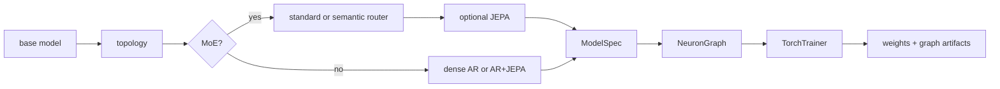

# CLI Workflows

The `cli/` package installs the `nfn` command for training, inference, and
evaluation outside the web editor. It is an in-repo companion to the Python SDK:
it builds real `ModelSpec` objects, exports graph JSON plus `.pt` weights, uses
the shared dataset manager, and defaults artifacts to `~/NeuralFn/artifacts`.

For the longer operator runbook, see [../cli/README.md](../cli/README.md).

## Install

```bash
cd cli
python -m venv .venv
source .venv/bin/activate
pip install -e ..
pip install -e .
nfn --help
```

The first editable install exposes the `neuralfn` and `server` packages from
the repo root. The second installs the CLI entrypoint declared by
`cli/pyproject.toml`.

## Commands

| Command | Purpose |
|---------|---------|
| `nfn train` | Train a composed recipe and export `.pt` weights plus graph `.json`. |
| `nfn infer` | Load an exported graph and generate text from a prompt. |
| `nfn eval` | Run validation batches and prompt probes, then write a JSON report. |

Every command accepts `--plan` for an interactive questionnaire and
`--plan-auto` for recommended defaults without prompting. Help output supports
`--help-style short`, `--help-style long`, and `--help-style verbose`.

## Recipe model

Recipes are composed from a small set of choices:

| Choice | Values |
|--------|--------|
| Base model | `llama`, `gpt2`, `nanogpt` |
| Topology | `dense`, `moe`, `semantic_router` |
| Router mode | `standard`, `semantic` |
| Objective overlay | `--jepa` |
| Runtime | default or `--megakernel` |
| Training mode | `pretrain`, `sft`, `dpo`, `ppo`, `reward_model` |
| Adapter | `none`, `lora`, `qlora`, `randmap` |



Examples:

```bash
nfn train --plan
nfn train --pretraining-file ./pretraining-data.txt
nfn train --base-model llama --topology moe --router-mode semantic --jepa
nfn infer --graph ~/NeuralFn/artifacts/llama_fast.json --prompt "Once upon a time"
nfn eval --base-model gpt2 --dataset shakespeare
```

## Datasets and tokenizers

Dataset shortcuts are resolved by the shared selector logic in
`cli/scripts/train_jepa_semantic.py`.

| Shortcut | Data path | Default tokenizer |
|----------|-----------|-------------------|
| `golf1` | cached-token parameter-golf, one training shard | `sp1024` |
| `golf10` | cached-token parameter-golf, ten training shards | `sp1024` |
| `shakespeare` / `shakespear` | raw text | `cl100k_base` |
| `tinystories` | raw text from TinyStoriesV2 GPT-4 files | `o200k_base` |
| `--pretraining-file FILE` | local raw `.txt` file | tokenizer selected by `--tokenizer` or dataset defaults |

Tokenizers are separate from datasets. `--tokenizer` accepts
`gpt2`, `cl100k_base`, `o200k_base`, `sp1024`, `sp2048`, `sp4096`, and
`sp8192`. SentencePiece assets live under `~/.cache/nfn/tokenizers`; if a
cached dataset already contains matching tokenizer files under its
`tokenizers/` directory, the CLI promotes them into the shared tokenizer cache
before trying a download.

Missing cached dataset aliases are downloaded by default when the CLI can
derive a contract from the alias or explicit download flags. Existing aliases
remain strict: tokenizer-backed shard/vocab mismatches fail fast and should be
fixed by rebuilding or re-downloading the alias.

## Artifacts

By default, the CLI writes to `~/NeuralFn/artifacts`. Set
`NEURALFN_ARTIFACTS_DIR` to override that shared artifact root for CLI and
server graph-run outputs.

Training saves:

- `<mode>.pt` for weights
- `<mode>.json` for the exported graph
- `<mode>.interrupted.pt` and `<mode>.interrupted.json` when interrupted

The graph JSON records `artifact_metadata.weights_file`, tokenizer metadata,
and training metadata so inference can load graph-first and treat `--weights`
as an override.

## Fine-tuning flags

`nfn train` can build fine-tuning root graphs through the same recipe path:

| Flag | Purpose |
|------|---------|
| `--training-mode sft` | Supervised fine-tuning with `sft_dataset_source` and masked token CE. |
| `--training-mode dpo` | Direct Preference Optimization with policy/reference forwards. |
| `--training-mode ppo` | PPO graph skeleton for rollout-buffer optimization. |
| `--training-mode reward_model` | Preference reward-head training. |
| `--adapter-type lora` | Insert trainable LoRA projections. |
| `--adapter-type qlora` | Use nf4 base projection buffers plus LoRA deltas. |
| `--adapter-type randmap` | Use fixed random projections with a trainable middle adapter. |
| `--adapter-only-save` | Save only adapter/head parameters after training. |

Fine-tuning checkpoints use `--base-checkpoint`, `--ref-checkpoint`, and
`--reward-checkpoint` depending on the selected objective.

## Verification

Useful non-training checks:

```bash
conda run -n NeuralFn python cli/nfn.py --help
conda run -n NeuralFn python cli/nfn.py train --help
conda run -n NeuralFn python -m pytest cli/tests/test_nfn_cli.py -q
conda run -n NeuralFn python -m pytest cli/tests/test_train_pretraining_file_flags.py -q
```

Training jobs are CUDA-oriented and may be long-running; use the smoke
`--run-preset` or targeted unit tests for local doc/API verification.
