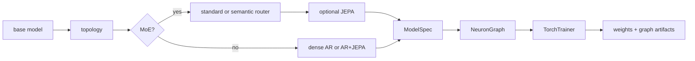

# CLI Workflows

The `cli/` package installs the `nfn` command for training, inference,
evaluation, and backend diagnostics outside the web editor. It is an in-repo companion to the Python SDK:
it builds real `ModelSpec` objects, exports graph JSON plus `.pt` weights, uses
the shared dataset manager, and defaults artifacts to `~/NeuralFn/artifacts`.

For the longer operator runbook, see [../cli/README.md](../cli/README.md).

## Install

```bash
cd cli
python -m venv .venv
source .venv/bin/activate
pip install -e ..
pip install -e .
nfn --help
```

The first editable install exposes the `neuralfn` and `server` packages from
the repo root. The second installs the CLI entrypoint declared by
`cli/pyproject.toml`.

The default SDK install does not pull in Torch. Root `nfn --help` / no-argument
startup, `nfn train|infer|eval --help`, `nfn kernels ... --help`, `nfn kernels list [--json]`, CUDA Tile registry metadata, and native GPT-2 training work without importing Torch; install
`pip install -e ".[torch]"` for graph-backed training or
`pip install -e ".[tile-cuda]"` for Torch-free native CUDA Tile build tooling.

## Commands

| Command | Purpose |
|---------|---------|
| `nfn train` | Train a composed recipe and export `.pt` weights plus graph `.json`. |
| `nfn infer` | Load an exported graph or supported graphless checkpoint and generate text from a prompt. |
| `nfn eval` | Run validation batches and prompt probes, then write a JSON report. |
| `nfn kernels` | Inspect CUDA Tile kernel coverage and local CUDA Tile diagnostics. |

Every command accepts `--plan` for an interactive questionnaire and
`--plan-auto` for recommended defaults without prompting. Help output supports
`--help-style short`, `--help-style long`, and `--help-style verbose`.

## Recipe model

Recipes are composed from a small set of choices:

| Choice | Values |
|--------|--------|
| Base model | `llama`, `gpt2`, `nanogpt` |
| Topology | `dense`, `moe`, `semantic_router` |
| Router mode | `standard`, `semantic` |
| Objective overlay | `--jepa` |
| Runtime | default or `--megakernel` |
| Training mode | `pretrain`, `sft`, `dpo`, `ppo`, `reward_model` |
| Adapter | `none`, `lora`, `qlora`, `randmap` |



Examples:

```bash
nfn train --plan
nfn train --base-model gpt2 --dataset tinystories --eval-every-steps 1000
nfn train --base-model gpt2 --dataset tinystories --native-cuda-print-command --native-cuda-dry-run
nfn infer --graph ~/NeuralFn/artifacts/llama_fast.json --prompt "Once upon a time"
nfn infer --graph ~/NeuralFn/artifacts/gpt2_evo.json --weights ~/NeuralFn/artifacts/gpt2_evo.pt --prompt "Once upon a time"
nfn infer --checkpoint ~/NeuralFn/artifacts/final_model.pt --checkpoint-tokenizer ~/Downloads/fineweb_8192_bpe_lossless_caps_caseops_v1_reserved.model
nfn eval --base-model gpt2 --dataset shakespeare
nfn kernels list --json
nfn kernels doctor
nfn kernels bench --device auto --iterations 200
nfn kernels examples
```

## Kernel diagnostics

`nfn train --help`, `nfn infer --help`, `nfn eval --help`, and `nfn kernels ... --help` use lightweight static help from `cli/nfn.py` so basic CLI orientation does not import `nfn_impl`, Torch, or graph-backed runtime modules. `nfn kernels list` prints CUDA Tile registry coverage from builtin and optimizer metadata on the same lightweight path. JSON output includes `by_dtype` aggregate counts plus each spec's legacy `dtypes` tuple and `dtype_support` matrix for `float32`, `float16`, `float8_e4m3fn`, `float8_e5m2`, and `nvfp4`, with either `"supported"` or the reason that dtype is not yet advertised. Unsupported lower-precision entries use category-specific reasons for losses/reductions, optimizers, stochastic masks, integer/hash/routing outputs, source nodes, and delegated graph calls. The fp8-supported entries include scalar/simple elementwise kernels, direct and composite projections, and attention Q/K/V modules that dequantize activations to float32 and return float32 outputs where required. The NVFP4-supported entries currently cover packed projection-family activations for `linear`, LM/router/value/reward/denoise heads, tied LM head, KV PCA encode/decode, JEPA heads, deterministic LoRA/TTT/adapter projections, `bitlinear_ternary`, `fp8_linear`, `mx_linear`, MLP projections, and ACT halt projection, plus attention Q/K/V and shared attention inputs for SDPA, sparse attention variants, differential attention, causal/fused causal attention, MLA, and routed attention experts. `nfn kernels doctor` also reports the local `nvcc`, CUDA Tile header, `torch.cuda`, and compute-capability status. `nfn kernels bench` compares the old graph-walk helper, the static compiled PyTorch plan, and the Tile-requested compiled plan on a small scalar graph. `nfn kernels examples` lists checked-in examples and `nfn kernels examples --write --output-dir examples/tile_cuda` regenerates the per-registry SDK snippets. These commands accept `--json` for automation.

`nfn train`, `nfn infer`, and `nfn eval` accept `--kernel-backend {auto,torch,tile-cuda}`, `--tile-cuda-strict` / `--no-tile-cuda-strict`, and `--tile-cuda-report PATH`. `tile-cuda` requests the implemented CUDA Tile fast path, build-loads the optional extension when needed, and defaults to strict kernel enforcement so unsupported graph nodes or tensor contracts fail instead of silently dropping to slower fallback paths. Pass `--no-tile-cuda-strict` only when intentionally debugging fallback behavior. The registry currently accounts for all 138 training-relevant entries with 129 Tile-covered kernels/compositions, 7 host-only entries, and 2 delegated graph calls. `NFN_TILE_CUDA_BUILD=1` enables extension builds for `auto` backend probes, and `NFN_TILE_CUDA_ARCH` can override the architecture flag passed to `nvcc`. Install `pip install -e ".[tile-cuda]"` if the active environment does not already provide `ninja` for native CUDA Tile builds; install `.[torch]` separately only for graph-backed PyTorch execution.

The native GPT-2 compiled CLI has its own backend selector:
`--backend llm-kittens|tile-cuda` (or Python wrapper
`--kernel-backend`). `llm-kittens` is the current external fast trainer.
`tile-cuda` is the default NeuralFn-owned compiled trainer for dense GPT-2.
`--native-cuda-print-plan` and `--native-cuda-check-tile-ops` still print the
raw Tile ABI plan or check the trainer-facing library. The Tile plan includes
the GPT-2 parameter layout and forward/backward/optimizer stage sequence that
the native loop executes.
`--native-cuda-smoke-tile-ops` / `--smoke-tile-ops` goes one step beyond
symbol checks: it loads `libnfn_native_train_tile_ops.so`, loads CUDA runtime,
launches `nfn_native_tile_fill_float32` on a tiny device buffer, copies the
result back, and reports JSON without Python, Torch, or graph-node payloads.
`--native-cuda-smoke-optimizer-step` / `--smoke-optimizer-step` allocates the
GPT-2 contiguous parameter, gradient, and AdamW moment buffers, runs one AdamW
call per registered GPT-2 parameter buffer with the correct decay/no-decay
setting, samples copyback values, and reports JSON.
`--native-cuda-smoke-lm-step` / `--smoke-lm-step` runs a tiny GPT-2-shaped
tied embedding/LM-head step through token embedding, linear logits, full-vocab
CE partials and workspace CE backward, linear input/weight backward, token
embedding weight backward, and AdamW.
`--check-tile-ops`, `--smoke-tile-ops`, `--smoke-optimizer-step`,
`--smoke-lm-step`, `--smoke-attention-step`, `--smoke-mlp-step`,
`--smoke-norm-residual-step`, and `--smoke-transformer-block-step` are no-data
preflight actions: the compiled CLI runs them before token-shard resolution, so
they do not require cached `fineweb_train_*.bin` shards and report
`token_shards_resolved: false` when no dataset was opened. Dataset-backed
smokes such as `--smoke-embedding-lm-step`, `--smoke-transformer-lm-step`, and
real training modes still resolve cached train/validation shards before running.
`--native-cuda-smoke-attention-step` / `--smoke-attention-step` runs a tiny
GPT-2 model-dim attention stage through qkv projection, QKV split, SDPA
forward/backward, QKV gradient merge, projection backward, and AdamW.
`--native-cuda-smoke-mlp-step` / `--smoke-mlp-step` runs a tiny GPT-2 MLP
stage through c_fc projection, GELU forward/backward, c_proj projection
backward, and AdamW.
`--native-cuda-smoke-norm-residual-step` / `--smoke-norm-residual-step` runs
GPT-2 LayerNorm, scaled residual add, LayerNorm affine/input backward, gradient
accumulation, and AdamW through raw Tile kernels.
`--native-cuda-smoke-embedding-lm-step` / `--smoke-embedding-lm-step` samples
a tiny cached uint16 token batch in C++ and runs token embedding, absolute
position embedding, embedding residual add, final LayerNorm, tied LM head, CE
backward, embedding/norm backward, and AdamW without graph-editor payloads.
`--train-embedding-lm` runs that GPT-2
embedding/final-norm/LM path as a real multi-step compiled loop over cached
train shards, with validation losses from validation shards controlled by
`--eval-every-steps`, `--eval-batches`, and `--eval-batch-size`.
`--native-cuda-smoke-transformer-block-step` /
`--smoke-transformer-block-step` composes GPT-2 LayerNorm, fused QKV attention,
real 12-head reshape/merge layout (`12 x 64`), residual adds, MLP, backward
passes, gradient accumulation, projection bias gradients, and AdamW updates for
all 12 GPT-2 block parameter buffers through raw Tile kernels.
`--native-cuda-smoke-transformer-lm-step` /
`--smoke-transformer-lm-step` samples cached uint16 tokens and runs
range-checked GPT-2 token IDs through token/position embeddings, one tiny
transformer block, final LayerNorm, tied LM head, CE forward/backward,
transformer backward, embedding backward, and AdamW for 16 parameter buffers
through raw Tile kernels.
`--train-transformer-lm` is the default strict compiled training action for that
transformer-LM path. It runs a full-vocab real-dim 12-layer multi-step loop
over cached shards with periodic validation records in `validation.losses`,
using the token/position embedding, transformer, final norm, tied LM head, CE
backward, a row-chunked tied LM-head/CE workspace, device-side global norm
gradient clipping, scratch-recompute activation tape, and 148-buffer AdamW raw
Tile kernels without Python/Torch.
The trainer-facing Tile ops library built by `tools/build_native_train_tile_ops.sh`
defaults to the SM120 ThunderKittens bf16 attention bridge. GPT-2-compatible
training JSON reports `attention_backend_strategy: "tk-sm120-bf16-bridge"`,
`attention_forward_tk_launch_count`, `attention_backward_tk_launch_count`, and
zero row/scalar attention launches when that path is active. Set
`NFN_TILE_CUDA_USE_TK_ATTENTION=0` before rebuilding only for the older float32
row-scan diagnostic path.
The same trainer-facing build routes transformer block forward/recompute
projections through `nfn_native_tile_linear_bf16_float32` and transformer block
dInput GEMMs through `nfn_native_tile_linear_backward_input_bf16_float32`, which
forces the cached-workspace BF16 `cublasGemmEx` bridge for cacheable-weight
GEMMs. LM-head and dWeight accumulation GEMMs stay on the normal optimized TF32
tensor-op `cublasSgemm` default so activation-first dWeight calls avoid BF16
repacking overhead. Set `NFN_TILE_CUDA_LINEAR_BF16=1` or
`NFN_NATIVE_LINEAR_BF16=1` only when profiling the normal linear ABI's BF16
bridge. GPT-2 training JSON reports `linear_backend_strategy:
"block-forward-and-block-dinput-bf16-dweight-tf32"`,
`block_forward_linear_strategy`, `block_backward_input_linear_strategy`,
`non_block_forward_backward_linear_strategy`,
`linear_bf16_gemm_count`, `linear_sgemm_count`, `linear_bf16_a_pack_count`,
`linear_bf16_a_cache_hit_count`, `linear_bf16_cache_reset_count`,
`linear_bf16_cached_a_capacity`, and `linear_bf16_cache_entry_count`.
The tied LM-head row chunk defaults to 2048 rows and can be overridden with
`--lm-head-row-chunk-size` on the compiled C++ entrypoint or
`--native-cuda-lm-head-row-chunk-size` from the wrapper/root CLI. Loss partials
are reduced on device before one host loss copy per forward loss, and tied
LM-head dWeight chunks accumulate directly into `accum_grad_token_weight` with
`nfn_native_tile_linear_backward_weight_accumulate_float32` instead of using a
full-vocab scratch gradient buffer per chunk or per microbatch.
Its JSON reports `trained_layers: 12`, `target_layers: 12`,
`block_state_layout` with block-vector allocation/init/zero/clip/AdamW/checkpoint/tape/forward/backward loop
flags, `activation_tape_strategy: "scratch-recompute"`, `activation_tape_count: 1`,
`persistent_block_outputs: 11`, `final_block_output_copy_elided: true`, `vocab: 50257`, `lm_head_row_chunk_size`,
`lm_head_row_chunk_count`, `loss_partial_count`, `logit_workspace_elements`,
`gradient_partial_count`, `gradient_clip_norm`, and `sample_gradient_clip_scale`
after completed steps. Pass
`--no-train-transformer-lm` on the compiled C++ entrypoint only for plan/check/debug
commands that should not start the default trainer. `--checkpoint-metadata-smoke
--output-dir PATH` writes a sparse version-5 bf16 native checkpoint-format file
plus `DONE_########` marker for the requested `--num-layers` target shape without Python,
Torch, or CUDA. Successful `--train-transformer-lm` runs also write a final
12-layer trained-weight native checkpoint plus `DONE_########` marker. The
trained checkpoint path packs device float32 weights to bf16 payload bits with
`nfn_native_tile_float32_to_bf16_bits_many` before a single contiguous host
copy, so JSON reports `checkpoint.payload_pack_strategy:
"device-many-float32-to-bf16-bits-contiguous"`, `payload_pack_kernel:
"nfn_native_tile_float32_to_bf16_bits_many"`, `payload_copy_strategy:
"single-contiguous-device-payload-d2h"`, `payload_cpu_bf16_conversion: false`,
`device_pack_kernel_launches`, `d2h_copy_count`, `d2h_bytes`, and
`float32_d2h_bytes_elided` instead of materializing full float32 tensors on CPU
for bf16 packing or copying each parameter tensor separately.
Use `--cuda-runtime-lib PATH` or `NFN_CUDA_RUNTIME_LIB` when libcudart is not
on the loader path. Backend names are strict; use `llm-kittens` or `tile-cuda`.
For bottleneck analysis, set `NFN_NATIVE_GPT2_STAGE_TIMING=1` before a
`--train-transformer-lm` run. The trainer then adds CUDA-event measurements
under `timing.stage_timing`, including token upload, model/block forward,
block recompute/backward, LM-head backward, embedding/final-norm backward,
gradient zero/clip, and AdamW update stages. It also reports nested LM-head,
block forward/recompute, and block backward substages such as
`lm_head_backward.dhidden`, `lm_head_backward.dweight`,
`block_forward.attention`, `block_backward.mlp_proj`,
`block_backward.attn_sdpa`, and `block_backward.qkv`. This mode inserts event
timing work and synchronizes before reporting, so keep it off for normal
throughput or model-quality runs.

Startup keeps per-block parameter/gradient allocation, scratch-tape activation
allocation, parameter initialization, and AdamW-state zeroing under the
block-vector visitors. Block 0 is not also touched through the legacy global
alias list, and JSON reports
`block0_duplicate_allocation_elided`,
`block0_duplicate_activation_allocation_elided`,
`block0_duplicate_parameter_initialization_elided`, and
`block0_duplicate_adamw_state_zero_elided` under `block_state_layout`.
Float buffers are suballocated from one aligned CUDA device arena, so the full
trainer does not issue one `cudaMalloc` per parameter, gradient, moment,
activation, and workspace buffer. JSON reports
`float_allocation_strategy: "single-arena"`,
`float_allocation_cuda_malloc_count`, `float_allocation_request_count`,
`float_arena_requested_elements`, and `float_arena_allocated_elements`.
Startup zeroes the float arena once, then overwrites nonzero weights with
device initializers; the default 12-layer shape elides 369 per-buffer zero-fill
launches for zero biases and AdamW state. JSON reports
`float_arena_zero_init_strategy: "single-arena-fill"`,
`float_arena_zero_fill_count`, `startup_per_buffer_zero_fill_elided`, and
`startup_per_buffer_zero_fill_launches_elided`.
Token upload/storage buffers are also arena-backed: one aligned device arena
holds widened int64 token/target buffers plus compact uint16 H2D staging, and
one pinned uint16 host arena holds compact source staging. JSON reports
`token_buffer_allocation_strategy: "combined-arenas"`,
`token_device_allocation_strategy: "single-device-arena"`,
`token_device_arena_cuda_malloc_count`,
`token_device_arena_suballocation_count`, and
`token_device_cuda_mallocs_elided`.

Native GPT-2 command paths accept `--template-name NAME` / `--template NAME` /
`--preset NAME` and `--graph-file PATH` / `--graph PATH`. These arguments are
canonicalized to `--template-name` and `--graph-file` by Python wrappers, then
carried through the SDK config and compiled C++ frontend without loading Torch.
Top-level `nfn train --base-model gpt2` direct compiled-CLI handoff adds
`--train-transformer-lm` for normal training commands, including selector-bearing
commands, unless the command already requested a plan/check/smoke/train action.
The selector accepts every name in
`neuralfn.config.SHIPPED_GPT_TEMPLATE_PRESETS`, and the compiled C++ plan JSON
reports the synchronized `shipped_template_catalog`,
`shipped_template_catalog_count`, and `template_known` fields. The current native
loop runs dense GPT-2-compatible presets (`gpt2`, `gpt2_megakernel`, and
`gpt2_moa`) through the transformer-LM trainer; `gpt2_moa` resolves to the
native MoA activation mode automatically. Structurally different shipped GPT
template names and custom graph files are selected and reported in JSON, but
return `selected-graph-native-trainer-missing` for real training until their
native C++ Tile trainer plans are implemented. Unknown template names return
`unknown-template`, which keeps typos separate from known migration work.

The same trainer samples cached token/target batches directly into one pinned
uint16 arena, enqueues one H2D `cudaMemcpyAsync`, and widens tokens plus targets
to int64 IDs on device with one `nfn_native_tile_uint16_to_int64` launch.
The per-batch CPU int64 expansion and token-range scan are intentionally absent
from this native hot path; output JSON reports
`token_id_upload_strategy: "uint16-pinned-async-h2d-device-widen"`,
`token_id_host_staging: "pinned"`, `token_id_h2d_copy:
"cudaMemcpyAsync-contiguous-arena"`, `token_id_h2d_copy_calls_per_microbatch:
1`, `token_id_widen_strategy: "single-contiguous-arena-kernel"`,
`token_id_widen_kernel_launches_per_microbatch: 1`, and
`token_batch_staging_strategy: "direct-sampler-to-pinned-arena"`,
`token_batch_vector_materialization: false`, and `token_id_host_validation:
false`.

Startup initializes the tied token embedding/LM-head weight directly on device
with `nfn_native_tile_init_gpt2_token_weight_float32` instead of building and
copying a 154 MB host float matrix. Output JSON reports
`token_weight_init_strategy: "device-tile-deterministic"` and
`token_weight_host_materialization: false`.

For performance, the compiled GPT-2 transformer-LM trainer does not compute
training loss in the hot path. Ordinary steps run the forward activations
needed for backward, CE gradient generation, gradient clipping, and AdamW only;
validation cadence computes validation loss from validation shards without also
measuring train loss. The JSON fields `train_loss_sparse: false`,
`train_loss_sampling: "disabled"`, `train_loss_on_validation_steps: false`,
`train_loss_eval_count`, and `train_loss_last_step` report that contract.

Persistent block-output preservation in the compiled GPT-2 trainer uses
`nfn_native_tile_copy_float32` rather than zero-fill plus
`nfn_native_tile_gradient_accumulate_float32(scale=1)`, removing one Tile launch
per block output copy while keeping the scratch-recompute tape contract.
The final block output copy is elided because final LayerNorm consumes it before
backward recomputation starts.
Validation forwards do not copy intermediate block outputs into persistent
training-backward buffers because no backward pass follows validation; JSON
reports `validation_persistent_block_outputs: 0` and
`validation_block_output_copies_elided: true`.
The scratch-recompute backward pass reuses the final block activations left by
the initial forward pass, so only earlier blocks are recomputed from persistent
block outputs. The default 12-layer JSON reports `backward_recompute_blocks: 11`
and `final_block_backward_recompute_elided: true`. Earlier-block recompute now
stops after the MLP GELU activation because backward does not consume the
recomputed MLP projection output or final residual output; JSON reports
`backward_recompute_mlp_projection_elided: true` and
`backward_recompute_final_residual_elided: true`.
The MLP projection backward path writes its dInput into the MLP fc gradient
buffer and runs `nfn_native_tile_gelu_backward_inplace_float32`, so the full
trainer does not allocate a separate hidden-size `grad_act` scratch buffer.
JSON reports `mlp_proj_backward_gelu_inplace: true` and
`mlp_proj_backward_grad_act_scratch_allocated: false`.
Transformer block backward residual-gradient pair additions use
`nfn_native_tile_scaled_residual_add_float32`, so the trainer avoids the earlier
zero-fill plus two-accumulate sequence; `block_state_layout.residual_backward_fused`
reports this path.
Gradient clipping feeds the device clip scalar directly into
`nfn_native_tile_adamw_step_with_device_scale_float32`, avoiding a separate
per-gradient-buffer scale pass before AdamW;
`block_state_layout.adamw_device_clip_scale_fused` reports this path.
The sum-of-squares phase uses `nfn_native_tile_sumsq_partials_many_float32` over
the same device-resident gradient descriptor table, so the default 12-layer path
emits one sumsq kernel launch per optimizer step instead of one per gradient
buffer. JSON reports `gradient_clip_strategy:
"fused-multi-buffer-sumsq-device-scale"`,
`gradient_sumsq_kernel_launches_per_optimizer_step`,
`gradient_sumsq_per_buffer_launches_elided`, and
`block_state_layout.gradient_clip_loop: false`.
AdamW updates use `nfn_native_tile_adamw_step_many_with_device_scale_float32`
over device-resident parameter descriptors, so the default 12-layer path updates
148 parameter buffers with one optimizer kernel launch per optimizer step
instead of one launch per buffer. JSON reports
`adamw_update_strategy: "fused-multi-buffer-device-scale"`,
`adamw_descriptor_count`, `adamw_step_kernel_launches_per_optimizer_step`, and
`adamw_per_buffer_step_launches_elided`.
Token, position, and block Linear weight gradients accumulate directly into
optimizer-step accumulation buffers. The tied LM-head CE backward scale includes
the microbatch accumulation factor, LM-head dWeight chunks and token-embedding
backward write into `accum_grad_token_weight`, and the old full-vocab
token-gradient scratch buffer is not allocated. Position embedding backward uses
the accumulate-position ABI, so `grad_position_weight` is not allocated or copied
after each microbatch. Each transformer block also writes qkv, attention-output,
MLP fc, MLP projection dWeight, LayerNorm affine, and Linear bias gradients
straight into block accumulation buffers, so the real 12-layer loop does not
allocate per-block scratch gradient buffers or run a per-microbatch copy loop.
Accumulation buffers are zeroed once per optimizer step. JSON
reports
`token_gradient_accumulation_strategy: "direct-device-accumulation-buffer"`,
`token_gradient_scratch_buffer_allocated: false`,
`position_gradient_accumulation_strategy:
"direct-device-accumulation-buffer"`,
`position_gradient_scratch_buffer_allocated: false`,
`block_linear_weight_gradient_accumulation_strategy:
"direct-device-accumulation-buffer"`,
`block_linear_weight_gradient_scratch_buffers_allocated: false`,
`layer_norm_affine_gradient_accumulation_strategy:
"direct-device-accumulation-buffer"`,
`linear_bias_gradient_accumulation_strategy:
"direct-device-accumulation-buffer"`,
`block_state_layout.per_block_gradient_buffers: 0`,
`block_state_layout.per_block_direct_accum_gradient_buffers: 12`,
`block_state_layout.gradient_accumulation_loop: false`,
`block_state_layout.gradient_accumulation_copy_loop_elided: true`,
`block_state_layout.gradient_zero_strategy` set to
`"fused-multi-buffer-accumulation-zero"`, and `gradient_zeroed_buffer_count: 0`.
The accumulation buffers are zeroed once per optimizer step through
`nfn_native_tile_fill_many_float32` over the same descriptor table used by the
fused AdamW call, so the default 12-layer trainer emits one zero-fill kernel
launch instead of one launch per accumulation buffer. JSON reports
`gradient_zero_kernel_launches_per_optimizer_step` and
`gradient_zero_per_buffer_launches_elided`.
LayerNorm affine-gradient backward has an accumulate ABI and uses a chunked
parallel atomic reduction for large row counts instead of one CUDA block looping
over all rows. JSON reports
`block_state_layout.layer_norm_backward_affine_strategy:
"auto-chunked-atomic-accumulate"`.

The RTX 5090 GPT-2 harness at `cli/scripts/train_gpt2.py` is native-only. Direct execution with the default `compiled-cli` runner translates GPT-2 flags to the compiled C++ CLI and runs it before importing `train_gpt2_native.py`, graph-backed helpers, `server.dataset_manager`, NumPy, tiktoken, or Torch; importing the module, building its parser, and resolving defaults are also lightweight. The native GPT-2 default dataset is TinyStoriesV2 GPT-4 (`roneneldan__TinyStories__TinyStoriesV2-GPT4`) with the GPT-2 tokenizer; `golf1` and `golf10` are explicit cached-token shortcuts, not defaults. The native path resolves the dataset alias with the shared C++ token-shard resolver, materializes `gpt2`/SentencePiece raw text into uint16 `fineweb_train_*.bin` and `fineweb_val_*.bin` shards when needed, then launches the compiled GPT-2 CUDA trainer directly. The resolver also accepts llm.kittens-style `TinyStories_train.bin` / `TinyStories_val.bin`; `--tinystories` uses `/mnt/disk2/dev/open-source/llm.kittens/dev/data/tinystories` when those files exist, `NFN_LLM_KITTENS_TINYSTORIES_DIR` overrides that location, and direct `--dataset-alias /path/to/TinyStories_train.bin` infers the sibling validation bin. The C++ sampler reads contiguous shard segments for each batch instead of reopening the shard for every sequence chunk, and native token-shard JSON reports `batch_read_strategy: "contiguous_shard_segments"`. With the default `compiled-cli` runner and existing cached train plus validation shard files, Python passes the alias/path directly to the compiled resolver without reading `meta.json`, validating shard metadata, or estimating the full training schedule first. The script sets up its own repo/script import path before native dispatch, so direct `python cli/scripts/train_gpt2.py ...` and `runpy`-style native invocations do not need `PYTHONPATH`. Default GPT-2 `nfn train` commands go directly to `nfn_gpt2_native_train --backend tile-cuda --train-transformer-lm` before importing `train_gpt2_native`, `nfn_impl`, or Torch; use `--backend llm-kittens` only when explicitly testing the external trainer bridge. Unsupported families fail from the native registry. Explicit non-default GPT-2 runners still use the Python native runner. Real token batches do not pass through graph-editor nodes or `TorchTrainer` on the compiled Tile-CUDA path. Defaults match the SM120 run shape: 20,000 steps, sequence length 1024, microbatch 64, 524,288 tokens/step, learning rate 0.0006, weight decay 0.1, 60 warmup steps, validation every 250 steps, sample/checkpoint cadence 20,000/200, and cosine decay to zero. The C++ loop makes the 524,288-token step real by deriving `grad_accum_steps = ceil(train_batch_tokens / (batch_size * seq_len))`, streaming that many microbatches through CUDA Tile forward/backward, accumulating scaled gradients on device, and running clip plus AdamW once per optimizer step. Native JSON reports `microbatch_tokens`, `requested_train_batch_tokens`, `grad_accum_steps`, `effective_train_batch_tokens`, `train_microbatches_completed`, and `gradient_accumulation_strategy`. Build the C++ binding with `bash tools/build_native_gpt2_binding.sh`, the launcher with `bash tools/build_native_gpt2_launcher.sh`, the no-Python cached-shard CLI with `bash tools/build_native_gpt2_cli.sh`, and the unified frontend with `bash tools/build_native_train_cli.sh`. `cli/install.sh` links stable command names, so use `nfn-native-train --base-model gpt2 --dataset-alias PATH_OR_ALIAS` or `nfn-gpt2-native --dataset-alias PATH_OR_ALIAS` to bypass Python entirely when shards already exist. Use `nfn-native-train --list-models` or `--list-models --json` to inspect native training coverage. The default runner is `compiled-cli`, which requires the no-Python cached-shard CLI; use `--native-cuda-runner auto|binding|launcher|subprocess` only when you intentionally want Python materialization/orchestration, the SDK binding, launcher, or direct external trainer path. Use `--eval-every-steps 1000` for validation loss every 1000 optimizer steps, `--native-cuda-print-command` to inspect the resolved native command, `--native-cuda-config-out PATH` to persist it, `NFN_DATASETS_DIR=/path/to/datasets` to override the native alias cache root, `NFN_NATIVE_GPT2_BIN_DIR=/path/to/bin` to choose where native command symlinks are installed, `NFN_NATIVE_TRAIN_CLI=/path/to/nfn_native_train` to override the unified frontend, `NFN_NATIVE_GPT2_CLI=/path/to/nfn_gpt2_native_train` to override the GPT-2 compiled CLI, `NFN_NATIVE_GPT2_LAUNCHER=/path/to/nfn_gpt2_tile_train` to override the launcher, and `NFN_NATIVE_GPT2_TRAIN_BIN=/path/to/train_gpt2cu` to override the external trainer binary used only by the explicit `llm-kittens` backend.

The compiled GPT-2 `--train-transformer-lm` JSON includes `cuda_runtime_preflight` before any allocation. Driver version `0` or a loaded CUDA runtime newer than the driver exits early with an actionable GPU-access/runtime error, which is the expected gate before live SM120 throughput comparison.

Wrapper-level dry-runs are metadata-only on the default GPT-2 `compiled-cli`
runner. `python cli/scripts/train_gpt2.py --tinystories --native-cuda-dry-run
--native-cuda-print-command` builds the compiled C++ argv from the dataset
alias/path and leaves shard validation to C++, so it does not import
`server.dataset_manager`, NumPy, tiktoken, or Torch and does not materialize
raw-text token shards before printing the command.
Dense GPT-2 native `--dry-run` / `--print-plan` JSON reports the implemented
Tile-CUDA transformer-LM path as `native-transformer-lm-ready` with
`training_step_plan.status: "ready"`. `required_native_work` is empty for the
native-runnable dense presets, and `remaining_validation` tracks the live SM120
throughput comparison still required against `llm.kittens/train-sm120.sh`.

Non-GPT-2 `nfn train` commands now enter the compiled native frontend and fail there with the registry status when no trainer is implemented. Direct legacy training scripts (`train_llama_fast.py`, `train_nanogpt.py`, `train_gpt2_evo.py`, JEPA/semantic/MoE variants, and DeepSeek smoke harnesses) hand off to the same native registry before Torch imports because their internal implementation is still graph-backed. NanoGPT is the partial exception: normal `nfn train --base-model nanogpt ...` and `python cli/scripts/train_nanogpt.py ...` runs add `--train-token-lm` automatically so they use the implemented native tied token-LM loop; `--dry-run` and `--print-command` inspect that same default route without starting the loop. The native NanoGPT loop uses `--eval-every-steps`, `--eval-batches`, and `--eval-batch-size` to compute validation loss over resolved validation token shards inside the compiled C++ loop, and reports those records in the output JSON `validation.losses` list without sending validation data through graph-editor nodes or Torch. Explicit native actions such as `--print-plan`, `--check-tile-ops`, or smoke commands still run exactly as requested. GPT-2 evo now has a model-aware compiled C++ preflight: `nfn_gpt2_evo_native_train --print-plan --eval-every-steps 1000 --tile-cuda-activation-dtype nvfp4` reports the AdamW, NVFP4, validation, and evo-layer plan plus the remaining native candidate kernels. Set `NFN_ALLOW_TORCH_TRAINING=1` only for one-off legacy debugging while native C++ trainers are being added for those model families.

SDK callers can use `neuralfn.native_train` for the same native frontend boundary. Build `neuralfn._native_train` with `bash tools/build_native_train_binding.sh`, then call `run_native_train(build_native_train_run_config("gpt2", ["--tinystories"]), runner="auto")` or inspect coverage with `native_train_model_registry()` without importing Torch. For GPT-2-only compiled CLI dispatch, `build_native_gpt2_compiled_cli_run_config(dataset_alias=...)` creates a handoff config without Python-side shard inspection.

Native C++ trainers can link the raw CUDA Tile ops library built by `bash tools/build_native_train_tile_ops.sh`. It produces `libnfn_native_train_tile_ops.so` from `neuralfn/csrc/tile_cuda/kernels.cu` plus a small C ABI in `neuralfn/csrc/native_train/tile_ops.cu`, avoiding `torch/extension.h` and the PyTorch extension binding while exposing trainer-critical single-buffer and multi-buffer AdamW, single-buffer and multi-buffer sumsq partials, gradient accumulation, device-buffer fill/zeroing, device float32-to-bf16 checkpoint payload packing, device-side global-norm clip scale finalization, device-scalar gradient scaling, reductions, linear, linear input/weight/weight-accumulate/bias/bias-accumulate backward, scaled residual add, fused projection bias+residual add, fused QKV split/merge, fused GPT-2 QKV split-to-heads, fused GPT-2 QKV bias+split-to-heads, fused GPT-2 heads-to-QKV gradient merge, reshape-heads/merge-heads, GELU forward/backward, token embedding forward/weight backward, absolute-position embedding forward/backward/backward-accumulate, RMSNorm, RMSNorm input backward, LayerNorm, LayerNorm input/affine/affine-accumulate backward, softmax, token and masked token cross-entropy partial, token and masked token cross-entropy logits backward, and scaled dot-product attention forward/backward kernels. The trainer build defines `NFN_TILE_CUDA_USE_CUBLAS_LINEAR=1` and links `libcublas`, so the exported native linear forward, dInput, dWeight, and accumulate-dWeight ABI symbols use GPU GEMM, while bias and accumulate-bias backward use GPU GEMV over a cached device ones vector initialized by a Tile fill kernel. The generic Tile extension build keeps the pure Tile fallback. CE logits backward uses a row-wise Tile path for vocabularies up to 1024 and a chunked row-wise path with reusable row-stat workspace for full GPT-class vocabularies. Linear weight, accumulate-weight, bias, and accumulate-bias backward keep the row-chunked tiled atomic fallback for builds or shapes that do not use the trainer cuBLAS path.

For GPT-2-compatible shapes, SDPA forward attempts a dense causal full-head
row-vector Tile kernel when `seq_k <= 1024`: one CTA computes a query row's
score/softmax and reuses it across all 64 value channels. If CUDA rejects that
row-kernel launch, the native Tile launcher records `cudaFuncGetAttributes`
diagnostics, the pre-launch CUDA error state, and the requested launch
grid/block shape, clears the launch error, auto-disables further row attempts
for the run, and falls back to scalar Tile attention without repeated
failed-launch overhead. Native GPT-2 JSON reports
`attention_forward_strategy: "row-vector-tile-score-reuse"`,
`attention_forward_value_chunk_size: 64`,
`attention_forward_scalar_launch_fallback_enabled: true`,
`attention_forward_row_launch_auto_disable_enabled: true`, runtime
row/fallback/scalar launch counts, row-kernel attribute fields, pre-launch
error codes, row launch grid/block fields, the old scalar output count, and the
score-reuse factor.

For GPT-2-compatible shapes, SDPA backward uses a query-row atomic Tile path.
The launcher zeros Q/K/V gradient buffers, then one CTA per query/head row
computes the softmax once, writes all 64 `dQ` channels, and atomically
accumulates `dK`/`dV` for the attended key rows. This replaces the old
per-scalar backward CTAs and avoids recomputing a full query softmax from each
key row. Native JSON reports
`attention_backward_strategy: "query-row-atomic-tile-score-reuse"`,
`attention_backward_row_count`, `attention_backward_scalar_output_count`,
`attention_backward_score_reuse_dim: 64`, and
`attention_backward_scalar_cta_elision_factor: 192`.

Compiled GPT-2 `--train-transformer-lm` training results include a `timing`
object with host wall-clock phase timers: `setup_wall_ms`,
`train_loop_wall_ms`, `validation_wall_ms`, `train_compute_wall_ms`,
`checkpoint_wall_ms`, `total_wall_ms`, `optimizer_steps_per_second`, and
`train_tokens_per_second`. These fields do not add synchronization points; the
train-loop timer ends after the existing final sample copy from device to host.

The full GPT-2 transformer-LM forward path uses
`nfn_native_tile_split_qkv_to_heads_add_bias_float32` to apply Q/K/V bias while
writing Q/K/V head-major buffers directly. This replaces the legacy QKV
bias-add plus split-plus-three-reshape sequence, so native JSON reports
`qkv_forward_layout_strategy: "fused-split-to-heads"`,
`qkv_bias_layout_strategy: "fused-qkv-bias-split-to-heads"`, and the elided
layout launches per block.

The matching backward layout path uses
`nfn_native_tile_scaled_dot_product_attention_backward_to_qkv_from_merged_grad_float32`
to write TK bf16 attention gradients directly into the row-major QKV gradient
buffer. This replaces three bf16-to-float conversion launches plus one
heads-to-QKV merge launch per block and removes the full trainer's head-major
Q/K/V gradient scratch buffers. Native JSON reports
`attention_backward_qkv_bridge_strategy: "fused-bf16-heads-to-row-qkv"` and
the elided bridge launches per block.

Full GPT-2 SDPA backward also uses
`nfn_native_tile_scaled_dot_product_attention_backward_from_merged_grad_float32`
to read the row-major attention-output gradient from the projection backward
directly. This removes the pre-SDPA-backward `reshape_heads` launch and
`grad_attn_heads` scratch buffer from the full trainer. Native JSON reports
`attention_backward_grad_layout_strategy: "merged-grad-out-direct"` and one
elided grad-output layout launch per block.

The full GPT-2 QKV path uses
`nfn_native_tile_split_qkv_to_heads_add_bias_float32` after the no-bias QKV
CUBLAS projection. The fused Tile pass applies Q/K/V bias while writing
head-major Q/K/V buffers, replacing the remaining standalone QKV bias-add
launch. Native JSON reports `qkv_bias_layout_strategy:
"fused-qkv-bias-split-to-heads"` and one elided legacy QKV bias launch per
block.

The full GPT-2 TK attention backward bridge uses
`nfn_native_tile_scaled_dot_product_attention_backward_to_qkv_from_merged_grad_float32`.
It converts bf16 `dQ`/`dK`/`dV` head-major gradients directly into row-major
`grad_qkv`, replacing three bf16-to-float gradient conversion launches plus the
heads-to-QKV merge launch. Native JSON reports
`attention_backward_qkv_bridge_strategy: "fused-bf16-heads-to-row-qkv"` and
three elided bridge launches per block.

The full GPT-2 MLP path uses `nfn_native_tile_gelu_add_bias_float32` after the
no-bias CUBLAS `c_fc` projection. The fused Tile pass writes the biased
preactivation kept for GELU backward and the GELU activation, replacing separate
bias-add and GELU launches. Native JSON reports
`mlp_fc_bias_gelu_strategy: "fused-bias-preactivation-gelu"` and one elided
legacy launch per block.

The full GPT-2 projection residual path uses
`nfn_native_tile_linear_bias_residual_add_float32` after no-bias attention-output
and MLP `c_proj` CUBLAS projections. The fused Tile pass applies projection
bias, residual scale, and residual add together, replacing separate projection
bias-add and residual-add launches. Native JSON reports
`projection_bias_residual_strategy: "fused-linear-bias-residual-add"` and two
elided legacy launches per block.

The full GPT-2 transformer-LM trainer also uses
`nfn_native_tile_fill_many_values_float32` for startup nonzero constant
parameter initialization. Its JSON reports
`parameter_initialization_strategy: "fused-multi-buffer-fill-values"` and
`parameter_initialization_per_buffer_launches_elided`; the default 12-layer
shape initializes those 75 tensors with one descriptor-driven Tile launch.
The AdamW, gradient-clip, gradient-zero, and parameter-fill descriptor tables
are suballocated from one device descriptor arena and uploaded from one
host-packed descriptor arena instead of ten separate small startup allocations
and ten descriptor H2D copies. JSON reports
`descriptor_allocation_strategy: "single-device-arena"`,
`descriptor_arena_cuda_malloc_count`, `descriptor_arena_suballocation_count`,
`descriptor_upload_strategy: "single-host-packed-arena-copy"`,
`descriptor_arena_copy_count`, `descriptor_arena_copy_calls_elided`, and
`descriptor_cuda_mallocs_elided`.

`neuralfn/csrc/native_train/token_shards.cpp` is the reusable C++ token-shard resolver and sequential batch sampler used by native trainers. It resolves aliases through `NFN_DATASETS_DIR`, validates `fineweb_train_*.bin` / `fineweb_val_*.bin` uint16 shards, accepts llm.kittens-style `TinyStories_train.bin` / `TinyStories_val.bin`, infers validation siblings for direct train-bin paths, skips the 1024-byte cached-shard header when present, sorts shard names, counts tokens, computes microbatch/gradient-accumulation metadata, and either produces token plus next-token target vectors for smoke/debug JSON or writes directly into caller-owned token/target buffers with `SequentialTokenBatchSampler::next_into()`. Full GPT-2 training uses `next_into()` with pinned memory, so real batches avoid Python, Torch, graph-editor nodes, `TokenBatch` vector materialization, and vector-to-pinned copies.

`bash tools/build_native_missing_trainers.sh` builds compiled per-family entrypoints such as `nfn_gpt2_evo_native_train`, `nfn_nanogpt_native_train`, and `nfn_llama_native_train`. The unified frontend dispatches to these binaries when present, and they report native registry status or family-specific missing CUDA Tile trainer kernels instead of entering Torch. GPT-2 evo is now a model-aware C++ preflight target: `nfn_gpt2_evo_native_train --print-plan --eval-every-steps 1000 --tile-cuda-activation-dtype nvfp4` validates the dense GPT-2 shape, `adamw` optimizer profile, validation cadence, NVFP4 activation intent, and evo-layer index/cadence/population metadata, then prints the remaining native candidate-evaluation, mutation, candidate-loss reduction, and best-candidate adoption kernels without importing Python or Torch. NanoGPT is now a partial C++ native trainer: `nfn_nanogpt_native_train --print-plan --require-token-shards --sample-token-batch` validates the NanoGPT shape, AdamW optimizer profile, cached-token shards, effective token schedule, contiguous parameter/gradient/AdamW-state buffer layout, AdamW decay/no-decay groups, forward/backward/optimizer `training_step_plan`, and first native token/target batch, then prints JSON without importing Python or Torch. Use `nfn_nanogpt_native_train --check-tile-ops --tile-ops-lib PATH` to `dlopen` `libnfn_native_train_tile_ops.so` and verify every NanoGPT-required raw ABI symbol from the compiled binary. Use `nfn_nanogpt_native_train --smoke-tile-ops --tile-ops-lib PATH` to also `dlopen` libcudart, allocate a tiny device buffer, execute `nfn_native_tile_fill_float32`, copy it back, and verify the value without Python or Torch. Use `nfn_nanogpt_native_train --smoke-optimizer-step --tile-ops-lib PATH` to build the NanoGPT parameter layout, allocate contiguous param/grad/AdamW moment buffers, initialize them through raw fill kernels, execute `nfn_native_tile_adamw_step_float32` once per registered parameter buffer with that buffer's decay/no-decay setting, copy param and moment buffers back, and verify the update. Use `nfn_nanogpt_native_train --smoke-training-loop-step --tile-ops-lib PATH` to exercise native optimizer-loop mechanics over that registered layout: gradient zeroing, synthetic gradient fill, global-norm clip scale finalization, device-scalar gradient scaling, and per-buffer AdamW updates. Use `nfn_nanogpt_native_train --smoke-lm-step --tile-ops-lib PATH` to run a tiny tied-embedding language-model step through token embedding, linear logits, token CE loss/backward, linear input/weight backward, token embedding weight backward, and AdamW update kernels, then verify loss, gradient, and weight update values. Use `nfn_nanogpt_native_train --smoke-token-train-step --tile-ops-lib PATH --dataset-alias PATH_OR_ALIAS` to sample a real native uint16 token/target batch from cached shards, run the tied-LM forward/backward/update kernels over those IDs, and verify sampled-batch loss, gradient, and weight update values. Use `nfn_nanogpt_native_train --train-token-lm --tile-ops-lib PATH --dataset-alias PATH_OR_ALIAS --max-steps N` to run the same tied token-embedding LM as a real multi-step native loop over cached token shards; it streams train batches with the C++ sampler, computes validation loss on validation shards every `--eval-every-steps` optimizer steps for `--eval-batches` batches of `--eval-batch-size` rows, zeros gradients on device, applies AdamW per step, and emits JSON metrics without Python or Torch. Use `nfn_nanogpt_native_train --smoke-embedding-norm-step --tile-ops-lib PATH --dataset-alias PATH_OR_ALIAS` to run sampled tokens through token plus absolute-position embeddings, residual add, LayerNorm forward/backward, tied logits, CE backward, embedding/position/norm gradients, and AdamW updates, then verify residual, norm, loss, gradient, and weight update values. Use `nfn_nanogpt_native_train --smoke-qkv-layout-step --tile-ops-lib PATH` to verify fused QKV split/merge layout kernels for the NanoGPT `attn.qkv.weight` activation and gradient path. Use `nfn_nanogpt_native_train --smoke-fused-qkv-attention-step --tile-ops-lib PATH` to run a tiny attention stage through one fused `attn.qkv.weight`, QKV split, SDPA forward/backward, QKV gradient merge, fused qkv weight backward, output projection backward, and AdamW updates for fused qkv/output weights. Use `nfn_nanogpt_native_train --smoke-transformer-block-step --tile-ops-lib PATH` to compose LayerNorm, fused-QKV attention, residual adds, MLP, backward passes, gradient accumulation, and AdamW updates for a tiny transformer block through raw native kernels. Use `nfn_nanogpt_native_train --smoke-mlp-step --tile-ops-lib PATH` to run a tiny MLP stage through fc projection, GELU, output projection, projection/input backward, GELU backward, and AdamW updates for both MLP weights, then verify forward, gradient, and weight update values. Use `nfn_nanogpt_native_train --smoke-attention-step --tile-ops-lib PATH` for the separate-Q/K/V attention comparison smoke; pass `--cuda-runtime-lib PATH` or set `NFN_CUDA_RUNTIME_LIB` when CUDA runtime resolution needs an explicit path. The tied LM head input/weight backward stages are covered by the raw linear backward ABI in that plan, and the AdamW optimizer stage is ready at the registered-buffer level. The native preflight defaults to `dropout_p=0.0`; nonzero `--dropout-p` reports the missing dropout ABI as required work. `tools/install_native_gpt2_commands.sh` links both underscore and hyphen command names for those targets, so an installed `nfn-native-train --base-model nanogpt ...` can dispatch to the installed `nfn_nanogpt_native_train` binary. Use `NFN_NATIVE_<MODEL>_CLI` for explicit overrides, such as `NFN_NATIVE_NANOGPT_CLI=/path/to/nfn_nanogpt_native_train` or `NFN_NATIVE_GPT2_EVO_CLI=/path/to/nfn_gpt2_evo_native_train`. Full NanoGPT transformer training and the other family trainers still need their model-specific CUDA Tile trainer loops; NanoGPT `--train-token-lm` is the implemented partial native training path.

`cli/scripts/infer_gpt2.py` keeps parser construction, `--help`, and artifact default resolution lightweight. Importing the module, running `python cli/scripts/infer_gpt2.py --help`, or resolving `--evo` / `--megakernel` defaults does not import Torch, `server.dataset_manager`, or NumPy. Actual token generation is still graph-backed and imports the runtime after parsing until a native GPT-2 inference binary lands.

## Datasets and tokenizers

Dataset shortcuts are resolved by the shared selector logic in
`cli/scripts/train_jepa_semantic.py`.

| Shortcut | Data path | Default tokenizer |
|----------|-----------|-------------------|
| `golf1` | cached-token parameter-golf, one training shard | `sp1024` |
| `golf10` | cached-token parameter-golf, ten training shards | `sp1024` |
| `shakespeare` / `shakespear` | raw text | `cl100k_base` |
| `tinystories` | raw text from TinyStoriesV2 GPT-4 files | `o200k_base` |
| `--pretraining-file FILE` | local raw `.txt` file | tokenizer selected by `--tokenizer` or dataset defaults |

Tokenizers are separate from datasets. `--tokenizer` accepts
`gpt2`, `cl100k_base`, `o200k_base`, `sp1024`, `sp2048`, `sp4096`, and
`sp8192`. SentencePiece assets live under `~/.cache/nfn/tokenizers`; if a
cached dataset already contains matching tokenizer files under its
`tokenizers/` directory, the CLI promotes them into the shared tokenizer cache
before trying a download.

Missing cached dataset aliases are downloaded by default when the CLI can
derive a contract from the alias or explicit download flags. Existing aliases
remain strict: tokenizer-backed shard/vocab mismatches fail fast and should be
fixed by rebuilding or re-downloading the alias.

Raw-text aliases avoid repeated graph/editor data movement. Schedule estimation
uses `meta.json` token counts or cached shard sizes when available. When the
selected tokenizer fits in `uint16` (`gpt2` and the current SentencePiece
variants), the first training load writes `fineweb_train_000000.bin` and optional
`fineweb_val_000000.bin` beside `data.txt` / `val.txt`; later runs memmap those
shards instead of re-tokenizing raw text. Tokenizers with ids outside `uint16`,
such as `o200k_base`, stay on the raw-text path.

## Artifacts

By default, the CLI writes to `~/NeuralFn/artifacts`. Set
`NEURALFN_ARTIFACTS_DIR` to override that shared artifact root for CLI and
server graph-run outputs.

Training saves:

- `<mode>.pt` for weights
- `<mode>.json` for the exported graph
- `<mode>.interrupted.pt` and `<mode>.interrupted.json` when interrupted

The graph JSON records `artifact_metadata.weights_file`, tokenizer metadata,
and training metadata so inference can load graph-first and treat `--weights`
as an override.

`nfn infer` also has a graphless compatibility path for flat Parameter Golf
root-GPT `.pt` checkpoints. Use `--checkpoint` with the matching SentencePiece
`.model` file, and optionally pass the training log so non-tensor hints can be
read from its `Hyperparameters` block:

```bash
nfn infer \
  --checkpoint ~/NeuralFn/artifacts/final_model.pt \
  --checkpoint-tokenizer ~/Downloads/fineweb_8192_bpe_lossless_caps_caseops_v1_reserved.model \
  --checkpoint-log ~/Downloads/a54a53b3-7d6e-461c-975a-590030e61bd0.txt
```

Passing `--weights <checkpoint>.pt` without `--graph` routes to the same
graphless loader. NeuralFn graph exports remain the primary format and should
continue to use `--graph`.

Native GPT-2 CUDA checkpoints from `train_gpt2cu` are recognized separately
from graph-backed `.pt` artifacts. Inspect them without importing Torch:

```bash
nfn infer --checkpoint ~/NeuralFn/artifacts/gpt2/model_00020000.bin --native-info
python cli/scripts/infer_gpt2.py --native-checkpoint ~/NeuralFn/artifacts/gpt2/model_00020000.bin --native-info
```

This reports the native header shape, precision, expected size, and `DONE_*`
marker state. Prompt generation from native `.bin` checkpoints still requires a
dedicated native GPT-2 inference executable; the graph-backed chat path will not
attempt to load them as Torch checkpoints.

For flat Parameter Golf checkpoints, architecture comes from tensor shapes plus
compatible metadata. A supplied training log may provide safe runtime hints
such as context window or logit softcap, but newer experimental structural
hints are ignored when the tensors are not present in the checkpoint. CaseOps
SentencePiece models use display cleanup that hides private-use case markers
and suppresses reconstruction-only tokens during sampling, including byte
fallback, ellipsis artifacts, and the high-id single-character fallback band
that can otherwise look like masked or gapped output in chat.

Graphless Parameter Golf sampling uses a conservative repeat guard by default:
`--no-repeat-ngram-size 4`, `--repeat-run-limit 3`, and the balanced
repetition-penalty preset. Lower `--no-repeat-ngram-size` to `3` or raise the
chat setting with `/repeat 1.15` when a checkpoint drifts into repeated
punctuation or phrase loops.

In interactive `nfn infer`, slash completion is live. A buffer beginning with
`/` shows matching commands in the status line as you type; unique prefixes
complete in place on Tab, ambiguous prefixes list matches, and value commands
show their expected argument after the command name. `/autocomplete n` enables
inline typing predictions for `n` words. The predicted text is rendered as a
50% gray ghost suffix after the cursor. The suffix preserves the model's
generated word boundary: a leading space starts a new word, and no leading
space completes the current word. Tab accepts the visible prediction. Use
`/autocomplete 0` to disable inline predictions and return non-command prompts
to the token-preview behavior: press Tab once to preview the next token and Tab
again to insert it when safe. Wrapped prompts and ghost predictions are
repainted as a full multi-row block so stale rows are cleared as the input
changes.

## Presets

The CLI includes a preset stack for the supplied lossless-caps Parameter Golf
training run:

```bash
nfn train \
  --model-preset parameter_golf_caseops_8192 \
  --run-preset parameter_golf_10min \
  --optimizer-preset parameter_golf_muon \
  --tokenizer sp8192
```

When `parameter_golf_caseops_8192` is selected, the planner recommends
`parameter_golf_10min`, `parameter_golf_muon`, and `sp8192` unless those values
were passed explicitly.

## Fine-tuning flags

`nfn train` can build fine-tuning root graphs through the same recipe path:

| Flag | Purpose |
|------|---------|
| `--training-mode sft` | Supervised fine-tuning with `sft_dataset_source` and masked token CE. |
| `--training-mode dpo` | Direct Preference Optimization with policy/reference forwards. |
| `--training-mode ppo` | PPO graph skeleton for rollout-buffer optimization. |
| `--training-mode reward_model` | Preference reward-head training. |
| `--adapter-type lora` | Insert trainable LoRA projections. |
| `--adapter-type qlora` | Use nf4 base projection buffers plus LoRA deltas. |
| `--adapter-type randmap` | Use fixed random projections with a trainable middle adapter. |
| `--adapter-only-save` | Save only adapter/head parameters after training. |

Fine-tuning checkpoints use `--base-checkpoint`, `--ref-checkpoint`, and
`--reward-checkpoint` depending on the selected objective.

## Verification

Useful non-training checks:

```bash
conda run -n NeuralFn python cli/nfn.py --help
conda run -n NeuralFn python cli/nfn.py train --help
conda run -n NeuralFn python -m pytest cli/tests/test_nfn_cli.py -q
conda run -n NeuralFn python -m pytest cli/tests/test_train_pretraining_file_flags.py -q
```

Training jobs are CUDA-oriented and may be long-running; use the smoke
`--run-preset` or targeted unit tests for local doc/API verification.
