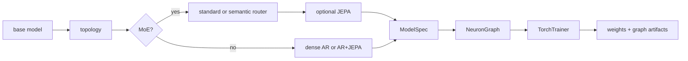

# CLI Workflows

The `cli/` package installs the `nfn` command for training, inference,
evaluation, and backend diagnostics outside the web editor. It is an in-repo companion to the Python SDK:
it builds real `ModelSpec` objects, exports graph JSON plus `.pt` weights, uses
the shared dataset manager, and defaults artifacts to `~/NeuralFn/artifacts`.

For the longer operator runbook, see [../cli/README.md](../cli/README.md).

## Install

```bash
cd cli
python -m venv .venv
source .venv/bin/activate
pip install -e ..
pip install -e .
nfn --help
```

The first editable install exposes the `neuralfn` and `server` packages from
the repo root. The second installs the CLI entrypoint declared by
`cli/pyproject.toml`.

The default SDK install does not pull in Torch. Root `nfn --help` / no-argument
startup, `nfn train|infer|eval --help`, `nfn kernels ... --help`, `nfn kernels list [--json]`, CUDA Tile registry metadata, and native GPT training work without importing Torch; install
`pip install -e ".[torch]"` for graph-backed training or
`pip install -e ".[tile-cuda]"` for Torch-free native CUDA Tile build tooling.

## Commands

| Command | Purpose |
|---------|---------|
| `nfn train` | Train a composed recipe and export `.pt` weights plus graph `.json`. |
| `nfn infer` | Load an exported graph or supported graphless checkpoint and generate text from a prompt. |
| `nfn eval` | Run validation batches and prompt probes, then write a JSON report. |
| `nfn kernels` | Inspect CUDA Tile kernel coverage and local CUDA Tile diagnostics. |

Every command accepts `--plan` for an interactive questionnaire and
`--plan-auto` for recommended defaults without prompting. Help output supports
`--help-style short`, `--help-style long`, and `--help-style verbose`.

## Recipe model

Recipes are composed from a small set of choices:

| Choice | Values |
|--------|--------|
| Base model | `gpt`, `gpt2`, `gpt3`, `llama`, `nanogpt` |
| Topology | `dense`, `moe`, `semantic_router` |
| Router mode | `standard`, `semantic` |
| Objective overlay | `--jepa` |
| Runtime | default or `--megakernel` |
| Training mode | `pretrain`, `sft`, `dpo`, `ppo`, `reward_model` |
| Adapter | `none`, `lora`, `qlora`, `randmap` |



Examples:

```bash
nfn train --plan
nfn train --base-model gpt --dataset tinystories --eval-every-steps 1000
nfn train --base-model gpt3 --dataset tinystories --native-cuda-print-command --native-cuda-dry-run
nfn infer --graph ~/NeuralFn/artifacts/llama_fast.json --prompt "Once upon a time"
nfn infer --graph ~/NeuralFn/artifacts/gpt2_evo.json --weights ~/NeuralFn/artifacts/gpt2_evo.pt --prompt "Once upon a time"
nfn infer --checkpoint ~/NeuralFn/artifacts/final_model.pt --checkpoint-tokenizer ~/Downloads/fineweb_8192_bpe_lossless_caps_caseops_v1_reserved.model
nfn eval --base-model gpt2 --dataset shakespeare
nfn kernels list --json
nfn kernels doctor
nfn kernels bench --device auto --iterations 200
nfn kernels examples
```

## Kernel diagnostics

`nfn train --help`, `nfn infer --help`, `nfn eval --help`, and `nfn kernels ... --help` use lightweight static help from `cli/nfn.py` so basic CLI orientation does not import `nfn_impl`, Torch, or graph-backed runtime modules. `nfn kernels list` prints CUDA Tile registry coverage from builtin and optimizer metadata on the same lightweight path. JSON output includes `by_dtype` aggregate counts plus each spec's legacy `dtypes` tuple and `dtype_support` matrix for `float32`, `float16`, `float8_e4m3fn`, `float8_e5m2`, and `nvfp4`, with either `"supported"` or the reason that dtype is not yet advertised. Unsupported lower-precision entries use category-specific reasons for losses/reductions, optimizers, stochastic masks, integer/hash/routing outputs, source nodes, and delegated graph calls. The fp8-supported entries include scalar/simple elementwise kernels, direct and composite projections, and attention Q/K/V modules that dequantize activations to float32 and return float32 outputs where required. The NVFP4-supported entries currently cover packed projection-family activations for `linear`, LM/router/value/reward/denoise heads, tied LM head, KV PCA encode/decode, JEPA heads, deterministic LoRA/TTT/adapter projections, `bitlinear_ternary`, `fp8_linear`, `mx_linear`, MLP projections, and ACT halt projection, plus attention Q/K/V and shared attention inputs for SDPA, sparse attention variants, differential attention, causal/fused causal attention, MLA, and routed attention experts. `nfn kernels doctor` also reports the local `nvcc`, CUDA Tile header, `torch.cuda`, and compute-capability status. `nfn kernels bench` compares the old graph-walk helper, the static compiled PyTorch plan, and the Tile-requested compiled plan on a small scalar graph. `nfn kernels examples` lists checked-in examples and `nfn kernels examples --write --output-dir examples/tile_cuda` regenerates the per-registry SDK snippets. These commands accept `--json` for automation.

`nfn train`, `nfn infer`, and `nfn eval` accept `--kernel-backend {auto,torch,tile-cuda}`, `--tile-cuda-strict` / `--no-tile-cuda-strict`, and `--tile-cuda-report PATH`. `tile-cuda` requests the implemented CUDA Tile fast path, build-loads the optional extension when needed, and defaults to strict kernel enforcement so unsupported graph nodes or tensor contracts fail instead of silently dropping to slower fallback paths. Pass `--no-tile-cuda-strict` only when intentionally debugging fallback behavior. The registry currently accounts for all 138 training-relevant entries with 129 Tile-covered kernels/compositions, 7 host-only entries, and 2 delegated graph calls. `NFN_TILE_CUDA_BUILD=1` enables extension builds for `auto` backend probes, and `NFN_TILE_CUDA_ARCH` can override the architecture flag passed to `nvcc`. Install `pip install -e ".[tile-cuda]"` if the active environment does not already provide `ninja` for native CUDA Tile builds; install `.[torch]` separately only for graph-backed PyTorch execution.

The native GPT compiled CLI has its own backend selector:
`--backend llm-kittens|tile-cuda` (or Python wrapper
`--kernel-backend`). `llm-kittens` is the current external fast trainer.
`tile-cuda` is the default NeuralFn-owned compiled trainer for dense GPT.
Use `--base-model gpt` as the canonical native trainer surface. `gpt2` and
`gpt3` are dense GPT selector aliases that canonicalize to
`--model-family gpt` before the compiled C++ frontend runs; `gpt3` defaults to
a 2048-token context only when no explicit template, graph, or
`--train-seq-len` is supplied.
`nfn-native-train --list-models --json` reports all three dense GPT aliases as
`implemented` because they share the same native trainer; template or graph
selection determines whether the selected architecture can run on that trainer.
Plan and runtime JSON include `architecture_source`,
`architecture_contract`, `model_family_context_policy`, and
`resolved_native_template_name` so a run makes clear that the graph/template,
not the family label, chooses the architecture. The default public template is
`gpt`; today it resolves to the implemented dense GPT native topology.
`--native-cuda-print-plan` and `--native-cuda-check-tile-ops` still print the
raw Tile ABI plan or check the trainer-facing library. The Tile plan includes
the GPT-2 parameter layout and forward/backward/optimizer stage sequence that
the native loop executes.
`--native-cuda-smoke-tile-ops` / `--smoke-tile-ops` goes one step beyond
symbol checks: it loads `libnfn_native_train_tile_ops.so`, loads CUDA runtime,
launches `nfn_native_tile_fill_float32` on a tiny device buffer, copies the
result back, and reports JSON without Python, Torch, or graph-node payloads.
`--native-cuda-smoke-optimizer-step` / `--smoke-optimizer-step` allocates the
GPT-2 contiguous parameter, gradient, and AdamW moment buffers, runs one AdamW
call per registered GPT-2 parameter buffer with the correct decay/no-decay
setting, samples copyback values, and reports JSON.
`--native-cuda-smoke-lm-step` / `--smoke-lm-step` runs a tiny GPT-2-shaped
tied embedding/LM-head step through token embedding, linear logits, full-vocab
CE partials and workspace CE backward, linear input/weight backward, token
embedding weight backward, and AdamW.
`--check-tile-ops`, `--smoke-tile-ops`, `--smoke-optimizer-step`,
`--smoke-lm-step`, `--smoke-attention-step`, `--smoke-mlp-step`,
`--smoke-norm-residual-step`, and `--smoke-transformer-block-step` are no-data
preflight actions: the compiled CLI runs them before token-shard resolution, so
they do not require cached `fineweb_train_*.bin` shards and report
`token_shards_resolved: false` when no dataset was opened. Dataset-backed
smokes such as `--smoke-embedding-lm-step`, `--smoke-transformer-lm-step`, and
real training modes still resolve cached train/validation shards before running.
`--native-cuda-smoke-attention-step` / `--smoke-attention-step` runs a tiny
GPT-2 model-dim attention stage through qkv projection, QKV split, SDPA
forward/backward, QKV gradient merge, projection backward, and AdamW.
`--native-cuda-smoke-mlp-step` / `--smoke-mlp-step` runs a tiny GPT-2 MLP
stage through c_fc projection, GELU forward/backward, c_proj projection
backward, and AdamW.
`--native-cuda-smoke-norm-residual-step` / `--smoke-norm-residual-step` runs
GPT-2 LayerNorm, scaled residual add, LayerNorm affine/input backward, gradient
accumulation, and AdamW through raw Tile kernels.
`--native-cuda-smoke-embedding-lm-step` / `--smoke-embedding-lm-step` samples
a tiny cached uint16 token batch in C++ and runs token embedding, absolute
position embedding, embedding residual add, final LayerNorm, tied LM head, CE
backward, embedding/norm backward, and AdamW without graph-editor payloads.
`--train-embedding-lm` runs that GPT-2
embedding/final-norm/LM path as a real multi-step compiled loop over cached
train shards, with validation losses from validation shards controlled by
`--eval-every-steps`, `--eval-batches`, and `--eval-batch-size`.
`--native-cuda-smoke-transformer-block-step` /
`--smoke-transformer-block-step` composes GPT-2 LayerNorm, fused QKV attention,
real 12-head reshape/merge layout (`12 x 64`), residual adds, MLP, backward
passes, gradient accumulation, projection bias gradients, and AdamW updates for
all 12 GPT-2 block parameter buffers through raw Tile kernels.
`--native-cuda-smoke-transformer-lm-step` /
`--smoke-transformer-lm-step` samples cached uint16 tokens and runs
range-checked GPT-2 token IDs through token/position embeddings, one tiny
transformer block, final LayerNorm, tied LM head, CE forward/backward,
transformer backward, embedding backward, and AdamW for 16 parameter buffers
through raw Tile kernels.
`--train-transformer-lm` is the default strict compiled training action for that
transformer-LM path. It runs a full-vocab real-dim 12-layer multi-step loop
over cached shards with periodic validation records in `validation.losses`,
using the token/position embedding, transformer, final norm, tied LM head, CE
backward, a row-chunked tied LM-head/CE workspace, device-side global norm
gradient clipping, scratch-recompute activation tape, and 148-buffer AdamW raw
Tile kernels without Python/Torch.
Native JSON normally prints to stdout. Add `--json-out PATH` to the compiled
trainer to write that JSON directly to a file, or use the aliases
`--profile-json PATH` / `--stage-profile-json PATH` when collecting profiler
runs such as `NFN_NATIVE_GPT_STAGE_TIMING=1 build/nfn_gpt_native_train ...
--profile-json /tmp/nfn_profile.json`.
Validation uses a separate C++ validation sampler and active forward batch size
from `--eval-batch-size`; that value must be at least 1 and no larger than the
training `--batch-size` because the fixed activation arena is allocated for the
training microbatch. Runtime JSON reports it as `validation.eval_batch_size`,
and validation loss records report their token counts in
`validation.losses[].tokens`.
The trainer-facing Tile ops library built by `tools/build_native_train_tile_ops.sh`
defaults to the SM120 ThunderKittens bf16 attention bridge. GPT-2-compatible
training JSON reports `attention_backend_strategy: "tk-sm120-bf16-bridge"`,
`attention_forward_tk_launch_count`, `attention_backward_tk_launch_count`, and
zero row/scalar attention launches when that path is active. Set
`NFN_TILE_CUDA_USE_TK_ATTENTION=0` before rebuilding only for the older float32
row-scan diagnostic path.
The SM120 build uses llm.kittens-style NVCC threading, host-compiler,
data-prep, memory, and LayerNorm tuning flags for the ThunderKittens headers,
but leaves GEMM dispatch on NeuralFn's initialized cublasLt path.
The same trainer-facing build defaults dense GPT block projection weights to the
BF16-primary path while leaving FP32 gradients and AdamW state in the optimizer
buffers. The old FP32-master/BF16-shadow path remains available with
`NFN_NATIVE_GPT_BF16_BLOCK_WEIGHT_PARAMS=0`. The compiled trainer routes block
forward/recompute and block dInput GEMMs through `nfn_native_tile_linear_weight_bf16_float32`,
`nfn_native_tile_linear_weight_bf16_output_float32`,
`nfn_native_tile_linear_bf16_input_weight_bf16_float32`, and
`nfn_native_tile_linear_backward_input_weight_bf16_float32`. LN1 packed-QKV
forward uses `nfn_native_tile_layer_norm_with_stats_bf16_out_float32` and
`nfn_native_tile_linear_bf16_input_weight_bf16_output_float32` by default.
Transformer block
dWeight+bias accumulation uses
`nfn_native_tile_linear_backward_weight_bias_accumulate_bf16_float32` or
`nfn_native_tile_linear_backward_weight_bias_accumulate_bf16_bits_float32`,
which request cuBLASLt `CUBLASLT_EPILOGUE_BGRADB` for supported BF16 block
shapes and fall back inside the ABI to separate dWeight plus Tile bias
reduction when unsupported. Tied LM-head
logits, dHidden, and dWeight chunks also default to the BF16 classifier path,
which writes BF16 logits, overwrites them with BF16 dlogits, then feeds BF16
dlogits into the LM-head dHidden and dWeight GEMMs. The tied token
embedding/LM-head weight also keeps a persistent BF16 shadow by default for
LM-head logits and dHidden while retaining the FP32 master for token embedding,
AdamW state, and checkpoint export. Runtime JSON reports
`token_weight_bf16_shadow_enabled` and `token_weight_bf16_refresh_count`. Set
`NFN_NATIVE_GPT_TOKEN_WEIGHT_BF16_SHADOW=0` only for paired benchmarks against
the older per-step BF16 bridge/cache route, or set
`NFN_NATIVE_GPT2_LM_HEAD_BF16_LOGITS=0` to return only the tied LM-head chunks
to the older optimized TF32 tensor-op `cublasSgemm` path for debugging.
`nfn_native_tile_linear_weight_bf16_gelu_bf16_float32` now handles stored-MLP
FC+bias+GELU and
`nfn_native_tile_linear_backward_input_dgelu_weight_bf16_bits_float32` handles
fused MLP projection dInput plus saved-BF16 GELU backward, so these fused MLP
routes also consume persistent BF16 block-weight shadows. Runtime JSON reports
`stored_mlp_forward_strategy:
"tk-sm120-fused-fc-bias-gelu-bf16-store-bf16-shadow-weight"` and
`block_backward_mlp_proj_dgelu_strategy:
"tk-sm120-fused-dinput-dgelu-bf16-store-bf16-shadow-weight-bf16-grad-handoff"` when
that path is active. The raw ABI also exposes
`nfn_native_tile_linear_backward_input_bf16_bits_weight_bf16_float32` and
`nfn_native_tile_linear_backward_weight_bias_accumulate_bf16_bits_bf16_bits_float32`
for the default BF16 MLP gradient handoff; set
`NFN_NATIVE_GPT_BF16_MLP_GRAD_HANDOFF=0` to compare against the older
float-gradient handoff. Runtime JSON reports
`block_backward_bf16_mlp_grad_handoff_enabled` and switches
`stored_mlp_activation_backward_consumer_strategy` when the handoff is active.
The older float-gradient path still uses the fused dInput+dGELU ABI and only
hands the following MLP FC backward a float gradient when the handoff is forced off.
The raw Tile library also exports
`nfn_native_tile_linear_backward_weight_bias_accumulate_bf16_bits_bf16_bits_to_bf16_bits_float32`
for profiling BF16/BF16 block dWeight accumulation into BF16 staging buffers.
Set `NFN_NATIVE_GPT_BF16_BLOCK_DWEIGHT_STAGING=1` only for paired benchmarks; it
is default-off because the dedicated RTX 5090 candidate-vs-baseline run measured
about `1.0245x` slower train-loop time than the current cuBLASLt bgrad path.
Runtime JSON reports `block_dweight_bf16_staging_enabled`,
`block_dweight_bf16_staging_strategy`, staging bytes, zero count, and
BF16-to-FP32 flush launches when the experiment is enabled.
The mixed float32-hidden/BF16-grad dWeight+bias ABI can opt into a cuBLASLt
bgrad epilogue route for QKV profiling with
`NFN_NATIVE_GPT_FUSE_FLOAT32_BF16_DWEIGHT_BGRAD=1` or
`NFN_TILE_CUDA_LINEAR_FLOAT32_BF16_BGRAD=1`; it remains default-off after paired
RTX 5090 timing showed a slight train-loop regression.
Set
`NFN_TILE_CUDA_LINEAR_BF16=1` or
`NFN_NATIVE_LINEAR_BF16=1` only when profiling the normal linear ABI's BF16
bridge. Set `NFN_TILE_CUDA_LINEAR_CUBLASLT=1` or
`NFN_NATIVE_LINEAR_CUBLASLT=1` only when profiling the normal linear ABI's
cached cuBLASLt TF32 path; the current 5090 GPT-2 shape keeps SGEMM as the
faster default. GPT-2 training JSON reports `linear_backend_strategy:
"block-bf16-cublaslt-shape-gated-lm-head-tk-sm120-default"`,
`block_forward_linear_strategy`, `block_backward_input_linear_strategy`,
`block_weight_bf16_shadow_strategy`, `block_weight_bf16_shadow_elements`,
`block_weight_bf16_shadow_bytes`, `block_weight_bf16_shadow_descriptor_count`,
`block_weight_bf16_shadow_fused_adamw_refresh_enabled`,
`block_weight_bf16_refresh_count`,
`block_weight_bf16_fused_adamw_refresh_count`,
`adamw_bf16_shadow_refresh_strategy`,
`block_backward_mlp_proj_dgelu_strategy`,
`block_backward_weight_linear_strategy`,
`non_block_forward_backward_linear_strategy`,
`linear_bf16_gemm_count`, `linear_cublaslt_gemm_count`,
`linear_cublaslt_descriptor_cache_enabled`, `linear_sgemm_count`,
`linear_bf16_a_pack_count`, `linear_bf16_a_cache_hit_count`,
`linear_bf16_cache_reset_count`, `linear_bf16_cached_a_capacity`, and
`linear_bf16_cache_entry_count`.
The cuBLASLt descriptor cache is enabled by default, so cached plans retain
matmul descriptors and matrix layouts instead of recreating them for every
GEMM; set `NFN_TILE_CUDA_CUBLASLT_DESCRIPTOR_CACHE=0` or
`NFN_NATIVE_LINEAR_CUBLASLT_DESCRIPTOR_CACHE=0` only for paired profiling
against the older descriptor-recreate path.
The BF16 operand cache is only for stable operands such as weights and biases;
BF16-output GEMMs repack mutable activation inputs because native scratch
activation pointers are reused with new contents.
The tied LM-head dWeight path follows the same rule: it consumes BF16 dlogits
but repacks each mutable hidden activation chunk instead of caching that
scratch pointer across gradient-accumulation microbatches.
The default dense GPT route also uses
`nfn_native_tile_linear_backward_input_dgelu_bf16_bits_float32` to fuse the MLP
projection dInput GEMM with saved-BF16 GELU backward. Set
`NFN_NATIVE_GPT_FUSE_MLP_PROJ_DGELU=0` to compare against the older separate
MLP projection dInput plus GELU-backward launches.
The default `non_block_forward_backward_linear_strategy` is
`"padded-lm-head-tk-sm120-bf16-gemm-default"` when the native Tile ops library
was built with the SM120 TK GEMM bridge.
The public GPT-2 tokenizer vocab stays 50,257, while the native tied token
embedding/LM-head tensor is padded to 50,304 rows for GEMM-friendly layout;
training JSON reports both `vocab: 50257` and `padded_vocab: 50304`, and
`--dry-run` / `--print-plan` reports `shape.padded_vocab_size: 50304`.
The tied LM-head row chunk defaults to 8192 rows and can be overridden with
`--lm-head-row-chunk-size` on the compiled C++ entrypoint or
`--native-cuda-lm-head-row-chunk-size` from the wrapper/root CLI. Loss partials
are reduced on device before one host loss copy per forward loss, and tied
LM-head dWeight chunks accumulate directly into `accum_grad_token_weight` with
`nfn_native_tile_linear_backward_weight_accumulate_float32` instead of using a
full-vocab scratch gradient buffer per chunk or per microbatch. Default JSON
reports `lm_head_training_logits_dtype: "bf16"`,
`lm_head_bf16_logits_enabled: true`, `lm_head_bf16_logit_elements`, and
`lm_head_ce_backward_strategy: "public-vocab-strided-fused-row-bf16-logits-dlogits"`.
The LM-head CE kernels softmax over the public vocab and use the padded row
count only as the logit/dlogit stride; JSON reports
`lm_head_public_vocab_ce_enabled`, `lm_head_softmax_vocab`,
`lm_head_logit_row_stride`, and `lm_head_padded_dlogits_zeroed`. Set
`NFN_NATIVE_GPT_PUBLIC_VOCAB_CE=0` only when paired-benchmarking against the old
padded-vocab CE behavior.
`--smoke-lm-step`, `--smoke-embedding-lm-step`, `--train-embedding-lm`, and
`--smoke-transformer-lm-step` use that same 50,304-row padded tied token
embedding/LM-head tensor while validating token IDs against public vocab 50,257.
Its JSON reports `trained_layers: 12`, `target_layers: 12`,
`block_state_layout` with block-vector allocation/init/zero/clip/AdamW/checkpoint/tape/forward/backward loop
flags, `activation_tape_strategy: "scratch-recompute"`, `activation_tape_count: 1`,
`persistent_block_outputs: 11`, `persistent_block_output_write_strategy: "direct-residual2-output"`, `persistent_block_output_copy_elided_count`,
`final_block_output_copy_elided: true`, `vocab: 50257`, `padded_vocab: 50304`, `lm_head_row_chunk_size`,
`lm_head_row_chunk_count`, `loss_partial_count`, `logit_workspace_elements`,
`gradient_partial_count`, `gradient_clip_norm`, and `sample_gradient_clip_scale`
after completed steps. Pass
`--no-train-transformer-lm` on the compiled C++ entrypoint only for plan/check/debug
commands that should not start the default trainer. `--checkpoint-metadata-smoke
--output-dir PATH` writes a sparse version-5 bf16 native checkpoint-format file
plus `DONE_########` marker for the requested `--num-layers` target shape without Python,
Torch, or CUDA. Successful `--train-transformer-lm` runs also write a final
12-layer trained-weight native checkpoint plus `DONE_########` marker. Version-5
checkpoints store public vocab 50,257 separately from padded tensor vocab 50,304,
so tokenizer checks should use the public vocab while tensor-size checks use the
padded vocab. The trained checkpoint path packs device float32 weights to bf16 payload bits with
`nfn_native_tile_float32_to_bf16_bits_many` before a single contiguous host
copy, so JSON reports `checkpoint.payload_pack_strategy:
"device-many-float32-to-bf16-bits-contiguous"`, `payload_pack_kernel:
"nfn_native_tile_float32_to_bf16_bits_many"`, `payload_copy_strategy:
"single-contiguous-device-payload-d2h"`, `payload_cpu_bf16_conversion: false`,
`device_pack_kernel_launches`, `d2h_copy_count`, `d2h_bytes`, and
`float32_d2h_bytes_elided` instead of materializing full float32 tensors on CPU
for bf16 packing or copying each parameter tensor separately.
Use `--cuda-runtime-lib PATH` or `NFN_CUDA_RUNTIME_LIB` when libcudart is not
on the loader path. Backend names are strict; use `llm-kittens` or `tile-cuda`.
For bottleneck analysis, set `NFN_NATIVE_GPT2_STAGE_TIMING=1` before a
`--train-transformer-lm` run. The trainer then adds CUDA-event measurements
under `timing.stage_timing`, including token upload, model/block forward,
block recompute/backward, LM-head backward, embedding/final-norm backward,
gradient zero/clip, and AdamW update stages. It also reports nested LM-head,
block forward/recompute, and block backward substages such as
`lm_head_backward.dhidden`, `lm_head_backward.dweight`,
`block_forward.attention.qkv`, `block_forward.attention.sdpa`,
`block_forward.mlp_fc_gelu.fc`, `block_forward.mlp_proj.proj`,
`block_backward.mlp_proj`, `block_backward.mlp_proj.dinput`,
`block_backward.mlp_proj.gelu`, `block_backward.attn_sdpa`, and
`block_backward.qkv`. This mode inserts event
timing work and synchronizes before reporting, so keep it off for normal
throughput or model-quality runs.

Startup keeps per-block parameter/gradient allocation, scratch-tape activation
allocation, parameter initialization, and AdamW-state zeroing under the
block-vector visitors. Block 0 is not also touched through the legacy global
alias list, and JSON reports
`block0_duplicate_allocation_elided`,
`block0_duplicate_activation_allocation_elided`,
`block0_duplicate_parameter_initialization_elided`, and
`block0_duplicate_adamw_state_zero_elided` under `block_state_layout`.
Float buffers are suballocated from one aligned CUDA device arena, so the full
trainer does not issue one `cudaMalloc` per parameter, gradient, moment,
activation, and workspace buffer. JSON reports
`float_allocation_strategy: "single-arena"`,
`float_allocation_cuda_malloc_count`, `float_allocation_request_count`,
`float_arena_requested_elements`, and `float_arena_allocated_elements`.
BF16 activation and scratch buffers are suballocated from one uint16 CUDA device
arena by default, covering stored MLP activations, residual1 caches, packed
attention stores, LM-head BF16 logits, MLP BF16 scratch, packed-QKV BF16
scratch, and block BF16 weight shadows. Set
`NFN_NATIVE_GPT_COMBINED_BF16_ARENA=0` or
`NFN_NATIVE_GPT2_COMBINED_BF16_ARENA=0` to reproduce the older per-buffer
BF16 `cudaMalloc` path during paired benchmarks. JSON reports
`uint16_allocation_strategy`, `uint16_allocation_cuda_malloc_count`,
`uint16_allocation_request_count`, `uint16_arena_requested_elements`,
`uint16_arena_allocated_elements`, `uint16_arena_cuda_malloc_count`, and
`uint16_arena_suballocation_count`.
Set `NFN_NATIVE_GPT_CUDA_MALLOC_ASYNC=1` only for allocator profiling. It routes
the same large native GPT device arenas through CUDA runtime `cudaMallocAsync`
and frees them with `cudaFreeAsync` when those symbols are available, falling
back to `cudaMalloc` if an async allocation fails. The path is default-off
because paired dedicated-RTX-5090 timing measured it slower than the default
arena `cudaMalloc` path. JSON reports `device_allocator_strategy`,
`device_cuda_malloc_async_requested`, `device_cuda_malloc_async_enabled`, async
symbol availability, async allocation/free counts, and
`device_cuda_malloc_async_fallback_count`.
Startup zeroes only AdamW first/second moment state as coalesced contiguous
ranges with `cudaMemsetAsync` by default, then overwrites nonzero weights with
device initializers and zeroes gradients per optimizer step. Set
`NFN_NATIVE_GPT_CUDA_MEMSET_ZERO=0` to compare against the older Tile fill
zeroing path, `NFN_NATIVE_GPT_ZERO_ADAMW_STATE_RANGES=0` to force the older
descriptor-driven AdamW state fills, or
`NFN_NATIVE_GPT_ZERO_ADAMW_STATE_ONLY=0` to force the older full-arena zero for
bisection. JSON reports
`float_arena_zero_init_strategy: "adamw-state-contiguous-range-cuda-memset"`,
`"adamw-state-contiguous-range-fill"`, `"adamw-state-fill-many"`,
`"single-arena-cuda-memset"`, or `"single-arena-fill"`,
`startup_cuda_memset_zero_enabled`, `startup_cuda_memset_zero_available`,
`float_arena_zero_fill_count`, `adamw_state_zero_fill_count`,
`startup_cuda_memset_zero_fill_count`, `startup_tile_zero_fill_count`,
`adamw_state_zero_range_count`, `adamw_state_zero_range_elements`,
`startup_per_buffer_zero_fill_elided`, and
`startup_per_buffer_zero_fill_launches_elided`.
Token upload/storage buffers are also arena-backed: one aligned device arena
holds widened int64 token/target buffers plus compact uint16 H2D staging, and
one pinned uint16 host arena holds compact source staging. JSON reports
`token_buffer_allocation_strategy: "combined-arenas"`,
`token_device_allocation_strategy: "single-device-arena"`,
`token_device_arena_cuda_malloc_count`,
`token_device_arena_suballocation_count`, and
`token_device_cuda_mallocs_elided`.

Native dense GPT command paths accept `--template-name NAME` / `--template NAME` /
`--preset NAME` and `--graph-file PATH` / `--graph PATH`. These arguments are
canonicalized to `--template-name` and `--graph-file` by Python wrappers, then
carried through the SDK config and compiled C++ frontend without loading Torch.
Top-level `nfn train --base-model gpt` direct compiled-CLI handoff adds
`--train-transformer-lm` for normal training commands, including selector-bearing
commands, unless the command already requested a plan/check/smoke/train action.
`--base-model gpt2` and `--base-model gpt3` are aliases for this same trainer;
`gpt3` only defaults to a 2048-token context when no explicit template, graph,
or `--train-seq-len` is present.
For all other cases, including custom graphs and explicit templates, `gpt3`
does not alter the architecture; the selected graph/template and sequence
arguments are authoritative.
The selector accepts `gpt` as the default public dense GPT template alias plus
every name in
`neuralfn.config.SHIPPED_GPT_TEMPLATE_PRESETS`, and the compiled C++ plan JSON
reports the synchronized `shipped_template_catalog`,
`shipped_template_catalog_count`, and `template_known` fields. The current native
loop runs `gpt`, `gpt2`, `gpt2_megakernel`, and `gpt2_moa` through the
transformer-LM trainer; `gpt` reports `resolved_native_template_name: "gpt2"`,
and `gpt2_moa` resolves to the native MoA activation mode automatically.
Structurally different shipped GPT
template names and custom graph files are selected and reported in JSON, but
return `selected-graph-native-trainer-missing` for real training until their
native C++ Tile trainer plans are implemented. Unknown template names return
`unknown-template`, which keeps typos separate from known migration work.

The GPT-2 evo compiled preflight accepts the same selector aliases. It reports
`template_name`, `graph_file`, `template_known`,
`selected_graph_support_status`, `selected_graph_native_runnable: false`, and
the synchronized shipped template catalog before any graph-backed runtime import.
Dense GPT-2-compatible selectors currently report
`native-gpt2-evo-trainer-missing`; structurally different templates report
`template-native-trainer-missing`; custom graph files report
`custom-graph-native-trainer-missing`.
Use `nfn_gpt2_evo_native_train --smoke-evo-kernels --tile-ops-lib PATH` to
verify the raw evo mutate/select/adopt ABI on CUDA device buffers without
opening datasets, importing Python/Torch, or routing payloads through
graph-editor nodes.

The same trainer samples cached token/target batches directly into one pinned
uint16 arena, enqueues one H2D `cudaMemcpyAsync`, and widens tokens plus targets
to int64 IDs on device with one `nfn_native_tile_uint16_to_int64` launch.
The per-batch CPU int64 expansion and token-range scan are intentionally absent
from this native hot path; output JSON reports
`token_id_upload_strategy: "uint16-pinned-async-h2d-device-widen"`,
`token_id_host_staging: "pinned"`, `token_id_h2d_copy:
"cudaMemcpyAsync-contiguous-arena"`, `token_id_h2d_copy_calls_per_microbatch:
1`, `token_id_widen_strategy: "single-contiguous-arena-kernel"`,
`token_id_widen_kernel_launches_per_microbatch: 1`, and
`token_batch_staging_strategy: "direct-sampler-to-pinned-arena"`,
`token_batch_vector_materialization: false`, and `token_id_host_validation:
false`.

Startup initializes the tied token embedding/LM-head weight directly on device
with `nfn_native_tile_init_gpt2_token_weight_float32` instead of building and
copying a 154 MB host float matrix. Output JSON reports
`token_weight_init_strategy: "device-tile-deterministic"` and
`token_weight_host_materialization: false`.

For performance, the compiled GPT-2 transformer-LM trainer does not compute
training loss in the hot path. Ordinary steps run the forward activations
needed for backward, CE gradient generation, gradient clipping, and AdamW only;
validation cadence computes validation loss from validation shards without also
measuring train loss. The JSON fields `train_loss_sparse: false`,
`train_loss_sampling: "disabled"`, `train_loss_on_validation_steps: false`,
`train_loss_eval_count`, and `train_loss_last_step` report that contract.

Persistent block-output preservation in the compiled GPT trainer writes the MLP
residual-add output directly into each non-final block's persistent
backward-recompute buffer. This removes the previous post-block copy launch
while keeping the scratch-recompute tape contract.
The final block output copy is elided because final LayerNorm consumes it before
backward recomputation starts.
Validation forwards do not copy intermediate block outputs into persistent
training-backward buffers because no backward pass follows validation; JSON
reports `validation_persistent_block_outputs: 0` and
`validation_block_output_copies_elided: true`.
The scratch-recompute backward pass reuses the final block activations left by
the initial forward pass, so only earlier blocks are recomputed from persistent
block outputs. The default 12-layer JSON reports `backward_recompute_blocks: 11`
and `final_block_backward_recompute_elided: true`. The default workstation
path stores earlier-block `ln2_out`, MLP preactivation, and GELU activation
tensors in a BF16 arena during forward,
consumes them directly for MLP dWeight and GELU backward, and reports
`mlp_activation_storage_strategy: "bf16-forward-store-direct-backward-opt-in"`,
`stored_mlp_activation_blocks`, `stored_mlp_activation_bytes`,
`stored_mlp_activation_store_kernel_launches`,
`stored_mlp_activation_restore_kernel_launches`,
`stored_mlp_activation_backward_consumer_strategy`, and
`backward_recompute_mlp_fc_gelu_elided: true`. Set
`NFN_NATIVE_GPT2_STORE_MLP_ACTIVATIONS=0` to use lower-memory pure scratch
recompute, which reports `activation_tape_strategy: "scratch-recompute"` and
`backward_recompute_mlp_fc_gelu_elided: false`. Earlier-block recompute still
stops before the MLP projection output and final residual output because
backward does not consume them; JSON reports
`backward_recompute_mlp_projection_elided: true` and
`backward_recompute_final_residual_elided: true`. Rebuild
`libnfn_native_train_tile_ops.so` with `bash tools/build_native_train_tile_ops.sh`
after updating, because the native trainer checks for the BF16 activation
store/direct-backward ABI symbols at startup.
The MLP projection backward path writes its dInput into the MLP fc gradient
buffer and runs `nfn_native_tile_gelu_backward_inplace_float32`, so the full
trainer does not allocate a separate hidden-size `grad_act` scratch buffer.
JSON reports `mlp_proj_backward_gelu_inplace: true` and
`mlp_proj_backward_grad_act_scratch_allocated: false`.
Transformer block backward residual-gradient pair additions use
`nfn_native_tile_scaled_residual_add_float32`, so the trainer avoids the earlier
zero-fill plus two-accumulate sequence; `block_state_layout.residual_backward_fused`
reports this path. When LayerNorm backward residual fusion is enabled, the
default trainer also skips the fallback-only `grad_residual1_from_mlp` and
`grad_x_from_attn` activation scratch buffers; runtime JSON reports
`block_state_layout.layer_norm_backward_residual_scratch_buffers_allocated`,
`block_state_layout.layer_norm_backward_residual_scratch_buffers_elided`, and
`block_state_layout.layer_norm_backward_residual_scratch_elements_elided`.
Gradient clipping feeds the device clip scalar directly into
`nfn_native_tile_adamw_step_with_device_scale_float32`, avoiding a separate
per-gradient-buffer scale pass before AdamW;
`block_state_layout.adamw_device_clip_scale_fused` reports this path.
The sum-of-squares phase uses `nfn_native_tile_sumsq_partials_many_float32` over
the same device-resident gradient descriptor table, so the default 12-layer path
emits one sumsq kernel launch per optimizer step instead of one per gradient
buffer. JSON reports `gradient_clip_strategy:
"fused-multi-buffer-sumsq-device-scale"`,
`gradient_sumsq_kernel_launches_per_optimizer_step`,
`gradient_sumsq_per_buffer_launches_elided`, and
`block_state_layout.gradient_clip_loop: false`.
AdamW updates use `nfn_native_tile_adamw_step_many_with_device_scale_float32`
over device-resident parameter descriptors, so the default 12-layer path updates
148 parameter buffers with one optimizer kernel launch per optimizer step
instead of one launch per buffer. JSON reports
`adamw_update_strategy: "fused-multi-buffer-device-scale"`,
`adamw_descriptor_count`, `adamw_step_kernel_launches_per_optimizer_step`, and
`adamw_per_buffer_step_launches_elided`. The Tile ops ABI also exports
`nfn_native_tile_adamw_step_many_with_device_scale_bf16_shadow_float32`, which
can write optional BF16 block-weight shadow entries from the same AdamW launch.
Set `NFN_NATIVE_GPT_FUSE_ADAMW_BF16_SHADOW_REFRESH=1` only after forcing
`NFN_NATIVE_GPT_BF16_BLOCK_WEIGHT_PARAMS=0`; the BF16-primary default bypasses
the shadow-refresh route, and prior paired dedicated RTX 5090 timing was
neutral/slightly slower for the fused shadow write.
The default native GPT optimizer uses the no-master BF16 block projection update
path. Token/position/norm/bias tensors keep using the float32 multi-buffer AdamW
ABI, while QKV, attention projection, MLP FC, and MLP projection weights update
their BF16 parameter buffers directly through
`nfn_native_tile_adamw_step_many_with_device_scale_bf16_param_float32`.
The raw ABI also exports
`nfn_native_tile_adamw_step_many_with_device_scale_bf16_param_bf16_grad_float32`
for BF16-primary parameter updates that consume BF16 gradient buffers while
keeping AdamW first and second moments in float32. The dense GPT trainer still
uses the float-gradient BF16-param entrypoint until the block-gradient buffers
move to BF16.
Checkpoint export syncs those BF16 block weights back into FP32 staging buffers
before the existing version-5 BF16 checkpoint packer runs. Set
`NFN_NATIVE_GPT_BF16_BLOCK_WEIGHT_PARAMS=0` to reproduce the older FP32-master
plus BF16-shadow refresh path for bisection. Runtime JSON reports
`block_weight_bf16_primary_param_update_enabled`,
`block_weight_bf16_primary_param_update_count`,
`adamw_float_update_descriptor_count`, `adamw_bf16_param_descriptor_count`,
`adamw_float_update_kernel_launches`, `adamw_bf16_param_kernel_launches`, and
`checkpoint.bf16_param_sync_kernel_launches`.
Token, position, and block Linear weight gradients accumulate directly into
optimizer-step accumulation buffers. The tied LM-head CE backward scale includes
the microbatch accumulation factor, LM-head dWeight chunks and token-embedding
backward write into `accum_grad_token_weight`, and the old full-vocab
token-gradient scratch buffer is not allocated. Position embedding backward uses
the accumulate-position ABI, so `grad_position_weight` is not allocated or copied
after each microbatch. Each transformer block also writes qkv, attention-output,
MLP fc, MLP projection dWeight, LayerNorm affine, and Linear bias gradients
straight into block accumulation buffers, so the real 12-layer loop does not
allocate per-block scratch gradient buffers or run a per-microbatch copy loop.
Accumulation buffers are zeroed once per optimizer step. JSON
reports
`token_gradient_accumulation_strategy: "direct-device-accumulation-buffer"`,
`token_gradient_scratch_buffer_allocated: false`,
`position_gradient_accumulation_strategy:
"direct-device-accumulation-buffer"`,
`position_gradient_scratch_buffer_allocated: false`,
`block_linear_weight_gradient_accumulation_strategy:
"direct-device-accumulation-buffer"`,
`block_linear_weight_gradient_scratch_buffers_allocated: false`,
`layer_norm_affine_gradient_accumulation_strategy:
"direct-device-accumulation-buffer"`,
`linear_bias_gradient_accumulation_strategy:
"direct-device-accumulation-buffer"`,
`block_state_layout.per_block_gradient_buffers: 0`,
`block_state_layout.per_block_direct_accum_gradient_buffers: 12`,
`block_state_layout.gradient_accumulation_loop: false`,
`block_state_layout.gradient_accumulation_copy_loop_elided: true`,
`block_state_layout.gradient_zero_strategy` set to
`"fused-multi-buffer-accumulation-zero"`, and `gradient_zeroed_buffer_count: 0`.
For the default GPT-2 `batch=64`, `seq=1024` shape, large-row Linear
bias-gradient reductions use the Tile chunked atomic reduction path instead of
cuBLAS SGEMV. This keeps the expensive MLP projection bias reduction on the
native Tile route; small reductions can still use the existing cuBLAS path.
The accumulation buffers are zeroed once per optimizer step through coalesced
contiguous-range `cudaMemsetAsync` by default, falling back to
`nfn_native_tile_fill_many_float32` over the same descriptor table used by the
fused AdamW call when CUDA memset is unavailable or
`NFN_NATIVE_GPT_CUDA_MEMSET_GRAD_ZERO=0` is set. JSON reports
`gradient_cuda_memset_zero_enabled`, `gradient_cuda_memset_zero_available`,
`gradient_zero_range_count`, `gradient_zero_cuda_memset_count`,
`gradient_zero_tile_fill_count`, `gradient_zero_kernel_launches_per_optimizer_step`,
and `gradient_zero_per_buffer_launches_elided`.
LayerNorm affine-gradient backward has an accumulate ABI and uses a chunked
parallel atomic reduction for large row counts instead of one CUDA block looping
over all rows. The LayerNorm affine row chunk now defaults to 256 rows; set
`NFN_TILE_CUDA_LAYERNORM_AFFINE_ROW_CHUNK_SIZE=N`,
`NFN_NATIVE_GPT_LAYERNORM_AFFINE_ROW_CHUNK_SIZE=N`, or
`NFN_NATIVE_GPT2_LAYERNORM_AFFINE_ROW_CHUNK_SIZE=N` to run paired chunk-size
experiments without rebuilding. JSON reports
`block_state_layout.layer_norm_backward_affine_strategy:
"auto-chunked-atomic-accumulate"`.

The RTX 5090 dense GPT harness at `cli/scripts/train_gpt.py` is native-only; `train_gpt2.py` is the compatibility entrypoint. Direct execution with the default `compiled-cli` runner translates GPT flags to the compiled C++ CLI and runs it before importing `train_gpt_native.py`, graph-backed helpers, `server.dataset_manager`, NumPy, tiktoken, or Torch; importing the compatibility module, building its parser, and resolving defaults are also lightweight. The native GPT default dataset is TinyStoriesV2 GPT-4 (`roneneldan__TinyStories__TinyStoriesV2-GPT4`) with the GPT-2 tokenizer; `golf1` and `golf10` are explicit cached-token shortcuts, not defaults. The native path resolves the dataset alias with the shared C++ token-shard resolver, materializes `gpt2`/SentencePiece raw text into uint16 `fineweb_train_*.bin` and `fineweb_val_*.bin` shards when needed, then launches the compiled CUDA Tile trainer directly. The resolver also accepts llm.kittens-style `TinyStories_train.bin` / `TinyStories_val.bin`; `--tinystories` uses `/mnt/disk2/dev/open-source/llm.kittens/dev/data/tinystories` when those files exist, `NFN_LLM_KITTENS_TINYSTORIES_DIR` overrides that location, and direct `--dataset-alias /path/to/TinyStories_train.bin` infers the sibling validation bin. The C++ sampler reads contiguous shard segments for each batch instead of reopening the shard for every sequence chunk, and native token-shard JSON reports `batch_read_strategy: "contiguous_shard_segments"`. With the default `compiled-cli` runner and existing cached train plus validation shard files, Python passes the alias/path directly to the compiled resolver without reading `meta.json`, validating shard metadata, or estimating the full training schedule first. The script sets up its own repo/script import path before native dispatch, so direct `python cli/scripts/train_gpt.py ...` and `runpy`-style native invocations do not need `PYTHONPATH`. Default dense GPT `nfn train` commands go directly to `nfn_gpt_native_train --backend tile-cuda --train-transformer-lm` before importing `train_gpt_native`, `nfn_impl`, or Torch; use `--backend llm-kittens` only when explicitly testing the external trainer bridge. Unsupported families fail from the native registry. Explicit non-default compatibility runners still use the Python native runner. Real token batches do not pass through graph-editor nodes or `TorchTrainer` on the compiled Tile-CUDA path. Defaults match the SM120 run shape: 20,000 steps, sequence length 1024, microbatch 64, 524,288 tokens/step, learning rate 0.0006, weight decay 0.1, 60 warmup steps, validation every 250 steps, sample/checkpoint cadence 20,000/200, cosine decay to zero, tokenizer vocab 50,257, and padded native embedding/LM-head rows 50,304. The C++ loop makes the 524,288-token step real by deriving `grad_accum_steps = ceil(train_batch_tokens / (batch_size * seq_len))`, streaming that many microbatches through CUDA Tile forward/backward, accumulating scaled gradients on device, and running clip plus AdamW once per optimizer step. Native JSON reports `model_family`, `microbatch_tokens`, `requested_train_batch_tokens`, `grad_accum_steps`, `effective_train_batch_tokens`, `train_microbatches_completed`, `gradient_accumulation_strategy`, `vocab`, and `padded_vocab`. Build the C++ binding with `bash tools/build_native_gpt2_binding.sh`, the launcher with `bash tools/build_native_gpt2_launcher.sh`, the no-Python cached-shard CLI with `bash tools/build_native_gpt_cli.sh`, and the unified frontend with `bash tools/build_native_train_cli.sh`. `cli/install.sh` links stable command names, so use `nfn-native-train --base-model gpt --dataset-alias PATH_OR_ALIAS` or `nfn-gpt-native --dataset-alias PATH_OR_ALIAS` to bypass Python entirely when shards already exist. Use `nfn-native-train --list-models` or `--list-models --json` to inspect native training coverage. The default runner is `compiled-cli`, which requires the no-Python cached-shard CLI; use `--native-cuda-runner auto|binding|launcher|subprocess` only when you intentionally want Python materialization/orchestration, the SDK binding, launcher, or direct external trainer path. Use `--eval-every-steps 1000` for validation loss every 1000 optimizer steps, `--native-cuda-print-command` to inspect the resolved native command, `--native-cuda-config-out PATH` to persist it, `NFN_DATASETS_DIR=/path/to/datasets` to override the native alias cache root, `NFN_NATIVE_GPT2_BIN_DIR=/path/to/bin` to choose where native command symlinks are installed, `NFN_NATIVE_TRAIN_CLI=/path/to/nfn_native_train` to override the unified frontend, `NFN_NATIVE_GPT_CLI=/path/to/nfn_gpt_native_train` to override the GPT compiled CLI, `NFN_NATIVE_GPT2_LAUNCHER=/path/to/nfn_gpt2_tile_train` to override the launcher, and `NFN_NATIVE_GPT2_TRAIN_BIN=/path/to/train_gpt2cu` to override the external trainer binary used only by the explicit `llm-kittens` backend.

`nfn train --tinystories` takes the same compiled dense GPT route when `--base-model gpt` is omitted.

The compiled GPT-2 `--train-transformer-lm` JSON includes `cuda_runtime_preflight` before any allocation. Driver version `0` or a loaded CUDA runtime newer than the driver exits early with an actionable GPU-access/runtime error, which is the expected gate before live SM120 throughput comparison.

For the canonical RTX 5090 SM120 parity benchmark, run
`tools/bench_native_gpt_sm120_parity.sh`. It compares the local
`/mnt/disk2/dev/open-source/llm.kittens/train_gpt2cu` TinyStories command
using the `train-sm120.sh` shape against
`build/nfn_gpt_native_train --backend tile-cuda` through
`tools/paired_kernel_speed.py`, with selected-GPU idle/process guards and JSON
output enabled. Set `NFN_SM120_PARITY_STEPS`, `NFN_SM120_PARITY_SAMPLES`,
`NFN_SM120_PARITY_WARMUP`, `NFN_SM120_PARITY_CUDA_VISIBLE_DEVICES`,
`NFN_SM120_PARITY_MAX_GPU_UTILIZATION_PCT`, or
`NFN_SM120_PARITY_JSON_OUT` to adjust the run without editing the command.
`NFN_SM120_PARITY_CUDA_VISIBLE_DEVICES` defaults to `auto`, which selects an
idle display-disabled NVIDIA GPU for mixed display/compute workstations; set it
to `0` or another explicit CUDA device value when you want manual pinning.
The wrapper writes NeuralFn native profile sidecars by default. Set
`NFN_SM120_PARITY_PROFILE_DIR=none` for an unprofiled throughput run, or set it
to a directory to keep sidecars; profiled runs default
`NFN_NATIVE_GPT_STAGE_TIMING_MAX_EVENTS=80000` unless you override it.
For compile-time kernel experiments, `tools/build_native_train_tile_ops.sh`
accepts whitespace-separated `NFN_TILE_CUDA_EXTRA_NVCC_FLAGS` and
`NFN_TILE_CUDA_EXTRA_LDLIBS` and appends them after the default SM120 flags.
Use this for temporary paired benchmark candidates; for example, set
`NFN_TILE_CUDA_EXTRA_NVCC_FLAGS="-DLLMK_SM120_USE_TK_FUSED_DGELU_DINP -DLLMK_SM120_APPROX_DGELU_TANH=1"`
and run `bash tools/build_native_train_tile_ops.sh /tmp/libnfn_candidate.so`.
Leave the variables unset for the default build.
Short parity runs default to timing-only cadence with
`NFN_SM120_PARITY_SAMPLE_EVERY=0` and
`NFN_SM120_PARITY_CHECKPOINT_EVERY=0`, because llm.kittens samples and writes
checkpoints on the final step whenever those intervals are positive. Compare
`train_loop_wall_ms_per_step` and `train_tokens_per_second` under the native
metrics summaries rather than child-process `seconds`; the llm.kittens
reference still runs its built-in validation passes around short runs. Set
`NFN_SM120_PARITY_SAMPLE_EVERY=20000`,
`NFN_SM120_PARITY_CHECKPOINT_EVERY=200`, and
`NFN_SM120_PARITY_GENERATE_TOKENS=144` when deliberately reproducing the full
`train-sm120.sh` sample/checkpoint cadence instead of measuring only training
throughput.

For timing-only native GPT probes, pass wrapper
`--native-cuda-no-checkpoint` or compiled C++ `--no-checkpoint` to skip final
trained-checkpoint export. Runtime JSON then reports `checkpoint.enabled:
false`, `checkpoint.checkpoint_written: false`, and zero checkpoint wall time;
normal training leaves checkpoint export enabled.

Native GPT startup initializes the tied token FP32 master weight and persistent
BF16 LM-head shadow in a single CUDA Tile ABI call,
`nfn_native_tile_init_gpt2_token_weight_with_bf16_shadow_float32`, when the
default token BF16 shadow is enabled. Set
`NFN_NATIVE_GPT_FUSE_TOKEN_WEIGHT_BF16_INIT=0` (or the `GPT2`-prefixed alias) to
reproduce the older two-pass token init plus BF16 refresh path. Runtime JSON
reports `token_weight_bf16_initial_refresh_fusion_enabled` and
`token_weight_bf16_initial_refresh_elided`; use `--startup-only` when comparing
this setup-only path.

For native kernel candidate comparisons, use
`python tools/paired_kernel_speed.py --baseline "OLD_COMMAND" --candidate
"NEW_COMMAND" --samples N --json-out /tmp/result.json`. The helper defaults
`--cuda-visible-devices` to `auto`, selecting an idle display-disabled NVIDIA
GPU from `nvidia-smi` when one is available; pass an explicit device id such as
`--cuda-visible-devices 0` to pin manually, or `--cuda-visible-devices ""` to
leave the environment unchanged. It alternates baseline/candidate order inside
one script so unrelated external GPU load affects both measurements in the same
sampling window, and it runs one warmup pair by default to keep first-use CUDA
or kernel-load cost out of the reported samples. It sets
`CUDA_DEVICE_MAX_CONNECTIONS=1` for both commands by default; pass
`--cuda-device-max-connections ""` to leave that environment unchanged. Pass
repeatable `--baseline-env KEY=VALUE` or `--candidate-env KEY=VALUE` flags for
environment-gated kernel candidates; these overrides apply only to that side of
the pair and are recorded in the JSON/text output. `--command-timeout-seconds N`
terminates the timed-out command's process group so a slow native candidate does
not leave child GPU work running after the sample is recorded. Pass
`--require-idle-selected-gpu` when a speed test should fail before warmup or a
measured command if `nvidia-smi` reports a compute process on the selected CUDA
GPU; the check uses the selected GPU UUID so a separate display GPU does not
fail a dedicated compute-GPU run. Pass
`--max-selected-gpu-utilization-pct N` to fail the run when the selected CUDA
GPU's `nvidia-smi` utilization is already above `N` before each warmup or
measured command. When
`nvidia-smi` is present, the result JSON includes the resolved
`cuda_device_selection`, run-level `gpu_before` / `gpu_after` snapshots plus
per-sample `paired_samples[].gpu_before` / `paired_samples[].gpu_after`
snapshots and command-level `paired_samples[].baseline.gpu_before` /
`gpu_after` plus `paired_samples[].candidate.gpu_before` / `gpu_after`
snapshots containing GPU identity, display-active state, utilization, memory,
and active compute-process rows. This makes dedicated-GPU runs and accidental
external GPU load visible for the whole benchmark, each old/new measurement
pair, and each individual command. When a command emits NeuralFn native JSON, the helper extracts
native-loop counters into `baseline_native_metrics` or
`candidate_native_metrics`, including `timing.train_loop_wall_ms`,
`timing.train_tokens_per_second`, setup time, checkpoint time, total native
wall time, selected linear/attention kernel counters, emitted
`timing.setup_timing` and `timing.stage_timing` totals/averages/counts, and paired native-metric ratios
when both commands expose the same metric. If a child command uses
`--json-out`, `--profile-json`, or `--stage-profile-json`, the helper reads
that sidecar JSON when stdout has no native payload, so profiled native runs can
keep stdout small without dropping metric summaries. The helper also parses llm.kittens
`step ... ms ... tok/s` output into the same metric keys, plus BF16 MFU and
device-memory fields, so direct `train_gpt2cu` baselines can be compared
against NeuralFn native JSON without relying on outer subprocess wall time.
For multi-step llm.kittens logs, `train_loop_wall_ms` is the sum of parsed
step times, `train_loop_wall_ms_per_step` is the mean step time, and the
last-step values are preserved under `llm_kittens_last_step_*` metric keys.
Use those native summaries when
command startup or checkpoint export would otherwise hide the actual
training-loop speed or when a kernel candidate is expected to move only one
stage. Pass `--command-timeout-seconds N` to cap each child command. With
`--continue-on-error`, timeout rows stay in `paired_samples` with
`timed_out: true`, `returncode: -1`, and `timeout_seconds`, which is useful
when a bad kernel candidate saturates a dedicated GPU or allocates nearly all
VRAM.

Prefer the generic dense GPT environment names for new native runs:
`NFN_NATIVE_GPT_CLI`, `NFN_NATIVE_GPT_RUNNER`, `NFN_NATIVE_GPT_BINDING`, and
`NFN_NATIVE_GPT_TRAIN_BIN`. Runtime tuning also prefers
`NFN_NATIVE_GPT_STAGE_TIMING`, `NFN_NATIVE_GPT_PACKED_QKV_ATTENTION`,
`NFN_NATIVE_GPT_STORE_MLP_ACTIVATIONS`,
`NFN_NATIVE_GPT_STORE_ATTENTION_ACTIVATIONS`,
`NFN_NATIVE_GPT_STORE_PACKED_ATTENTION_ACTIVATIONS`,
`NFN_NATIVE_GPT_STORE_PACKED_ATTENTION_BLOCKS`,
`NFN_NATIVE_GPT_STORE_PACKED_ATTENTION_LSE`,
`NFN_NATIVE_GPT_PACKED_ATTENTION_BACKWARD_BATCH_CAP`,
`NFN_NATIVE_GPT_CUDA_MEMSET_GRAD_ZERO`,
`NFN_NATIVE_GPT_CUDA_MALLOC_ASYNC`,
`NFN_NATIVE_GPT_FUSE_ATTENTION_RESIDUAL_LN2`,
`NFN_NATIVE_GPT_BF16_MLP_GRAD_HANDOFF`,
`NFN_NATIVE_GPT_LN1_BF16_QKV_FORWARD`,
`NFN_NATIVE_GPT_BF16_QKV_GRAD_HANDOFF`,
`NFN_NATIVE_GPT_BF16_ATTENTION_GRAD_OUT`,
`NFN_NATIVE_GPT_DIRECT_BF16_QKV_GRAD_SCRATCH`,
`NFN_NATIVE_GPT_BF16_QKV_DWEIGHT`, and
`NFN_NATIVE_GPT_LM_HEAD_BF16_LOGITS`. The older `NFN_NATIVE_GPT2_*`
variables remain compatibility fallbacks for the GPT-2-named wrapper,
launcher, and existing local scripts.

Wrapper-level dry-runs are metadata-only on the default GPT `compiled-cli`
runner. `python cli/scripts/train_gpt.py --tinystories --native-cuda-dry-run
--native-cuda-print-command` builds the compiled C++ argv from the dataset
alias/path and leaves shard validation to C++, so it does not import
`server.dataset_manager`, NumPy, tiktoken, or Torch and does not materialize
raw-text token shards before printing the command. The default Tile-CUDA
command does not include the external `--target train_gpt2cu` bridge argument.
The compiled Tile-CUDA
frontend itself treats `--print-command` as a no-data/no-CUDA inspection mode:
it prints the exact `nfn_gpt_native_train ...` invocation and exits before
token-shard resolution, CUDA runtime loading, or driver preflight. The explicit
`llm-kittens` backend still receives `--target` and resolves train/validation
shards to print its delegated `train_gpt2cu -i/-j` command.
Dense GPT native `--dry-run` / `--print-plan` JSON reports the implemented
Tile-CUDA transformer-LM path as `native-transformer-lm-ready` with
`training_step_plan.status: "ready"`. `required_native_work` is empty for the
native-runnable dense presets, and `remaining_validation` tracks the live SM120
throughput comparison still required against `llm.kittens/train-sm120.sh`.

For startup profiling, pass `--startup-only` to `nfn_gpt_native_train` or
through the native wrapper/SDK config. The compiled frontend still resolves
cached token shards, loads CUDA, allocates the full Tile-CUDA transformer
training arenas, initializes native parameters, and emits normal setup timing,
but exits before optimizer steps or checkpoint export with
`status: "native-transformer-lm-startup-ready"`. Native GPT launchers now set
`CUDA_MODULE_LOADING=LAZY` by default when the caller has not already set it;
runtime JSON reports the resolved value as `cuda_module_loading`.

Non-dense-GPT `nfn train` commands now enter the compiled native frontend and fail there with the registry status when no trainer is implemented. Direct legacy training scripts (`train_llama_fast.py`, `train_nanogpt.py`, `train_gpt2_evo.py`, JEPA/semantic/MoE variants, and DeepSeek smoke harnesses) hand off to native C++ before Torch imports because their internal implementation is still graph-backed. The pre-import guard now prefers the family-specific binary for every guarded script: `NFN_NATIVE_<MODEL>_CLI`, then `build/nfn_<model>_native_train`, then an installed `nfn_<model>_native_train`; only if none is available does it fall back to `nfn-native-train --base-model <model>`. NanoGPT is the partial exception: normal `nfn train --base-model nanogpt ...` and `python cli/scripts/train_nanogpt.py ...` runs add `--train-token-lm` automatically so they use the implemented native tied token-LM loop; `--dry-run` and `--print-command` inspect that same default route without starting the loop. The native NanoGPT loop uses `--eval-every-steps`, `--eval-batches`, and `--eval-batch-size` to compute validation loss over resolved validation token shards inside the compiled C++ loop, and reports those records in the output JSON `validation.losses` list without sending validation data through graph-editor nodes or Torch. Explicit native actions such as `--print-plan`, `--check-tile-ops`, or smoke commands still run exactly as requested. GPT-2 evo has a model-aware compiled C++ preflight: `nfn_gpt2_evo_native_train --print-plan --eval-every-steps 1000 --tile-cuda-activation-dtype nvfp4` reports the AdamW, NVFP4, validation, and evo-layer plan; the raw Tile-CUDA trainer ABI now provides device-side mutation, best-loss selection, and best-candidate adoption, while the full forward-only candidate-evaluation loop is still missing. Set `NFN_ALLOW_TORCH_TRAINING=1` only for one-off legacy debugging while native C++ trainers are being added for those model families.

SDK callers can use `neuralfn.native_train` for the same native frontend boundary. Build `neuralfn._native_train` with `bash tools/build_native_train_binding.sh`, then call `run_native_train(build_native_train_run_config("gpt", ["--tinystories"]), runner="auto")` or inspect coverage with `native_train_model_registry()` without importing Torch. The generic C++ binding accepts `argv`, `compiled_cli_argv`, and `launcher_argv`; GPT alias-only configs prefer `compiled_cli_argv` so cached-shard resolution stays in the compiled native frontend instead of falling back to a raw external trainer command with empty train/validation paths. For GPT compiled CLI dispatch, `build_native_gpt2_compiled_cli_run_config(dataset_alias=...)` creates that handoff config without Python-side shard inspection.

Native C++ trainers can link the raw CUDA Tile ops library built by `bash tools/build_native_train_tile_ops.sh`. It produces `libnfn_native_train_tile_ops.so` from `neuralfn/csrc/tile_cuda/kernels.cu` plus a small C ABI in `neuralfn/csrc/native_train/tile_ops.cu`, avoiding `torch/extension.h` and the PyTorch extension binding while exposing trainer-critical single-buffer and multi-buffer AdamW, single-buffer and multi-buffer sumsq partials, gradient accumulation, device-buffer fill/zeroing, device float32-to-bf16 checkpoint payload packing, device-side global-norm clip scale finalization, device-scalar gradient scaling, reductions, evo candidate mutation/best-loss selection/best-candidate adoption, linear, forced-BF16 linear, BF16-output linear, BF16-input linear, linear input/forced-BF16 input/BF16-bits input plus BF16-weight input backward/weight/weight-accumulate/forced-BF16 weight-accumulate/forced-BF16 weight+bias-accumulate/float-input plus BF16-bits weight+bias-accumulate/BF16-bits input plus BF16-bits weight+bias accumulate/bias/bias-accumulate backward, BF16-bits bias add, scaled residual add, fused projection bias+residual add, fused QKV split/merge, fused GPT-2 QKV split-to-heads, fused GPT-2 QKV bias+split-to-heads, fused GPT-2 heads-to-QKV gradient merge, packed GPT-2 QKV TK attention forward/backward including BF16-gradient output, reshape-heads/merge-heads, GELU forward/backward, fused bias+GELU forward, fused bias+GELU with BF16 activation output, token embedding forward/weight backward, absolute-position embedding forward/backward/backward-accumulate, RMSNorm, RMSNorm input backward, LayerNorm, LayerNorm input plus fused input/residual-add, affine, and affine-accumulate backward, softmax, token and masked token cross-entropy partial, token and masked token cross-entropy logits backward, and scaled dot-product attention forward/backward kernels. The trainer build defines `NFN_TILE_CUDA_USE_CUBLAS_LINEAR=1` and links `libcublas`, so the exported native linear forward, BF16-input linear forward, dInput, dWeight, and accumulate-dWeight ABI symbols use GPU GEMM; the forced-BF16 and BF16-bits weight+bias accumulate ABIs use cuBLASLt `BGRADB` when supported and fall back to separate dWeight plus Tile bias-reduction launchers. The generic Tile extension build keeps the pure Tile fallback. CE logits backward uses a row-wise Tile path for vocabularies up to 1024 and a chunked row-wise path with reusable row-stat workspace for full GPT-class vocabularies. Linear weight, accumulate-weight, bias, and accumulate-bias backward keep the row-chunked tiled atomic fallback for builds or shapes that do not use the trainer cuBLAS path.

Set `NFN_NATIVE_LINEAR_SHAPE_STATS=1` or `NFN_TILE_CUDA_LINEAR_SHAPE_STATS=1` when profiling native GPT linear dispatch. `nfn_gpt_native_train` then emits `linear_shape_stats` JSON buckets with the backend path (`cublaslt`, `tk_bf16`, `tk_bf16_float_out`, `cublas_gemmex_bf16`, or `cublas_sgemm`), GEMM shape, transpose flags, and call count. Keep this off during normal training because it adds host-side bookkeeping around successful GEMM launches.

Full GPT-2 `--train-transformer-lm` uses `nfn_native_tile_gelu_add_bias_bf16_act_float32` for MLP bias+GELU, preserving the float preactivation and float GELU activation while writing BF16 GELU bits for the projection input. The following MLP projection uses `nfn_native_tile_linear_bf16_input_bits_float32`, so that forward path does not repack the GELU activation before GEMM. Training JSON reports `mlp_proj_forward_activation_strategy`, `mlp_forward_act_bf16_elements`, and `mlp_forward_act_bf16_bytes`.

For GPT-2-compatible shapes, SDPA forward attempts a dense causal full-head
row-vector Tile kernel when `seq_k <= 1024`: one CTA computes a query row's
score/softmax and reuses it across all 64 value channels. If CUDA rejects that
row-kernel launch, the native Tile launcher records `cudaFuncGetAttributes`
diagnostics, the pre-launch CUDA error state, and the requested launch
grid/block shape, clears the launch error, auto-disables further row attempts
for the run, and falls back to scalar Tile attention without repeated
failed-launch overhead. Native GPT-2 JSON reports
`attention_forward_strategy: "row-vector-tile-score-reuse"`,
`attention_forward_value_chunk_size: 64`,
`attention_forward_scalar_launch_fallback_enabled: true`,
`attention_forward_row_launch_auto_disable_enabled: true`, runtime
row/fallback/scalar launch counts, row-kernel attribute fields, pre-launch
error codes, row launch grid/block fields, the old scalar output count, and the
score-reuse factor.

For GPT-2-compatible shapes, SDPA backward uses a query-row atomic Tile path.
The launcher zeros Q/K/V gradient buffers, then one CTA per query/head row
computes the softmax once, writes all 64 `dQ` channels, and atomically
accumulates `dK`/`dV` for the attended key rows. This replaces the old
per-scalar backward CTAs and avoids recomputing a full query softmax from each
key row. Native JSON reports
`attention_backward_strategy: "query-row-atomic-tile-score-reuse"`,
`attention_backward_row_count`, `attention_backward_scalar_output_count`,
`attention_backward_score_reuse_dim: 64`, and
`attention_backward_scalar_cta_elision_factor: 192`.

Compiled GPT-2 `--train-transformer-lm` training results include a `timing`
object with host wall-clock phase timers: `setup_wall_ms`,
`train_loop_wall_ms`, `validation_wall_ms`, `train_compute_wall_ms`,
`checkpoint_wall_ms`, `total_wall_ms`, `optimizer_steps_per_second`, and
`train_tokens_per_second`. The train-loop timer ends after an explicit
end-of-loop device synchronization and before the diagnostic final sample copies
from device to host, so short parity runs exclude post-training metadata copy
overhead.

The full GPT-2 transformer-LM forward path uses
`nfn_native_tile_split_qkv_to_heads_add_bias_float32` to apply Q/K/V bias while
writing Q/K/V head-major buffers directly. This replaces the legacy QKV
bias-add plus split-plus-three-reshape sequence, so native JSON reports
`qkv_forward_layout_strategy: "fused-split-to-heads"`,
`qkv_bias_layout_strategy: "fused-qkv-bias-split-to-heads"`, and the elided
layout launches per block.

By default, dense GPT-2 now uses the packed-QKV SM120 TK bridge instead of that
split-to-heads bridge. `nfn_native_tile_linear_bf16_output_float32` writes the
QKV projection as packed BF16 and fuses Q/K/V bias into the SM120 TK BF16 GEMM,
and
`nfn_native_tile_scaled_dot_product_attention_packed_qkv_bf16_float32` runs TK
attention directly over the packed row-major QKV tensor. Backward uses
`nfn_native_tile_scaled_dot_product_attention_packed_qkv_backward_to_qkv_bf16_bits_from_merged_grad_float32`
or the saved-LSE variant to write BF16 `dQKV` bits back into the packed QKV
activation buffer after forward consumers are done. QKV dWeight+bias then uses
`nfn_native_tile_linear_backward_weight_bias_accumulate_float32_bf16_bits`, and
QKV dInput consumes the same BF16 gradient bits with the BF16-weight input
backward ABI, avoiding the older full float32 `grad_qkv` expansion.
The packed BF16 attention output is also consumed directly by
`nfn_native_tile_linear_bf16_input_bits_float32` for the attention projection
forward pass and by the BF16-bits dWeight accumulator for that projection, so
the packed route does not unpack `O` to float32 before the projection.
Set `NFN_NATIVE_GPT_BF16_QKV_GRAD_HANDOFF=0` to force the older packed
attention backward path that expands `dQKV` to float32 before QKV dWeight/dInput.
Set `NFN_NATIVE_GPT_BF16_ATTENTION_GRAD_OUT=1` only for profiling the BF16
attention-projection dInput handoff candidate: it makes the attention projection
dInput GEMM write BF16 grad-out bits and feeds those bits into packed attention
backward. Runtime JSON reports
`attention_backward_bf16_grad_out_handoff_enabled`,
`attention_backward_grad_out_dtype`, BF16 grad-out scratch sizes, and the
updated `attention_backward_qkv_bridge_strategy`. Keep it off for normal
training; paired dedicated-RTX-5090 timing measured the candidate slower than
the current float grad-out default.
Set `NFN_NATIVE_GPT2_PACKED_QKV_ATTENTION=0` to force the older split bridge for
profiling. Native plan and runtime JSON report `packed_qkv_attention_enabled`,
`packed_qkv_attention_bf16_bytes`,
`packed_qkv_float_attention_tape_elided`,
`packed_qkv_float_attention_tape_elements_elided`, `qkv_forward_layout_strategy:
"packed-qkv-bf16-no-split"`, `qkv_bias_layout_strategy:
"packed-qkv-bf16-bias-fused-tk-gemm"`, `qkv_bias_fused_tk_gemm_enabled`,
`attention_projection_input_strategy:
"packed-o-bf16-direct-gemm"`, `attention_packed_output_unpack_strategy:
"elided-direct-bf16-projection"`, `attention_backward_bf16_qkv_grad_handoff_enabled`,
`qkv_backward_layout_strategy: "packed-qkv-bf16-gradient-handoff"`,
`attention_backward_direct_bf16_qkv_grad_scratch_enabled`,
`attention_backward_direct_bf16_qkv_grad_scratch_elements`,
`attention_backward_qkv_bridge_strategy: "tk-sm120-packed-qkv-direct-bf16-grad-scratch-handoff"`,
and `attention_backward_strategy:
"tk-sm120-packed-qkv-bf16-backward-direct-bf16-grad-scratch-handoff"` when the default packed
route is active.
Set `NFN_NATIVE_GPT_DIRECT_BF16_QKV_GRAD_SCRATCH=0` when reproducing the older
workspace-to-packed-QKV-buffer copy path in paired candidate-vs-baseline
benchmarks.
Set `NFN_NATIVE_GPT_FUSE_QKV_BIAS_TK_GEMM=0` to reproduce the older separate
packed BF16 QKV bias-add launch.
Set `NFN_NATIVE_GPT_LN1_BF16_QKV_FORWARD=0` to reproduce the previous
float32-LN1 QKV forward path.
BF16/BF16 QKV dWeight+bias accumulation is default-on and reuses the saved LN1
BF16 buffer;
runtime JSON reports `block_backward_bf16_qkv_dweight_enabled` and
`block_backward_qkv_dweight_strategy:
"packed-ln1-bf16-qkv-bf16-grad-dweight-bias-accumulate"`. Set
`NFN_NATIVE_GPT_BF16_QKV_DWEIGHT=0` to reproduce the previous float32-LN1
dWeight path.
`NFN_NATIVE_GPT_BF16_BLOCK_DWEIGHT_STAGING=1` moves the QKV and MLP FC BF16/BF16
dWeight outputs into BF16 staging buffers and flushes them back to the normal
float32 accumulation buffers before clipping and AdamW. Keep it off for normal
training; the paired RTX 5090 benchmark showed the staging candidate slower than
the current default.
The packed backward batch cap defaults to 64 so the workstation `64 x 1024`
microbatch runs as one TK backward chunk. Set
`NFN_NATIVE_GPT_PACKED_ATTENTION_BACKWARD_BATCH_CAP=48` when reproducing the
previous split in paired candidate-vs-baseline benchmarks. The GPT-2-prefixed
fallback name is `NFN_NATIVE_GPT2_PACKED_ATTENTION_BACKWARD_BATCH_CAP`.
`attention_backward_tk_launch_count` counts packed backward chunks, not just
wrapper calls, so smaller caps are visible in runtime JSON.
The default route also stores packed BF16 QKV and packed BF16 O for the saved
packed-attention blocks on the RTX 5090 workstation shape, reuses those saved
tensors during backward, and leaves per-row TK `lse` in the shared workspace by
default. Runtime JSON reports `packed_attention_activation_storage_strategy:
"packed-qkv-o-bf16-forward-store-direct-backward"`,
`stored_packed_attention_activation_blocks`, `stored_packed_attention_lse_enabled`,
`stored_packed_attention_*` counters, and the saved path strategy
`"tk-sm120-packed-qkv-bf16-saved-activation-backward-direct-bf16-grad-scratch-handoff"`. Set
`NFN_NATIVE_GPT_STORE_PACKED_ATTENTION_ACTIVATIONS=0` for the previous
lower-memory recompute path, set `NFN_NATIVE_GPT_STORE_PACKED_ATTENTION_LSE=1`
to opt into storing per-row packed-attention LSE alongside QKV/O in paired
benchmarks, or set `NFN_NATIVE_GPT_STORE_PACKED_ATTENTION_BLOCKS=N` to tune the
cap.

When packed-QKV attention is disabled, the matching backward layout path uses
`nfn_native_tile_scaled_dot_product_attention_backward_to_qkv_from_merged_grad_float32`
to write TK bf16 attention gradients directly into the row-major QKV gradient
buffer. This replaces three bf16-to-float conversion launches plus one
heads-to-QKV merge launch per block and removes the full trainer's head-major
Q/K/V gradient scratch buffers. Native JSON reports
`attention_backward_qkv_bridge_strategy: "fused-bf16-heads-to-row-qkv"` and
the elided bridge launches per block.

Full GPT-2 SDPA backward also uses
`nfn_native_tile_scaled_dot_product_attention_backward_from_merged_grad_float32`
to read the row-major attention-output gradient from the projection backward
directly. This removes the pre-SDPA-backward `reshape_heads` launch and
`grad_attn_heads` scratch buffer from the full trainer. Native JSON reports
`attention_backward_grad_layout_strategy: "merged-grad-out-direct"` and one
elided grad-output layout launch per block.

The full GPT-2 QKV path uses
`nfn_native_tile_split_qkv_to_heads_add_bias_float32` after the no-bias QKV
CUBLAS projection. The fused Tile pass applies Q/K/V bias while writing
head-major Q/K/V buffers, replacing the remaining standalone QKV bias-add
launch. Native JSON reports `qkv_bias_layout_strategy:
"fused-qkv-bias-split-to-heads"` and one elided legacy QKV bias launch per
block.

When packed-QKV attention is disabled, the full GPT-2 TK attention backward bridge uses
`nfn_native_tile_scaled_dot_product_attention_backward_to_qkv_from_merged_grad_float32`.
It converts bf16 `dQ`/`dK`/`dV` head-major gradients directly into row-major
`grad_qkv`, replacing three bf16-to-float gradient conversion launches plus the
heads-to-QKV merge launch. Native JSON reports
`attention_backward_qkv_bridge_strategy: "fused-bf16-heads-to-row-qkv"` and
three elided bridge launches per block.

The full GPT-2 MLP path uses `nfn_native_tile_gelu_add_bias_float32` after the
no-bias CUBLAS `c_fc` projection. The fused Tile pass writes the biased
preactivation kept for GELU backward and the GELU activation, replacing separate
bias-add and GELU launches. Native JSON reports
`mlp_fc_bias_gelu_strategy: "fused-bias-preactivation-gelu"` and one elided
legacy launch per block.

The native trainer-facing GELU kernels use the GPT-style tanh approximation for
forward, fused bias+forward, explicit backward, and in-place backward. Keep
`nfn_native_tile_gelu_float32`, `nfn_native_tile_gelu_add_bias_float32`,
`nfn_native_tile_gelu_backward_float32`, and
`nfn_native_tile_gelu_backward_inplace_float32` aligned on
`0.5*x*(1+tanh(sqrt(2/pi)*(x+0.044715*x^3)))` when changing the native MLP path.

The full GPT-2 projection residual path uses
`nfn_native_tile_linear_bias_residual_add_float32` after no-bias attention-output
and MLP `c_proj` CUBLAS projections. The fused Tile pass applies projection
bias, residual scale, and residual add together, replacing separate projection
bias-add and residual-add launches. Native JSON reports
`projection_bias_residual_strategy: "fused-linear-bias-residual-add"` and two
elided legacy launches per block.

The attention projection residual path also defaults to the stats-preserving
fused LN2 route through
`nfn_native_tile_linear_bias_residual_layer_norm_with_stats_float32`. It applies
attention projection bias, residual scale, residual add, and LN2 in one Tile
launch while writing LN2 mean/rstd for backward stats reuse. Set
`NFN_NATIVE_GPT2_FUSE_ATTENTION_RESIDUAL_LN2=0` to force the older separate
residual-add plus LN2 route. Native plan and runtime JSON report
`attention_residual_ln2_strategy: "fused-linear-bias-residual-layernorm"` and
`block_state_layout.layer_norm_backward_reuses_forward_stats: true` when this
default route is active. On the dense GPT runtime path, BF16 stored-MLP training
also defaults to eliding the redundant FP32 LN2 norm-output store when the fused
residual+LN2 kernel writes the BF16 LN2 output directly; runtime JSON reports
`fused_ln2_bf16_norm_float_store_elision_enabled`,
`stored_mlp_ln2_bf16_float_store_elided_count`, and
`stored_mlp_ln2_bf16_float_store_elided_elements`. Set
`NFN_NATIVE_GPT_ELIDE_LN2_BF16_NORM_FLOAT_STORE=0` to restore the older FP32
store for paired benchmarks.

Block backward also defaults to
`nfn_native_tile_layer_norm_backward_affine_residual_add_accumulate_with_stats_float32`
and
`nfn_native_tile_layer_norm_backward_affine_residual_add_accumulate_with_stats_bf16_bits_float32`
for GPT-width LN1/LN2 residual paths. The fused Tile pass consumes stored
LayerNorm mean/rstd, accumulates dWeight/dBias, computes dInput, applies the
residual scale, and adds the upstream residual gradient in one launch. Set
`NFN_NATIVE_GPT_FUSE_LN_BACKWARD_AFFINE_RESIDUAL=0` or
`NFN_NATIVE_GPT2_FUSE_LN_BACKWARD_AFFINE_RESIDUAL=0` to force the previous
affine-accumulate plus dInput/residual-add pair; set
`NFN_NATIVE_GPT_FUSE_LN_BACKWARD_RESIDUAL=0` or
`NFN_NATIVE_GPT2_FUSE_LN_BACKWARD_RESIDUAL=0` to force the older separate
LayerNorm dInput plus residual-add route. Runtime JSON reports
`block_state_layout.layer_norm_backward_affine_residual_fusion_enabled`,
`block_state_layout.layer_norm_backward_affine_residual_fused_kernel_launches`,
and `block_state_layout.layer_norm_backward_residual_strategy`.

The full GPT-2 transformer-LM trainer also uses
`nfn_native_tile_fill_many_values_float32` for startup nonzero constant
parameter initialization. Its JSON reports
`parameter_initialization_strategy: "fused-multi-buffer-fill-values"` and
`parameter_initialization_per_buffer_launches_elided`; the default 12-layer
shape initializes those 75 tensors with one descriptor-driven Tile launch.
The AdamW, gradient-clip, gradient-zero, and parameter-fill descriptor tables
are suballocated from one device descriptor arena and uploaded from one
host-packed descriptor arena instead of ten separate small startup allocations
and ten descriptor H2D copies. JSON reports
`descriptor_allocation_strategy: "single-device-arena"`,
`descriptor_arena_cuda_malloc_count`, `descriptor_arena_suballocation_count`,
`descriptor_upload_strategy: "single-host-packed-arena-copy"`,
`descriptor_arena_copy_count`, `descriptor_arena_copy_calls_elided`, and
`descriptor_cuda_mallocs_elided`.

`neuralfn/csrc/native_train/token_shards.cpp` is the reusable C++ token-shard resolver and sequential batch sampler used by native trainers. It resolves aliases through `NFN_DATASETS_DIR`, validates `fineweb_train_*.bin` / `fineweb_val_*.bin` uint16 shards, accepts llm.kittens-style `TinyStories_train.bin` / `TinyStories_val.bin`, infers validation siblings for direct train-bin paths, skips the 1024-byte cached-shard header when present, sorts shard names, counts tokens, computes microbatch/gradient-accumulation metadata, and either produces token plus next-token target vectors for smoke/debug JSON or writes directly into caller-owned token/target buffers with `SequentialTokenBatchSampler::next_into()`. Full GPT-2 training uses `next_into()` with pinned memory, so real batches avoid Python, Torch, graph-editor nodes, `TokenBatch` vector materialization, and vector-to-pinned copies.

`bash tools/build_native_missing_trainers.sh` builds compiled per-family entrypoints such as `nfn_gpt2_evo_native_train`, `nfn_nanogpt_native_train`, and `nfn_llama_native_train`. The unified frontend dispatches to these binaries when present, and they report native registry status or family-specific missing CUDA Tile trainer kernels instead of entering Torch. GPT-2 evo is now a model-aware C++ preflight target: `nfn_gpt2_evo_native_train --print-plan --eval-every-steps 1000 --tile-cuda-activation-dtype nvfp4` validates the dense GPT-2 shape, `adamw` optimizer profile, validation cadence, NVFP4 activation intent, and evo-layer index/cadence/population metadata, reports the available device-side mutation/selection/adoption ABI, and leaves the full forward-only candidate-evaluation loop as the missing trainer work. Use `nfn_gpt2_evo_native_train --smoke-evo-kernels --tile-ops-lib PATH` to load the raw evo ABI plus CUDA runtime, run mutate/select/adopt on tiny device buffers, and verify best-candidate adoption by copyback before datasets or graph-editor nodes are opened. NanoGPT is now a partial C++ native trainer: `nfn_nanogpt_native_train --print-plan --require-token-shards --sample-token-batch` validates the NanoGPT shape, AdamW optimizer profile, cached-token shards, effective token schedule, contiguous parameter/gradient/AdamW-state buffer layout, AdamW decay/no-decay groups, forward/backward/optimizer `training_step_plan`, and first native token/target batch, then prints JSON without importing Python or Torch. Use `nfn_nanogpt_native_train --check-tile-ops --tile-ops-lib PATH` to `dlopen` `libnfn_native_train_tile_ops.so` and verify every NanoGPT-required raw ABI symbol from the compiled binary. Use `nfn_nanogpt_native_train --smoke-tile-ops --tile-ops-lib PATH` to also `dlopen` libcudart, allocate a tiny device buffer, execute `nfn_native_tile_fill_float32`, copy it back, and verify the value without Python or Torch. Use `nfn_nanogpt_native_train --smoke-optimizer-step --tile-ops-lib PATH` to build the NanoGPT parameter layout, allocate contiguous param/grad/AdamW moment buffers, initialize them through raw fill kernels, execute `nfn_native_tile_adamw_step_float32` once per registered parameter buffer with that buffer's decay/no-decay setting, copy param and moment buffers back, and verify the update. Use `nfn_nanogpt_native_train --smoke-training-loop-step --tile-ops-lib PATH` to exercise native optimizer-loop mechanics over that registered layout: gradient zeroing, synthetic gradient fill, global-norm clip scale finalization, device-scalar gradient scaling, and per-buffer AdamW updates. Use `nfn_nanogpt_native_train --smoke-lm-step --tile-ops-lib PATH` to run a tiny tied-embedding language-model step through token embedding, linear logits, token CE loss/backward, linear input/weight backward, token embedding weight backward, and AdamW update kernels, then verify loss, gradient, and weight update values. Use `nfn_nanogpt_native_train --smoke-token-train-step --tile-ops-lib PATH --dataset-alias PATH_OR_ALIAS` to sample a real native uint16 token/target batch from cached shards, run the tied-LM forward/backward/update kernels over those IDs, and verify sampled-batch loss, gradient, and weight update values. Use `nfn_nanogpt_native_train --train-token-lm --tile-ops-lib PATH --dataset-alias PATH_OR_ALIAS --max-steps N` to run the same tied token-embedding LM as a real multi-step native loop over cached token shards; it streams train batches with the C++ sampler, computes validation loss on validation shards every `--eval-every-steps` optimizer steps for `--eval-batches` batches of `--eval-batch-size` rows, zeros gradients on device, applies AdamW per step, and emits JSON metrics without Python or Torch. Use `nfn_nanogpt_native_train --smoke-embedding-norm-step --tile-ops-lib PATH --dataset-alias PATH_OR_ALIAS` to run sampled tokens through token plus absolute-position embeddings, residual add, LayerNorm forward/backward, tied logits, CE backward, embedding/position/norm gradients, and AdamW updates, then verify residual, norm, loss, gradient, and weight update values. Use `nfn_nanogpt_native_train --smoke-qkv-layout-step --tile-ops-lib PATH` to verify fused QKV split/merge layout kernels for the NanoGPT `attn.qkv.weight` activation and gradient path. Use `nfn_nanogpt_native_train --smoke-fused-qkv-attention-step --tile-ops-lib PATH` to run a tiny attention stage through one fused `attn.qkv.weight`, QKV split, SDPA forward/backward, QKV gradient merge, fused qkv weight backward, output projection backward, and AdamW updates for fused qkv/output weights. Use `nfn_nanogpt_native_train --smoke-transformer-block-step --tile-ops-lib PATH` to compose LayerNorm, fused-QKV attention, residual adds, MLP, backward passes, gradient accumulation, and AdamW updates for a tiny transformer block through raw native kernels. Use `nfn_nanogpt_native_train --smoke-mlp-step --tile-ops-lib PATH` to run a tiny MLP stage through fc projection, GELU, output projection, projection/input backward, GELU backward, and AdamW updates for both MLP weights, then verify forward, gradient, and weight update values. Use `nfn_nanogpt_native_train --smoke-attention-step --tile-ops-lib PATH` for the separate-Q/K/V attention comparison smoke; pass `--cuda-runtime-lib PATH` or set `NFN_CUDA_RUNTIME_LIB` when CUDA runtime resolution needs an explicit path. The tied LM head input/weight backward stages are covered by the raw linear backward ABI in that plan, and the AdamW optimizer stage is ready at the registered-buffer level. The native preflight defaults to `dropout_p=0.0`; nonzero `--dropout-p` reports the missing dropout ABI as required work. `tools/install_native_gpt2_commands.sh` links both underscore and hyphen command names for those targets, so an installed `nfn-native-train --base-model nanogpt ...` can dispatch to the installed `nfn_nanogpt_native_train` binary. Use `NFN_NATIVE_<MODEL>_CLI` for explicit overrides, such as `NFN_NATIVE_NANOGPT_CLI=/path/to/nfn_nanogpt_native_train` or `NFN_NATIVE_GPT2_EVO_CLI=/path/to/nfn_gpt2_evo_native_train`. Full NanoGPT transformer training and the other family trainers still need their model-specific CUDA Tile trainer loops; NanoGPT `--train-token-lm` is the implemented partial native training path.

`cli/scripts/infer_gpt2.py` keeps parser construction, `--help`, and artifact default resolution lightweight. Importing the module, running `python cli/scripts/infer_gpt2.py --help`, or resolving `--evo` / `--megakernel` defaults does not import Torch, `server.dataset_manager`, or NumPy. Actual token generation is still graph-backed and imports the runtime after parsing until a native GPT-2 inference binary lands.

## Datasets and tokenizers

Dataset shortcuts are resolved by the shared selector logic in
`cli/scripts/train_jepa_semantic.py`.

| Shortcut | Data path | Default tokenizer |
|----------|-----------|-------------------|
| `golf1` | cached-token parameter-golf, one training shard | `sp1024` |
| `golf10` | cached-token parameter-golf, ten training shards | `sp1024` |
| `shakespeare` / `shakespear` | raw text | `cl100k_base` |
| `tinystories` | raw text from TinyStoriesV2 GPT-4 files | `o200k_base` |
| `--pretraining-file FILE` | local raw `.txt` file | tokenizer selected by `--tokenizer` or dataset defaults |

Tokenizers are separate from datasets. `--tokenizer` accepts
`gpt2`, `cl100k_base`, `o200k_base`, `sp1024`, `sp2048`, `sp4096`, and
`sp8192`. SentencePiece assets live under `~/.cache/nfn/tokenizers`; if a
cached dataset already contains matching tokenizer files under its
`tokenizers/` directory, the CLI promotes them into the shared tokenizer cache
before trying a download.

Missing cached dataset aliases are downloaded by default when the CLI can
derive a contract from the alias or explicit download flags. Existing aliases
remain strict: tokenizer-backed shard/vocab mismatches fail fast and should be
fixed by rebuilding or re-downloading the alias.

Raw-text aliases avoid repeated graph/editor data movement. Schedule estimation
uses `meta.json` token counts or cached shard sizes when available. When the
selected tokenizer fits in `uint16` (`gpt2` and the current SentencePiece
variants), the first training load writes `fineweb_train_000000.bin` and optional
`fineweb_val_000000.bin` beside `data.txt` / `val.txt`; later runs memmap those
shards instead of re-tokenizing raw text. Tokenizers with ids outside `uint16`,
such as `o200k_base`, stay on the raw-text path.

## Artifacts

By default, the CLI writes to `~/NeuralFn/artifacts`. Set
`NEURALFN_ARTIFACTS_DIR` to override that shared artifact root for CLI and
server graph-run outputs.

Training saves:

- `<mode>.pt` for weights
- `<mode>.json` for the exported graph
- `<mode>.interrupted.pt` and `<mode>.interrupted.json` when interrupted

The graph JSON records `artifact_metadata.weights_file`, tokenizer metadata,
and training metadata so inference can load graph-first and treat `--weights`
as an override.

`nfn infer` also has a graphless compatibility path for flat Parameter Golf
root-GPT `.pt` checkpoints. Use `--checkpoint` with the matching SentencePiece
`.model` file, and optionally pass the training log so non-tensor hints can be
read from its `Hyperparameters` block:

```bash
nfn infer \
  --checkpoint ~/NeuralFn/artifacts/final_model.pt \
  --checkpoint-tokenizer ~/Downloads/fineweb_8192_bpe_lossless_caps_caseops_v1_reserved.model \
  --checkpoint-log ~/Downloads/a54a53b3-7d6e-461c-975a-590030e61bd0.txt
```

Passing `--weights <checkpoint>.pt` without `--graph` routes to the same
graphless loader. NeuralFn graph exports remain the primary format and should
continue to use `--graph`.

Native GPT-2 CUDA checkpoints from `train_gpt2cu` are recognized separately
from graph-backed `.pt` artifacts. Inspect them without importing Torch:

```bash
nfn infer --checkpoint ~/NeuralFn/artifacts/gpt2/model_00020000.bin --native-info
python cli/scripts/infer_gpt2.py --native-checkpoint ~/NeuralFn/artifacts/gpt2/model_00020000.bin --native-info
nfn_gpt_native_train --native-info --native-checkpoint ~/NeuralFn/artifacts/gpt2/model_00020000.bin
nfn_gpt_native_train --inspect-checkpoint ~/NeuralFn/artifacts/gpt2/model_00020000.bin
nfn infer --checkpoint ~/NeuralFn/artifacts/gpt2/model_00020000.bin --prompt-tokens 1,2,3 --max-new-tokens 16
nfn_gpt_native_train --sample-checkpoint ~/NeuralFn/artifacts/gpt2/model_00020000.bin --prompt-tokens 1,2,3 --max-new-tokens 16
nfn_gpt_native_train --checkpoint-logits-smoke --native-checkpoint ~/NeuralFn/artifacts/gpt2/model_00020000.bin --prompt-tokens 1,2,3
nfn_gpt_native_train --checkpoint-qkv-smoke --native-checkpoint ~/NeuralFn/artifacts/gpt2/model_00020000.bin --prompt-tokens 1,2,3 --checkpoint-block-index 0
nfn_gpt_native_train --checkpoint-attention-smoke --native-checkpoint ~/NeuralFn/artifacts/gpt2/model_00020000.bin --prompt-tokens 1,2,3 --checkpoint-block-index 0
nfn_gpt_native_train --checkpoint-attention-residual-smoke --native-checkpoint ~/NeuralFn/artifacts/gpt2/model_00020000.bin --prompt-tokens 1,2,3 --checkpoint-block-index 0
nfn_gpt_native_train --checkpoint-block-smoke --native-checkpoint ~/NeuralFn/artifacts/gpt2/model_00020000.bin --prompt-tokens 1,2,3 --checkpoint-block-index 0
nfn_gpt_native_train --checkpoint-block-logits-smoke --native-checkpoint ~/NeuralFn/artifacts/gpt2/model_00020000.bin --prompt-tokens 1,2,3 --checkpoint-block-index 0
nfn_gpt_native_train --checkpoint-forward-logits-smoke --native-checkpoint ~/NeuralFn/artifacts/gpt2/model_00020000.bin --prompt-tokens 1,2,3
nfn_gpt_native_train --checkpoint-load-smoke --native-checkpoint ~/NeuralFn/artifacts/gpt2/model_00020000.bin --checkpoint-load-tensor h.0.ln_1.weight --checkpoint-load-elements 1024
nfn_gpt_native_train --checkpoint-layout --native-checkpoint ~/NeuralFn/artifacts/gpt2/model_00020000.bin
```

This reports the native header shape, precision, expected size, and `DONE_*`
marker state. The compiled `nfn_gpt_native_train` forms emit JSON and return
before CUDA, token-shard resolution, Torch, Python dataset setup, or graph-node
execution. The prompt-token forms dispatch to compiled C++ and validate the
checkpoint, context window, vocab bounds, and token list without Torch or
graph-node flow, then execute autoregressive CUDA Tile checkpoint forward passes
and return up to `--max-new-tokens` IDs in `generated_tokens`. Text prompt
generation from native `.bin` checkpoints now tokenizes with the GPT-2 tokenizer
in the lightweight wrapper and then uses the same compiled sampler path; the
wrapper reprints the compiled JSON and then prints generated token IDs plus
GPT-2-decoded generated text. The graph-backed chat path will not attempt to load
native `.bin` files as Torch checkpoints.
`--checkpoint-load-smoke` is the compiled CUDA prerequisite check for that
sampler: it reads a bounded bf16 payload slice from the checkpoint, copies it to
device memory, converts it with `nfn_native_tile_bf16_bits_to_float32`, and
verifies copyback without Torch, token-shard resolution, Python datasets, or
graph-editor tensors. Pass `--checkpoint-load-tensor NAME` to seek to a named
tensor using the decoded checkpoint layout before copying the slice.
`--checkpoint-layout` is the no-CUDA companion for sampler wiring: it decodes
the header-derived tensor layout, payload offsets, file offsets, and bounded
payload samples as compiled C++ JSON.
`--checkpoint-logits-smoke` is the first checkpoint-backed CUDA forward slice:
it loads checkpoint embeddings and final norm tensors, converts bf16 weights on
device, and runs token embedding, position embedding, residual add, final
LayerNorm, and tied LM-head logits for the last prompt token. It does not yet
execute transformer blocks.
`--checkpoint-qkv-smoke` advances that path into a selected transformer block:
it loads `wte.weight`, `wpe.weight`, `h.N.ln_1.weight`, `h.N.ln_1.bias`,
`h.N.attn.c_attn.weight`, and `h.N.attn.c_attn.bias`, converts them on device,
and runs embedding residual, block LayerNorm, and QKV projection through CUDA
Tile kernels. Use `--checkpoint-block-index N` to select the block. It still
does not execute attention, MLP, or the generation loop.
`--checkpoint-attention-smoke` continues that same checkpoint-backed block stage
through split-to-heads, causal scaled-dot-product attention, and merge-heads on
CUDA Tile kernels. It still stops before attention output projection, residual
add, MLP, and generation-loop sampling.
`--checkpoint-attention-residual-smoke` loads `h.N.attn.c_proj.weight` and
`h.N.attn.c_proj.bias`, then runs the attention output projection and residual
add on CUDA Tile kernels. It still stops before `ln_2`, MLP, and generation-loop
sampling.
`--checkpoint-block-smoke` continues through `ln_2`, MLP fc, GELU+bias, MLP
projection, and the final block residual add on CUDA Tile kernels. It still
stops before final LayerNorm, tied LM-head logits, and generation-loop sampling.
`--checkpoint-block-logits-smoke` continues through final LayerNorm and tied
LM-head logits for the last prompt token, reporting top token/logit metadata.
It still runs only the selected checkpoint block rather than a multi-layer
forward loop.
`--checkpoint-forward-logits-smoke` runs every checkpoint GPT block in order,
then final LayerNorm and the tied LM head for the last prompt token. It reports
`transformer_blocks_executed: true`, `blocks_executed`, and
`graph_editor_node_flow: false`; generation-loop sampling is still the remaining
native inference step.

For flat Parameter Golf checkpoints, architecture comes from tensor shapes plus
compatible metadata. A supplied training log may provide safe runtime hints
such as context window or logit softcap, but newer experimental structural
hints are ignored when the tensors are not present in the checkpoint. CaseOps
SentencePiece models use display cleanup that hides private-use case markers
and suppresses reconstruction-only tokens during sampling, including byte
fallback, ellipsis artifacts, and the high-id single-character fallback band
that can otherwise look like masked or gapped output in chat.

Graphless Parameter Golf sampling uses a conservative repeat guard by default:
`--no-repeat-ngram-size 4`, `--repeat-run-limit 3`, and the balanced
repetition-penalty preset. Lower `--no-repeat-ngram-size` to `3` or raise the
chat setting with `/repeat 1.15` when a checkpoint drifts into repeated
punctuation or phrase loops.

In interactive `nfn infer`, slash completion is live. A buffer beginning with
`/` shows matching commands in the status line as you type; unique prefixes
complete in place on Tab, ambiguous prefixes list matches, and value commands
show their expected argument after the command name. `/autocomplete n` enables
inline typing predictions for `n` words. The predicted text is rendered as a
50% gray ghost suffix after the cursor. The suffix preserves the model's
generated word boundary: a leading space starts a new word, and no leading
space completes the current word. Tab accepts the visible prediction. Use
`/autocomplete 0` to disable inline predictions and return non-command prompts
to the token-preview behavior: press Tab once to preview the next token and Tab
again to insert it when safe. Wrapped prompts and ghost predictions are
repainted as a full multi-row block so stale rows are cleared as the input
changes.

## Presets

The CLI includes a preset stack for the supplied lossless-caps Parameter Golf
training run:

```bash
nfn train \
  --model-preset parameter_golf_caseops_8192 \
  --run-preset parameter_golf_10min \
  --optimizer-preset parameter_golf_muon \
  --tokenizer sp8192
```

When `parameter_golf_caseops_8192` is selected, the planner recommends
`parameter_golf_10min`, `parameter_golf_muon`, and `sp8192` unless those values
were passed explicitly.

## Fine-tuning flags

`nfn train` can build fine-tuning root graphs through the same recipe path:

| Flag | Purpose |
|------|---------|
| `--training-mode sft` | Supervised fine-tuning with `sft_dataset_source` and masked token CE. |
| `--training-mode dpo` | Direct Preference Optimization with policy/reference forwards. |
| `--training-mode ppo` | PPO graph skeleton for rollout-buffer optimization. |
| `--training-mode reward_model` | Preference reward-head training. |
| `--adapter-type lora` | Insert trainable LoRA projections. |
| `--adapter-type qlora` | Use nf4 base projection buffers plus LoRA deltas. |
| `--adapter-type randmap` | Use fixed random projections with a trainable middle adapter. |
| `--adapter-only-save` | Save only adapter/head parameters after training. |

Fine-tuning checkpoints use `--base-checkpoint`, `--ref-checkpoint`, and
`--reward-checkpoint` depending on the selected objective.

## Verification

Useful non-training checks:

```bash
conda run -n NeuralFn python cli/nfn.py --help
conda run -n NeuralFn python cli/nfn.py train --help
conda run -n NeuralFn python -m pytest cli/tests/test_nfn_cli.py -q
conda run -n NeuralFn python -m pytest cli/tests/test_train_pretraining_file_flags.py -q
```

Training jobs are CUDA-oriented and may be long-running; use the smoke
`--run-preset` or targeted unit tests for local doc/API verification.
