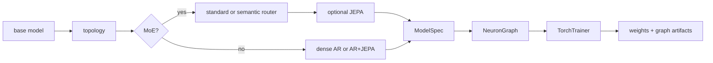

# CLI Workflows

The `cli/` package installs the `nfn` command for training, inference,
evaluation, and backend diagnostics outside the web editor. It is an in-repo companion to the Python SDK:
it builds real `ModelSpec` objects, exports graph JSON plus `.pt` weights, uses
the shared dataset manager, and defaults artifacts to `~/NeuralFn/artifacts`.

For the longer operator runbook, see [../cli/README.md](../cli/README.md).

## Install

```bash
cd cli
python -m venv .venv
source .venv/bin/activate
pip install -e ..
pip install -e .
nfn --help
```

The first editable install exposes the `neuralfn` and `server` packages from
the repo root. The second installs the CLI entrypoint declared by
`cli/pyproject.toml`.

The default SDK install is the lean native/core surface. Root `nfn --help` /
no-argument startup, `nfn train|infer|eval --help`, `nfn kernels ... --help`,
`nfn kernels list [--json]`, CUDA Tile registry metadata, and native GPT
training work without installing or importing Torch, NumPy, tokenizers,
HuggingFace datasets, graph-analysis packages, or server dependencies. Install
`pip install -e ".[tile-cuda]"` for Torch-free native CUDA Tile build tooling,
`pip install -e ".[datasets]"` for raw-text tokenization and HF dataset cache
materialization, `pip install -e ".[graph]"` for Python graph helpers,
`pip install -e ".[server]"` for the FastAPI/editor/MCP backend. The root
`.[all]` extra is also Torch-free, and NeuralFn no longer exposes a `.[torch]`
extra. Legacy graph-backed Torch code requires a separately managed PyTorch
install outside NeuralFn's package metadata.

## Commands

| Command | Purpose |
|---------|---------|
| `nfn train` | Train a composed recipe and export `.pt` weights plus graph `.json`. |
| `nfn infer` | Load an exported graph or supported graphless checkpoint and generate text from a prompt. |
| `nfn eval` | Run validation batches and prompt probes, then write a JSON report. |
| `nfn kernels` | Inspect CUDA Tile kernel coverage and local CUDA Tile diagnostics. |

Every command accepts `--plan` for an interactive questionnaire and
`--plan-auto` for recommended defaults without prompting. Help output supports
`--help-style short`, `--help-style long`, and `--help-style verbose`.

## Recipe model

Recipes are composed from a small set of choices:

| Choice | Values |
|--------|--------|
| Base model | `gpt`, `gpt2`, `gpt3`, `llama`, `nanogpt` |
| Topology | `dense`, `moe`, `semantic_router` |
| Router mode | `standard`, `semantic` |
| Objective overlay | `--jepa` |
| Runtime | default or `--megakernel` |
| Training mode | `pretrain`, `sft`, `dpo`, `ppo`, `reward_model` |
| Adapter | `none`, `lora`, `qlora`, `randmap` |



Examples:

```bash
nfn train --plan
nfn train --base-model gpt --dataset tinystories --eval-every-steps 1000
nfn train --base-model gpt3 --dataset tinystories --native-cuda-print-command --native-cuda-dry-run
nfn infer --graph ~/NeuralFn/artifacts/llama_fast.json --prompt "Once upon a time"
nfn infer --graph ~/NeuralFn/artifacts/gpt2_evo.json --weights ~/NeuralFn/artifacts/gpt2_evo.pt --prompt "Once upon a time"
nfn infer --checkpoint ~/NeuralFn/artifacts/final_model.pt --checkpoint-tokenizer ~/Downloads/fineweb_8192_bpe_lossless_caps_caseops_v1_reserved.model
nfn eval --base-model gpt2 --dataset shakespeare
nfn kernels list --json
nfn kernels doctor
nfn kernels bench --device auto --iterations 200
nfn kernels examples
```

## Kernel diagnostics

`nfn train --help`, `nfn infer --help`, `nfn eval --help`, and `nfn kernels ... --help` use lightweight static help from `cli/nfn.py` so basic CLI orientation does not import `nfn_impl`, Torch, or graph-backed runtime modules. `nfn kernels list` prints CUDA Tile registry coverage from builtin and optimizer metadata on the same lightweight path. JSON output includes `by_dtype` aggregate counts plus each spec's legacy `dtypes` tuple and `dtype_support` matrix for `float32`, `float16`, `float8_e4m3fn`, `float8_e5m2`, and `nvfp4`, with either `"supported"` or the reason that dtype is not yet advertised. Unsupported lower-precision entries use category-specific reasons for losses/reductions, optimizers, stochastic masks, integer/hash/routing outputs, source nodes, and delegated graph calls. The fp8-supported entries include scalar/simple elementwise kernels, direct and composite projections, and attention Q/K/V modules that dequantize activations to float32 and return float32 outputs where required. The NVFP4-supported entries currently cover packed projection-family activations for `linear`, LM/router/value/reward/denoise heads, tied LM head, KV PCA encode/decode, JEPA heads, deterministic LoRA/TTT/adapter projections, `bitlinear_ternary`, `fp8_linear`, `mx_linear`, MLP projections, and ACT halt projection, plus attention Q/K/V and shared attention inputs for SDPA, sparse attention variants, differential attention, causal/fused causal attention, MLA, and routed attention experts. `nfn kernels doctor` also reports the local `nvcc`, CUDA Tile header, `torch.cuda`, and compute-capability status. `nfn kernels bench` compares the old graph-walk helper, the static compiled PyTorch plan, and the Tile-requested compiled plan on a small scalar graph. `nfn kernels examples` lists checked-in examples and `nfn kernels examples --write --output-dir examples/tile_cuda` regenerates the per-registry SDK snippets. These commands accept `--json` for automation.

`nfn train`, `nfn infer`, and `nfn eval` accept `--kernel-backend {auto,torch,tile-cuda}`, `--tile-cuda-strict` / `--no-tile-cuda-strict`, and `--tile-cuda-report PATH`. `tile-cuda` requests the implemented CUDA Tile fast path, build-loads the optional extension when needed, and defaults to strict kernel enforcement so unsupported graph nodes or tensor contracts fail instead of silently dropping to slower fallback paths. Pass `--no-tile-cuda-strict` only when intentionally debugging fallback behavior. The registry currently accounts for all 138 training-relevant entries with 129 Tile-covered kernels/compositions, 7 host-only entries, and 2 delegated graph calls. `NFN_TILE_CUDA_BUILD=1` enables extension builds for `auto` backend probes, and `NFN_TILE_CUDA_ARCH` can override the architecture flag passed to `nvcc`. Install `pip install -e ".[tile-cuda]"` if the active environment does not already provide `ninja` for native CUDA Tile builds. NeuralFn no longer exposes a `.[torch]` extra; graph-backed PyTorch execution requires a separately managed PyTorch install.

The native GPT compiled CLI has its own backend selector:
`--backend tile-cuda` (or Python wrapper `--kernel-backend tile-cuda`). `tile-cuda` is the default and only NeuralFn-owned compiled trainer for dense GPT. Use the parity benchmark script, not a training backend, for llm.kittens reference timing.
The compiled runtime reports token-weight startup routes with
`token_weight_init_strategy`, `token_weight_vector4_strided_init_requested`,
`token_weight_padded_init_fusion_requested`,
`token_weight_padded_init_fusion_available`,
`token_weight_padded_init_fusion_enabled`, and
`token_weight_padding_zero_launches_elided`. The padded-vocab fused BF16-shadow
initializer is diagnostic-only and default-off; set
`NFN_NATIVE_GPT_FUSE_TOKEN_WEIGHT_PADDED_INIT=1` only for paired startup
bisection after rebuilding the trainer-facing Tile ops library. The
`token_weight_vector4_strided` paired profile forces baseline
`NFN_NATIVE_GPT_TOKEN_WEIGHT_VECTOR4_STRIDED_INIT=0` versus candidate `=1`, so
the benchmark JSON has a visible strategy-value route change for the hidden
Tile dispatch.
Use `--base-model gpt` as the canonical native trainer surface. `gpt2` and
`gpt3` are dense GPT selector aliases that canonicalize to
`--model-family gpt` before the compiled C++ frontend runs; GPT3 defaults to
a 2048-token context when selected through `--base-model gpt3` or
`--template-name gpt3`, unless a custom graph or explicit `--train-seq-len` is
supplied. The implicit GPT3 batch size is 32, preserving the default
65,536-token microbatch unless `--batch-size` is explicit.
`nfn-native-train --list-models --json` reports dense GPT coverage with
capability-specific fields: `transformer_lm_status`, `token_lm_status`, and
`geometry_status`. `gpt`, `gpt2`, `gpt3`, and `nanogpt` are implemented aliases
of the same native transformer trainer. NanoGPT full-transformer training adds
`--template-name nanogpt` and uses the selected 320-wide/5-head/5-layer dense
GPT geometry; explicit `--train-token-lm` remains implemented for token-LM
diagnostics.
Plan and runtime JSON include `architecture_source`,
`architecture_contract`, `model_family_context_policy`, and
`resolved_native_template_name` so a run makes clear that the graph/template,
not the family label, chooses the architecture. The default public template is
`gpt`; today it resolves to the implemented dense GPT native topology.
`--native-cuda-print-plan` and `--native-cuda-check-tile-ops` still print the
raw Tile ABI plan or check the trainer-facing library. The Tile plan includes
the GPT-2 parameter layout and forward/backward/optimizer stage sequence that
the native loop executes.
`--native-cuda-smoke-tile-ops` / `--smoke-tile-ops` goes one step beyond
symbol checks: it loads `libnfn_native_train_tile_ops.so`, loads CUDA runtime,
launches `nfn_native_tile_fill_float32` on a tiny device buffer, copies the
result back, and reports JSON without Python, Torch, or graph-node payloads.
`--native-cuda-smoke-optimizer-step` / `--smoke-optimizer-step` allocates the
GPT-2 contiguous parameter, gradient, and AdamW moment buffers, runs one AdamW
call per registered GPT-2 parameter buffer with the correct decay/no-decay
setting, samples copyback values, and reports JSON.
`--native-cuda-smoke-lm-step` / `--smoke-lm-step` runs a tiny GPT-2-shaped
tied embedding/LM-head step through token embedding, linear logits, full-vocab
CE partials and workspace CE backward, linear input/weight backward, token
embedding weight backward, and AdamW.
`--check-tile-ops`, `--smoke-tile-ops`, `--smoke-optimizer-step`,
`--smoke-lm-step`, `--smoke-attention-step`, `--smoke-mlp-step`,
`--smoke-norm-residual-step`, and `--smoke-transformer-block-step` are no-data
preflight actions: the compiled CLI runs them before token-shard resolution, so
they do not require cached `fineweb_train_*.bin` shards and report
`token_shards_resolved: false` when no dataset was opened. Dataset-backed
smokes such as `--smoke-embedding-lm-step`, `--smoke-transformer-lm-step`, and
real training modes still resolve cached train/validation shards before running.
`--native-cuda-smoke-attention-step` / `--smoke-attention-step` runs a tiny
GPT-2 model-dim attention stage through qkv projection, QKV split, SDPA
forward/backward, QKV gradient merge, projection backward, and AdamW.
`--native-cuda-smoke-mlp-step` / `--smoke-mlp-step` runs a tiny GPT-2 MLP
stage through c_fc projection, GELU forward/backward, c_proj projection
backward, and AdamW.
`--native-cuda-smoke-norm-residual-step` / `--smoke-norm-residual-step` runs
GPT-2 LayerNorm, scaled residual add, LayerNorm affine/input backward, gradient
accumulation, and AdamW through raw Tile kernels.
`--native-cuda-smoke-embedding-lm-step` / `--smoke-embedding-lm-step` samples
a tiny cached uint16 token batch in C++ and runs token embedding, absolute
position embedding, embedding residual add, final LayerNorm, tied LM head, CE
backward, embedding/norm backward, and AdamW without graph-editor payloads.
`--train-embedding-lm` runs that GPT-2
embedding/final-norm/LM path as a real multi-step compiled loop over cached
train shards, with validation losses from validation shards controlled by
`--eval-every-steps`, `--eval-batches`, and `--eval-batch-size`.
`--native-cuda-smoke-transformer-block-step` /
`--smoke-transformer-block-step` composes GPT-2 LayerNorm, fused QKV attention,
real 12-head reshape/merge layout (`12 x 64`), residual adds, MLP, backward
passes, gradient accumulation, projection bias gradients, and AdamW updates for
all 12 GPT-2 block parameter buffers through raw Tile kernels.
`--native-cuda-smoke-transformer-lm-step` /
`--smoke-transformer-lm-step` samples cached uint16 tokens and runs
range-checked GPT-2 token IDs through token/position embeddings, one tiny
transformer block, final LayerNorm, tied LM head, CE forward/backward,
transformer backward, embedding backward, and AdamW for 16 parameter buffers
through raw Tile kernels.
`--train-transformer-lm` is the default strict compiled training action for that
transformer-LM path. It runs a full-vocab real-dim 12-layer multi-step loop
over cached shards with periodic validation records in `validation.losses`,
using the token/position embedding, transformer, final norm, tied LM head, CE
backward, a row-chunked tied LM-head/CE workspace, device-side global norm
gradient clipping, scratch-recompute activation tape, and 148-buffer AdamW raw
Tile kernels without Python/Torch.
Native JSON normally prints to stdout. Add `--json-out PATH` to the compiled
trainer to write that JSON directly to a file, or use the aliases
`--profile-json PATH` / `--stage-profile-json PATH` when collecting profiler
runs such as `NFN_NATIVE_GPT_STAGE_TIMING=1 build/nfn_gpt_native_train ...
--profile-json /tmp/nfn_profile.json`.
Profile JSON includes ranked arena request details in
`float_arena_request_stats.top_requests` and
`uint16_arena_request_stats.top_requests`. Each entry reports the suballocation
name, elements, bytes, and arena offset, so startup work can pair
`timing.setup_timing` with the actual buffers behind the large float and BF16
arena `cudaMalloc` calls. The same objects also include `family_count`,
`top_families`, `top_family_elements`, and `top_family_bytes`; repeated
per-block names are normalized as `block.*...` so layer-wide allocation
families can be selected from the JSON without manual grouping. Main
transformer-LM global float buffers are named individually, for example
`mlp.fc.grad_out`, `attention.grad_out`, and `lm_head.float_logits`, instead of
being collapsed under a generic buffer label.
`NFN_NATIVE_GPT_BF16_PERSISTENT_BLOCK_OUTPUTS=1` is a diagnostic-only
startup/memory switch for the dense GPT scratch-recompute trainer. It stores
the earlier inter-block persistent outputs as BF16, restores them through one
FP32 scratch buffer during backward, and reports
`bf16_persistent_block_outputs_enabled`,
`bf16_persistent_block_output_store_count`,
`bf16_persistent_block_output_restore_count`,
`persistent_block_output_write_strategy`,
`fp32_persistent_block_output_elements_elided`, and
`fp32_persistent_block_output_bytes_elided` in runtime JSON. At the default
12-layer `64 x 1024 x 768` shape it elides `2,214,592,512` FP32 bytes. The
current Tile ABI can report
`scratch-residual2-output-plus-fused-bf16-persistent-store` when the MLP
residual-add output and BF16 persistent side-store are fused through
`nfn_native_tile_linear_bias_residual_add_bf16_linear_bf16_residual_float32`.
It remains off by default because the 2026-06-22 CUDA 13.3 dedicated RTX 5090
full-token paired benchmark measured `1.010946x` train-loop wall time and
`0.989173x` tokens/sec versus the current default.
Validation uses a separate C++ validation sampler and active forward batch size
from `--eval-batch-size`; that value must be at least 1 and no larger than the
training `--batch-size` because the fixed activation arena is allocated for the
training microbatch. Runtime JSON reports it as `validation.eval_batch_size`,
and validation loss records report their token counts in
`validation.losses[].tokens`.
The trainer-facing Tile ops library built by `tools/build_native_train_tile_ops.sh`
defaults to the SM120 ThunderKittens bf16 attention bridge. GPT-2-compatible
training JSON reports `attention_backend_strategy: "tk-sm120-bf16-bridge"`,
`attention_forward_tk_launch_count`, `attention_backward_tk_launch_count`, and
zero row/scalar attention launches when that path is active. Set
`NFN_TILE_CUDA_USE_TK_ATTENTION=0` before rebuilding only for the older float32
row-scan diagnostic path.
The SM120 build uses llm.kittens-style NVCC threading, host-compiler,
data-prep, memory, and LayerNorm tuning flags for the ThunderKittens headers,
but leaves GEMM dispatch on NeuralFn's initialized cublasLt path.
The same trainer-facing build defaults dense GPT block projection weights to the
BF16-primary path while leaving FP32 gradients and AdamW state in the optimizer
buffers. The old FP32-master/BF16-shadow path remains available with
`NFN_NATIVE_GPT_BF16_BLOCK_WEIGHT_PARAMS=0`. The compiled trainer routes block
forward/recompute and block dInput GEMMs through `nfn_native_tile_linear_weight_bf16_float32`,
`nfn_native_tile_linear_weight_bf16_output_float32`,
`nfn_native_tile_linear_bf16_input_weight_bf16_float32`, and
`nfn_native_tile_linear_backward_input_weight_bf16_float32`. LN1 packed-QKV
forward uses `nfn_native_tile_layer_norm_with_stats_bf16_out_float32` and
`nfn_native_tile_linear_bf16_input_weight_bf16_output_float32` by default.
Transformer block
dWeight+bias accumulation uses
`nfn_native_tile_linear_backward_weight_bias_accumulate_bf16_float32` or
`nfn_native_tile_linear_backward_weight_bias_accumulate_bf16_bits_float32`,
which request cuBLASLt `CUBLASLT_EPILOGUE_BGRADB` for supported BF16 block
shapes and fall back inside the ABI to separate dWeight plus Tile bias
reduction when unsupported. Tied LM-head
logits, dHidden, and dWeight chunks also default to the BF16 classifier path,
which writes BF16 logits, overwrites them with BF16 dlogits, then feeds BF16
dlogits into the LM-head dHidden and dWeight GEMMs. The tied token
embedding/LM-head weight also keeps a persistent BF16 shadow by default for
LM-head logits and dHidden while retaining the FP32 master for token embedding,
AdamW state, and checkpoint export. Runtime JSON reports
`token_weight_bf16_shadow_enabled` and `token_weight_bf16_refresh_count`. Set
`NFN_NATIVE_GPT_TOKEN_WEIGHT_BF16_SHADOW=0` only for paired benchmarks against
the older per-step BF16 bridge/cache route. The default vector4 token-weight
initializer keeps the conversion-based BF16 shadow writer; set
`NFN_NATIVE_GPT_TOKEN_WEIGHT_BF16_PATTERN_INIT=1` or
`NFN_TILE_CUDA_TOKEN_WEIGHT_BF16_PATTERN_INIT=1` only for paired startup
benchmarks against the rejected precomputed-pattern shadow writer. Set
`NFN_NATIVE_GPT2_LM_HEAD_BF16_LOGITS=0` to return only the tied LM-head chunks
to the older optimized TF32 tensor-op `cublasSgemm` path for debugging.
`nfn_native_tile_linear_weight_bf16_gelu_bf16_float32` now handles stored-MLP
FC+bias+GELU and
`nfn_native_tile_linear_backward_input_dgelu_weight_bf16_bits_float32` handles
fused MLP projection dInput plus saved-BF16 GELU backward, so these fused MLP
routes also consume persistent BF16 block-weight shadows. Runtime JSON reports
`stored_mlp_forward_strategy:
"tk-sm120-fused-fc-bias-gelu-bf16-store-bf16-shadow-weight"` and
`block_backward_mlp_proj_dgelu_strategy:
"tk-sm120-fused-dinput-dgelu-bf16-store-bf16-shadow-weight-bf16-grad-handoff"` when
that path is active. The raw ABI also exposes
`nfn_native_tile_linear_backward_input_bf16_bits_weight_bf16_float32` and
`nfn_native_tile_linear_backward_weight_bias_accumulate_bf16_bits_bf16_bits_float32`
for the default BF16 MLP gradient handoff; set
`NFN_NATIVE_GPT_BF16_MLP_GRAD_HANDOFF=0` to compare against the older
float-gradient handoff. Runtime JSON reports
`block_backward_bf16_mlp_grad_handoff_enabled` and switches
`stored_mlp_activation_backward_consumer_strategy` when the handoff is active.
When the BF16-only dGELU handoff covers every trained block, the trainer also
skips the old FP32 `mlp.fc.grad_out` arena buffer. Runtime JSON reports
`block_backward_mlp_fc_grad_out_float_buffer_elided`,
`block_backward_mlp_fc_grad_out_float_elements`,
`block_backward_mlp_fc_grad_out_float_bytes_elided`, and matching
`block_state_layout.mlp_fc_grad_out_float_*` counters. Set
`NFN_NATIVE_GPT_ELIDE_MLP_DGELU_FLOAT_GRAD=0` to compare against the older
float-gradient conversion/allocation path.
If the SM120 TK fused route is unavailable in a non-default Tile build or
shape, the BF16-only raw ABI falls back to BF16-output GEMM plus in-place
BF16-bits dGELU instead of leaving the handoff buffer unwritten.
The older float-gradient path still uses the fused dInput+dGELU ABI and only
hands the following MLP FC backward a float gradient when the handoff is forced off.
The raw Tile library also exports
`nfn_native_tile_linear_backward_weight_bias_accumulate_bf16_bits_bf16_bits_to_bf16_bits_float32`
for profiling BF16/BF16 block dWeight accumulation into BF16 staging buffers.
Set `NFN_NATIVE_GPT_BF16_BLOCK_DWEIGHT_STAGING=1` only for paired benchmarks; it
is default-off because the dedicated RTX 5090 candidate-vs-baseline run measured
about `1.0245x` slower train-loop time than the current cuBLASLt bgrad path.
Runtime JSON reports `block_dweight_bf16_staging_enabled`,
`block_dweight_bf16_staging_strategy`, staging bytes, zero count, and
BF16-to-FP32 flush launches when the experiment is enabled.
The mixed float32-hidden/BF16-grad dWeight+bias ABI can opt into a cuBLASLt
bgrad epilogue route for QKV profiling with
`NFN_NATIVE_GPT_FUSE_FLOAT32_BF16_DWEIGHT_BGRAD=1` or
`NFN_TILE_CUDA_LINEAR_FLOAT32_BF16_BGRAD=1`; it remains default-off after paired
RTX 5090 timing showed a slight train-loop regression.
Set
`NFN_TILE_CUDA_LINEAR_BF16=1` or
`NFN_NATIVE_LINEAR_BF16=1` only when profiling the normal linear ABI's BF16
bridge. Set `NFN_TILE_CUDA_LINEAR_CUBLASLT=1` or
`NFN_NATIVE_LINEAR_CUBLASLT=1` only when profiling the normal linear ABI's
cached cuBLASLt TF32 path; the current 5090 GPT-2 shape keeps SGEMM as the
faster default. GPT-2 training JSON reports `linear_backend_strategy:
"block-bf16-cublaslt-shape-gated-lm-head-tk-sm120-default"`,
`block_forward_linear_strategy`, `block_backward_input_linear_strategy`,
`block_weight_bf16_shadow_strategy`, `block_weight_bf16_shadow_elements`,
`block_weight_bf16_shadow_bytes`, `block_weight_bf16_shadow_descriptor_count`,
`block_weight_bf16_shadow_fused_adamw_refresh_enabled`,
`block_weight_bf16_refresh_count`,
`block_weight_bf16_fused_adamw_refresh_count`,
`adamw_bf16_shadow_refresh_strategy`,
`block_backward_mlp_proj_dgelu_strategy`,
`block_backward_weight_linear_strategy`,
`non_block_forward_backward_linear_strategy`,
`linear_bf16_gemm_count`, `linear_bf16_gemm_fast16bf_request_count`,
`linear_cublaslt_gemm_count`, `linear_cublaslt_descriptor_cache_enabled`, `linear_sgemm_count`,
`linear_bf16_a_pack_count`, `linear_bf16_a_cache_hit_count`,
`linear_bf16_cache_reset_count`, `linear_bf16_cached_a_capacity`, and
`linear_bf16_cache_entry_count`.
Native GPT CLI runs also report `device_exit_cuda_free_elision_enabled` and
`device_exit_cuda_free_skipped_count`. The default skips explicit exit-time
`cudaFree` calls for large device arenas, skips runtime-library `dlclose()`,
and relies on process teardown to reclaim them after JSON/checkpoint output is complete; set
`NFN_NATIVE_GPT_SKIP_EXIT_CUDA_FREE=0` to restore explicit device frees for
cleanup diagnostics. `runtime_library_dlclose_skipped_count` and
`timing.cleanup_wall_ms` reflect the selected cleanup path.
The cuBLASLt descriptor cache is enabled by default, so cached plans retain
matmul descriptors and matrix layouts instead of recreating them for every
GEMM; set `NFN_TILE_CUDA_CUBLASLT_DESCRIPTOR_CACHE=0` or
`NFN_NATIVE_LINEAR_CUBLASLT_DESCRIPTOR_CACHE=0` only for paired profiling
against the older descriptor-recreate path.
The BF16 operand cache is only for stable operands such as weights and biases;
BF16-output GEMMs repack mutable activation inputs because native scratch
activation pointers are reused with new contents.
The tied LM-head dWeight path follows the same rule: it consumes BF16 dlogits
but repacks each mutable hidden activation chunk instead of caching that
scratch pointer across gradient-accumulation microbatches.
The default dense GPT route also uses
`nfn_native_tile_linear_backward_input_dgelu_bf16_bits_float32` to fuse the MLP
projection dInput GEMM with saved-BF16 GELU backward. Set
`NFN_NATIVE_GPT_FUSE_MLP_PROJ_DGELU=0` to compare against the older separate
MLP projection dInput plus GELU-backward launches.
The default `non_block_forward_backward_linear_strategy` is
`"padded-lm-head-tk-sm120-bf16-gemm-default"` when the native Tile ops library
was built with the SM120 TK GEMM bridge.
The public GPT-2 tokenizer vocab stays 50,257, while the native tied token
embedding/LM-head tensor is padded to 50,304 rows for GEMM-friendly layout;
training JSON reports both `vocab: 50257` and `padded_vocab: 50304`, and
`--dry-run` / `--print-plan` reports `shape.padded_vocab_size: 50304`.
The tied LM-head row chunk defaults to 32768 rows on the dedicated RTX
5090/CUDA 13.3 workstation route and can be overridden with
`--lm-head-row-chunk-size` on the compiled C++ entrypoint or
`--native-cuda-lm-head-row-chunk-size` from the wrapper/root CLI. Use 8192 only
when reproducing the older lower-memory route. Loss partials
are reduced on device before one host loss copy per forward loss, and tied
LM-head dWeight chunks accumulate directly into `accum_grad_token_weight` with
`nfn_native_tile_linear_backward_weight_accumulate_float32` instead of using a
full-vocab scratch gradient buffer per chunk or per microbatch. Default JSON
reports `lm_head_training_logits_dtype: "bf16"`,
`lm_head_bf16_logits_enabled: true`, `lm_head_bf16_logit_elements`, and
`lm_head_ce_backward_strategy: "public-vocab-strided-fused-row-bf16-logits-dlogits"`.
The LM-head CE kernels softmax over the public vocab and use the padded row
count only as the logit/dlogit stride; JSON reports
`lm_head_public_vocab_ce_enabled`, `lm_head_softmax_vocab`,
`lm_head_logit_row_stride`, and `lm_head_padded_dlogits_zeroed`. Set
`NFN_NATIVE_GPT_PUBLIC_VOCAB_CE=0` only when paired-benchmarking against the old
padded-vocab CE behavior.
`--smoke-lm-step`, `--smoke-embedding-lm-step`, `--train-embedding-lm`, and
`--smoke-transformer-lm-step` use that same 50,304-row padded tied token
embedding/LM-head tensor while validating token IDs against public vocab 50,257.
Its JSON reports `trained_layers: 12`, `target_layers: 12`,
`block_state_layout` with block-vector allocation/init/zero/clip/AdamW/checkpoint/tape/forward/backward loop
flags, `activation_tape_strategy: "scratch-recompute"`, `activation_tape_count: 1`,
`persistent_block_outputs: 11`, `persistent_block_output_write_strategy: "direct-residual2-output"`, `persistent_block_output_copy_elided_count`,
`final_block_output_copy_elided: true`, `vocab: 50257`, `padded_vocab: 50304`, `lm_head_row_chunk_size`,
`lm_head_row_chunk_count`, `loss_partial_count`, `logit_workspace_elements`,
`gradient_partial_count`, `gradient_clip_norm`, and `sample_gradient_clip_scale`
after completed steps. Pass
`--no-train-transformer-lm` on the compiled C++ entrypoint only for plan/check/debug
commands that should not start the default trainer. `--checkpoint-metadata-smoke
--output-dir PATH` writes a sparse version-5 bf16 native checkpoint-format file
plus `DONE_########` marker for the requested `--num-layers` target shape without Python,
Torch, or CUDA. Successful `--train-transformer-lm` runs also write a final
12-layer trained-weight native checkpoint plus `DONE_########` marker. Version-5
checkpoints store public vocab 50,257 separately from padded tensor vocab 50,304,
so tokenizer checks should use the public vocab while tensor-size checks use the
padded vocab. The trained checkpoint path packs device float32 weights to bf16 payload bits with
`nfn_native_tile_float32_to_bf16_bits_many` before a single contiguous host
copy, so JSON reports `checkpoint.payload_pack_strategy:
"device-many-float32-to-bf16-bits-contiguous"`, `payload_pack_kernel:
"nfn_native_tile_float32_to_bf16_bits_many"`, `payload_copy_strategy:
"single-contiguous-device-payload-d2h"`, `payload_cpu_bf16_conversion: false`,
`device_pack_kernel_launches`, `d2h_copy_count`, `d2h_bytes`, and
`float32_d2h_bytes_elided` instead of materializing full float32 tensors on CPU
for bf16 packing or copying each parameter tensor separately.
Use `--cuda-runtime-lib PATH` or `NFN_CUDA_RUNTIME_LIB` when libcudart is not
on the loader path. Backend names are strict; use `tile-cuda`.
For bottleneck analysis, set `NFN_NATIVE_GPT2_STAGE_TIMING=1` before a
`--train-transformer-lm` run. The trainer then adds CUDA-event measurements
under `timing.stage_timing`, including token upload, model/block forward,
block recompute/backward, LM-head backward, embedding/final-norm backward,
gradient zero/clip, and AdamW update stages. It also reports nested LM-head,
block forward/recompute, and block backward substages such as
`lm_head_backward.dhidden`, `lm_head_backward.dweight`,
`block_forward.attention.qkv`, `block_forward.attention.sdpa`,
`block_forward.mlp_fc_gelu.fc`, `block_forward.mlp_proj.proj`,
`block_backward.mlp_proj`, `block_backward.mlp_proj.dinput`,
`block_backward.mlp_proj.gelu`, `block_backward.attn_sdpa`, and
`block_backward.qkv`. This mode inserts event
timing work and synchronizes before reporting, so keep it off for normal
throughput or model-quality runs.

Startup keeps per-block parameter/gradient allocation, scratch-tape activation
allocation, parameter initialization, and AdamW-state zeroing under the
block-vector visitors. Block 0 is not also touched through the legacy global
alias list, and JSON reports
`block0_duplicate_allocation_elided`,
`block0_duplicate_activation_allocation_elided`,
`block0_duplicate_parameter_initialization_elided`, and
`block0_duplicate_adamw_state_zero_elided` under `block_state_layout`.
Float buffers are suballocated from one aligned CUDA device arena, so the full
trainer does not issue one `cudaMalloc` per parameter, gradient, moment,
activation, and workspace buffer. JSON reports
`float_allocation_strategy: "single-arena"`,
`float_allocation_cuda_malloc_count`, `float_allocation_request_count`,
`float_arena_requested_elements`, `float_arena_allocated_elements`, and
`float_arena_request_stats` with the largest named suballocations and grouped
allocation families.
BF16 activation and scratch buffers are suballocated from one uint16 CUDA device
arena by default, covering stored MLP activations, residual1 caches, packed
attention stores, LM-head BF16 logits, MLP BF16 scratch, packed-QKV BF16
scratch, and block BF16 weight shadows. Set
`NFN_NATIVE_GPT_COMBINED_BF16_ARENA=0` or
`NFN_NATIVE_GPT2_COMBINED_BF16_ARENA=0` to reproduce the older per-buffer
BF16 `cudaMalloc` path during paired benchmarks. JSON reports
`uint16_allocation_strategy`, `uint16_allocation_cuda_malloc_count`,
`uint16_allocation_request_count`, `uint16_arena_requested_elements`,
`uint16_arena_allocated_elements`, `uint16_arena_cuda_malloc_count`, and
`uint16_arena_suballocation_count`, plus `uint16_arena_request_stats` with the
largest named BF16/uint16 suballocations and grouped allocation families.
Set `NFN_NATIVE_GPT_CUDA_MALLOC_ASYNC=1` only for allocator profiling. It routes
the same large native GPT device arenas through CUDA runtime `cudaMallocAsync`
and frees them with `cudaFreeAsync` when those symbols are available, falling
back to `cudaMalloc` if an async allocation fails. The path is default-off
because paired dedicated-RTX-5090 timing measured it slower than the default
arena `cudaMalloc` path; the latest CUDA 13.3 explicit arena-gated retest
measured `1.177290x` setup wall time, `2.243472x` float-arena materialization,
`1.716820x` uint16-arena materialization, and `1.176781x` total startup wall
time. JSON reports `device_allocator_strategy`,
`device_cuda_malloc_async_requested`, `device_cuda_malloc_async_enabled`, async
symbol availability, async allocation/free counts, and
`device_cuda_malloc_async_fallback_count`.
Startup timing JSON reports `setup_timing_accounted_ms`,
`setup_timing_unattributed_ms`, and `setup_timing_record_count` beside
`setup_wall_ms`. Use these fields with `timing.setup_timing` to separate
explicitly measured arena/kernel setup phases from loader, symbol-resolution,
and other host overhead before the first optimizer step. The setup timing array
includes `setup.load_tile_ops`, `setup.load_cuda_runtime`, and
`setup.cuda_runtime_symbols` before arena materialization.
The dense GPT training route loads Tile ops with lazy dynamic binding and still
validates required ABI symbols explicitly; JSON reports
`tile_ops_dlopen_binding_strategy: "RTLD_LAZY"`, `tile_ops_dlopen_wall_ms`,
`tile_ops_required_symbol_scan_wall_ms`, and
`tile_ops_typed_symbol_load_wall_ms`.
CUDA runtime setup also reports `cuda_runtime_symbol_load_wall_ms` and
`cuda_runtime_version_preflight_wall_ms`.
Dense GPT native training defaults `NFN_NATIVE_GPT_COMBINED_DEVICE_ARENA=1`.
The trainer waits until both the float arena and the BF16/uint16 arena layouts
are known, then packs them into one aligned `cudaMalloc`. JSON reports
`float_allocation_strategy: "combined-transformer-device-arena"`,
`uint16_allocation_strategy: "combined-transformer-device-arena"`,
`transformer_device_arena_requested`, `transformer_device_arena_enabled`,
`transformer_device_arena_cuda_malloc_count`,
`transformer_device_arena_requested_bytes`,
`transformer_device_arena_allocated_bytes`, and
`transformer_device_arena_uint16_byte_offset`. Set
`NFN_NATIVE_GPT_COMBINED_DEVICE_ARENA=0` only to compare against the older split
float/BF16 arena path. The CUDA 13.3 dedicated RTX 5090 3-step gate promoted the
combined arena at `0.991645x` train-loop wall time, `1.008465x` tokens/sec,
`0.993960x` LM-head backward, `0.998550x` block backward, and `0.988817x` MLP
projection time.
Startup zeroes only AdamW first/second moment state as coalesced contiguous
ranges with `cudaMemsetAsync` by default, then overwrites nonzero weights with
device initializers and zeroes gradients per optimizer step. Set
`NFN_NATIVE_GPT_CUDA_MEMSET_ZERO=0` to compare against the older Tile fill
zeroing path, `NFN_NATIVE_GPT_ZERO_ADAMW_STATE_RANGES=0` to force the older
descriptor-driven AdamW state fills, or
`NFN_NATIVE_GPT_ZERO_ADAMW_STATE_ONLY=0` to force the older full-arena zero for
bisection. JSON reports
`float_arena_zero_init_strategy: "adamw-state-contiguous-range-cuda-memset"`,
`"adamw-state-contiguous-range-fill"`, `"adamw-state-fill-many"`,
`"single-arena-cuda-memset"`, or `"single-arena-fill"`,
`startup_cuda_memset_zero_enabled`, `startup_cuda_memset_zero_available`,
`float_arena_zero_fill_count`, `adamw_state_zero_fill_count`,
`startup_cuda_memset_zero_fill_count`, `startup_tile_zero_fill_count`,
`adamw_state_zero_range_count`, `adamw_state_zero_range_elements`,
`startup_per_buffer_zero_fill_elided`, and
`startup_per_buffer_zero_fill_launches_elided`.
Token upload/storage buffers are also arena-backed: one aligned device arena
holds widened int64 token/target buffers plus compact uint16 H2D staging, and
one pinned uint16 host arena holds compact source staging. JSON reports
`token_buffer_allocation_strategy: "combined-arenas"`,
`token_device_allocation_strategy: "single-device-arena"`,
`token_device_arena_cuda_malloc_count`,
`token_device_arena_suballocation_count`, and
`token_device_cuda_mallocs_elided`.

Native dense GPT command paths accept `--template-name NAME` / `--template NAME` /
`--preset NAME` and `--graph-file PATH` / `--graph PATH`. These arguments are
canonicalized to `--template-name` and `--graph-file` by Python wrappers, then
carried through the SDK config and compiled C++ frontend without loading Torch.
Top-level `nfn train --base-model gpt` direct compiled-CLI handoff adds
`--train-transformer-lm` for normal training commands, including selector-bearing
commands, unless the command already requested a plan/check/smoke/train action.
`--base-model gpt2` and `--base-model gpt3` are aliases for this same trainer;
GPT3 defaults to a 2048-token context when selected through `--base-model gpt3`
or `--template-name gpt3`, unless a custom graph or explicit
`--train-seq-len` is present. The native planner also defaults the implicit GPT3
batch size to 32 so the token microbatch remains unchanged.
For custom graphs, the selected graph and explicit sequence arguments are
authoritative.
The selector accepts `gpt` as the default public dense GPT template alias plus
every name in
`neuralfn.config.SHIPPED_GPT_TEMPLATE_PRESETS`, and the compiled C++ plan JSON
reports the synchronized `shipped_template_catalog`,
`shipped_template_catalog_count`, and `template_known` fields. The current native
loop runs `gpt`, `gpt2`, `gpt3`, `nanogpt`, dense modern/megakernel aliases, and
`gpt2_moa` through the transformer-LM trainer; `gpt` reports
`resolved_native_template_name: "gpt2"`, and `gpt2_moa` resolves to the native
MoA activation mode automatically. Structurally different shipped GPT template
names are selected and reported in JSON, but return
`template-native-trainer-missing` for real training until their native C++ Tile
trainer plans are implemented. Existing custom graph files that carry
native-compatible GPT `template_spec` metadata report `native-transformer-lm`
and can run the selected dense GPT native trainer; arbitrary or incompatible custom
graph JSON reports `custom-graph-native-trainer-missing`, and missing custom
graph paths report `custom-graph-file-missing`. Unknown template names return
`unknown-template`, which keeps typos separate from known migration work.

The GPT-2 evo compiled preflight accepts the same selector aliases. It reports
`template_name`, `graph_file`, `template_known`,
`selected_graph_support_status`, `selected_graph_native_runnable`, and the
synchronized shipped template catalog before any graph-backed runtime import.
Dense GPT-2-compatible selectors, including `gpt2_modern`, report
`native-dense-gpt-layer-evo-delegate`; structurally different templates report
`template-native-trainer-missing`; custom graph files report
`custom-graph-native-trainer-missing`.
Use `nfn_gpt2_evo_native_train --smoke-evo-kernels --tile-ops-lib PATH` to
verify the raw evo mutate/select/adopt ABI on CUDA device buffers without
opening datasets, importing Python/Torch, or routing payloads through
graph-editor nodes.

The same trainer samples cached token/target batches directly into one pinned
uint16 arena, enqueues one H2D `cudaMemcpyAsync`, and widens tokens plus targets
to int64 IDs on device with one `nfn_native_tile_uint16_to_int64` launch.
The per-batch CPU int64 expansion and token-range scan are intentionally absent
from this native hot path; output JSON reports
`token_id_upload_strategy: "uint16-pinned-async-h2d-device-widen"`,
`token_id_host_staging: "pinned"`, `token_id_h2d_copy:
"cudaMemcpyAsync-contiguous-arena"`, `token_id_h2d_copy_calls_per_microbatch:
1`, `token_id_widen_strategy: "single-contiguous-arena-kernel"`,
`token_id_widen_kernel_launches_per_microbatch: 1`, and
`token_batch_staging_strategy: "direct-sampler-to-pinned-arena"`,
`token_batch_vector_materialization: false`, and `token_id_host_validation:
false`.

Startup initializes the tied token embedding/LM-head weight directly on device
with `nfn_native_tile_init_gpt2_token_weight_float32` instead of building and
copying a 154 MB host float matrix. The default fast Tile initializer uses
int32 Tile indices when the table fits in int32; set
`NFN_NATIVE_GPT_TOKEN_WEIGHT_FAST_INT32_INIT=0` only for paired comparison
against the older int64-index Tile path. Output JSON reports
`token_weight_init_strategy: "device-tile-deterministic"`,
`token_weight_fast_int32_init_enabled`, and `token_weight_host_materialization:
false`.

For performance, the compiled GPT-2 transformer-LM trainer keeps training loss
disabled unless `--train-loss-every-steps` is positive. Ordinary steps run the
forward activations needed for backward, CE gradient generation, gradient
clipping, and AdamW only; validation cadence computes validation loss from
validation shards without also measuring train loss. When sampled train loss is
enabled, the CE scalar accumulates on device across the whole optimizer step and
is copied to the host once per logged step. The JSON fields
`train_loss_sparse: false`, `train_loss_sampling`,
`train_loss_on_validation_steps: false`, `train_loss_eval_count`,
`train_loss_last_step`,
`train_loss_device_accumulation_strategy`,
`train_loss_host_copy_scope`, `train_loss_host_d2h_count`,
`train_loss_host_d2h_copies_per_logged_step`, and
`train_loss_microbatch_host_d2h_copies_elided_per_logged_step` report that
contract.

Paired CUDA benchmark runs use `tools/paired_kernel_speed.py` to alternate
baseline and candidate commands under the same selected GPU. For GPU-visible
runs the tool now takes a per-selected-GPU lock at
`/tmp/nfn_paired_kernel_speed_gpu_<device>.lock` before warmup or measured
commands, preventing two local same-GPU paired benchmarks from overlapping
before the idle-process guard can see them. The default is fail-fast; use
`--gpu-benchmark-lock-timeout-seconds N` to wait for the lock, or
`--no-gpu-benchmark-lock` only for intentionally unmanaged measurements.
When native JSON is present, paired output includes
`native_strategy_value_changes` for categorical strategy switches such as
LM-head CE, block linear, attention, allocator, or token-init route names, plus
`native_route_counter_changes` for numeric route counters. Candidate-only
environment knobs now trigger the timing-only warning only when route counters,
strategy values, and linear-shape plan metadata all remain unchanged.
`--require-native-route-change` makes that condition fail the run, and
`tools/bench_native_gpt_sm120_candidate.sh` enables it automatically for
measured candidate changes so a timing-only fluctuation cannot pass as a kernel
promotion.

Persistent block-output preservation in the compiled GPT trainer writes the MLP
residual-add output directly into each non-final block's persistent
backward-recompute buffer. This removes the previous post-block copy launch
while keeping the scratch-recompute tape contract.
The final block output copy is elided because final LayerNorm consumes it before
backward recomputation starts.
Validation forwards do not copy intermediate block outputs into persistent
training-backward buffers because no backward pass follows validation; JSON
reports `validation_persistent_block_outputs: 0` and
`validation_block_output_copies_elided: true`.
The scratch-recompute backward pass reuses the final block activations left by
the initial forward pass, so only earlier blocks are recomputed from persistent
block outputs. The default 12-layer JSON reports `backward_recompute_blocks: 11`
and `final_block_backward_recompute_elided: true`. The default workstation
path stores earlier-block `ln2_out`, MLP preactivation, and GELU activation
tensors in a BF16 arena during forward,
consumes them directly for MLP dWeight and GELU backward, and reports
`mlp_activation_storage_strategy: "bf16-forward-store-direct-backward-opt-in"`,
`stored_mlp_activation_blocks`, `stored_mlp_activation_bytes`,
`stored_mlp_activation_store_kernel_launches`,
`stored_mlp_activation_restore_kernel_launches`,
`stored_mlp_activation_backward_consumer_strategy`, and
`backward_recompute_mlp_fc_gelu_elided: true`. Set
`NFN_NATIVE_GPT2_STORE_MLP_ACTIVATIONS=0` to use lower-memory pure scratch
recompute, which reports `activation_tape_strategy: "scratch-recompute"` and
`backward_recompute_mlp_fc_gelu_elided: false`. Earlier-block recompute still
stops before the MLP projection output and final residual output because
backward does not consume them; JSON reports
`backward_recompute_mlp_projection_elided: true` and
`backward_recompute_final_residual_elided: true`. Dense GPT now skips the unused
FP32 attention-projection and MLP-projection output buffers by default when
BF16 projection-residual is active. Set
`NFN_NATIVE_GPT_ELIDE_FLOAT_PROJECTION_OUTPUTS=0` or
`NFN_NATIVE_GPT2_ELIDE_FLOAT_PROJECTION_OUTPUTS=0` only to reproduce the older
reservation for paired bisection. Runtime JSON reports
`float_projection_outputs_elided`, `float_projection_output_elements_elided`,
and matching `block_state_layout.float_projection_output_*` counters. Rebuild
`libnfn_native_train_tile_ops.so` with `bash tools/build_native_train_tile_ops.sh`
after updating, because the native trainer checks for the BF16 activation
store/direct-backward ABI symbols at startup.
The MLP projection backward path writes its dInput into the MLP fc gradient
buffer and runs `nfn_native_tile_gelu_backward_inplace_float32`, so the full
trainer does not allocate a separate hidden-size `grad_act` scratch buffer.
JSON reports `mlp_proj_backward_gelu_inplace: true` and
`mlp_proj_backward_grad_act_scratch_allocated: false`.
Transformer block backward residual-gradient pair additions use
`nfn_native_tile_scaled_residual_add_float32`, so the trainer avoids the earlier
zero-fill plus two-accumulate sequence; `block_state_layout.residual_backward_fused`
reports this path. When LayerNorm backward residual fusion is enabled, the
default trainer also skips the fallback-only `grad_residual1_from_mlp` and
`grad_x_from_attn` activation scratch buffers; runtime JSON reports
`block_state_layout.layer_norm_backward_residual_scratch_buffers_allocated`,
`block_state_layout.layer_norm_backward_residual_scratch_buffers_elided`, and
`block_state_layout.layer_norm_backward_residual_scratch_elements_elided`.
Gradient clipping feeds the device clip scalar directly into
`nfn_native_tile_adamw_step_with_device_scale_float32`, avoiding a separate
per-gradient-buffer scale pass before AdamW;
`block_state_layout.adamw_device_clip_scale_fused` reports this path.
The sum-of-squares phase uses `nfn_native_tile_sumsq_partials_many_float32` over
the same device-resident gradient descriptor table, so the default 12-layer path
emits one sumsq kernel launch per optimizer step instead of one per gradient
buffer. JSON reports `gradient_clip_strategy:
"fused-multi-buffer-sumsq-device-scale"`,
`gradient_sumsq_kernel_launches_per_optimizer_step`,
`gradient_sumsq_per_buffer_launches_elided`, and
`block_state_layout.gradient_clip_loop: false`.
AdamW updates use `nfn_native_tile_adamw_step_many_with_device_scale_float32`
over device-resident parameter descriptors, so the default 12-layer path updates
148 parameter buffers with one optimizer kernel launch per optimizer step
instead of one launch per buffer. JSON reports
`adamw_update_strategy: "fused-multi-buffer-device-scale"`,
`adamw_descriptor_count`, `adamw_step_kernel_launches_per_optimizer_step`, and
`adamw_per_buffer_step_launches_elided`. The Tile ops ABI also exports
`nfn_native_tile_adamw_step_many_with_device_scale_bf16_shadow_float32`, which
can write optional BF16 block-weight shadow entries from the same AdamW launch.
Set `NFN_NATIVE_GPT_FUSE_ADAMW_BF16_SHADOW_REFRESH=1` only after forcing
`NFN_NATIVE_GPT_BF16_BLOCK_WEIGHT_PARAMS=0`; the BF16-primary default bypasses
the shadow-refresh route, and prior paired dedicated RTX 5090 timing was
neutral/slightly slower for the fused shadow write.
The default native GPT optimizer uses the no-master BF16 block projection update
path. Token/position/norm/bias tensors keep using the float32 multi-buffer AdamW
ABI, while QKV, attention projection, MLP FC, and MLP projection weights update
their BF16 parameter buffers directly through
`nfn_native_tile_adamw_step_many_with_device_scale_bf16_param_float32`.
The raw ABI also exports
`nfn_native_tile_adamw_step_many_with_device_scale_bf16_param_bf16_grad_float32`
for BF16-primary parameter updates that consume BF16 gradient buffers while
keeping AdamW first and second moments in float32. The dense GPT trainer still
uses the float-gradient BF16-param entrypoint until the block-gradient buffers
move to BF16.
Checkpoint export syncs those BF16 block weights back into FP32 staging buffers
before the existing version-5 BF16 checkpoint packer runs. Set
`NFN_NATIVE_GPT_BF16_BLOCK_WEIGHT_PARAMS=0` to reproduce the older FP32-master
plus BF16-shadow refresh path for bisection. Runtime JSON reports
`block_weight_bf16_primary_param_update_enabled`,
`block_weight_bf16_primary_param_update_count`,
`adamw_float_update_descriptor_count`, `adamw_bf16_param_descriptor_count`,
`adamw_float_update_kernel_launches`, `adamw_bf16_param_kernel_launches`, and
`checkpoint.bf16_param_sync_kernel_launches`.
Token, position, and block Linear weight gradients accumulate directly into
optimizer-step accumulation buffers. The tied LM-head CE backward scale includes
the microbatch accumulation factor, LM-head dWeight chunks and token-embedding
backward write into `accum_grad_token_weight`, and the old full-vocab
token-gradient scratch buffer is not allocated. Position embedding backward uses
the accumulate-position ABI, so `grad_position_weight` is not allocated or copied
after each microbatch. Each transformer block also writes qkv, attention-output,
MLP fc, MLP projection dWeight, LayerNorm affine, and Linear bias gradients
straight into block accumulation buffers, so the real 12-layer loop does not
allocate per-block scratch gradient buffers or run a per-microbatch copy loop.
Accumulation buffers are zeroed once per optimizer step. JSON
reports
`token_gradient_accumulation_strategy: "direct-device-accumulation-buffer"`,
`token_gradient_scratch_buffer_allocated: false`,
`position_gradient_accumulation_strategy:
"direct-device-accumulation-buffer"`,
`position_gradient_scratch_buffer_allocated: false`,
`block_linear_weight_gradient_accumulation_strategy:
"direct-device-accumulation-buffer"`,
`block_linear_weight_gradient_scratch_buffers_allocated: false`,
`layer_norm_affine_gradient_accumulation_strategy:
"direct-device-accumulation-buffer"`,
`linear_bias_gradient_accumulation_strategy:
"direct-device-accumulation-buffer"`,
`block_state_layout.per_block_gradient_buffers: 0`,
`block_state_layout.per_block_direct_accum_gradient_buffers: 12`,
`block_state_layout.gradient_accumulation_loop: false`,
`block_state_layout.gradient_accumulation_copy_loop_elided: true`,
`block_state_layout.gradient_zero_strategy` set to
`"fused-multi-buffer-accumulation-zero"`, and `gradient_zeroed_buffer_count: 0`.
For the default GPT-2 `batch=64`, `seq=1024` shape, large-row Linear
bias-gradient reductions use the Tile chunked atomic reduction path instead of
cuBLAS SGEMV. This keeps the expensive MLP projection bias reduction on the
native Tile route; small reductions can still use the existing cuBLAS path.
The accumulation buffers are zeroed once per optimizer step through coalesced
contiguous-range `cudaMemsetAsync` by default, falling back to
`nfn_native_tile_fill_many_float32` over the same descriptor table used by the
fused AdamW call when CUDA memset is unavailable or
`NFN_NATIVE_GPT_CUDA_MEMSET_GRAD_ZERO=0` is set. JSON reports
`gradient_cuda_memset_zero_enabled`, `gradient_cuda_memset_zero_available`,
`gradient_zero_range_count`, `gradient_zero_cuda_memset_count`,
`gradient_zero_tile_fill_count`, `gradient_zero_kernel_launches_per_optimizer_step`,
and `gradient_zero_per_buffer_launches_elided`.
LayerNorm affine-gradient backward has an accumulate ABI and uses a chunked
parallel atomic reduction for large row counts instead of one CUDA block looping
over all rows. The LayerNorm affine row chunk now defaults to 256 rows; set
`NFN_TILE_CUDA_LAYERNORM_AFFINE_ROW_CHUNK_SIZE=N`,
`NFN_NATIVE_GPT_LAYERNORM_AFFINE_ROW_CHUNK_SIZE=N`, or
`NFN_NATIVE_GPT2_LAYERNORM_AFFINE_ROW_CHUNK_SIZE=N` to run paired chunk-size
experiments without rebuilding. JSON reports
`block_state_layout.layer_norm_backward_affine_strategy:
"auto-chunked-atomic-accumulate"`.

The RTX 5090 dense GPT harness at `cli/scripts/train_gpt.py` is native-only; `train_gpt2.py` is the compatibility entrypoint. Direct execution with the default `compiled-cli` runner translates GPT flags to the compiled C++ CLI and runs it before importing `train_gpt_native.py`, graph-backed helpers, `server.dataset_manager`, NumPy, tiktoken, or Torch; importing the compatibility module, building its parser, and resolving defaults are also lightweight. The native GPT default dataset is TinyStoriesV2 GPT-4 (`roneneldan__TinyStories__TinyStoriesV2-GPT4`) with the GPT-2 tokenizer; `golf1` and `golf10` are explicit cached-token shortcuts, not defaults. The native path resolves the dataset alias with the shared C++ token-shard resolver, materializes `gpt2`/SentencePiece raw text into uint16 `fineweb_train_*.bin` and `fineweb_val_*.bin` shards when needed, then launches the compiled CUDA Tile trainer directly. The resolver also accepts llm.kittens-style `TinyStories_train.bin` / `TinyStories_val.bin`; `--tinystories` uses `/mnt/disk2/dev/open-source/llm.kittens/dev/data/tinystories` when those files exist, `NFN_LLM_KITTENS_TINYSTORIES_DIR` overrides that location, and direct `--dataset-alias /path/to/TinyStories_train.bin` infers the sibling validation bin. The C++ sampler reads contiguous shard segments for each batch instead of reopening the shard for every sequence chunk, and native token-shard JSON reports `batch_read_strategy: "contiguous_shard_segments"`. With the default `compiled-cli` runner and existing cached train plus validation shard files, Python passes the alias/path directly to the compiled resolver without reading `meta.json`, validating shard metadata, or estimating the full training schedule first. The script sets up its own repo/script import path before native dispatch, so direct `python cli/scripts/train_gpt.py ...` and `runpy`-style native invocations do not need `PYTHONPATH`. Default dense GPT `nfn train` commands go directly to `nfn_gpt_native_train --backend tile-cuda --train-transformer-lm` before importing `train_gpt_native`, `nfn_impl`, or Torch. Unsupported families fail from the native registry. Explicit non-default compatibility runners still use the Python native runner. Real token batches do not pass through graph-editor nodes or `TorchTrainer` on the compiled Tile-CUDA path. Defaults match the SM120 run shape: 20,000 steps, sequence length 1024, microbatch 64, 524,288 tokens/step, learning rate 0.0006, weight decay 0.1, 60 warmup steps, validation every 250 steps, sample/checkpoint cadence 20,000/200, cosine decay to zero, tokenizer vocab 50,257, and padded native embedding/LM-head rows 50,304. The C++ loop makes the 524,288-token step real by deriving `grad_accum_steps = ceil(train_batch_tokens / (batch_size * seq_len))`, streaming that many microbatches through CUDA Tile forward/backward, accumulating scaled gradients on device, and running clip plus AdamW once per optimizer step. Native JSON reports `model_family`, `microbatch_tokens`, `requested_train_batch_tokens`, `grad_accum_steps`, `effective_train_batch_tokens`, `train_microbatches_completed`, `gradient_accumulation_strategy`, `vocab`, and `padded_vocab`. It also reports `sample_every_steps`, `generate_tokens`, `checkpoint_every_steps`, `train_time_sampling_enabled`, `periodic_checkpoint_enabled`, and `final_checkpoint_export_enabled` so timing-only benchmark runs can verify sample/checkpoint/export work is disabled. The default direct-uint16 token path does not reserve the unused int64 token/target device subarena; native JSON reports `token_i64_device_arena_elided` and `token_i64_device_arena_bytes_elided` for that startup allocation reduction. Build the C++ binding with `bash tools/build_native_gpt2_binding.sh`, the launcher with `bash tools/build_native_gpt2_launcher.sh`, the no-Python cached-shard CLI with `bash tools/build_native_gpt_cli.sh`, and the unified frontend with `bash tools/build_native_train_cli.sh`. `cli/install.sh` links stable command names, so use `nfn-native-train --base-model gpt --dataset-alias PATH_OR_ALIAS` or `nfn-gpt-native --dataset-alias PATH_OR_ALIAS` to bypass Python entirely when shards already exist. Use `nfn-native-train --list-models` or `--list-models --json` to inspect native training coverage. The default runner is `compiled-cli`, which requires the no-Python cached-shard CLI; use `--native-cuda-runner auto|binding|launcher` only when you intentionally want SDK binding or launcher selection. Use `--eval-every-steps 1000` for validation loss every 1000 optimizer steps, and use `--train-loss-every-steps 1000`, `--train-log-every 1000`, or `--train-log-every-steps 1000` when you also want sampled native training loss. Training-loss cadence defaults to `0` for timing-only runs; when enabled it is collected inside the folded LM-head backward recompute rather than by sending tokens through graph-editor nodes or running a duplicate forward LM-head loss pass. Use `--native-cuda-print-command` to inspect the resolved native command, `--native-cuda-config-out PATH` to persist it, `NFN_DATASETS_DIR=/path/to/datasets` to override the native alias cache root, `NFN_NATIVE_GPT2_BIN_DIR=/path/to/bin` to choose where native command symlinks are installed, `NFN_NATIVE_TRAIN_CLI=/path/to/nfn_native_train` to override the unified frontend, `NFN_NATIVE_GPT_CLI=/path/to/nfn_gpt_native_train` to override the GPT compiled CLI, `NFN_NATIVE_GPT2_LAUNCHER=/path/to/nfn_gpt2_tile_train` to override the launcher.

Direct `python cli/scripts/train_gpt_native.py ...` compiled-cli runs now use
the legacy harness only for argument resolution, dry runs, and command
printing. Non-dry-run compiled-cli actions replace that Python process with the
compiled C++ trainer and inherit the same default CUDA device, max-connection,
and lazy-module-loading environment used by SDK launches.

The installed console entry point uses the same fast path as direct script
execution: `nfn = "nfn:main"` dispatches default dense GPT training to the
compiled native command before importing `train_gpt_native`, `nfn_impl`, or
Torch.
Programmatic `nfn.main([...], stdin_isatty=..., stdout_isatty=...)` calls with
native training arguments take that same compiled dispatcher before the
graph-backed implementation module is loaded.

Native checkpoint inference uses the same direct boundary for token-id prompts:
`nfn infer --native-checkpoint PATH --prompt-tokens IDS` and
`nfn infer --checkpoint PATH --prompt-tokens IDS` exec the compiled
`nfn_gpt_native_train --sample-checkpoint` path before importing `infer_gpt`,
Torch, graph-backed inference helpers, NumPy, tiktoken, or dataset managers.
Use `--prompt-tokens` for the no-tokenizer path; text `--prompt` inference may
still import tiktoken locally to encode GPT-2 prompt text before calling the
same native sampler.

Plan and runtime JSON also include `native_geometry_contract`. The compiled dense GPT loop reports `name: "native-dense-gpt-transformer"` and `shape_source: "selected_dense_gpt_geometry"` for preset selection or `"custom_graph_template_spec"` for compatible custom graph metadata. The contract records the selected dense model width, head count, head dim, GELU 4x MLP, absolute positions, LayerNorm, public vocab 50,257, padded vocab 50,304, sequence length, and layer count. `template_geometry_dynamic` is true whenever the selected runtime geometry differs from the GPT-2 default, such as `gpt3` context or `nanogpt` width/layer count; `custom_graph_geometry_dynamic` is true when an existing graph file exposes compatible GPT `template_spec` metadata. The same object includes `selected_template_geometry` and `geometry_matches_compiled_loop`, so selecting `nanogpt` records and uses its 320-wide/5-head/5-layer dense GPT geometry.

Plan and runtime JSON also include `lm_head_classifier_strategy_contract` for
SM120 parity work. It compares the llm.kittens-style full resident BF16
classifier logits buffer with NeuralFn's row-chunked BF16 logits/dlogits
contract, including full/chunk rows, BF16 and FP32-equivalent byte counts,
resident-logit reduction ratio, in-place dlogit storage, and the benchmark
target (`tools/paired_kernel_speed.py` stage `lm_head_backward.total_ms` plus
overall train-loop wall time). At the default `64 x 1024` shape, this reports
65,536 reference rows versus an 8,192-row NeuralFn chunk and an 8x resident
logit reduction. `tools/paired_kernel_speed.py` extracts the contract's
full/chunk BF16 byte counts, chunk rows/count, and reduction ratio into native
metric summaries so candidate-vs-baseline reports show whether a classifier
kernel experiment changed memory contract or only changed timing.
Use `NFN_NATIVE_GPT_LM_HEAD_COOPERATIVE_BACKWARD=1` to exercise the current
cooperative LM-head backward ABI wrapper, or
`nfn_gpt_native_train --require-cooperative-lm-head-backward` when a
parity/preflight run must require the strict cooperative LM-head backward ABI.
The flag is default-off for normal training. Rebuilt Tile ops libraries now
export the strict
`nfn_native_tile_lm_head_classifier_backward_fused_kernel_bf16_u16` callable,
so `--require-cooperative-lm-head-backward` can pass preflight, but the current
body is co-scheduled rather than a single fused parity kernel. It launches CE
first, then queues dHidden and dWeight on persistent non-blocking side streams.
Runtime strategy strings include
`strict-cooperative-abi-co-scheduled-ce-side-stream-dhidden-dweight-not-single-kernel`.
The non-required candidate path can still enable the event-ordered sequence
wrapper and reports `lm_head_cooperative_backward_sequence_wrapper_enabled:
true`; wrapper-only builds fail the strict guard.
Runtime JSON reports `lm_head_cooperative_backward_required`,
`lm_head_cooperative_backward_requested`,
`lm_head_cooperative_backward_abi_wrapper_available`,
`lm_head_cooperative_backward_sequence_wrapper_available`,
`lm_head_cooperative_backward_kernel_available`,
`lm_head_cooperative_backward_fused_kernel_available`,
`lm_head_cooperative_backward_route_integrated`,
`lm_head_cooperative_backward_kernel_enabled`,
`lm_head_cooperative_backward_sequence_wrapper_enabled`, and
`lm_head_cooperative_backward_strategy`.
The Tile symbol is no longer an untyped probe in rebuilt ops libraries: its C
ABI receives the BF16 logit/dlogit chunk, u16 targets, row-loss buffer,
BF16/float hidden inputs, BF16/float token weights, dHidden, dWeight, shape
metadata, loss scale, dWeight beta, flags, and stream. Runtime JSON reports
`lm_head_cooperative_backward_abi_wrapper_available: true` when the run loads a
Tile ops library that exports that wrapper symbol.
The current wrapper symbol is
`nfn_native_tile_lm_head_classifier_backward_cooperative_fused_bf16_u16`; it
only satisfies `lm_head_cooperative_backward_sequence_wrapper_available`. The
future hard fused route is probed through
`nfn_native_tile_lm_head_classifier_backward_fused_kernel_bf16_u16`; only that
separate symbol satisfies `lm_head_cooperative_backward_fused_kernel_available`.
At runtime the compiled trainer also loads that separate true-fused callable
and uses it only when `lm_head_cooperative_backward_kernel_enabled` is true.
The sequence-wrapper callable is used only for non-required diagnostic runs, so
adding or rebuilding the wrapper symbol cannot accidentally satisfy
`--require-cooperative-lm-head-backward`.
Rebuilt Tile ops libraries expose cooperative sequence counters in the native
training JSON: `lm_head_cooperative_sequence_launch_count`,
`lm_head_cooperative_sequence_ce_launch_count`,
`lm_head_cooperative_sequence_dhidden_launch_count`,
`lm_head_cooperative_sequence_dweight_launch_count`,
`lm_head_cooperative_sequence_concurrent_count`,
`lm_head_cooperative_sequence_legacy_count`, and
`lm_head_cooperative_sequence_loss_bin_count`. These fields are intended for
same-script candidate comparisons and should remain nonzero only for diagnostic
sequence-wrapper routes, not for the future true fused kernel. The paired
kernel speed tool includes these counters in human summaries and route-change
tracking.

`nfn train --tinystories` takes the same compiled dense GPT route when `--base-model gpt` is omitted.

The compiled GPT-2 `--train-transformer-lm` JSON includes `cuda_runtime_preflight`.
Set `NFN_NATIVE_GPT_CUDA_VERSION_PREFLIGHT=1` or
`NFN_NATIVE_GPT2_CUDA_VERSION_PREFLIGHT=1` when you want the trainer to query
`cudaRuntimeGetVersion` / `cudaDriverGetVersion` before allocation and fail
early on driver version `0` or a loaded CUDA runtime newer than the driver.
Normal workstation training leaves this version preflight off to avoid its
startup cost; CUDA allocation or kernel errors still surface through the native
runtime error path.

For the canonical RTX 5090 SM120 parity benchmark, run
`tools/bench_native_gpt_sm120_parity.sh`. It compares the local
`/mnt/disk2/dev/open-source/llm.kittens/train_gpt2cu` TinyStories command
using the `train-sm120.sh` shape against
`build/nfn_gpt_native_train --backend tile-cuda` through
`tools/paired_kernel_speed.py`, with selected-GPU idle/process guards and JSON
output enabled. Set `NFN_SM120_PARITY_STEPS`, `NFN_SM120_PARITY_SAMPLES`,
`NFN_SM120_PARITY_WARMUP`, `NFN_SM120_PARITY_CUDA_VISIBLE_DEVICES`,
`NFN_SM120_PARITY_MAX_GPU_UTILIZATION_PCT`, or
`NFN_SM120_PARITY_JSON_OUT` to adjust the run without editing the command.
The parity wrapper also accepts generic `NFN_SM120_*` fallbacks such as
`NFN_SM120_STEPS`, `NFN_SM120_SAMPLES`, `NFN_SM120_WARMUP`,
`NFN_SM120_CUDA_VISIBLE_DEVICES`, `NFN_SM120_PROFILE_DIR`, and
`NFN_SM120_JSON_OUT`; parity-specific names win when both are set.
`NFN_SM120_PARITY_CUDA_VISIBLE_DEVICES` defaults to `auto`, which selects an
idle display-disabled NVIDIA GPU for mixed display/compute workstations; set it
to `0` or another explicit CUDA device value when you want manual pinning.
The wrapper writes NeuralFn native profile sidecars by default. Set
`NFN_SM120_PARITY_PROFILE_DIR=none` for a run without sidecars, or set it to a
directory to keep them. Sidecars do not enable CUDA-event stage timing by
default; set `NFN_SM120_PARITY_STAGE_TIMING=1` for attribution runs, which
default `NFN_NATIVE_GPT_STAGE_TIMING_MAX_EVENTS=80000` unless you override it.
If attention backward section timing is enabled, paired summaries include the
native `attention_backward_dprep_timing_*` and
`attention_backward_tk_timing_*` counters next to the `stage.*` buckets and
candidate-over-baseline ratios. When a native command fails after writing a
profile sidecar, the immediate failure message includes the sidecar `status`
and `error` values, which is the fastest way to distinguish CUDA-driver access,
missing-symbol, and dataset-resolution failures during benchmark work.
For compile-time kernel experiments, `tools/build_native_train_tile_ops.sh`
accepts whitespace-separated `NFN_TILE_CUDA_EXTRA_NVCC_FLAGS` and
`NFN_TILE_CUDA_EXTRA_LDLIBS` and appends them after the default SM120 flags.
Use this for temporary paired benchmark candidates; for example, set
`NFN_TILE_CUDA_EXTRA_NVCC_FLAGS="-DLLMK_SM120_USE_TK_FUSED_DGELU_DINP -DLLMK_SM120_APPROX_DGELU_TANH=1"`
and run `bash tools/build_native_train_tile_ops.sh /tmp/libnfn_candidate.so`.
Leave the variables unset for the default build.
Short parity runs default to timing-only cadence with
`NFN_SM120_PARITY_SAMPLE_EVERY=0` and
`NFN_SM120_PARITY_CHECKPOINT_EVERY=0`, and the NeuralFn side now receives
`--train-loss-every-steps 0` unless `NFN_SM120_PARITY_TRAIN_LOSS_EVERY_STEPS`
or generic `NFN_SM120_TRAIN_LOSS_EVERY_STEPS` overrides it. This keeps short
throughput runs from timing NeuralFn's periodic train-loss accumulation path
while llm.kittens is configured for `-v 250` validation cadence. The wrapper
also enables `NFN_NATIVE_GPT_TRAIN_LOOP_EVENT_TIMING=1` on the NeuralFn side by
default and reports CUDA-event loop metrics such as
`train_loop_cuda_event_wall_ms_per_step` and
`train_loop_cuda_event_steady_state_wall_ms_per_step`; set
`NFN_SM120_PARITY_TRAIN_LOOP_EVENT_TIMING=0` to turn that off. Set
`NFN_SM120_PARITY_CANDIDATE_ENV` or generic `NFN_SM120_CANDIDATE_ENV` to pass
extra `KEY=VALUE` overrides only to the NeuralFn candidate side; this is the
parity-wrapper equivalent of `tools/paired_kernel_speed.py --candidate-env`.
For example,
`NFN_SM120_PARITY_CANDIDATE_ENV='NFN_NATIVE_GPT_LM_HEAD_CE_REVERSE_ROWS=0'`
reproduces the LM-head CE natural-row diagnostic. Compare
`train_loop_wall_ms_per_step`, the CUDA-event loop fields, and
`train_tokens_per_second` under the native metrics summaries rather than
child-process `seconds`; the llm.kittens reference still runs its built-in
validation passes around short runs. Set
`NFN_SM120_PARITY_SAMPLE_EVERY=20000`,
`NFN_SM120_PARITY_CHECKPOINT_EVERY=200`, and
`NFN_SM120_PARITY_GENERATE_TOKENS=144` when deliberately reproducing the full
`train-sm120.sh` sample/checkpoint cadence instead of measuring only training
throughput.
Set `NFN_SM120_PARITY_ACTIVATION` or the generic `NFN_SM120_ACTIVATION`
fallback for activation bisections; the wrapper passes the same value to
llm.kittens as `-af` and to NeuralFn as `--native-cuda-activation`.
When validation is disabled with `--eval-every-steps 0` or
`--eval-batches 0`, the compiled transformer-LM loop also skips validation
sampler construction; runtime JSON reports `validation.runtime_enabled` and
`validation.sampler_constructed`.

For timing-only native GPT probes, pass wrapper
`--native-cuda-no-checkpoint` or compiled C++ `--no-checkpoint` to skip final
trained-checkpoint export. Runtime JSON then reports `checkpoint.enabled:
false`, `checkpoint.checkpoint_written: false`, and zero checkpoint wall time;
normal training leaves checkpoint export enabled. The top-level `nfn train`
dispatcher normalizes default dense GPT training to the compiled
`--no-checkpoint` flag before execing the native C++ trainer. When callers
explicitly select a dense GPT family with `--base-model gpt`, `gpt2`, `gpt3`,
or `nanogpt`, the dispatcher also preserves the wrapper spelling
`--native-cuda-no-checkpoint` in the printed/native argv for compatibility with
native-cuda command inspection tests.

For startup measurements where the Tile ops library itself is not being
swapped, `bash tools/build_native_gpt_cli_linked.sh` builds
`build/nfn_gpt_native_train_linked` with
`build/libnfn_native_train_tile_ops.so` as a direct dependency. Invoke that
binary with `--tile-ops-lib linked` to resolve Tile ABI symbols from
`RTLD_DEFAULT` instead of calling `dlopen` on the shared object inside the
trainer. JSON reports `tile_ops_dlopen_binding_strategy:
"RTLD_DEFAULT-linked"` and keeps the same required-symbol scan fields. When
`build/nfn_gpt_native_train_linked` exists, the normal Python and C++ dense GPT
dispatchers prefer it automatically and the linked binary self-selects
`--tile-ops-lib linked` from its executable name. Set `NFN_NATIVE_GPT_CLI`,
`NFN_NATIVE_GPT2_CLI`, or explicit `--tile-ops-lib PATH` to force the regular
dynamic route for same-script kernel candidate comparisons that intentionally
replace the Tile ops `.so` at runtime.

Native GPT startup initializes the tied token FP32 master weight and persistent
BF16 LM-head shadow in a single CUDA Tile ABI call,
`nfn_native_tile_init_gpt2_token_weight_with_bf16_shadow_float32`, when the
default token BF16 shadow is enabled. Set
`NFN_NATIVE_GPT_FUSE_TOKEN_WEIGHT_BF16_INIT=0` (or the `GPT2`-prefixed alias) to
reproduce the older two-pass token init plus BF16 refresh path. Runtime JSON
reports `token_weight_bf16_initial_refresh_fusion_enabled` and
`token_weight_bf16_initial_refresh_elided`; use `--startup-only` when comparing
this setup-only path.

When `--train-loss-every-steps` is enabled on the default BF16/u16-token dense
GPT path, the compiled trainer uses
`nfn_native_tile_token_cross_entropy_backward_loss_inplace_strided_bf16_bits_u16_targets`
to combine public-vocab CE loss accumulation and in-place BF16 dlogit writes in
one Tile CUDA kernel. Runtime JSON reports
`lm_head_ce_loss_backward_fused_available` and
`lm_head_ce_loss_backward_strategy`; the expected default strategy is
`fused-loss-accumulate-and-dlogits-public-vocab-bf16-u16-targets`. Validation
loss is still controlled by `--eval-every-steps` and does not use graph-editor
nodes or the Torch trainer. Train-loss records also report
`train_loss_device_accumulation_strategy` with value
`"optimizer-step-device-scalar-accumulate"` and `train_loss_host_copy_scope`
with value `"once-per-logged-optimizer-step"`, plus
`train_loss_host_d2h_copies_per_logged_step: 1`; microbatch scalar copies are
elided according to `grad_accum_steps - 1`.

For native kernel candidate comparisons, use
`python tools/paired_kernel_speed.py --baseline "OLD_COMMAND" --candidate
"NEW_COMMAND" --samples N --json-out /tmp/result.json`. The helper defaults
`--cuda-visible-devices` to `auto`, selecting an idle display-disabled NVIDIA
GPU from `nvidia-smi` when one is available; pass an explicit device id such as
`--cuda-visible-devices 0` to pin manually, or `--cuda-visible-devices ""` to
leave the environment unchanged. It alternates baseline/candidate order inside
one script so unrelated external GPU load affects both measurements in the same
sampling window, and it runs one warmup pair by default to keep first-use CUDA
or kernel-load cost out of the reported samples. It sets
`CUDA_DEVICE_MAX_CONNECTIONS=1` for both commands by default; pass
`--cuda-device-max-connections ""` to leave that environment unchanged. Pass
repeatable `--baseline-env KEY=VALUE` or `--candidate-env KEY=VALUE` flags for
environment-gated kernel candidates; these overrides apply only to that side of
the pair and are recorded in the JSON/text output. Use repeatable
`--max-candidate-ratio [STAT:]METRIC=RATIO` gates for hot metrics that must not
regress, and `--min-candidate-ratio [STAT:]METRIC=RATIO` gates for metrics that
must stay at or above baseline, such as `train_tokens_per_second` or required
route counters; `STAT` defaults to `mean` and can be `median`, `min`, or `max`.
The SM120 native candidate wrapper forwards
`NFN_SM120_NATIVE_MIN_CANDIDATE_RATIO` /
`NFN_SM120_CANDIDATE_MIN_CANDIDATE_RATIO` the same way it forwards the existing
max-ratio aliases. `--command-timeout-seconds N`
terminates the timed-out command's process group so a slow native candidate does
not leave child GPU work running after the sample is recorded. Pass
`--require-idle-selected-gpu` when a speed test should fail before warmup or a
measured command if `nvidia-smi` reports a compute process on the selected CUDA
GPU; the check uses the selected GPU UUID so a separate display GPU does not
fail a dedicated compute-GPU run. Pass
`--max-selected-gpu-utilization-pct N` to fail the run when the selected CUDA
GPU's `nvidia-smi` utilization is already above `N` before each warmup or
measured command. Use
`--allow-stale-selected-gpu-utilization-without-compute-processes` only for
dedicated WSL/NVML runs where the selected GPU has no compute processes but the
utilization counter remains stuck high after retries; active compute processes
still fail immediately, and the allowance is recorded in text and JSON output.
The native candidate wrapper enables that allowance by default through
`NFN_SM120_NATIVE_ALLOW_STALE_GPU_UTILIZATION_WITHOUT_COMPUTE=1`; set it to `0`
for strict utilization gating. For `tools/bench_native_gpt_sm120_candidate.sh` startup
bisections, set `NFN_SM120_NATIVE_STARTUP_ONLY=1`; measured candidate runs then
auto-gate `setup_wall_ms=1.000` unless an explicit max-ratio override is set,
because startup-only JSON has no `train_loop_wall_ms_per_step` metric. When
several named profiles need a fresh run, use
`tools/sweep_native_gpt_sm120_candidates.sh`. It invokes the same candidate
wrapper once per profile, keeps strict route/metric gates, continues after
failed candidates, and writes `summary.tsv` plus per-profile logs, JSON, and
native sidecars under `NFN_SM120_NATIVE_SWEEP_OUT_DIR`. Pass profiles as
arguments or set `NFN_SM120_NATIVE_SWEEP_PROFILES`; set
`NFN_SM120_NATIVE_SWEEP_ALLOW_FAILURES=1` only when the outer command should
return success after collecting rejected-candidate evidence.
The CUDA 13.3.33 linked-trainer startup sweep left all existing startup
profiles diagnostic-only: `token_weight_vector4_strided` improved token init
but failed total setup, `token_weight_threaded` only won total setup through
unrelated arena timing while its token stage regressed, and
`token_weight_fast_int32`, `token_weight_two_pass_bf16`, and
`combined_device_arena` all regressed setup.
When
using the native candidate wrapper for common workload controls, canonical
`NFN_SM120_NATIVE_*` names win first, explicit
`NFN_SM120_NATIVE_CANDIDATE_*` aliases win next, short
`NFN_SM120_CANDIDATE_*` aliases win next, then parity and generic
`NFN_SM120_*` fallbacks apply. This means aliases such as
`NFN_SM120_NATIVE_CANDIDATE_STEPS`, `NFN_SM120_NATIVE_CANDIDATE_SAMPLES`,
`NFN_SM120_NATIVE_CANDIDATE_WARMUP`, `NFN_SM120_NATIVE_CANDIDATE_JSON_OUT`,
and `NFN_SM120_NATIVE_CANDIDATE_CUDA_VISIBLE_DEVICES` select the paired
workload instead of being ignored by the wrapper. LM-head loss-bin candidate
profiles (`lm_head_loss_bins`, `lm_head_ce_loss_bins_default_specialized`, and
`lm_head_ce_loss_bins_llmk_style_specialized`) add
`--train-loss-every-steps 1` to both baseline and candidate commands, because
those routes only replace the logged loss-accumulation tail. When
`nvidia-smi` is present, the result JSON includes the resolved
`cuda_device_selection`, run-level `gpu_before` / `gpu_after` snapshots plus
per-sample `paired_samples[].gpu_before` / `paired_samples[].gpu_after`
snapshots and command-level `paired_samples[].baseline.gpu_before` /
`gpu_after` plus `paired_samples[].candidate.gpu_before` / `gpu_after`
snapshots containing GPU identity, display-active state, utilization, memory,
and active compute-process rows. This makes dedicated-GPU runs and accidental
external GPU load visible for the whole benchmark, each old/new measurement
pair, and each individual command. When a child command exits nonzero without
`--continue-on-error`, the helper prints both stdout and stderr tails so CUDA
driver/runtime messages from external baselines remain visible even when stderr
is empty. When a command emits NeuralFn native JSON, the helper extracts
native-loop counters into `baseline_native_metrics` or
`candidate_native_metrics`, including `timing.train_loop_wall_ms`,
`timing.train_tokens_per_second`, setup time, checkpoint time, total native
wall time, selected linear/attention kernel counters, emitted
`timing.setup_timing` and `timing.stage_timing` totals/averages/counts, and paired native-metric ratios
when both commands expose the same metric. If a child command uses
`--json-out`, `--profile-json`, or `--stage-profile-json`, the helper reads
that sidecar JSON when stdout has no native payload, so profiled native runs can
keep stdout small without dropping metric summaries. Direct native C++ runs that
redirect to those JSON/profile files also mirror failed `--check-tile-ops` and
`--train-transformer-lm` summaries to stderr, so missing Tile symbols and
CUDA-driver/runtime preflight errors are visible without manually opening the
sidecar. The helper also parses llm.kittens
`step ... ms ... tok/s` output into the same metric keys, plus BF16 MFU and
device-memory fields, so direct `train_gpt2cu` baselines can be compared
against NeuralFn native JSON without relying on outer subprocess wall time.
For multi-step llm.kittens logs, `train_loop_wall_ms` is the sum of parsed
step times, `train_loop_wall_ms_per_step` is the mean step time, and the
last-step values are preserved under `llm_kittens_last_step_*` metric keys.
Use those native summaries when
command startup or checkpoint export would otherwise hide the actual
training-loop speed or when a kernel candidate is expected to move only one
stage. Pass `--command-timeout-seconds N` to cap each child command. With
`--continue-on-error`, timeout rows stay in `paired_samples` with
`timed_out: true`, `returncode: -1`, and `timeout_seconds`, which is useful
when a bad kernel candidate saturates a dedicated GPU or allocates nearly all
VRAM.

For the dense GPT native-vs-native wrapper, use the canonical
`NFN_SM120_NATIVE_*` controls (`NFN_SM120_NATIVE_STEPS`,
`NFN_SM120_NATIVE_SAMPLES`, `NFN_SM120_NATIVE_CANDIDATE_ENV`,
`NFN_SM120_NATIVE_PROFILE_DIR`, and so on). The wrapper also accepts the shorter
`NFN_SM120_CANDIDATE_*` aliases for the same controls, including steps,
samples, warmup, train-batch tokens, CUDA device selection, profile directory,
stage timing, candidate env, template/graph selection, dry-run, and JSON output.
It also accepts generic `NFN_SM120_*` fallbacks for common shape/output controls
so a short parity command can be reused for native bisection without falling
back to the wrapper defaults.
If both names are set for one control, the canonical `NFN_SM120_NATIVE_*` value
wins.
Known route-bisection profiles are exposed through
`NFN_SM120_NATIVE_CANDIDATE_PROFILE`. For example,
`qkv_forward_bf16_fallback_65536` expands to
`NFN_NATIVE_LINEAR_TK_FORWARD_DISABLE_SHAPE=2304,65536,768,T,N` so the current
packed-QKV forward shape can be retested against the cuBLAS/BF16 fallback after
CUDA or driver changes. Keep that profile diagnostic-only: the dedicated RTX
5090 same-script run changed `linear_tk_gemm_count` as expected but rejected it
at `1.009016x` train-loop wall time and `1.091020x`
`stage.block_forward.attention.total_ms`.
`lm_head_tk_dweight_32768` expands to
`NFN_NATIVE_LINEAR_TK_DWEIGHT_ENABLE_SHAPE=768,50304,32768,N,T` for the current
32768-row LM-head dWeight bucket. Runtime JSON reports
`linear_tk_dweight_gemm_count`; the dedicated RTX 5090 5-step, 3-sample
same-script benchmark moved 80 dWeight GEMMs from cuBLASLt to TK but rejected
the route at `1.022262x` train-loop wall time and `1.279309x`
`stage.lm_head_backward.dweight.total_ms`.
`lm_head_prepack_bf16_hidden_off` pins
`NFN_NATIVE_GPT_LM_HEAD_PREPACK_BF16_HIDDEN=1` on the baseline and `0` on the
candidate, making the default-on full-microbatch BF16 final-norm hidden prepack
measurable against the older per-chunk LM-head hidden packing path without
custom paired env wiring. The CUDA 13.3.33 linked-trainer RTX 5090 gate kept
prepack default-on because the opt-out regressed train-loop wall time to
`1.001656x`, LM-head backward to `1.006690x`, and LM-head dWeight to
`1.006903x`.
`mlp_proj_tk_dweight_65536` expands to
`NFN_NATIVE_LINEAR_TK_DWEIGHT_ENABLE_SHAPE=3072,768,65536,N,T`. That profile
uses the same TK dWeight bridge inside the BF16/BF16 dWeight+bias ABI for the
hot MLP projection block bucket, then runs the existing Tile bias reducer. It
gates `stage.block_backward.mlp_proj.dweight_bias.total_ms` and remains
diagnostic-only: the dedicated RTX 5090 one-step probe moved 96 dWeight GEMMs
from cuBLASLt to TK but failed the whole-step, block-backward, MLP-projection,
and MLP-projection dWeight+bias gates. Current runtime JSON now reports
`block_backward_mlp_proj_tk_dweight_requested`,
`block_backward_mlp_proj_tk_dweight_enabled`, and
`block_backward_weight_linear_strategy:
"diagnostic-tk-sm120-mlp-proj-dweight-plus-tile-bias"` when that diagnostic
route runs. A stronger CUDA 13.3 dedicated RTX 5090 3-step, 2-sample recheck
kept it rejected at `1.017138x` train-loop wall and `1.313764x`
`stage.block_backward.mlp_proj.dweight_bias.total_ms`.
`lm_head_loss_bins` compares the current train-loss logging default against the
older row-loss path. The candidate side expands to
`NFN_NATIVE_GPT_LM_HEAD_LOSS_BIN_REDUCTION=1`, the baseline side is forced to
`NFN_NATIVE_GPT_LM_HEAD_LOSS_BIN_REDUCTION=0`, and the wrapper applies
`--train-loss-every-steps 1` to both sides so the route counter is meaningful.
Set `NFN_NATIVE_GPT_LM_HEAD_LOSS_BIN_REDUCTION=0` manually only for regression
checks against the older row-loss tail.
When `--native-stage-timing` is used through the paired speed tool or the SM120
candidate wrapper, linked dense GPT commands named `nfn_gpt_native_train_linked`
are treated as native commands. The harness injects
`NFN_NATIVE_GPT_STAGE_TIMING=1` and appends per-command native profile JSON
sidecars before applying stage-ratio gates.
The SM120 candidate wrapper scopes those gates to the candidate family:
LM-head-only profiles require the overall train loop plus LM-head stages, while
block, attention, MLP, and QKV profiles retain the extra block-stage gates.
Native dense-GPT JSON also reports the cuBLASLt BGRADB epilogue counters
`linear_cublaslt_bgrad_gemm_count`,
`linear_cublaslt_bgrad_direct_write_count`, and
`linear_cublaslt_bgrad_accumulate_count`. The paired speed tool treats these as
route counters, so BGRADB first-write or split bias-accumulation candidates can
prove whether they changed the active block dWeight+bias path before timing is
accepted.
`lm_head_classifier_ce_no_loss` expands to
`NFN_NATIVE_GPT_LM_HEAD_CLASSIFIER_CE_NO_LOSS=1`, forces the baseline side to
`NFN_NATIVE_GPT_LM_HEAD_CLASSIFIER_CE_NO_LOSS=0`, and keeps train-loss logging
disabled, so the paired benchmark measures the default-off no-loss
optimizer-step CE candidate directly. Runtime JSON reports
`lm_head_classifier_ce_no_loss_requested` and
`lm_head_classifier_ce_no_loss_enabled`.
`lm_head_row_loss_sum_accumulate` expands to
`NFN_NATIVE_GPT_LM_HEAD_ROW_LOSS_SUM_ACCUMULATE=1`; this is now the default
row-loss tail. `lm_head_row_loss_partial_reduce` expands to
`NFN_NATIVE_GPT_LM_HEAD_ROW_LOSS_SUM_ACCUMULATE=0` for paired checks against
the older `sum_partials` plus scalar `gradient_accumulate` tail.
`lm_head_ce_scalar_streaming_store` expands to
`NFN_NATIVE_GPT_CE_BF16_VEC_LOADS=1` and
`NFN_NATIVE_GPT_CE_BF16_SCALAR_STREAMING_STORES=1` for the narrower BF16 CE
scalar-store cache-hint probe. It is diagnostic-only: the candidate changes
`lm_head_ce_bf16_vector_io_strategy` to
`vec8-loads-scalar-streaming-stores`, but the dedicated RTX 5090 gate rejected
it at `1.005702x` train-loop wall and `1.135829x` LM-head CE time.
`lm_head_ce_default_specialized` expands to
`NFN_NATIVE_GPT_LM_HEAD_CE_DEFAULT_SPECIALIZED=1`. It selects a default-shape
row-loss CE kernel only when the current dense GPT CE defaults are otherwise
unchanged: 1024 threads, vec8 BF16 loads, scalar cached stores, and `expf`.
Runtime JSON reports `lm_head_ce_default_specialized_requested`,
`lm_head_ce_default_specialized_enabled`, and `lm_head_ce_kernel_strategy`.
Keep it diagnostic-only: the CUDA 13.3 dedicated RTX 5090 same-script gate
proved the route changed but rejected it at `1.001545x` train-loop wall and
`1.000331x` LM-head CE time.
`lm_head_overlap_last_dweight` expands to
`NFN_NATIVE_GPT_LM_HEAD_OVERLAP_LAST_DWEIGHT=1` for the narrower LM-head
side-stream schedule that overlaps only the last processed row chunk's dWeight
accumulation with final norm and block backward. Runtime JSON reports
`lm_head_overlap_last_dweight_requested`,
`lm_head_overlap_last_dweight_enabled`,
`lm_head_overlap_last_dweight_queue_count`,
`lm_head_overlap_last_dweight_sync_count`, `lm_head_side_stream_count`, and the
stream-enabled fields. Keep it
diagnostic-only for now: the 2026-06-22 CUDA 13.3 dedicated RTX 5090 3-sample
gate proved the route active and measured `0.999109x` train-loop wall time, but
failed the strict total LM-head stage gate at `1.000506x`.
`lm_head_full_resident_reuse` expands to
`NFN_NATIVE_GPT_ALLOW_UNSAFE_LM_HEAD_ROW_CHUNK=1
NFN_NATIVE_GPT_REUSE_FORWARD_LM_HEAD_LOGITS=1
NFN_NATIVE_GPT_FULL_BATCH_LM_HEAD_REUSE=1` plus
`--lm-head-row-chunk-size 65536`, reproducing the closest current
llm.kittens-style resident-logit/full-batch LM-head schedule. Keep it
diagnostic-only: the CUDA 13.3 dedicated RTX 5090 one-step same-script run
improved LM-head backward to `0.705502x`, but regressed train-loop wall to
`21.830567x` and block backward to `44.496727x` under the 6.59 GB resident-logit
footprint.
`cublaslt_grouped_probe` expands to
`NFN_NATIVE_GPT_PROBE_CUBLASLT_GROUPED_LAYOUT=1
NFN_NATIVE_GPT_PROBE_CUBLASLT_GROUPED_MATMUL=1`. Use it as a readiness check
before grouped block-backward work; on the current CUDA 13.3 WSL stack the
layout probe passes but grouped matmul execution still reports status `15`.
The wrapper keeps route-change proof enabled but skips automatic metric-ratio
gates for this capability-only profile, so setup timing noise does not make the
readiness check exit nonzero.
The profile intentionally omits `NFN_NATIVE_GPT_PROBE_CUBLAS_GROUPED_BF16_GEMM`
because the current CUDA stack still leaves the trainer context unusable after
that unsupported probe.
`lm_head_ce_vec8_io` expands to
`NFN_NATIVE_GPT_CE_BF16_VEC_LOADS=1 NFN_NATIVE_GPT_CE_BF16_VEC_STORES=1` for
the normal no-loss LM-head classifier path. It keeps the default vec8 BF16
loads and changes the dlogit write pass from scalar stores to vec8 streaming
stores. Runtime JSON reports `lm_head_ce_bf16_vec_loads_enabled`,
`lm_head_ce_bf16_vec_stores_enabled`,
`lm_head_ce_bf16_vec_normal_stores_enabled`, and
`lm_head_ce_bf16_vector_io_strategy`, and stage-timed wrapper runs gate the
candidate on `stage.lm_head_backward.ce.total_ms`.
The streaming-store candidate reuses packed vec8 BF16 loads in the final
dlogit write pass, but remains diagnostic-only: the 2026-06-22 dedicated RTX
5090 same-script gate proved the strategy changed to
`vec8-loads-streaming-stores` and rejected it at `1.001346x` train-loop wall
time, `1.000944x` LM-head backward, and `1.004197x` CE time.
`lm_head_cooperative_backward` adds
`NFN_NATIVE_GPT_LM_HEAD_COOPERATIVE_BACKWARD=1` to the candidate command.
`lm_head_cooperative_backward_required` adds the same environment flag plus
`--require-cooperative-lm-head-backward`. Use the non-required profile for
same-script wrapper-symbol timing, and the required profile for preflight
checks that must prove the strict cooperative ABI is available and integrated.
The current strict ABI is reported as available and satisfies the required
guard, but it remains opt-in. The CUDA 13.3 dedicated RTX 5090 one-step,
two-sample same-script gate proved the strict route executed with 16
cooperative sequence launches, but rejected promotion at `1.022567x`
train-loop wall and `0.977929x` tokens/sec versus the normal native baseline.
`lm_head_cooperative_loss_bins` adds
`NFN_NATIVE_GPT_LM_HEAD_COOPERATIVE_BACKWARD=1`,
`NFN_NATIVE_GPT_LM_HEAD_LOSS_BIN_REDUCTION=1`, and
`NFN_NATIVE_GPT_LM_HEAD_COOPERATIVE_LOSS_BINS=1`, and applies
`--train-loss-every-steps 1` to both baseline and candidate commands so the
loss-bin kernel is exercised fairly. It remains diagnostic-only: the dedicated
RTX 5090 CUDA 13.3 2-step, 2-sample gate proved the cooperative loss-bin
strategy, but rejected the candidate at `1.001346x` train-loop wall,
`1.000068x` LM-head backward, and `1.002485x` block backward.

Prefer the generic dense GPT environment names for new native runs:
`NFN_NATIVE_GPT_CLI`, `NFN_NATIVE_GPT_RUNNER`, and `NFN_NATIVE_GPT_BINDING`. The `llm-kittens` GPT training backend has been removed; keep `tools/bench_native_gpt_sm120_parity.sh` for reference timing. Runtime tuning prefers
`NFN_NATIVE_GPT_STAGE_TIMING`, `NFN_NATIVE_GPT_PACKED_QKV_ATTENTION`,
`NFN_NATIVE_GPT_STORE_MLP_ACTIVATIONS`,
`NFN_NATIVE_GPT_STORE_ATTENTION_ACTIVATIONS`,
`NFN_NATIVE_GPT_STORE_PACKED_ATTENTION_ACTIVATIONS`,
`NFN_NATIVE_GPT_STORE_PACKED_ATTENTION_BLOCKS`,
`NFN_NATIVE_GPT_STORE_PACKED_ATTENTION_LSE`,
`NFN_NATIVE_GPT_PACKED_ATTENTION_BACKWARD_BATCH_CAP`,
`NFN_NATIVE_GPT_PACKED_ATTENTION_DPREP_GRID3D`,
`NFN_NATIVE_GPT_CUDA_MEMSET_GRAD_ZERO`,
`NFN_NATIVE_GPT_CUDA_MALLOC_ASYNC`,
`NFN_NATIVE_GPT_FUSE_ATTENTION_RESIDUAL_LN2`,
`NFN_NATIVE_GPT_BF16_MLP_GRAD_HANDOFF`,
`NFN_NATIVE_GPT_LN1_BF16_QKV_FORWARD`,
`NFN_NATIVE_GPT_BF16_QKV_GRAD_HANDOFF`,
`NFN_NATIVE_GPT_BF16_ATTENTION_GRAD_OUT`,
`NFN_NATIVE_GPT_DIRECT_BF16_QKV_GRAD_SCRATCH`,
`NFN_NATIVE_GPT_BF16_QKV_DWEIGHT`, and
`NFN_NATIVE_GPT_LM_HEAD_BF16_LOGITS`. `NFN_NATIVE_GPT_REUSE_FORWARD_LM_HEAD_LOGITS=1`
is a classifier-memory diagnostic that allocates full BF16 LM-head logits and
reuses them during backward; keep it paired with a lower
`NFN_NATIVE_GPT_STORE_PACKED_ATTENTION_BLOCKS` cap when testing on a 32 GiB
RTX 5090, and leave it off for normal training because the CUDA 13.3 paired
checks were slower than the default chunked-logit path. The older
`NFN_NATIVE_GPT2_*`
variables remain compatibility fallbacks for the GPT-2-named wrapper,
launcher, and existing local scripts.

Wrapper-level dry-runs are metadata-only on the default GPT `compiled-cli`
runner, and explicit `--native-cuda-runner auto` uses the same direct compiled
C++ fast path for dense GPT `train_gpt.py` and `nfn train` commands. `python cli/scripts/train_gpt.py --tinystories --native-cuda-dry-run
--native-cuda-print-command` builds the compiled C++ argv from the dataset
alias/path and leaves shard validation to C++, so it does not import
`server.dataset_manager`, NumPy, tiktoken, or Torch and does not materialize
raw-text token shards before printing the command. The default Tile-CUDA
command does not include the external `--target train_gpt2cu` bridge argument.
The compiled Tile-CUDA
frontend itself treats `--print-command` as a no-data/no-CUDA inspection mode:
it prints the exact `nfn_gpt_native_train ...` invocation and exits before
token-shard resolution, CUDA runtime loading, or driver preflight. Dense GPT native `--dry-run` / `--print-plan` JSON reports the implemented
Tile-CUDA transformer-LM path as `native-transformer-lm-ready` with
`training_step_plan.status: "ready"`. `required_native_work` is empty for the
native-runnable dense presets, and `remaining_validation` tracks the current
work to close the measured SM120 throughput gap. Use
`tools/bench_native_gpt_sm120_parity.sh` for same-script RTX 5090 comparisons
against `llm.kittens/train-sm120.sh`.

For startup profiling, pass `--startup-only` to `nfn_gpt_native_train` or
through the native wrapper/SDK config. The compiled frontend still resolves
cached token shards, loads CUDA, allocates the full Tile-CUDA transformer
training arenas, initializes native parameters, and emits normal setup timing,
but exits before optimizer steps or checkpoint export with
`status: "native-transformer-lm-startup-ready"`. Native GPT launchers now set
`CUDA_MODULE_LOADING=LAZY` by default when the caller has not already set it;
the master `nfn train` native dispatcher applies the same default before
executing the compiled trainer. Runtime JSON reports the resolved value as
`cuda_module_loading`. Startup-only skips validation shard discovery even when
the configured validation cadence is positive, because no validation pass can
run in this mode; JSON reports `validation_shards_required: false` and leaves
`val_shard` empty for train-only token caches.

CUDA error 35 from a native smoke or trainer run now includes a diagnostic hint
because it can mean either a real runtime/driver mismatch or blocked GPU device
access in the current process context. Check unsandboxed `nvidia-smi` and the
libcudart selected by `--cuda-runtime-lib` / `NFN_CUDA_RUNTIME_LIB` before
treating it as a kernel or Tile ops failure.

Non-dense-GPT `nfn train` commands now enter compiled native C++ before any legacy graph-backed imports. The top-level CLI prefers direct family binaries for compiled families: `NFN_NATIVE_<MODEL>_CLI`, then `build/nfn_<model>_native_train`, then an installed `nfn_<model>_native_train`; only if none is available does it fall back to the unified `nfn-native-train --base-model <model>` frontend. `NFN_NATIVE_TRAIN_CLI` is the explicit override when you intentionally want that unified frontend. Direct guarded training scripts (`train_llama_fast.py`, `train_llama_megakernel.py`, `train_mixllama_fast.py`, `train_nanogpt.py`, `train_gpt2_evo.py`, `train_jepa_semantic.py`, semantic-router MoE variants, and `train_deepseek_v4.py`) use the same native C++ boundary. `train_gpt2_evo.py`, `train_nanogpt.py`, `train_llama_fast.py`, `train_llama_megakernel.py`, `train_mixllama_fast.py`, semantic-router MoE training scripts, and `train_deepseek_v4.py` are now Torch-free native shims on both direct execution and module import; importing `train_jepa_semantic.py` and building its parser now also avoids Torch, with the old graph-backed training runtime loaded only by helper functions that explicitly use it. The pre-import guard normalizes wrapper-level preflight aliases such as `--native-cuda-print-plan`, `--native-cuda-check-tile-ops`, `--native-cuda-smoke-*`, `--native-cuda-tile-ops-lib`, and `--native-cuda-cuda-runtime-lib` to the canonical C++ flags before forwarding to family binaries. The no-Torch verifier covers direct GPT, GPT-2-evo, NanoGPT, LLaMA fast/megakernel, MixLLaMA, JEPA semantic, semantic-router MoE, DeepSeek-V4, native inference, explicit and default `nfn train`, top-level per-family `nfn train --base-model ...` dispatch for GPT-2 evo, NanoGPT token-LM, LLaMA, MixLLaMA, JEPA, semantic-router MoE, and DeepSeek-V4, SDK handoff surfaces, and built SDK binding imports under an import blocker for Torch, NumPy, tokenizers, dataset manager imports, and `nfn_impl`; its default `ldd` artifact scan also includes optional compiled native frontends, per-family trainer binaries, and built SDK binding modules when they are present. The old `NFN_ALLOW_TORCH_TRAINING` bypass is ignored by CLI training entrypoints; legacy graph-backed experiments must call Python SDK trainer APIs directly. Normal `nfn train --base-model nanogpt ...`, `python cli/scripts/train_nanogpt.py ...`, direct `python cli/scripts/train_gpt_native.py --model-family nanogpt ...`, and raw `nfn_gpt_native_train --model-family nanogpt ...` runs dispatch to the shared dense GPT native trainer with `--template-name nanogpt --train-transformer-lm`; pass `--train-token-lm` explicitly to use the older native tied token-LM diagnostic loop. The direct GPT-native wrapper and compiled C++ frontend canonicalize NanoGPT to `model_family: "gpt"` and inject `--template-name nanogpt` unless the caller already supplied a template or graph selector. That token-LM loop uses `--eval-every-steps`, `--eval-batches`, and `--eval-batch-size` to compute validation loss over resolved validation token shards inside the compiled C++ loop, and reports those records in the output JSON `validation.losses` list without sending validation data through graph-editor nodes or Torch. Explicit native actions such as `--print-plan`, `--check-tile-ops`, or smoke commands still run exactly as requested. GPT-2 evo has a model-aware compiled C++ preflight: `nfn_gpt2_evo_native_train --print-plan --eval-every-steps 1000 --tile-cuda-activation-dtype nvfp4` reports the AdamW, NVFP4, validation, and evo-layer plan; the binary also accepts `--native-cuda-print-plan`, `--native-cuda-smoke-evo-kernels`, `--native-cuda-tile-ops-lib`, and `--native-cuda-cuda-runtime-lib` directly for wrapper-compatible preflight usage. The raw Tile-CUDA trainer ABI now provides device-side mutation, best-loss selection, and best-candidate adoption; dense GPT-2-compatible evo training delegates to the native dense GPT trainer for forward candidate evaluation.

The no-Torch verifier also executes the guarded legacy training scripts with no
native flags against stubbed native CLIs, and it imports the installed
`nfn:main` console entry point plus programmatic `nfn.main([...],
stdin_isatty=..., stdout_isatty=...)` dense GPT training dry-runs, native
checkpoint metadata, prompt-token inference, and the direct
`train_gpt_native.py` compiled-cli dry-run handoff. These checks prove the default
direct-script, console-entry, direct GPT-native harness, and programmatic train/infer paths cross into
native C++ before Torch, NumPy, tokenizer, dataset-manager, `infer_gpt`,
`train_gpt_native`, or `nfn_impl` imports. It also imports the native-only GPT-2-evo, NanoGPT,
LLaMA fast/megakernel, MixLLaMA, semantic-router MoE, and DeepSeek-V4 shim modules under that same blocker so import-time
regressions are caught.

The generic native frontend treats `nano_gpt` and `nano-gpt` as aliases for
`nanogpt` before model-registry lookup or direct dense GPT dispatch. SDK callers
using the same spellings therefore reach the shared dense GPT C++ trainer with
the canonical NanoGPT selector instead of forwarding an unsupported
`--model-family nano-gpt` argument.

SDK callers can use `neuralfn.native_train` for the same native frontend boundary. Build `neuralfn._native_train` with `bash tools/build_native_train_binding.sh`, then call `run_native_train(build_native_train_run_config("gpt", ["--tinystories"]), runner="auto")` or inspect coverage with `native_train_model_registry()` without importing Torch. Use `exec_native_train(build_native_train_run_config("gpt", ["--tinystories"]))` when a script should replace itself with the selected compiled native trainer through `execvpe`, matching the process boundary used by `nfn train`; keep `run_native_train(...)` for binding/subprocess calls that need a return code. Dense GPT-family configs (`gpt`, `gpt2`, `gpt3`, `nanogpt`) now resolve straight to `nfn_gpt_native_train --model-family ...` when `NFN_NATIVE_GPT_CLI` is set or `build/nfn_gpt_native_train` exists, so the SDK avoids the extra generic `nfn_native_train` dispatcher process on the normal workstation path; set `NFN_NATIVE_TRAIN_CLI` or pass `native_train_cli=` to force the unified frontend. `native_train_model_registry()` reports `gpt2-evo` as implemented through the `native-dense-gpt-layer-evo-delegate` transformer status, matching the C++ family binary that execs dense GPT CUDA Tile training with `--layer-evo`. The generic C++ binding accepts `argv`, `compiled_cli_argv`, and `launcher_argv`; GPT alias-only configs prefer `compiled_cli_argv` so cached-shard resolution stays in the compiled native frontend instead of falling back to a raw external trainer command with empty train/validation paths. Like the GPT-specific binding, the generic binding launches the selected native command with `posix_spawnp()` and the subprocess fallback defaults `CUDA_VISIBLE_DEVICES=0`, `CUDA_DEVICE_MAX_CONNECTIONS=1`, and `CUDA_MODULE_LOADING=LAZY` only when the caller has not already set them. For GPT compiled CLI dispatch, `build_native_gpt2_compiled_cli_run_config(dataset_alias=...)` creates that handoff config without Python-side shard inspection.

Native C++ trainers can link the raw CUDA Tile ops library built by `bash tools/build_native_train_tile_ops.sh`. It produces `libnfn_native_train_tile_ops.so` from `neuralfn/csrc/tile_cuda/kernels.cu` plus a small C ABI in `neuralfn/csrc/native_train/tile_ops.cu`, avoiding `torch/extension.h` and the PyTorch extension binding while exposing trainer-critical single-buffer and multi-buffer AdamW, single-buffer and multi-buffer sumsq partials, gradient accumulation, device-buffer fill/zeroing, device float32-to-bf16 checkpoint payload packing, device-side global-norm clip scale finalization, device-scalar gradient scaling, reductions, evo candidate mutation/best-loss selection/best-candidate adoption, linear, forced-BF16 linear, BF16-output linear, BF16-input linear, linear input/forced-BF16 input/BF16-bits input plus BF16-weight input backward/weight/weight-accumulate/forced-BF16 weight-accumulate/forced-BF16 weight+bias-accumulate/float-input plus BF16-bits weight+bias-accumulate/BF16-bits input plus BF16-bits weight+bias accumulate/bias/bias-accumulate backward, BF16-bits bias add, scaled residual add, fused projection bias+residual add, fused QKV split/merge, fused GPT-2 QKV split-to-heads, fused GPT-2 QKV bias+split-to-heads, fused GPT-2 heads-to-QKV gradient merge, packed GPT-2 QKV TK attention forward/backward including BF16-gradient output, reshape-heads/merge-heads, GELU forward/backward, fused bias+GELU forward, fused bias+GELU with BF16 activation output, token embedding forward/weight backward, absolute-position embedding forward/backward/backward-accumulate, RMSNorm, RMSNorm input backward, LayerNorm, LayerNorm input plus fused input/residual-add, affine, and affine-accumulate backward, softmax, token and masked token cross-entropy partial, token and masked token cross-entropy logits backward, and scaled dot-product attention forward/backward kernels. The trainer build defines `NFN_TILE_CUDA_USE_CUBLAS_LINEAR=1` and links `libcublas`, so the exported native linear forward, BF16-input linear forward, dInput, dWeight, and accumulate-dWeight ABI symbols use GPU GEMM; the forced-BF16 and BF16-bits weight+bias accumulate ABIs use cuBLASLt `BGRADB` when supported and fall back to separate dWeight plus Tile bias-reduction launchers. The generic Tile extension build keeps the pure Tile fallback. CE logits backward uses a row-wise Tile path for vocabularies up to 1024 and a chunked row-wise path with reusable row-stat workspace for full GPT-class vocabularies. Linear weight, accumulate-weight, bias, and accumulate-bias backward keep the row-chunked tiled atomic fallback for builds or shapes that do not use the trainer cuBLAS path.

`nfn_native_tile_trainer_linear_cublaslt_grouped_matmul_probe_status` is a
diagnostic-only ABI for grouped cuBLASLt execution. Request it during native GPT
startup with `NFN_NATIVE_GPT_PROBE_CUBLASLT_GROUPED_MATMUL=1`; JSON reports the
request, status, and support flag. The current CUDA 13.3 RTX 5090 probe reports
status `15`, so grouped cuBLASLt execution should not be used for training
routes yet.

The raw Tile ABI also exposes
`nfn_native_tile_trainer_linear_cublaslt_plan_cache_count` and
`nfn_native_tile_trainer_linear_cublaslt_plan_cache_entry`. Normal
`nfn_gpt_native_train` JSON reports these as
`linear_cublaslt_plan_cache_available`, `linear_cublaslt_plan_cache_count`, and
`linear_cublaslt_plan_cache`, including shape, transpose, selected heuristic,
returned heuristic count, workspace, and epilogue metadata. This snapshot does
not enable synchronized `linear_shape_stats` timing, so use it for ordinary
same-script parity runs where timing perturbation would hide the candidate
effect. `tools/paired_kernel_speed.py` summarizes this data under
`native_cublaslt_plan_cache`, prints plan-cache changes, and treats a cached
plan change as kernel-level attribution when deciding whether to emit the
timing-only candidate warning.

The native GPT runtime `timing` block separates `setup_wall_ms`, `train_loop_wall_ms`, `post_train_sample_wall_ms`, `cleanup_wall_ms`, `checkpoint_wall_ms`, and `total_wall_ms`. Use `setup_wall_ms` for time-to-ready/training-start checks, `train_loop_wall_ms` for throughput comparisons, and `cleanup_wall_ms` to identify teardown from explicit CUDA frees and library close operations.

Set `NFN_NATIVE_LINEAR_SHAPE_STATS=1`, `NFN_TILE_CUDA_LINEAR_SHAPE_STATS=1`, `NFN_NATIVE_GPT_LINEAR_SHAPE_STATS=1`, or `NFN_NATIVE_GPT2_LINEAR_SHAPE_STATS=1` when profiling native GPT linear dispatch. `nfn_gpt_native_train` then emits `linear_shape_stats` JSON buckets with the backend path (`cublaslt`, `tk_bf16`, `tk_bf16_float_out`, `cublas_gemmex_bf16`, or `cublas_sgemm`), GEMM shape, transpose flags, call count, and timing. TK BF16 entries include normal forward/backward, TK float-output conversion, and fused TK GELU/dGELU paths, so active MLP buckets no longer appear as zero-time shape rows. Fused TK GELU rows use a host-synchronized fallback if CUDA stream events do not capture the helper dispatch. With the v2 Tile stats ABI, cuBLASLt rows also report selected heuristic index, returned heuristic count, and workspace bytes. Keep this off during normal training because it adds host-side bookkeeping around successful GEMM launches; use the `linear_cublaslt_plan_cache` JSON fields when you only need to prove which cuBLASLt plans were cached.

For one-shape TK forward bisection, set `NFN_NATIVE_LINEAR_TK_FORWARD_DISABLE_SHAPE=m,n,k,opA,opB` or `NFN_TILE_CUDA_LINEAR_TK_FORWARD_DISABLE_SHAPE=m,n,k,opA,opB`. The tuple uses the same shape convention reported by `linear_shape_stats` and applies only to TK forward/fused-GELU calls that already have a fallback implementation; bits-only backward dGELU paths are intentionally not gated.

Full GPT-2 `--train-transformer-lm` uses `nfn_native_tile_gelu_add_bias_bf16_act_float32` for MLP bias+GELU, preserving the float preactivation and float GELU activation while writing BF16 GELU bits for the projection input. The following MLP projection uses `nfn_native_tile_linear_bf16_input_bits_float32`, so that forward path does not repack the GELU activation before GEMM. Training JSON reports `mlp_proj_forward_activation_strategy`, `mlp_forward_act_bf16_elements`, and `mlp_forward_act_bf16_bytes`.

For GPT-2-compatible shapes, SDPA forward attempts a dense causal full-head
row-vector Tile kernel when `seq_k <= 1024`: one CTA computes a query row's
score/softmax and reuses it across all 64 value channels. If CUDA rejects that
row-kernel launch, the native Tile launcher records `cudaFuncGetAttributes`
diagnostics, the pre-launch CUDA error state, and the requested launch
grid/block shape, clears the launch error, auto-disables further row attempts
for the run, and falls back to scalar Tile attention without repeated
failed-launch overhead. Native GPT-2 JSON reports
`attention_forward_strategy: "row-vector-tile-score-reuse"`,
`attention_forward_value_chunk_size: 64`,
`attention_forward_scalar_launch_fallback_enabled: true`,
`attention_forward_row_launch_auto_disable_enabled: true`, runtime
row/fallback/scalar launch counts, row-kernel attribute fields, pre-launch
error codes, row launch grid/block fields, the old scalar output count, and the
score-reuse factor.

For GPT-2-compatible shapes, SDPA backward uses a query-row atomic Tile path.
The launcher zeros Q/K/V gradient buffers, then one CTA per query/head row
computes the softmax once, writes all 64 `dQ` channels, and atomically
accumulates `dK`/`dV` for the attended key rows. This replaces the old
per-scalar backward CTAs and avoids recomputing a full query softmax from each
key row. Native JSON reports
`attention_backward_strategy: "query-row-atomic-tile-score-reuse"`,
`attention_backward_row_count`, `attention_backward_scalar_output_count`,
`attention_backward_score_reuse_dim: 64`, and
`attention_backward_scalar_cta_elision_factor: 192`.

Compiled GPT-2 `--train-transformer-lm` training results include a `timing`
object with host wall-clock phase timers: `setup_wall_ms`,
`train_loop_wall_ms`, `validation_wall_ms`, `train_compute_wall_ms`,
`checkpoint_wall_ms`, `total_wall_ms`, `optimizer_steps_per_second`, and
`train_tokens_per_second`. The train-loop timer ends after an explicit
end-of-loop device synchronization and before the diagnostic final sample copies
from device to host, so short parity runs exclude post-training metadata copy
overhead.

The full GPT-2 transformer-LM forward path uses
`nfn_native_tile_split_qkv_to_heads_add_bias_float32` to apply Q/K/V bias while
writing Q/K/V head-major buffers directly. This replaces the legacy QKV
bias-add plus split-plus-three-reshape sequence, so native JSON reports
`qkv_forward_layout_strategy: "fused-split-to-heads"`,
`qkv_bias_layout_strategy: "fused-qkv-bias-split-to-heads"`, and the elided
layout launches per block.

By default, dense GPT-2 now uses the packed-QKV SM120 TK bridge instead of that
split-to-heads bridge. `nfn_native_tile_linear_bf16_output_float32` writes the
QKV projection as packed BF16 and fuses Q/K/V bias into the SM120 TK BF16 GEMM,
and
`nfn_native_tile_scaled_dot_product_attention_packed_qkv_bf16_float32` runs TK
attention directly over the packed row-major QKV tensor. Backward uses
`nfn_native_tile_scaled_dot_product_attention_packed_qkv_backward_to_qkv_bf16_bits_from_merged_grad_float32`
or the saved-LSE variant to write BF16 `dQKV` bits back into the packed QKV
activation buffer after forward consumers are done. QKV dWeight+bias then uses
`nfn_native_tile_linear_backward_weight_bias_accumulate_float32_bf16_bits`, and
QKV dInput consumes the same BF16 gradient bits with the BF16-weight input
backward ABI, avoiding the older full float32 `grad_qkv` expansion.
The packed BF16 attention output is also consumed directly by
`nfn_native_tile_linear_bf16_input_bits_float32` for the attention projection
forward pass and by the BF16-bits dWeight accumulator for that projection, so
the packed route does not unpack `O` to float32 before the projection.
Set `NFN_NATIVE_GPT_BF16_QKV_GRAD_HANDOFF=0` to force the older packed
attention backward path that expands `dQKV` to float32 before QKV dWeight/dInput.
Set `NFN_NATIVE_GPT_BF16_ATTENTION_GRAD_OUT=1` only for profiling the BF16
attention-projection dInput handoff candidate: it makes the attention projection
dInput GEMM write BF16 grad-out bits and feeds those bits into packed attention
backward. Runtime JSON reports
`attention_backward_bf16_grad_out_handoff_enabled`,
`attention_backward_grad_out_dtype`, BF16 grad-out scratch sizes, and the
updated `attention_backward_qkv_bridge_strategy`. Keep it off for normal
training; paired dedicated-RTX-5090 timing measured the candidate slower than
the current float grad-out default.
Set `NFN_NATIVE_GPT2_PACKED_QKV_ATTENTION=0` to force the older split bridge for
profiling. Native plan and runtime JSON report `packed_qkv_attention_enabled`,
`packed_qkv_attention_bf16_bytes`,
`packed_qkv_float_attention_tape_elided`,
`packed_qkv_float_attention_tape_elements_elided`, `qkv_forward_layout_strategy:
"packed-qkv-bf16-no-split"`, `qkv_bias_layout_strategy:
"packed-qkv-bf16-bias-fused-tk-gemm"`, `qkv_bias_fused_tk_gemm_enabled`,
`attention_projection_input_strategy:
"packed-o-bf16-direct-gemm"`, `attention_packed_output_unpack_strategy:
"elided-direct-bf16-projection"`, `attention_backward_bf16_qkv_grad_handoff_enabled`,
`qkv_backward_layout_strategy: "packed-qkv-bf16-gradient-handoff"`,
`attention_backward_direct_bf16_qkv_grad_scratch_enabled`,
`attention_backward_direct_bf16_qkv_grad_scratch_elements`,
`attention_backward_qkv_bridge_strategy: "tk-sm120-packed-qkv-direct-bf16-grad-scratch-handoff"`,
and `attention_backward_strategy:
"tk-sm120-packed-qkv-bf16-backward-direct-bf16-grad-scratch-handoff"` when the default packed
route is active.
Set `NFN_NATIVE_GPT_DIRECT_BF16_QKV_GRAD_SCRATCH=0` when reproducing the older
workspace-to-packed-QKV-buffer copy path in paired candidate-vs-baseline
benchmarks.
Set `NFN_NATIVE_GPT_FUSE_QKV_BIAS_TK_GEMM=0` to reproduce the older separate
packed BF16 QKV bias-add launch.
Set `NFN_NATIVE_GPT_LN1_BF16_QKV_FORWARD=0` to reproduce the previous
float32-LN1 QKV forward path.
BF16/BF16 QKV dWeight+bias accumulation is default-on and reuses the saved LN1
BF16 buffer;
runtime JSON reports `block_backward_bf16_qkv_dweight_enabled` and
`block_backward_qkv_dweight_strategy:
"packed-ln1-bf16-qkv-bf16-grad-dweight-bias-accumulate"`. Set
`NFN_NATIVE_GPT_BF16_QKV_DWEIGHT=0` to reproduce the previous float32-LN1
dWeight path.
`NFN_NATIVE_GPT_BF16_BLOCK_DWEIGHT_STAGING=1` moves the QKV and MLP FC BF16/BF16
dWeight outputs into BF16 staging buffers and flushes them back to the normal
float32 accumulation buffers before clipping and AdamW. Keep it off for normal
training; the paired RTX 5090 benchmark showed the staging candidate slower than
the current default.
The packed backward batch cap defaults to 64 so the workstation `64 x 1024`
microbatch runs as one TK backward chunk. Set
`NFN_NATIVE_GPT_PACKED_ATTENTION_BACKWARD_BATCH_CAP=48` when reproducing the
previous split in paired candidate-vs-baseline benchmarks. The GPT-2-prefixed
fallback name is `NFN_NATIVE_GPT2_PACKED_ATTENTION_BACKWARD_BATCH_CAP`.
`attention_backward_tk_launch_count` counts packed backward chunks, not just
wrapper calls, so smaller caps are visible in runtime JSON.
The default route also stores packed BF16 QKV and packed BF16 O for the saved
packed-attention blocks on the RTX 5090 workstation shape, reuses those saved
tensors during backward, and leaves per-row TK `lse` in the shared workspace by
default. Runtime JSON reports `packed_attention_activation_storage_strategy:
"packed-qkv-o-bf16-forward-store-direct-backward"`,
`stored_packed_attention_activation_blocks`, `stored_packed_attention_lse_enabled`,
`stored_packed_attention_*` counters, and the saved path strategy
`"tk-sm120-packed-qkv-bf16-saved-activation-backward-direct-bf16-grad-scratch-handoff"`. Set
`NFN_NATIVE_GPT_STORE_PACKED_ATTENTION_ACTIVATIONS=0` for the previous
lower-memory recompute path, set `NFN_NATIVE_GPT_STORE_PACKED_ATTENTION_LSE=1`
to opt into storing per-row packed-attention LSE alongside QKV/O in paired
benchmarks, or set `NFN_NATIVE_GPT_STORE_PACKED_ATTENTION_BLOCKS=N` to tune the
cap.

When packed-QKV attention is disabled, the matching backward layout path uses
`nfn_native_tile_scaled_dot_product_attention_backward_to_qkv_from_merged_grad_float32`
to write TK bf16 attention gradients directly into the row-major QKV gradient
buffer. This replaces three bf16-to-float conversion launches plus one
heads-to-QKV merge launch per block and removes the full trainer's head-major
Q/K/V gradient scratch buffers. Native JSON reports
`attention_backward_qkv_bridge_strategy: "fused-bf16-heads-to-row-qkv"` and
the elided bridge launches per block.

Full GPT-2 SDPA backward also uses
`nfn_native_tile_scaled_dot_product_attention_backward_from_merged_grad_float32`
to read the row-major attention-output gradient from the projection backward
directly. This removes the pre-SDPA-backward `reshape_heads` launch and
`grad_attn_heads` scratch buffer from the full trainer. Native JSON reports
`attention_backward_grad_layout_strategy: "merged-grad-out-direct"` and one
elided grad-output layout launch per block.

The full GPT-2 QKV path uses
`nfn_native_tile_split_qkv_to_heads_add_bias_float32` after the no-bias QKV
CUBLAS projection. The fused Tile pass applies Q/K/V bias while writing
head-major Q/K/V buffers, replacing the remaining standalone QKV bias-add
launch. Native JSON reports `qkv_bias_layout_strategy:
"fused-qkv-bias-split-to-heads"` and one elided legacy QKV bias launch per
block.

When packed-QKV attention is disabled, the full GPT-2 TK attention backward bridge uses
`nfn_native_tile_scaled_dot_product_attention_backward_to_qkv_from_merged_grad_float32`.
It converts bf16 `dQ`/`dK`/`dV` head-major gradients directly into row-major
`grad_qkv`, replacing three bf16-to-float gradient conversion launches plus the
heads-to-QKV merge launch. Native JSON reports
`attention_backward_qkv_bridge_strategy: "fused-bf16-heads-to-row-qkv"` and
three elided bridge launches per block.

The full GPT-2 MLP path uses `nfn_native_tile_gelu_add_bias_float32` after the
no-bias CUBLAS `c_fc` projection. The fused Tile pass writes the biased
preactivation kept for GELU backward and the GELU activation, replacing separate
bias-add and GELU launches. Native JSON reports
`mlp_fc_bias_gelu_strategy: "fused-bias-preactivation-gelu"` and one elided
legacy launch per block.

The native trainer-facing GELU kernels use the GPT-style tanh approximation for
forward, fused bias+forward, explicit backward, and in-place backward. Keep
`nfn_native_tile_gelu_float32`, `nfn_native_tile_gelu_add_bias_float32`,
`nfn_native_tile_gelu_backward_float32`, and
`nfn_native_tile_gelu_backward_inplace_float32` aligned on
`0.5*x*(1+tanh(sqrt(2/pi)*(x+0.044715*x^3)))` when changing the native MLP path.

The full GPT-2 projection residual path uses
`nfn_native_tile_linear_bias_residual_add_float32` after no-bias attention-output
and MLP `c_proj` CUBLAS projections. The fused Tile pass applies projection
bias, residual scale, and residual add together, replacing separate projection
bias-add and residual-add launches. Native JSON reports
`projection_bias_residual_strategy: "fused-linear-bias-residual-add"` and two
elided legacy launches per block.

The attention projection residual path also defaults to the stats-preserving
fused LN2 route through
`nfn_native_tile_linear_bias_residual_layer_norm_with_stats_float32`. It applies
attention projection bias, residual scale, residual add, and LN2 in one Tile
launch while writing LN2 mean/rstd for backward stats reuse. Set
`NFN_NATIVE_GPT2_FUSE_ATTENTION_RESIDUAL_LN2=0` to force the older separate
residual-add plus LN2 route. Native plan and runtime JSON report
`attention_residual_ln2_strategy: "fused-linear-bias-residual-layernorm"` and
`block_state_layout.layer_norm_backward_reuses_forward_stats: true` when this
default route is active. On the dense GPT runtime path, BF16 stored-MLP training
also defaults to eliding the redundant FP32 LN2 norm-output store when the fused
residual+LN2 kernel writes the BF16 LN2 output directly; runtime JSON reports
`fused_ln2_bf16_norm_float_store_elision_enabled`,
`stored_mlp_ln2_bf16_float_store_elided_count`, and
`stored_mlp_ln2_bf16_float_store_elided_elements`. Set
`NFN_NATIVE_GPT_ELIDE_LN2_BF16_NORM_FLOAT_STORE=0` to restore the older FP32
store for paired benchmarks.

Block backward also defaults to
`nfn_native_tile_layer_norm_backward_affine_residual_add_accumulate_with_stats_float32`
and
`nfn_native_tile_layer_norm_backward_affine_residual_add_accumulate_with_stats_bf16_bits_float32`
for GPT-width LN1/LN2 residual paths. The fused Tile pass consumes stored
LayerNorm mean/rstd, accumulates dWeight/dBias, computes dInput, applies the
residual scale, and adds the upstream residual gradient in one launch. Set
`NFN_NATIVE_GPT_FUSE_LN_BACKWARD_AFFINE_RESIDUAL=0` or
`NFN_NATIVE_GPT2_FUSE_LN_BACKWARD_AFFINE_RESIDUAL=0` to force the previous
affine-accumulate plus dInput/residual-add pair; set
`NFN_NATIVE_GPT_FUSE_LN_BACKWARD_RESIDUAL=0` or
`NFN_NATIVE_GPT2_FUSE_LN_BACKWARD_RESIDUAL=0` to force the older separate
LayerNorm dInput plus residual-add route. Runtime JSON reports
`block_state_layout.layer_norm_backward_affine_residual_fusion_enabled`,
`block_state_layout.layer_norm_backward_affine_residual_fused_kernel_launches`,
and `block_state_layout.layer_norm_backward_residual_strategy`.

The full GPT-2 transformer-LM trainer also uses
`nfn_native_tile_fill_many_values_float32` for startup nonzero constant
parameter initialization. Its JSON reports
`parameter_initialization_strategy: "fused-multi-buffer-fill-values"` and
`parameter_initialization_per_buffer_launches_elided`; the default 12-layer
shape initializes those 75 tensors with one descriptor-driven Tile launch.
The AdamW, gradient-clip, gradient-zero, and parameter-fill descriptor tables
are suballocated from one device descriptor arena and uploaded from one
host-packed descriptor arena instead of ten separate small startup allocations
and ten descriptor H2D copies. JSON reports
`descriptor_allocation_strategy: "single-device-arena"`,
`descriptor_arena_cuda_malloc_count`, `descriptor_arena_suballocation_count`,
`descriptor_upload_strategy: "single-host-packed-arena-copy"`,
`descriptor_arena_copy_count`, `descriptor_arena_copy_calls_elided`, and
`descriptor_cuda_mallocs_elided`.

`neuralfn/csrc/native_train/token_shards.cpp` is the reusable C++ token-shard resolver and sequential batch sampler used by native trainers. It resolves aliases through `NFN_DATASETS_DIR`, validates `fineweb_train_*.bin` / `fineweb_val_*.bin` uint16 shards, accepts llm.kittens-style `TinyStories_train.bin` / `TinyStories_val.bin`, infers validation siblings for direct train-bin paths, skips the 1024-byte cached-shard header when present, sorts shard names, counts tokens, computes microbatch/gradient-accumulation metadata, and either produces token plus next-token target vectors for smoke/debug JSON or writes directly into caller-owned token/target buffers with `SequentialTokenBatchSampler::next_into()`. Full GPT-2 training uses `next_into()` with pinned memory, so real batches avoid Python, Torch, graph-editor nodes, `TokenBatch` vector materialization, and vector-to-pinned copies.

The compiled `nfn_native_train` frontend is also a direct startup-fast dense GPT
entrypoint. It accepts the common Python wrapper flags `--dataset tinystories`,
`--output`, `--kernel-backend`, `--template` / `--preset`, `--graph`, and
`--native-cuda-*` aliases, normalizes them to the compiled GPT CLI contract, and
adds dense GPT defaults such as `--train-transformer-lm`, `--backend tile-cuda`,
the TinyStories alias fallback, and GPT-3's implicit 2048-token context when no
template, graph, or explicit sequence length is supplied. Use it when startup
latency matters and the run should bypass Python argument shims entirely.

`bash tools/build_native_missing_trainers.sh` builds compiled per-family entrypoints such as `nfn_gpt2_evo_native_train`, `nfn_nanogpt_native_train`, and `nfn_llama_native_train`. The unified frontend dispatches to these binaries when present, and they report native registry status or family-specific missing CUDA Tile trainer kernels instead of entering Torch. GPT-2 evo is now a model-aware C++ preflight target: `nfn_gpt2_evo_native_train --print-plan --eval-every-steps 1000 --tile-cuda-activation-dtype nvfp4` validates the dense GPT-2 shape, `adamw` optimizer profile, validation cadence, NVFP4 activation intent, and evo-layer index/cadence/population metadata, reports the available device-side mutation/selection/adoption ABI, and dense GPT-2-compatible evo runs delegate to `nfn_gpt_native_train --train-transformer-lm --layer-evo` for native forward candidate evaluation. Use `nfn_gpt2_evo_native_train --smoke-evo-kernels --tile-ops-lib PATH` to load the raw evo ABI plus CUDA runtime, run mutate/select/adopt on tiny device buffers, and verify best-candidate adoption by copyback before datasets or graph-editor nodes are opened. NanoGPT full-transformer training uses the shared dense GPT CUDA Tile trainer through `nfn_gpt_native_train --template-name nanogpt --train-transformer-lm`; the separate `nfn_nanogpt_native_train` binary remains the token-LM diagnostic target. `nfn_nanogpt_native_train --print-plan --require-token-shards --sample-token-batch` validates the NanoGPT shape with the real GPT-2 tokenizer vocabulary (`50257`), AdamW optimizer profile, cached-token shards, effective token schedule, contiguous parameter/gradient/AdamW-state buffer layout, AdamW decay/no-decay groups, forward/backward/optimizer `training_step_plan`, and first native token/target batch, then prints JSON without importing Python or Torch. Use `nfn_nanogpt_native_train --check-tile-ops --tile-ops-lib PATH` to `dlopen` `libnfn_native_train_tile_ops.so` and verify every NanoGPT-required raw ABI symbol from the compiled binary, including deterministic inverted dropout when `--dropout-p` is nonzero. Use `nfn_nanogpt_native_train --smoke-tile-ops --tile-ops-lib PATH` to also `dlopen` libcudart, allocate a tiny device buffer, execute `nfn_native_tile_fill_float32`, copy it back, and verify the value without Python or Torch. Use `nfn_nanogpt_native_train --smoke-optimizer-step --tile-ops-lib PATH` to build the NanoGPT parameter layout, allocate contiguous param/grad/AdamW moment buffers, initialize them through raw fill kernels, execute `nfn_native_tile_adamw_step_float32` once per registered parameter buffer with that buffer's decay/no-decay setting, copy param and moment buffers back, and verify the update. Use `nfn_nanogpt_native_train --smoke-training-loop-step --tile-ops-lib PATH` to exercise native optimizer-loop mechanics over that registered layout: gradient zeroing, synthetic gradient fill, global-norm clip scale finalization, device-scalar gradient scaling, and per-buffer AdamW updates. Use `nfn_nanogpt_native_train --smoke-lm-step --tile-ops-lib PATH` to run a tiny tied-embedding language-model step through token embedding, linear logits, token CE loss/backward, linear input/weight backward, token embedding weight backward, and AdamW update kernels, then verify loss, gradient, and weight update values. Use `nfn_nanogpt_native_train --smoke-token-train-step --tile-ops-lib PATH --dataset-alias PATH_OR_ALIAS` to sample a real native uint16 token/target batch from cached shards, run the tied-LM forward/backward/update kernels over those IDs, and verify sampled-batch loss, gradient, and weight update values. Use `nfn_nanogpt_native_train --train-token-lm --tile-ops-lib PATH --dataset-alias PATH_OR_ALIAS --max-steps N` to run the same tied token-embedding LM as a real multi-step native loop over cached token shards; it streams train batches with the C++ sampler, computes validation loss on validation shards every `--eval-every-steps` optimizer steps for `--eval-batches` batches of `--eval-batch-size` rows, zeros gradients on device, applies AdamW per step, and emits JSON metrics without Python or Torch. Use `nfn_nanogpt_native_train --smoke-embedding-norm-step --tile-ops-lib PATH --dataset-alias PATH_OR_ALIAS` to run sampled tokens through token plus absolute-position embeddings, residual add, LayerNorm forward/backward, tied logits, CE backward, embedding/position/norm gradients, and AdamW updates, then verify residual, norm, loss, gradient, and weight update values. Use `nfn_nanogpt_native_train --smoke-qkv-layout-step --tile-ops-lib PATH` to verify fused QKV split/merge layout kernels for the NanoGPT `attn.qkv.weight` activation and gradient path. Use `nfn_nanogpt_native_train --smoke-fused-qkv-attention-step --tile-ops-lib PATH` to run a tiny attention stage through one fused `attn.qkv.weight`, QKV split, SDPA forward/backward, QKV gradient merge, fused qkv weight backward, output projection backward, and AdamW updates for fused qkv/output weights. Use `nfn_nanogpt_native_train --smoke-transformer-block-step --tile-ops-lib PATH` to compose LayerNorm, fused-QKV attention, residual adds, MLP, backward passes, gradient accumulation, and AdamW updates for a tiny transformer block through raw native kernels. Use `nfn_nanogpt_native_train --smoke-mlp-step --tile-ops-lib PATH` to run a tiny MLP stage through fc projection, GELU, output projection, projection/input backward, GELU backward, and AdamW updates for both MLP weights, then verify forward, gradient, and weight update values. Use `nfn_nanogpt_native_train --smoke-attention-step --tile-ops-lib PATH` for the separate-Q/K/V attention comparison smoke; pass `--cuda-runtime-lib PATH` or set `NFN_CUDA_RUNTIME_LIB` when CUDA runtime resolution needs an explicit path. The tied LM head input/weight backward stages are covered by the raw linear backward ABI in that plan, and the AdamW optimizer stage is ready at the registered-buffer level. `tools/install_native_gpt2_commands.sh` links both underscore and hyphen command names for those targets, so an installed `nfn-native-train --base-model nanogpt --train-token-lm ...` can dispatch to the installed `nfn_nanogpt_native_train` binary. Use `NFN_NATIVE_<MODEL>_CLI` for explicit overrides, such as `NFN_NATIVE_NANOGPT_CLI=/path/to/nfn_nanogpt_native_train` or `NFN_NATIVE_GPT2_EVO_CLI=/path/to/nfn_gpt2_evo_native_train`. The remaining non-dense-GPT family trainers still need their model-specific CUDA Tile trainer loops before they can run real training.

`cli/scripts/infer_gpt.py` is the canonical GPT inference entrypoint, with
`cli/scripts/infer_gpt2.py` kept as a compatibility wrapper. Both keep parser
construction, `--help`, and artifact default resolution lightweight. Importing
either module, running `python cli/scripts/infer_gpt.py --help`, or resolving
`--evo` / `--megakernel` defaults does not import Torch,
`server.dataset_manager`, or NumPy. Graph-backed `.pt` / `.json` generation
imports the runtime only after parsing; native `.bin` checkpoint prompts
dispatch to the compiled `nfn_gpt_native_train --sample-checkpoint` path.

## Datasets and tokenizers

Dataset shortcuts are resolved by the shared selector logic in
`cli/scripts/train_jepa_semantic.py`.

| Shortcut | Data path | Default tokenizer |
|----------|-----------|-------------------|
| `golf1` | cached-token parameter-golf, one training shard | `sp1024` |
| `golf10` | cached-token parameter-golf, ten training shards | `sp1024` |
| `shakespeare` / `shakespear` | raw text | `cl100k_base` |
| `tinystories` | raw text from TinyStoriesV2 GPT-4 files | `o200k_base` |
| `--pretraining-file FILE` | local raw `.txt` file | tokenizer selected by `--tokenizer` or dataset defaults |

Tokenizers are separate from datasets. `--tokenizer` accepts
`gpt2`, `cl100k_base`, `o200k_base`, `sp1024`, `sp2048`, `sp4096`, and
`sp8192`. SentencePiece assets live under `~/.cache/nfn/tokenizers`; if a
cached dataset already contains matching tokenizer files under its
`tokenizers/` directory, the CLI promotes them into the shared tokenizer cache
before trying a download.

The GPT-2 compatibility training wrapper accepts the same pretraining-file and
dataset shortcut flags for parser/API compatibility without importing Torch.
Direct script execution still dispatches to compiled native GPT training before
loading those compatibility helpers.

Missing cached dataset aliases are downloaded by default when the CLI can
derive a contract from the alias or explicit download flags. Existing aliases
remain strict: tokenizer-backed shard/vocab mismatches fail fast and should be
fixed by rebuilding or re-downloading the alias.

Raw-text aliases avoid repeated graph/editor data movement. Schedule estimation
uses `meta.json` token counts or cached shard sizes when available. When the
selected tokenizer fits in `uint16` (`gpt2` and the current SentencePiece
variants), the first training load writes `fineweb_train_000000.bin` and optional
`fineweb_val_000000.bin` beside `data.txt` / `val.txt`; later runs memmap those
shards instead of re-tokenizing raw text. Tokenizers with ids outside `uint16`,
such as `o200k_base`, stay on the raw-text path.

## Artifacts

By default, the CLI writes to `~/NeuralFn/artifacts`. Set
`NEURALFN_ARTIFACTS_DIR` to override that shared artifact root for CLI and
server graph-run outputs.

Training saves:

- `<mode>.pt` for weights
- `<mode>.json` for the exported graph
- `<mode>.interrupted.pt` and `<mode>.interrupted.json` when interrupted

The graph JSON records `artifact_metadata.weights_file`, tokenizer metadata,
and training metadata so inference can load graph-first and treat `--weights`
as an override.

`nfn infer` also has a graphless compatibility path for flat Parameter Golf
root-GPT `.pt` checkpoints. Use `--checkpoint` with the matching SentencePiece
`.model` file, and optionally pass the training log so non-tensor hints can be
read from its `Hyperparameters` block:

```bash
nfn infer \
  --checkpoint ~/NeuralFn/artifacts/final_model.pt \
  --checkpoint-tokenizer ~/Downloads/fineweb_8192_bpe_lossless_caps_caseops_v1_reserved.model \
  --checkpoint-log ~/Downloads/a54a53b3-7d6e-461c-975a-590030e61bd0.txt
```

Passing `--weights <checkpoint>.pt` without `--graph` routes to the same
graphless loader. NeuralFn graph exports remain the primary format and should
continue to use `--graph`.

Native GPT CUDA checkpoints from `train_gpt2cu` or NeuralFn native dense GPT
training are recognized separately from graph-backed `.pt` artifacts. Inspect
them without importing Torch:

```bash
nfn infer --native-checkpoint ~/NeuralFn/artifacts/gpt2/model_00020000.bin --native-info
python cli/scripts/infer_gpt.py --native-checkpoint ~/NeuralFn/artifacts/gpt2/model_00020000.bin --native-info
nfn_gpt_native_train --native-info --native-checkpoint ~/NeuralFn/artifacts/gpt2/model_00020000.bin
nfn_gpt_native_train --inspect-checkpoint ~/NeuralFn/artifacts/gpt2/model_00020000.bin
nfn infer --native-checkpoint ~/NeuralFn/artifacts/gpt2/model_00020000.bin --prompt-tokens 1,2,3 --max-new-tokens 16
nfn_gpt_native_train --sample-checkpoint ~/NeuralFn/artifacts/gpt2/model_00020000.bin --prompt-tokens 1,2,3 --max-new-tokens 16
nfn_gpt_native_train --checkpoint-logits-smoke --native-checkpoint ~/NeuralFn/artifacts/gpt2/model_00020000.bin --prompt-tokens 1,2,3
nfn_gpt_native_train --checkpoint-qkv-smoke --native-checkpoint ~/NeuralFn/artifacts/gpt2/model_00020000.bin --prompt-tokens 1,2,3 --checkpoint-block-index 0
nfn_gpt_native_train --checkpoint-attention-smoke --native-checkpoint ~/NeuralFn/artifacts/gpt2/model_00020000.bin --prompt-tokens 1,2,3 --checkpoint-block-index 0
nfn_gpt_native_train --checkpoint-attention-residual-smoke --native-checkpoint ~/NeuralFn/artifacts/gpt2/model_00020000.bin --prompt-tokens 1,2,3 --checkpoint-block-index 0
nfn_gpt_native_train --checkpoint-block-smoke --native-checkpoint ~/NeuralFn/artifacts/gpt2/model_00020000.bin --prompt-tokens 1,2,3 --checkpoint-block-index 0
nfn_gpt_native_train --checkpoint-block-logits-smoke --native-checkpoint ~/NeuralFn/artifacts/gpt2/model_00020000.bin --prompt-tokens 1,2,3 --checkpoint-block-index 0
nfn_gpt_native_train --checkpoint-forward-logits-smoke --native-checkpoint ~/NeuralFn/artifacts/gpt2/model_00020000.bin --prompt-tokens 1,2,3
nfn_gpt_native_train --checkpoint-load-smoke --native-checkpoint ~/NeuralFn/artifacts/gpt2/model_00020000.bin --checkpoint-load-tensor h.0.ln_1.weight --checkpoint-load-elements 1024
nfn_gpt_native_train --checkpoint-layout --native-checkpoint ~/NeuralFn/artifacts/gpt2/model_00020000.bin
```

This reports the native header shape, precision, expected size, and `DONE_*`
marker state. The compiled `nfn_gpt_native_train` forms emit JSON and return
before CUDA, token-shard resolution, Torch, Python dataset setup, or graph-node
execution. The prompt-token forms dispatch to compiled C++ and validate the
checkpoint, context window, vocab bounds, and token list without Torch or
graph-node flow, then execute autoregressive CUDA Tile checkpoint forward passes
and return up to `--max-new-tokens` IDs in `generated_tokens`. Text prompt
generation from native `.bin` checkpoints now tokenizes with the GPT-2 tokenizer
in the lightweight wrapper and then uses the same compiled sampler path; the
wrapper reprints the compiled JSON and then prints generated token IDs plus
GPT-2-decoded generated text. The graph-backed chat path will not attempt to load
native `.bin` files as Torch checkpoints.

For native GPT training, `--eval-every-steps 0` disables validation and the
compiled C++ token resolver does not require or stat validation shards. Plan and
runtime JSON report `validation_shards_required` and
`validation_shards_resolved`, so train-only cached shard directories are
distinguishable from validation-capable runs.

`--checkpoint-load-smoke` is the compiled CUDA prerequisite check for that
sampler: it reads a bounded bf16 payload slice from the checkpoint, copies it to
device memory, converts it with `nfn_native_tile_bf16_bits_to_float32`, and
verifies copyback without Torch, token-shard resolution, Python datasets, or
graph-editor tensors. Pass `--checkpoint-load-tensor NAME` to seek to a named
tensor using the decoded checkpoint layout before copying the slice.
`--checkpoint-layout` is the no-CUDA companion for sampler wiring: it decodes
the header-derived tensor layout, payload offsets, file offsets, and bounded
payload samples as compiled C++ JSON.
`--checkpoint-logits-smoke` is the first checkpoint-backed CUDA forward slice:
it loads checkpoint embeddings and final norm tensors, converts bf16 weights on
device, and runs token embedding, position embedding, residual add, final
LayerNorm, and tied LM-head logits for the last prompt token. It does not yet
execute transformer blocks.
`--checkpoint-qkv-smoke` advances that path into a selected transformer block:
it loads `wte.weight`, `wpe.weight`, `h.N.ln_1.weight`, `h.N.ln_1.bias`,
`h.N.attn.c_attn.weight`, and `h.N.attn.c_attn.bias`, converts them on device,
and runs embedding residual, block LayerNorm, and QKV projection through CUDA
Tile kernels. Use `--checkpoint-block-index N` to select the block. It still
does not execute attention, MLP, or the generation loop.
`--checkpoint-attention-smoke` continues that same checkpoint-backed block stage
through split-to-heads, causal scaled-dot-product attention, and merge-heads on
CUDA Tile kernels. It still stops before attention output projection, residual
add, MLP, and generation-loop sampling.
`--checkpoint-attention-residual-smoke` loads `h.N.attn.c_proj.weight` and
`h.N.attn.c_proj.bias`, then runs the attention output projection and residual
add on CUDA Tile kernels. It still stops before `ln_2`, MLP, and generation-loop
sampling.
`--checkpoint-block-smoke` continues through `ln_2`, MLP fc, GELU+bias, MLP
projection, and the final block residual add on CUDA Tile kernels. It still
stops before final LayerNorm, tied LM-head logits, and generation-loop sampling.
`--checkpoint-block-logits-smoke` continues through final LayerNorm and tied
LM-head logits for the last prompt token, reporting top token/logit metadata.
It still runs only the selected checkpoint block rather than a multi-layer
forward loop.
`--checkpoint-forward-logits-smoke` runs every checkpoint GPT block in order,
then final LayerNorm and the tied LM head for the last prompt token. It reports
`transformer_blocks_executed: true`, `blocks_executed`, and
`graph_editor_node_flow: false`; generation-loop sampling is still the remaining
native inference step.

For flat Parameter Golf checkpoints, architecture comes from tensor shapes plus
compatible metadata. A supplied training log may provide safe runtime hints
such as context window or logit softcap, but newer experimental structural
hints are ignored when the tensors are not present in the checkpoint. CaseOps
SentencePiece models use display cleanup that hides private-use case markers
and suppresses reconstruction-only tokens during sampling, including byte
fallback, ellipsis artifacts, and the high-id single-character fallback band
that can otherwise look like masked or gapped output in chat.

Graphless Parameter Golf sampling uses a conservative repeat guard by default:
`--no-repeat-ngram-size 4`, `--repeat-run-limit 3`, and the balanced
repetition-penalty preset. Lower `--no-repeat-ngram-size` to `3` or raise the
chat setting with `/repeat 1.15` when a checkpoint drifts into repeated
punctuation or phrase loops.

In interactive `nfn infer`, slash completion is live. A buffer beginning with
`/` shows matching commands in the status line as you type; unique prefixes
complete in place on Tab, ambiguous prefixes list matches, and value commands
show their expected argument after the command name. `/autocomplete n` enables
inline typing predictions for `n` words. The predicted text is rendered as a
50% gray ghost suffix after the cursor. The suffix preserves the model's
generated word boundary: a leading space starts a new word, and no leading
space completes the current word. Tab accepts the visible prediction. Use
`/autocomplete 0` to disable inline predictions and return non-command prompts
to the token-preview behavior: press Tab once to preview the next token and Tab
again to insert it when safe. Wrapped prompts and ghost predictions are
repainted as a full multi-row block so stale rows are cleared as the input
changes.

## Presets

The CLI includes a preset stack for the supplied lossless-caps Parameter Golf
training run:

```bash
nfn train \
  --model-preset parameter_golf_caseops_8192 \
  --run-preset parameter_golf_10min \
  --optimizer-preset parameter_golf_muon \
  --tokenizer sp8192
```

When `parameter_golf_caseops_8192` is selected, the planner recommends
`parameter_golf_10min`, `parameter_golf_muon`, and `sp8192` unless those values
were passed explicitly.

## Fine-tuning flags

`nfn train` can build fine-tuning root graphs through the same recipe path:

| Flag | Purpose |
|------|---------|
| `--training-mode sft` | Supervised fine-tuning with `sft_dataset_source` and masked token CE. |
| `--training-mode dpo` | Direct Preference Optimization with policy/reference forwards. |
| `--training-mode ppo` | PPO graph skeleton for rollout-buffer optimization. |
| `--training-mode reward_model` | Preference reward-head training. |
| `--adapter-type lora` | Insert trainable LoRA projections. |
| `--adapter-type qlora` | Use nf4 base projection buffers plus LoRA deltas. |
| `--adapter-type randmap` | Use fixed random projections with a trainable middle adapter. |
| `--adapter-only-save` | Save only adapter/head parameters after training. |

Fine-tuning checkpoints use `--base-checkpoint`, `--ref-checkpoint`, and
`--reward-checkpoint` depending on the selected objective.

## Verification

Useful non-training checks:

```bash
conda run -n NeuralFn python cli/nfn.py --help
conda run -n NeuralFn python cli/nfn.py train --help
conda run -n NeuralFn python -m pytest cli/tests/test_nfn_cli.py -q
conda run -n NeuralFn python -m pytest cli/tests/test_train_pretraining_file_flags.py -q
```

Training jobs are CUDA-oriented and may be long-running; use the smoke
`--run-preset` or targeted unit tests for local doc/API verification.
