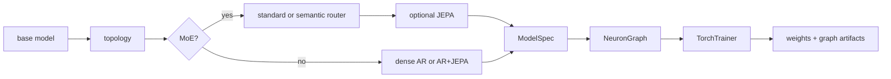

# CLI Workflows

The `cli/` package installs the `nfn` command for training, inference,
evaluation, and backend diagnostics outside the web editor. It is an in-repo companion to the Python SDK:
it builds real `ModelSpec` objects, exports graph JSON plus `.pt` weights, uses
the shared dataset manager, and defaults artifacts to `~/NeuralFn/artifacts`.

For the longer operator runbook, see [../cli/README.md](../cli/README.md).

## Install

```bash
cd cli
python -m venv .venv
source .venv/bin/activate
pip install -e ..
pip install -e .
nfn --help
```

The first editable install exposes the `neuralfn` and `server` packages from
the repo root. The second installs the CLI entrypoint declared by
`cli/pyproject.toml`.

## Commands

| Command | Purpose |
|---------|---------|
| `nfn train` | Train a composed recipe and export `.pt` weights plus graph `.json`. |
| `nfn infer` | Load an exported graph or supported graphless checkpoint and generate text from a prompt. |
| `nfn eval` | Run validation batches and prompt probes, then write a JSON report. |
| `nfn kernels` | Inspect CUDA Tile kernel coverage and local CUDA Tile diagnostics. |

Every command accepts `--plan` for an interactive questionnaire and
`--plan-auto` for recommended defaults without prompting. Help output supports
`--help-style short`, `--help-style long`, and `--help-style verbose`.

## Recipe model

Recipes are composed from a small set of choices:

| Choice | Values |
|--------|--------|
| Base model | `llama`, `gpt2`, `nanogpt` |
| Topology | `dense`, `moe`, `semantic_router` |
| Router mode | `standard`, `semantic` |
| Objective overlay | `--jepa` |
| Runtime | default or `--megakernel` |
| Training mode | `pretrain`, `sft`, `dpo`, `ppo`, `reward_model` |
| Adapter | `none`, `lora`, `qlora`, `randmap` |



Examples:

```bash
nfn train --plan
nfn train --pretraining-file ./pretraining-data.txt
nfn train --base-model llama --topology moe --router-mode semantic --jepa
nfn infer --graph ~/NeuralFn/artifacts/llama_fast.json --prompt "Once upon a time"
nfn infer --checkpoint ~/NeuralFn/artifacts/final_model.pt --checkpoint-tokenizer ~/Downloads/fineweb_8192_bpe_lossless_caps_caseops_v1_reserved.model
nfn eval --base-model gpt2 --dataset shakespeare
nfn train --kernel-backend tile-cuda --tile-cuda-report ./tile-report.json
nfn kernels list --json
nfn kernels doctor
nfn kernels bench --device auto --iterations 200
nfn kernels examples
```

## Kernel diagnostics

`nfn kernels list` prints the CUDA Tile registry coverage generated from the live NeuralFn builtin and torch-backend dispatch surfaces. `nfn kernels doctor` also reports the local `nvcc`, CUDA Tile header, `torch.cuda`, and compute-capability status. `nfn kernels bench` compares the old graph-walk helper, the static compiled PyTorch plan, and the Tile-requested compiled plan on a small scalar graph. `nfn kernels examples` lists checked-in examples and `nfn kernels examples --write --output-dir examples/tile_cuda` regenerates the per-registry SDK snippets. These commands accept `--json` for automation.

`nfn train`, `nfn infer`, and `nfn eval` accept `--kernel-backend {auto,torch,tile-cuda}`, `--tile-cuda-strict`, and `--tile-cuda-report PATH`. `tile-cuda` requests the implemented CUDA Tile fast path; the registry currently accounts for all 138 training-relevant entries with 129 Tile-covered kernels/compositions, 7 host-only entries, and 2 delegated graph calls. `--tile-cuda-strict` fails graph compilation if selected nodes are uncovered or if the Tile runtime is unavailable. Building the optional extension from source is opt-in with `NFN_TILE_CUDA_BUILD=1`, and `NFN_TILE_CUDA_ARCH` can override the architecture flag passed to `nvcc`. Install `pip install -e ".[tile-cuda]"` if the active environment does not already provide `ninja` for PyTorch extension builds.

## Datasets and tokenizers

Dataset shortcuts are resolved by the shared selector logic in
`cli/scripts/train_jepa_semantic.py`.

| Shortcut | Data path | Default tokenizer |
|----------|-----------|-------------------|
| `golf1` | cached-token parameter-golf, one training shard | `sp1024` |
| `golf10` | cached-token parameter-golf, ten training shards | `sp1024` |
| `shakespeare` / `shakespear` | raw text | `cl100k_base` |
| `tinystories` | raw text from TinyStoriesV2 GPT-4 files | `o200k_base` |
| `--pretraining-file FILE` | local raw `.txt` file | tokenizer selected by `--tokenizer` or dataset defaults |

Tokenizers are separate from datasets. `--tokenizer` accepts
`gpt2`, `cl100k_base`, `o200k_base`, `sp1024`, `sp2048`, `sp4096`, and
`sp8192`. SentencePiece assets live under `~/.cache/nfn/tokenizers`; if a
cached dataset already contains matching tokenizer files under its
`tokenizers/` directory, the CLI promotes them into the shared tokenizer cache
before trying a download.

Missing cached dataset aliases are downloaded by default when the CLI can
derive a contract from the alias or explicit download flags. Existing aliases
remain strict: tokenizer-backed shard/vocab mismatches fail fast and should be
fixed by rebuilding or re-downloading the alias.

## Artifacts

By default, the CLI writes to `~/NeuralFn/artifacts`. Set
`NEURALFN_ARTIFACTS_DIR` to override that shared artifact root for CLI and
server graph-run outputs.

Training saves:

- `<mode>.pt` for weights
- `<mode>.json` for the exported graph
- `<mode>.interrupted.pt` and `<mode>.interrupted.json` when interrupted

The graph JSON records `artifact_metadata.weights_file`, tokenizer metadata,
and training metadata so inference can load graph-first and treat `--weights`
as an override.

`nfn infer` also has a graphless compatibility path for flat Parameter Golf
root-GPT `.pt` checkpoints. Use `--checkpoint` with the matching SentencePiece
`.model` file, and optionally pass the training log so non-tensor hints can be
read from its `Hyperparameters` block:

```bash
nfn infer \
  --checkpoint ~/NeuralFn/artifacts/final_model.pt \
  --checkpoint-tokenizer ~/Downloads/fineweb_8192_bpe_lossless_caps_caseops_v1_reserved.model \
  --checkpoint-log ~/Downloads/a54a53b3-7d6e-461c-975a-590030e61bd0.txt
```

Passing `--weights <checkpoint>.pt` without `--graph` routes to the same
graphless loader. NeuralFn graph exports remain the primary format and should
continue to use `--graph`.

For flat Parameter Golf checkpoints, architecture comes from tensor shapes plus
compatible metadata. A supplied training log may provide safe runtime hints
such as context window or logit softcap, but newer experimental structural
hints are ignored when the tensors are not present in the checkpoint. CaseOps
SentencePiece models use display cleanup that hides private-use case markers
and suppresses reconstruction-only tokens during sampling, including byte
fallback, ellipsis artifacts, and the high-id single-character fallback band
that can otherwise look like masked or gapped output in chat.

Graphless Parameter Golf sampling uses a conservative repeat guard by default:
`--no-repeat-ngram-size 4`, `--repeat-run-limit 3`, and the balanced
repetition-penalty preset. Lower `--no-repeat-ngram-size` to `3` or raise the
chat setting with `/repeat 1.15` when a checkpoint drifts into repeated
punctuation or phrase loops.

In interactive `nfn infer`, slash completion is live. A buffer beginning with
`/` shows matching commands in the status line as you type; unique prefixes
complete in place on Tab, ambiguous prefixes list matches, and value commands
show their expected argument after the command name. `/autocomplete n` enables
inline typing predictions for `n` words. The predicted text is rendered as a
50% gray ghost suffix after the cursor. The suffix preserves the model's
generated word boundary: a leading space starts a new word, and no leading
space completes the current word. Tab accepts the visible prediction. Use
`/autocomplete 0` to disable inline predictions and return non-command prompts
to the token-preview behavior: press Tab once to preview the next token and Tab
again to insert it when safe. Wrapped prompts and ghost predictions are
repainted as a full multi-row block so stale rows are cleared as the input
changes.

## Presets

The CLI includes a preset stack for the supplied lossless-caps Parameter Golf
training run:

```bash
nfn train \
  --model-preset parameter_golf_caseops_8192 \
  --run-preset parameter_golf_10min \
  --optimizer-preset parameter_golf_muon \
  --tokenizer sp8192
```

When `parameter_golf_caseops_8192` is selected, the planner recommends
`parameter_golf_10min`, `parameter_golf_muon`, and `sp8192` unless those values
were passed explicitly.

## Fine-tuning flags

`nfn train` can build fine-tuning root graphs through the same recipe path:

| Flag | Purpose |
|------|---------|
| `--training-mode sft` | Supervised fine-tuning with `sft_dataset_source` and masked token CE. |
| `--training-mode dpo` | Direct Preference Optimization with policy/reference forwards. |
| `--training-mode ppo` | PPO graph skeleton for rollout-buffer optimization. |
| `--training-mode reward_model` | Preference reward-head training. |
| `--adapter-type lora` | Insert trainable LoRA projections. |
| `--adapter-type qlora` | Use nf4 base projection buffers plus LoRA deltas. |
| `--adapter-type randmap` | Use fixed random projections with a trainable middle adapter. |
| `--adapter-only-save` | Save only adapter/head parameters after training. |

Fine-tuning checkpoints use `--base-checkpoint`, `--ref-checkpoint`, and
`--reward-checkpoint` depending on the selected objective.

## Verification

Useful non-training checks:

```bash
conda run -n NeuralFn python cli/nfn.py --help
conda run -n NeuralFn python cli/nfn.py train --help
conda run -n NeuralFn python -m pytest cli/tests/test_nfn_cli.py -q
conda run -n NeuralFn python -m pytest cli/tests/test_train_pretraining_file_flags.py -q
```

Training jobs are CUDA-oriented and may be long-running; use the smoke
`--run-preset` or targeted unit tests for local doc/API verification.
