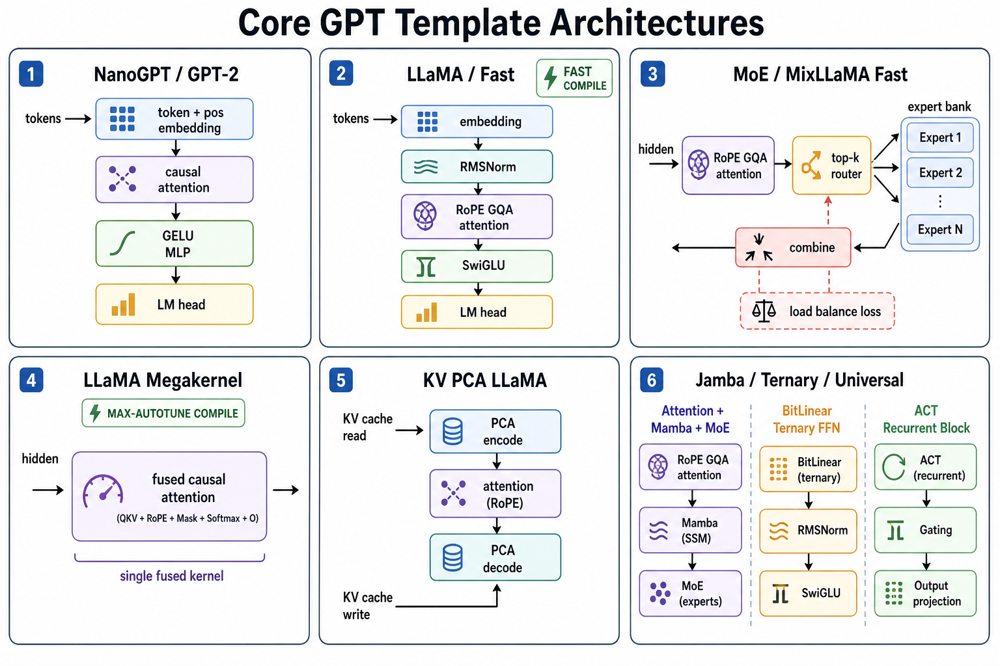
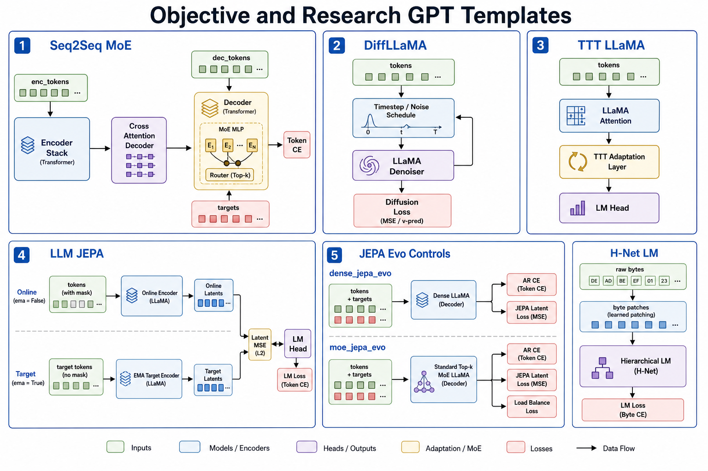
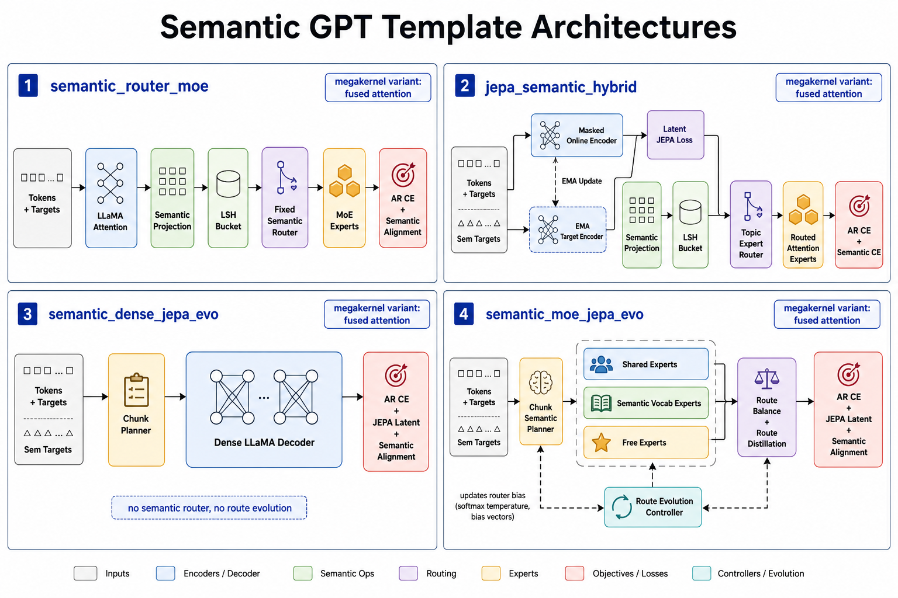

# Templates and Presets

NeuralFn ships a template system that generates complete, trainable transformer graphs from a preset name and a config dict. This is the fastest way to get a working model.

## Spec hierarchy

Three dataclasses define a model:

- **`ModelSpec`** -- top-level model dimensions: `model_dim`, `num_layers`, `vocab_size`, `tie_embeddings`, `logit_softcap`, plus the block and template specs.
- **`BlockSpec`** -- per-block architecture: norm type, MLP type, positional encoding, attention backend, head counts, MoE settings, compression, adapter.
- **`TemplateSpec`** -- high-level switches: `objective` (ar, diffusion, jepa, seq2seq, sft, dpo, ppo, reward_model), `backbone`, `tokenization`, `sparsity` (dense, moe), `router_mode`, `compression`, `adapter`, `runtime` (eager, compile, megakernel), and `backend_capabilities`.

---

## Building a model from a preset

The simplest entry point:

```python
from neuralfn import build_gpt_root_graph
from neuralfn.config import build_llama_spec

spec = build_llama_spec(
    n_layer=6,
    n_embd=256,
    num_heads=8,
    num_kv_heads=4,
    vocab_size=32000,
)
graph = build_gpt_root_graph(name="my_llama", model_spec=spec)
```

This returns a fully wired `NeuronGraph` with `runtime="torch"` and `training_method="torch"`, ready for `TorchTrainer`.

### Other builder functions

| Function | Returns | Use case |
|----------|---------|----------|
| `build_gpt_root_graph(name, model_spec)` | `NeuronGraph` | Complete graph with I/O nodes from an existing `ModelSpec`. |
| `build_model_stage_graph(name, model_spec)` | `NeuronGraph` | Just the named model-stage subgraph (no dataset_source or loss). |
| `build_gpt_template_payload(name, config)` | `dict` | JSON payload with `variant_library`, graph settings, model node, extra nodes, and extra edges for the server/editor API. |
| `build_model_spec_from_config(config)` | `ModelSpec` | Dispatches to the right `build_*_spec()` function based on `config["preset"]`. |

---

## Preset table

| Preset | Builder | Backbone | Objective | Sparsity | Key features |
|--------|---------|----------|-----------|----------|--------------|
| `nanogpt` | `build_nanogpt_spec` | nanogpt | ar | dense | LayerNorm, GELU MLP, absolute position embeddings |
| `nanogpt_megakernel` | `build_nanogpt_megakernel_spec` | nanogpt | ar | dense | NanoGPT with `runtime="megakernel"` |
| `gpt2` | `build_gpt2_spec` | gpt2 | ar | dense | LayerNorm, GELU MLP, absolute position embeddings, bias |
| `gpt2_megakernel` | `build_gpt2_megakernel_spec` | gpt2 | ar | dense | GPT-2 with `runtime="megakernel"`; native CUDA Tile trainer-compatible |
| `gpt2_moa` | `build_gpt2_moa_spec` | gpt2 | ar | dense | GPT-2 with mixture-of-activations MLP selection |
| `llama` | `build_llama_spec` | llama | ar | dense | RMSNorm, SwiGLU, RoPE, GQA |
| `moe` / `mixllama` | `build_mixllama_spec` | mixllama | ar | moe | RMSNorm, MoE MLP, RoPE, GQA |
| `llama_fast` | `build_llama_fast_spec` | llama | ar | dense | Like llama + `torch.compile` |
| `mixllama_fast` | `build_mixllama_fast_spec` | mixllama | ar | moe | Like moe + `torch.compile` |
| `jamba` | `build_jamba_hybrid_spec` | jamba | ar | moe | Hybrid attention + Mamba SSM, MoE, compile |
| `ternary_b158` | `build_ternary_b158_spec` | llama | ar | dense | BitLinear ternary weights |
| `seq2seq` | `build_decoder2encoder_moe_spec` | llama | seq2seq | moe | Encoder-decoder, MoE |
| `diffusion` | `build_diffllama_spec` | llama | diffusion | dense | Discrete diffusion objective |
| `ttt_llama` | `build_ttt_llama_spec` | ttt | ar | dense | Test-Time Training layers |
| `llm_jepa` | `build_llm_jepa_spec` | llama | jepa | dense | JEPA with EMA target encoder |
| `dense_jepa_evo` | `build_dense_jepa_evo_spec` | llama | `ar_jepa` | dense | Non-semantic AR+JEPA Evo control with dense FFNs and no semantic router. |
| `moe_jepa_evo` | `build_moe_jepa_evo_spec` | mixllama | `ar_jepa` | moe | Non-semantic AR+JEPA Evo control with standard MoE routing and no semantic router. |
| `hnet_lm` | `build_hnet_lm_spec` | hnet | ar | dense | Raw-byte vocab (256), byte patches |
| `universal_llama` | `build_universal_llama_spec` | universal | ar | dense | ACT-based universal transformer |
| `llama_megakernel` | `build_llama_megakernel_spec` | llama | ar | dense | Fused attention, max-autotune compile |
| `kv_pca_llama` | `build_kv_pca_llama_spec` | llama | ar | dense | PCA-compressed KV cache |

### [Experimental] Presets

| Preset [Experimental] | Builder [Experimental] | Backbone | Objective [Experimental] | Sparsity | Key features [Experimental] |
|-----------------------|------------------------|----------|----------------------------|----------|----------------------------|
| `gpt2_evo` (SDK-only builder) | `build_gpt2_evo_spec` | gpt2 | ar | dense | Dense GPT-2 with one evolution-trained block: the `layer_evo_index` block (default middle) is excluded from gradient optimization and updated by an interleaved evolutionary search (`layer_evo_*` knobs) that always keeps the current weights as the elite candidate. Trained via the Torch-free `cli/scripts/train_gpt2_evo.py` native shim, which delegates to the compiled C++ GPT-2-evo/dense-GPT CUDA Tile path with a 12-layer SM120 AdamW run, the real GPT-2 tokenizer vocabulary (`50257`), NVFP4 activation intent, and live validation every 250 optimizer steps. Native inference uses `nfn infer --checkpoint .../gpt2_evo --prompt-tokens IDS`; legacy graph-backed `.pt/.json` artifacts can still use `cli/scripts/infer_gpt2.py --evo` or explicit `nfn infer --graph ... --weights ...`. Not registered as an editor preset. |
| `semantic_router_moe` | `build_semantic_router_moe_spec` | mixllama | `semantic_router` | moe | AR-only control experiment: vocab-grounded semantic projection + LSH + one expert per semantic vocabulary dimension shared across all MoE blocks. |
| `jepa_semantic_hybrid` | `build_jepa_semantic_hybrid_spec` | llama | `jepa_semantic` | moe | JEPA + vocab-grounded semantic state + LSH + fixed dimension-to-expert topic routing + full-sequence attention experts (research prototype). |
| `semantic_dense_jepa_evo` | `build_semantic_dense_jepa_evo_spec` | llama | `semantic_dense_jepa_evo` | dense | Dense control for the Semantic JEPA Evo stack: chunk-level causal semantic planner, JEPA target supervision, dense LLaMA FFNs, and no route evolution. |
| `semantic_moe_jepa_evo` | `build_semantic_moe_jepa_evo_spec` | mixllama | `semantic_moe_jepa_evo` | moe | Full chunk-routed Semantic MoE JEPA Evo: 2 shared experts, semantic-vocab experts, 8 free experts, JEPA target supervision, and periodic route evolution. |

**Disclaimer [Experimental]:** The semantic routing presets are experimental; graph layout, config keys, and training APIs may change. `semantic_router_moe`, `jepa_semantic_hybrid`, `semantic_dense_jepa_evo`, and `semantic_moe_jepa_evo` use the root/data contract text `tokens` + text `targets` plus a separate `semantic_data_source` that provides vocab-topic `sem_targets`. The router-only and hybrid presets require one expert per semantic vocabulary dimension. `semantic_dense_jepa_evo` keeps dense FFNs for comparison, while `semantic_moe_jepa_evo` adds shared and free experts around the semantic expert bank, so `experts` must equal `semantic_shared_experts + NUM_VOCAB_DIMS + semantic_free_experts`.

### Frontier presets (modern-kernel combinations)

These presets combine the modern-LLM kernels (§21–§33 in `todo-kernels.md`) with the existing block builders. Each new op ships first as a **PyTorch-reference Stage** in `neuralfn/torch_backend.py` and is later repointed at an `llm.kittens` kernel (the FP8/MX paths are numerics/format demonstrators — no SM120 speedup until the kernel swap lands).

| Preset | Builder | Mirrors | Key features |
|--------|---------|---------|--------------|
| `deepseek_v3` | `build_deepseek_v3_spec` | DeepSeek-V3 | Multi-head Latent Attention (compressed-KV + decoupled RoPE) + auxiliary-loss-free balanced MoE + shared experts |
| `deepseek_v4` | `build_deepseek_v4_spec` | DeepSeek-V4-Pro | Native-sparse (CSA-spirit) attention + auxfree MoE + Manifold-Constrained Hyper-Connection residuals + QK-norm + FP8 dense/attention linears |
| `gemma3` | `build_gemma3_spec` | Gemma-2/3 | Sliding-window attention + GeGLU + QK-norm + logit softcap |
| `diff_transformer` | `build_diff_transformer_spec` | Differential Transformer | Two-softmax-branch differential attention + head-wise norm |
| `qwen3_longctx` | `build_qwen3_longctx_spec` | Qwen/Llama long-ctx | GQA + YaRN RoPE scaling + QK-norm |
| `longctx_sparse_llama` | `build_longctx_sparse_llama_spec` | NSA / long-context | Native-sparse attention (local window + sinks + strided compression); `attention_variant` selectable (`block_sparse`/`sliding_window`/`streaming`) |
| `modern_norms_llama` | `build_modern_norms_llama_spec` | — | Dynamic Tanh (DyT) norm + QK-norm + GeGLU on a Llama backbone |
| `fp8_llama` | `build_fp8_llama_spec` | Blackwell FP8 | FP8 (E4M3) weight-quantized linears via the compression seam |
| `mxfp4_llama` | `build_mxfp4_llama_spec` | OCP MXFP4 | Per-32-block E8M0 microscaled FP4 weight linears |
| `auxfree_moe_jepa_evo` | `build_auxfree_moe_jepa_evo_spec` | DeepSeek balancing × NeuralFn | Auxiliary-loss-free balancing crossed with route-evolution + JEPA |
| `diff_semantic_moe_jepa_evo` | `build_diff_semantic_moe_jepa_evo_spec` | — | Differential attention crossed with the semantic chunk-routed MoE + JEPA stack |
| `dyt_geglu_semantic_dense_jepa_evo` | `build_dyt_geglu_semantic_dense_jepa_evo_spec` | — | DyT + GeGLU crossed with the semantic dense JEPA Evo stack |

**DeepSeek-V4 mapping note:** V4-Pro's *domain-specific experts* (independently cultivated per math/code/agent/instruction, then consolidated) are the post-training analog of NeuralFn's architectural **semantic vocab-grounded per-dimension experts** (`semantic_router_moe`, `semantic_moe_jepa_evo`) — one expert per semantic dimension at routing time.

**Native training selection:** `neuralfn.config.SHIPPED_GPT_TEMPLATE_PRESETS` is
the canonical SDK catalog of names accepted by native dense GPT training
selectors. `train_gpt.py`, `nfn train --base-model gpt`, and the native GPT SDK
handoff accept `--template-name` / `--preset` for every shipped GPT template
name, plus the public `gpt` dense-template alias and `--graph-file` for a custom
graph JSON. `gpt2` and `gpt3` are model
family aliases for the same trainer; GPT3 defaults the context window to 2048
when selected by `--base-model gpt3` or `--template-name gpt3`, unless a custom
graph or explicit sequence length is provided. Its implicit batch size is 32 so
the default token microbatch stays fixed. Dense GPT-compatible selections
(`gpt`, `gpt2`, `gpt3`, `gpt2_megakernel`, and `gpt2_moa`) map
to the implemented compiled CUDA Tile trainer today; `gpt` reports
`resolved_native_template_name: "gpt2"` while the implementation template keeps
its legacy name, and `gpt2_moa` resolves to the native MoA activation mode
automatically. Structurally different presets and custom
graphs are selected and reported by the compiled frontend, then fail with
`selected-graph-native-trainer-missing` until their graph-specific C++ Tile
trainer plans are implemented; they do not fall back to Torch by default.

#### Modernized presets (`<preset>_modern`)

Every base preset in `MODERN_BASE_PRESETS` has a `<preset>_modern` variant that overlays a uniform modern recipe via `_apply_modern_profile`: **LayerNorm → RMSNorm, GELU → GeGLU, absolute positions → RoPE + YaRN, fused QK-norm on, and MoE blocks → auxiliary-loss-free balancing** (mHC residuals and FP8 stay opt-in). For example `nanogpt_modern`, `gpt2_modern`, `llama_modern`, `moe_modern`, … `semantic_moe_jepa_evo_modern`. The overlay is additive and preserves each preset's objective/backbone/expert topology.

#### New `BlockSpec` knobs

`attention_variant` (`dense`/`differential`/`sliding_window`/`block_sparse`/`nsa`/`streaming`/`mla`), `use_qk_norm`, `norm_type` (`+dyt`/`+group_norm`), `mlp_type` (`+geglu`/`+reglu`/`+solu`), `moe_balance_mode` (`aux_loss`/`auxfree`), `residual_type` (`add`/`mhc`), `compression` (`+fp8_e4m3`/`fp8_e5m2`/`mxfp4`/`mxfp8`), `rope_scaling` (now honored: `linear`/`ntk`/`yarn`), plus geometry knobs `window_size`, `sparse_block_size`, `num_sinks`, `nsa_compress_stride`, `mx_block_size`, `diff_lambda_init`, `dyt_alpha_init`.

**Optimizer note:** DeepSeek-V3/V4 train with the **Muon** optimizer. Optimizers are training-time choices (trainer/optimizer config), not `BlockSpec` fields, so they are not presets — see the training workflow docs for the optimizer menu (Muon/Lion/Sophia/…).

**Out of scope (documented):** MLA is not stacked onto `kv_pca`; Mixture-of-Depths and `soft_moe` are not implemented (they break the shape-stable `[B,T,D]` / top-k dispatch contracts); FP8 does not reach the fused-megakernel attention or the MoE expert parameters in this reference (experts stay bf16).

---

## Architecture diagrams

The architecture sheets below cover every shipped GPT template preset. They are visual summaries; the preset tables on this page remain the source of truth for exact builder names, objectives, sparsity, and config fields.

### Core autoregressive templates



| Diagram area | Presets covered |
|--------------|-----------------|
| NanoGPT / GPT-2 decoder | `nanogpt`, `gpt2` |
| LLaMA decoder and compiled variants | `llama`, `llama_fast`, `llama_fast_megakernel` |
| MoE / MixLLaMA decoder | `moe`, `mixllama_fast`, `mixllama_fast_megakernel` |
| Megakernel fused attention | `llama_megakernel` |
| PCA-compressed KV cache | `kv_pca_llama` |
| Hybrid and alternate block families | `jamba`, `ternary_b158`, `universal_llama` |

### Objective and research templates



| Diagram area | Presets covered |
|--------------|-----------------|
| Encoder-decoder MoE | `seq2seq` |
| Diffusion objective | `diffusion` |
| Test-Time Training layers | `ttt_llama` |
| EMA-target JEPA | `llm_jepa` |
| Non-semantic JEPA Evo controls | `dense_jepa_evo`, `moe_jepa_evo` |
| Byte-patched language model | `hnet_lm` |

### Semantic routing templates



| Diagram area | Presets covered |
|--------------|-----------------|
| Semantic router MoE | `semantic_router_moe`, `semantic_router_moe_megakernel` |
| JEPA semantic hybrid | `jepa_semantic_hybrid`, `jepa_semantic_hybrid_megakernel` |
| Dense Semantic JEPA Evo control | `semantic_dense_jepa_evo` |
| Full Semantic MoE JEPA Evo | `semantic_moe_jepa_evo` |

The detailed Semantic MoE JEPA Evo reference diagram remains available as a standalone asset:


---

## Common config keys

These keys can be passed in config-dict flows such as `build_model_spec_from_config()` and the server/editor template APIs. Direct `build_*_spec()` calls use the canonical Python keyword names; aliases are shown where applicable.

| Key | Alias | Default | Description |
|-----|-------|---------|-------------|
| `n_layer` | `num_layers` | `4` | Number of transformer blocks. |
| `n_head` | `num_heads` | `4` | Number of attention heads. |
| `n_embd` | `model_dim` | `128` | Hidden dimension. |
| `vocab_size` | -- | `256` | Vocabulary size. |
| `num_kv_heads` | -- | `2` | Number of KV heads for GQA. `None` for full MHA. |
| `mlp_multiplier` | -- | `4.0` (GPT), `8/3` (Llama) | FFN hidden-dim multiplier. |
| `multiple_of` | -- | `256` | Round FFN hidden dim to this multiple (Llama-family). |
| `experts` | -- | `8` | Number of MoE experts (MoE presets). |
| `top_k` | -- | `2` | Top-K expert routing (MoE presets). |
| `rope_base` / `rope_theta` | -- | `10000.0` | RoPE base for attention-enabled presets, including hybrid routed experts. |
| `qk_gain_init` | -- | `1.0` | Initial query scaling for attention-enabled presets. |
| `dropout_p` | -- | `0.0`-`0.1` | Dropout probability. |
| `tie_embeddings` | -- | varies | Tie input embedding and output projection weights. |
| `logit_softcap` | -- | `0.0` | Tanh softcap on logits (0 = disabled). |
| `ar_loss_coef` | -- | `1.0` | Scalar for routed AR loss on semantic routing presets. |
| `jepa_loss_coef` | -- | `0.25` | Scalar for JEPA latent loss on JEPA semantic presets. |
| `semantic_align_loss_coef` | -- | `0.5` | Scalar for semantic-alignment loss on semantic routing presets. |
| `semantic_vocab_ref` | -- | default vocab | Semantic vocabulary file used by semantic projector/router stages. |
| `route_chunk_size` | -- | `32` | Chunk size for `semantic_dense_jepa_evo` planner updates and `semantic_moe_jepa_evo` route updates. |
| `semantic_shared_experts` | -- | `2` | Always-on shared experts for `semantic_moe_jepa_evo`. |
| `semantic_free_experts` | -- | `8` | Free learned experts for `semantic_moe_jepa_evo`. |
| `route_evo_enabled` | -- | `true` | Enable periodic route-evolution search for `semantic_moe_jepa_evo`. |
| `route_evo_fraction` | -- | `0.10` | Approximate fraction of optimizer steps that run route evolution. |
| `route_evo_population` | -- | `8` | Candidate count for route evolution. |
| `route_evo_mutation_scale` | -- | `0.05` | Mutation scale for route-evolution candidates. |
| `ttt_hidden_dim` | -- | `32` | Hidden dim for TTT layers. |
| `byte_patch_size` | -- | `4` | Byte patch window for H-Net. |
| `max_recurrence_steps` | -- | `4` | Max ACT recurrence steps (universal transformer). |
| `adapter_type` | -- | `"none"` | Adapter implementation: `"none"`, `"lora"`, `"qlora"`, or `"randmap"`. |
| `lora_rank` / `lora_alpha` | -- | `8` / `16.0` | LoRA/qLoRA rank and scaling. |
| `lora_targets` | -- | `("q_proj", "v_proj")` | Projection roles wrapped by LoRA/qLoRA. |
| `qlora_group_size` | -- | `64` | NF4 group size for qLoRA base projections. |

---

## Composed recipes and fine-tuning roots

The `nfn` CLI and lower-level Python callers can use `build_composed_lm_spec()`
to build a `ModelSpec` from base-model/topology/router choices instead of a
single named preset. Dense GPT aliases (`gpt`, `gpt2`, and `gpt3`) all resolve
through the GPT-compatible builder; the selected template or custom graph still
decides the actual architecture and native support status:

```python
from neuralfn.config import FineTuneSpec, build_composed_lm_spec
from neuralfn.torch_templates import build_gpt_root_graph

spec = build_composed_lm_spec(
    base_model="llama",
    topology="moe",
    router_mode="semantic",
    use_jepa=True,
    adapter_type="lora",
    lora_rank=8,
    finetune=FineTuneSpec(objective="sft", base_checkpoint="base.pt"),
)
spec.template.objective = "sft"
graph = build_gpt_root_graph(name="sft_model", model_spec=spec)
```

Fine-tuning objectives dispatch to dedicated roots:

| Objective | Root graph | Dataset source | Loss path |
|-----------|------------|----------------|-----------|
| `sft` | `build_sft_root_graph` | `sft_dataset_source` | masked token CE |
| `dpo` | `build_dpo_root_graph` | `dpo_dataset_source` | policy/reference logp -> DPO loss |
| `ppo` | `build_ppo_root_graph` | `ppo_rollout_source` | clipped policy/value loss plus KL/reward shaping |
| `reward_model` | `build_reward_model_root_graph` | `dpo_dataset_source` | reward heads -> preference BCE |

---

## Dispatching to the right builder

`build_model_spec_from_config()` maps `config["preset"]` to its builder function:

```python
from neuralfn.torch_templates import build_model_spec_from_config

spec = build_model_spec_from_config({
    "preset": "llama",
    "n_layer": 8,
    "n_embd": 512,
    "num_heads": 8,
    "num_kv_heads": 4,
})
```

This returns a `ModelSpec` that can be passed to `build_model_stage_graph("model_stage", spec)` for lower-level graph construction.

---

## Example: building a custom Llama variant

```python
from neuralfn import build_gpt_root_graph
from neuralfn.torch_backend import CompiledTorchGraph
from neuralfn.config import build_llama_spec
import torch

spec = build_llama_spec(
    n_layer=4,
    n_embd=128,
    num_heads=4,
    num_kv_heads=2,
    vocab_size=256,
    mlp_multiplier=8.0 / 3.0,
    multiple_of=64,
    tie_embeddings=False,
)
graph = build_gpt_root_graph(name="llama_small", model_spec=spec)

compiled = CompiledTorchGraph(graph)
n_params = sum(p.numel() for p in compiled.parameters())
print(f"Parameters: {n_params:,}")

tokens = torch.randint(0, 256, (1, 32))
targets = torch.randint(0, 256, (1, 32))
loss = compiled(tokens, targets)
print(f"Forward pass loss: {loss[0].item():.4f}")
```

---

Next: [Training Workflows](training-workflows.md)
